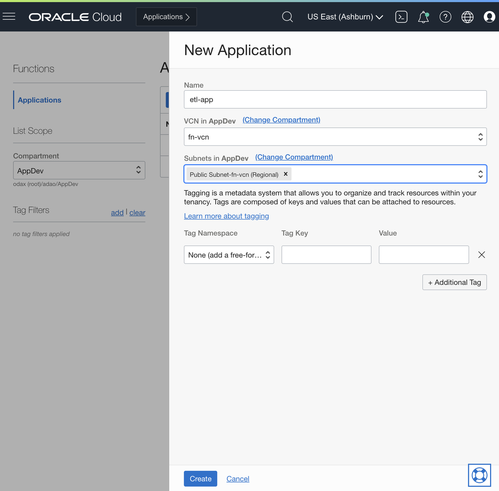
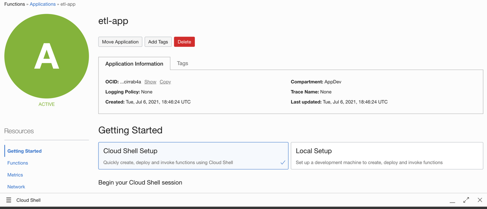
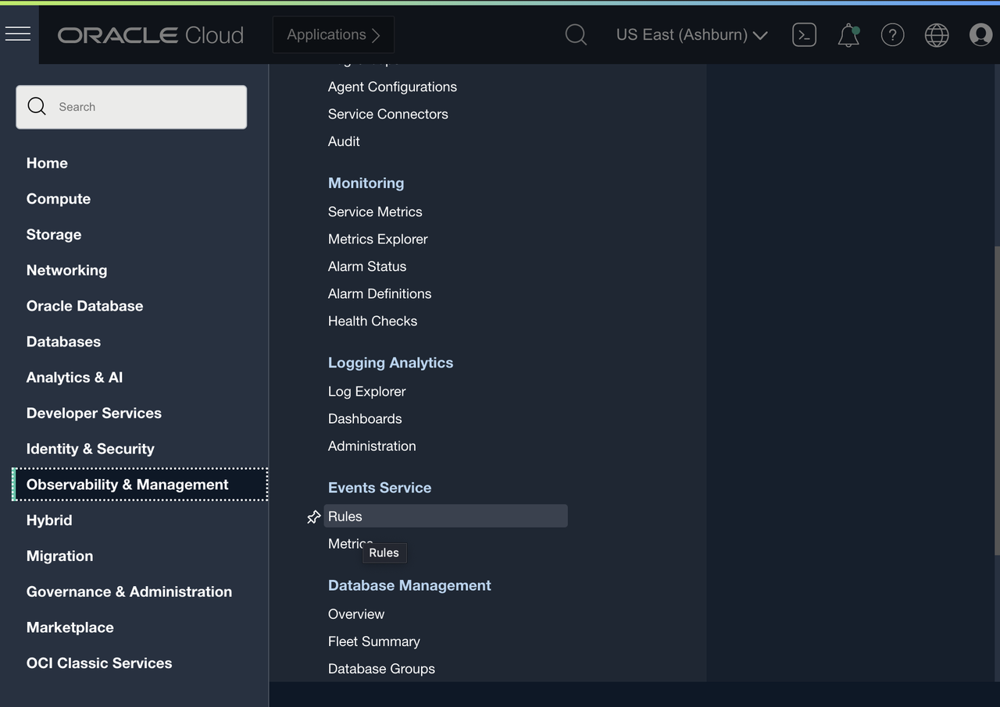
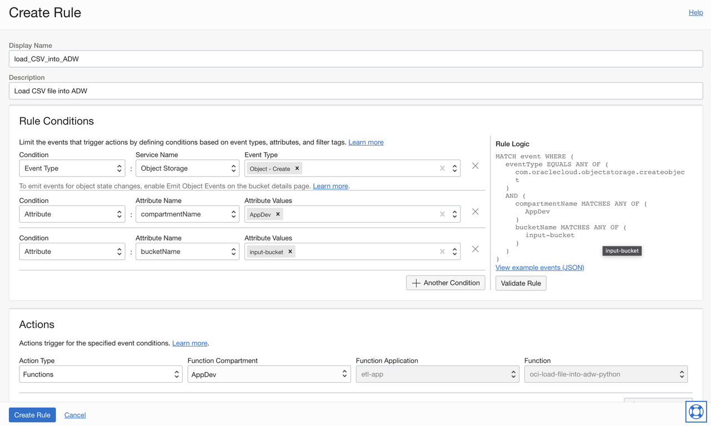
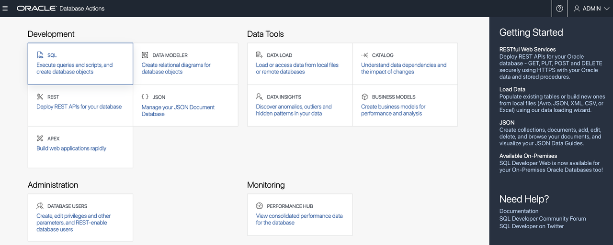
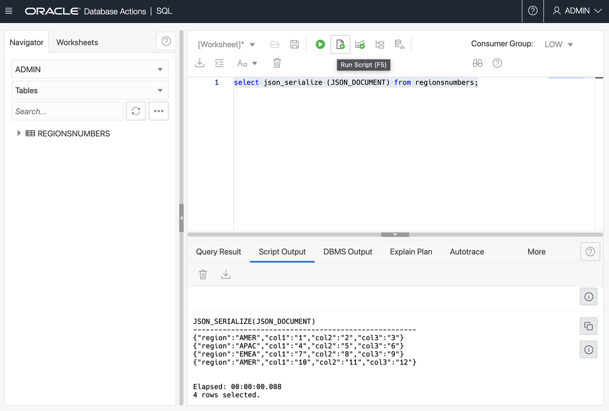

# Create the Function

## Introduction

In this lab you will create the Oracle Function and trigger the function whenever a file is uploaded to the Object Storage. The function will take the file and write it to the database.

Estimated time: 20 minutes

### Objectives

- Create an application.
- Deploy a Function.
- Create an Event rule.
- Test the created Function

### Prerequisites

- Your Oracle Cloud Trial Account
- Completed the **Prerequisites for Functions** Lab
- Completed the **Create Bucket, Policies and Autonomous Database (ADW)** Lab

## Task 1: Create an application

In this step, you will create an application and set up Fn CLI in the OCI Cloud Shell.

1. Click the **Navigation Menu** in the upper left, navigate to **Developer Services** and select **Applications** under the **Functions** section.

    

1. Select your development compartment (AppDev) from the **Compartment** list.
1. Click **Create Application**.
1. For name, enter `etl-app`.
1. Select the VCN you created earlier (e.g. `fn-vcn`).
1. Select the public subnet.
1. Click **Create**.

    

1. Click on the created application to open the application details.
1. Follow the **Begin your Cloud Shell session** steps under **Getting Started** in the **Cloud Shell Setup**

    

1. Follow each step of **Setup fn CLI on Cloud Shell**.
1. On the step 4 of Setup fn CLI on Cloud Shell, replace the placeholder **[OCIR-REPO]** with **fnadw** (Or some friendly name)
1. On the step 6 of Setup fn CLI on Cloud Shell, you will be using the generated token from the previous step as password
1. Stop at step 7 of Setup fn CLI on Cloud Shell, as you will be creating your own function on the next lab step

This involves launching Cloud Shell, updating the Fn context, generating an auth token for the registry, and logging into the Oracle Cloud Infrastructure Registry.

## Task 2: Deploy the function

In this step, you will clone the functions source code repository and use the `fn deploy` command to build the Docker image, push the image to OCIR, and deploy the function to Oracle Functions in your application.

1. You should have already open the OCI Cloud Shell, if not the case, from the Console UI, open the Cloud Shell.
1. Clone the Functions source code repository:

    ```shell
    <copy>
    git clone https://github.com/oracle/oracle-functions-samples.git
    </copy>
    ```

1. Go to the `samples/oci-load-file-into-adw-python` folder:

    ```shell
    <copy>
    cd oracle-functions-samples/samples/oci-load-file-into-adw-python
    </copy>
    ```

1. Deploy the function to the `etl-app`:

    ```shell
    <copy>
    fn -v deploy --app etl-app
    </copy>
    ```

    After you deploy the function, you need to set function configuration values so the function knows how to connect to the Autonomous Database.

1. Using the Fn CLI, set the following configuration values.

    Note: These commands uses the **`ORDS_BASE_URL`** and **DB_PASSWORD** env variables that you exported after created the Oracle Database. If your Cloud Shell timed out or was reconnected, you may need to export again using `export ORDS_BASE_URL=<ORDS_BASE_URL>` replacing `<ORDS_BASE_URL>` with the copied URL from the **RESTful Services and SODA** and `export DB_PASSWORD=<DB_PASSWORD>` replacing `<DB_PASSWORD>` with the ADMIN database password that you chose

    ```shell
    <copy>
    fn config function etl-app oci-load-file-into-adw-python ords-base-url $ORDS_BASE_URL && \
    fn config function etl-app oci-load-file-into-adw-python db-schema admin && \
    fn config function etl-app oci-load-file-into-adw-python db-user admin
    </copy>
    ```

    ```shell
    <copy>
    fn config function etl-app oci-load-file-into-adw-python dbpwd-cipher $DB_PASSWORD
    </copy>
    ```

    ```shell
    <copy>
    fn config function etl-app oci-load-file-into-adw-python input-bucket input-bucket && \
    fn config function etl-app oci-load-file-into-adw-python processed-bucket processed-bucket
    </copy>
    ```

## Task 3: Create an Event rule

In this step, you will configure a Cloud Event to trigger the function when you drop the files into the `input-bucket`.

1. From Console UI, open navigation and select **Observability & Management** and click **Events Service** > **Rules**.
    
1. Select your development compartment (AppDev) from the **Compartment** list. e.g.: **AppDev**
1. Click **Create Rule**.
1. For display name, enter `load_CSV_into_ADW`.
1. For description, enter `Load CSV file into ADW`.
1. Create three rules.

    Note: Remember to hit `enter` every time you input a new Event Type or Attribute Values

    - Enter the first Condition and click **Another Condition** to add more conditions:

        | Condition | Service/Attribute Name | Event Type |
        | --- | --- | --- |
        | Event Type | Object Storage | Object - Create |

    - Enter the Second Condition and click **Another Condition** to add more conditions:

        | Condition | Service/Attribute Name | Attribute Value |
        | --- | --- | --- |
        | Attribute | compartmentName | AppDev |

        Note: If you deployed in a different compartment, enter the name of that compartment instead of AppDev

    - Enter the Third Condition:

        | Condition | Service/Attribute Name | Attribute Value |
        | --- | --- | --- |
        | Attribute | bucketName | input-bucket |

1. Under Actions, select **Functions**:
    - For function compartment, select your development compartment (AppDev).
    - For function application, select `etl-app`.
    - For function, select `oci-load-file-into-adw-python`.

    

1. Click **Create Rule**.

## Task 4: Test the function

To test the function, you can upload a `.csv` file to the `input-bucket`. You can do that from the Console UI or the Cloud Shell using the OCI CLI.

1. Open the Cloud Shell.
1. Go to the functions folder:

    ```shell
    <copy>
    cd ~/oracle-functions-samples/samples/oci-load-file-into-adw-python
    </copy>
    ```

1. Use the OCI CLI to upload `file1.csv` to the `input-bucket`:

    ```shell
    <copy>
    oci os object put --bucket-name input-bucket --file file1.csv
    </copy>
    ```

    You should see something like this:

    ```bash
    Uploading object  [####################################]  100%
    {
      "etag": "607fd72d-a041-484c-9ee0-93b9f5488084",
      "last-modified": "Tue, 6 Jul 2021 18:03:50 GMT",
      "opc-content-md5": "O8mZv0X2gLagQGT5CutWsQ=="
    }
    ```

To see the data in the database, follow these steps:

1. Navigate to **Autonomous Data Warehouse**. Click the **Navigation Menu** in the upper left, navigate to **Oracle Database** and select **Autonomous Data Warehouse**.

 

1. Select your development compartment (AppDev) from the **Compartment** list.
1. Click on the database name (`funcdb`).
1. Click the **Service Console**.
1. Click **Development** link from the side bar.
1. Click **Database Actions**.
1. Use **ADMIN** and the admin password to authenticate.
1. Click **SQL** to get to the worksheet.

    

1. In the worksheet, enter the following query:

    ```shell
    <copy>
    select json_serialize (JSON_DOCUMENT) from regionsnumbers;
    </copy>
    ```

1. Click the green play button (`Run Script`) to execute the query.

    

1. The data from the CSV file is in the **Script Output** tab.

This concludes this lab.

## Acknowledgements

- **Author** - Adao Junior
- **Contributors** -  Peter Jausovec, Prasenjit Sarkar, Adao Junior
- **Sample Author** - Greg Verstraeten
- **Last Updated By/Date** - Adao Junior, July 2021
