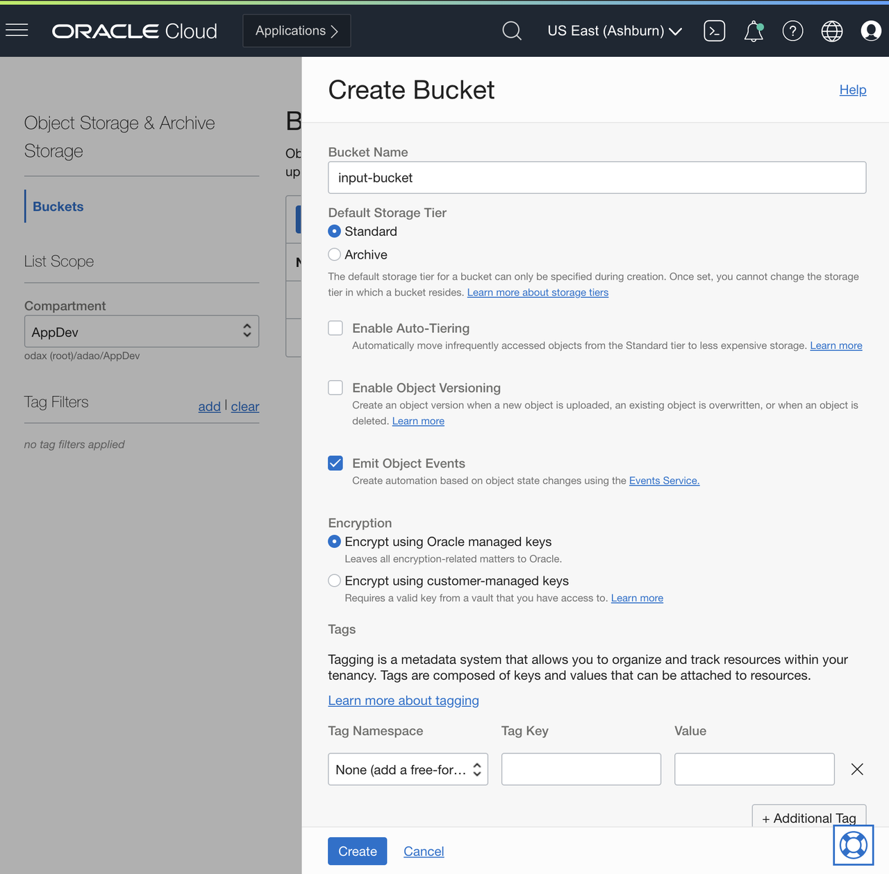
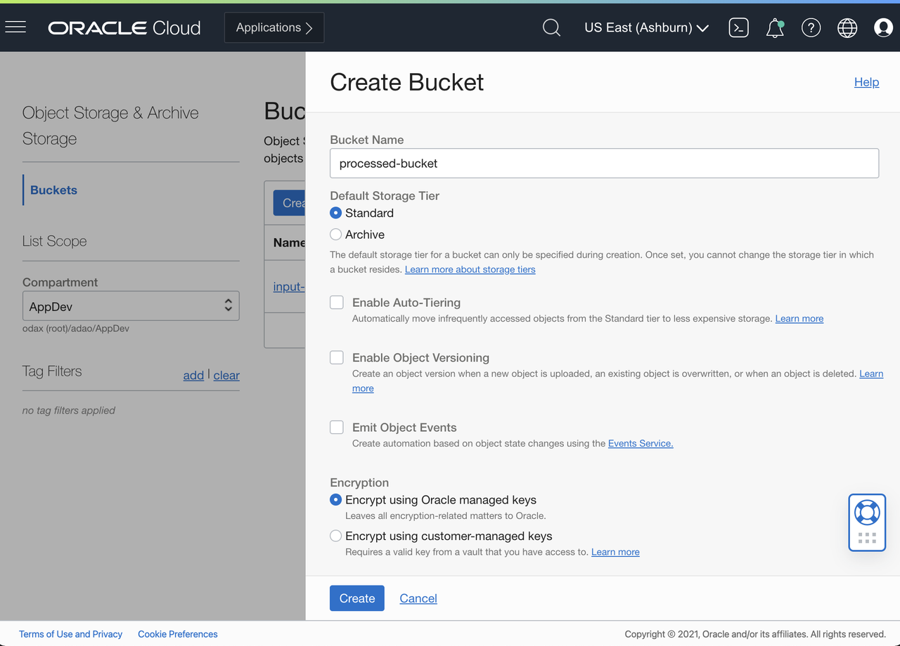
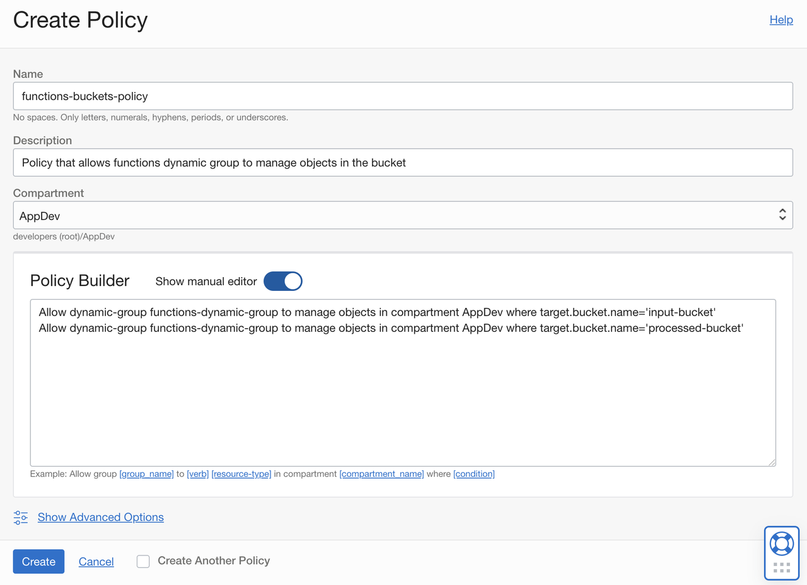
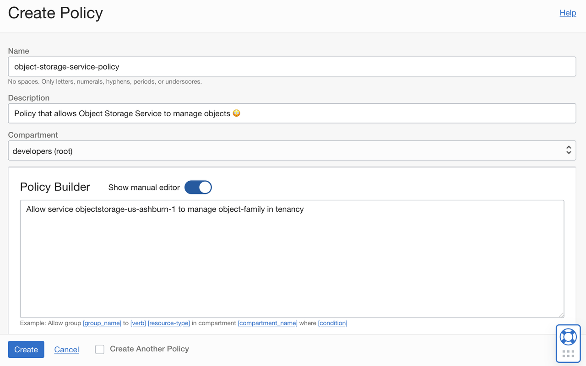
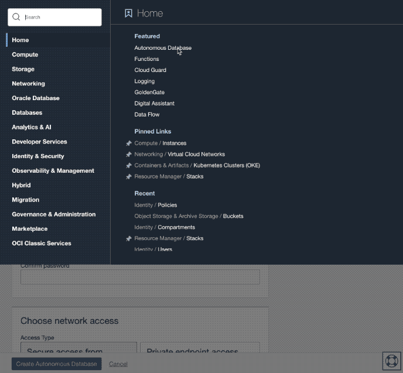
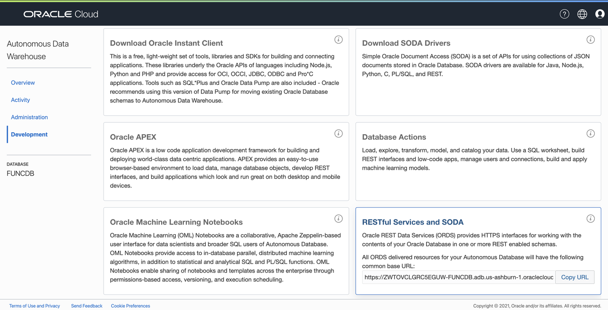
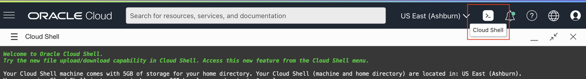

# Create Bucket, Policies and Autonomous Database (ADW)

## Introduction

In this lab you will create an Object Storage Bucket and Autonomous Database that will be used by the Function.

Estimated time: 10 minutes

### Objectives

- Create Object Storage Bucket for input files.
- Create Object Storage Bucket for processed files.
- Create the IAM policy for the Function to access the Bucket
- Create the IAM policy for the Object Storage Service be able to manage objects
- Create an Autonomous Data Warehouse Database.

### Prerequisites

- Your Oracle Cloud Trial Account
- Completed the **Prerequisites for Functions**

## Task 1: Create Object Storage Bucket for input

You need a `input-bucket` bucket in Object Storage. You will use the `input-bucket` to drop-in the CSV files. The function will process the file and import them into Autonomous Data Warehouse.

Let's create the `input-bucket` first:

1. Click the **Navigation Menu** in the upper left, navigate to **Storage** and select **Buckets** under **Object Storage and Archive Storage**.

    

1. Select your development compartment (AppDev) from the **Compartment** list.
1. Click the **Create Bucket**.
1. Name the bucket **input-bucket**.
1. Select the **Standard** storage tier.
1. Check the **Emit Object Events** check box.
1. Click **Create**.

    

## Task 2: Create Object Storage Bucket for processed files

You need a `processed-bucket` bucket in Object Storage. The function will upload the processed files to the `processed-bucket`.

Let's create the `processed-bucket`:

1. Click the **Navigation Menu** in the upper left, navigate to **Storage** and select **Buckets** under **Object Storage and Archive Storage**.

    

1. Select your development compartment (AppDev) from the **Compartment** list.
1. Click the **Create Bucket**.
1. Name the bucket **processed-bucket**.
1. Select the **Standard** storage tier.
1. Click **Create**.

    

## Task 3: Create Compartment IAM policies for the function

Create a new policy that allows the dynamic group (`functions-dynamic-group`) to manage objects in the bucket.

1. Click the **Navigation Menu** in the upper left, navigate to **Identity & Security** and select **Policies** under the **Identity** section.

    

1. Click **Create Policy**.
1. For name, enter `functions-buckets-policy`.
1. For description, enter `Policy that allows functions dynamic group to manage objects in the bucket`.
1. Under Compartment, select `AppDev` (Or any other compartment that you created on the previous lab)
1. Go to the Policy Builder section and turn on the `Show manual editor`.
1. Enter on the textbox the policy bellow:

    `Allow dynamic-group functions-dynamic-group to manage objects in compartment [compartment-name] where target.bucket.name='input-bucket'`

    `Allow dynamic-group functions-dynamic-group to manage objects in compartment [compartment-name] where target.bucket.name='processed-bucket'`

    Note: the `compartment-name` is your development compartment (the one where you created the VCN and will be creating a Function Application later in the lab e.g., AppDev)

    Example using AppDev Compartment:

    ```shell
    <copy>
    Allow dynamic-group functions-dynamic-group to manage objects in compartment AppDev where target.bucket.name='input-bucket'
    </copy>
    ```

    Press enter to go to a new line (as shown on the picture)

    ```shell
    <copy>
    Allow dynamic-group functions-dynamic-group to manage objects in compartment AppDev where target.bucket.name='processed-bucket'
    </copy>
    ```

1. Click **Create**.

    

## Task 4: Create Tenancy IAM policies for the Object Storage service

Create a new policy that allows the service Object Storage manage objects. (you may not need that policy, here just in case you do not have correct access to your tenancy)

1. Click the **Navigation Menu** in the upper left, navigate to **Identity & Security** and select **Policies** under the **Identity** section.

    

1. Click **Create Policy**.
1. For name, enter `object-storage-service-policy`.
1. For description, enter `Policy that allows Object Storage Service to manage objects 😳`.
1. Under Compartment, select the `(root)` compartment. (You should see the tenancyName(root) on the lower level, where tenancyName is the name of your tenancy)
1. Go to the Policy Builder section and turn on the `Show manual editor`.
1. Enter on the textbox the policy similar to the bellow:

    `Allow service objectstorage-<region-name> to manage object-family in tenancy`

    Note: the `<region-name>` is your deployment tenancy

    Example using us-ashburn-1 (US East (Ashburn)):

    ```shell
    <copy>
    Allow service objectstorage-us-ashburn-1 to manage object-family in tenancy
    </copy>
    ```

1. Click **Create**.

    

## Task 5: Create an Autonomous Data Warehouse

The function accesses the Autonomous Database using SODA (Simple Oracle Document Access) for simplicity. You can use the other type of access by modifying the function.

1. Navigate to **Autonomous Data Warehouse**. Click the **Navigation Menu** in the upper left, navigate to **Oracle Database** and select **Autonomous Data Warehouse**.

    

1. Click **Create Autonomous Database**.
1. From the list, select your development compartment (AppDev).
1. For display name and database name, enter `funcdb`.
1. For the workload type, select **Data Warehouse**.
1. For deployment type, select **Shared Infrastructure**.
1. Enter the admin password. Make a note on the password, as you will need on the next lab.
1. Choose license type to **License Included**.
1. Click **Create Autonomous Database**.

    

    Wait for OCI to provision the Autonomous Database, and then click the **Service Console** button.

1. Click **Development** from the sidebar.
1. Under RESTful Services and SODA, click **Copy URL**.

    

1. Go back to the OCI Console and open the OCI Cloud Shell

    

1. From your OCI Cloud Shell (If using another terminal, you need to make sure you have all tools to test or alternatives), create the collection called `regionsnumbers` by running the command below. Make sure you replace the `<ORDS_BASE_URL>` with the value you copied in the previous step, and `<DB_PASSWORD>` with the admin password you set when you created the Autonomous Database.

    - export env variable `ORDS_BASE_URL`:

        ```shell
        <copy>
        export ORDS_BASE_URL=<ORDS_BASE_URL>
        </copy>
        ```

    - export env variable DB_PASSWORD:

        ```shell
        <copy>
        export DB_PASSWORD=<DB_PASSWORD>
        </copy>
        ```

        Note: Include passwords on env variables is not recommended in a production environment. Is include here to facilitate the copy of the commands

    - create collection `regionsnumbers`:

        ```shell
        <copy>
        curl -X PUT -u 'ADMIN:"'$DB_PASSWORD'"' -H "Content-Type: application/json" $ORDS_BASE_URL/admin/soda/latest/regionsnumbers
        </copy>
        ```

1. To double check collection was created, you can list all collections. The output should look similar as below:

    ```shell
    <copy>
    curl -u 'ADMIN:"'$DB_PASSWORD'"' -H "Content-Type: application/json" $ORDS_BASE_URL/admin/soda/latest/
    </copy>
    ```

    You should see something like this:

    ```bash
    {"items":[{"name":"regionsnumbers","properties":{"schemaName":"ADMIN","tableName":"REGIONSNUMBERS","keyColumn":{"name":"ID","sqlType":"VARCHAR2","maxLength":255,"assignmentMethod":"UUID"},"contentColumn":{"name":"JSON_DOCUMENT","sqlType":"BLOB","jsonFormat":"OSON"},"versionColumn":{"name":"VERSION","type":"String","method":"UUID"},"lastModifiedColumn":{"name":"LAST_MODIFIED"},"creationTimeColumn":{"name":"CREATED_ON"},"readOnly":false},"links":[{"rel":"canonical","href":"https://.../ords/admin/soda/latest/regionsnumbers"}]}],"hasMore":false}
    ```

Do not close the OCI Cloud Shell, as you will be using ont he next lab.

You may now [proceed to the next lab](#next).

## Acknowledgements

- **Author** - Adao Junior
- **Contributors** -  Peter Jausovec, Prasenjit Sarkar, Adao Junior, Sachin Pikle, Mark Mundy
- **Sample Author** - Greg Verstraeten
- **Last Updated By/Date** - Adao Junior, July 2021
