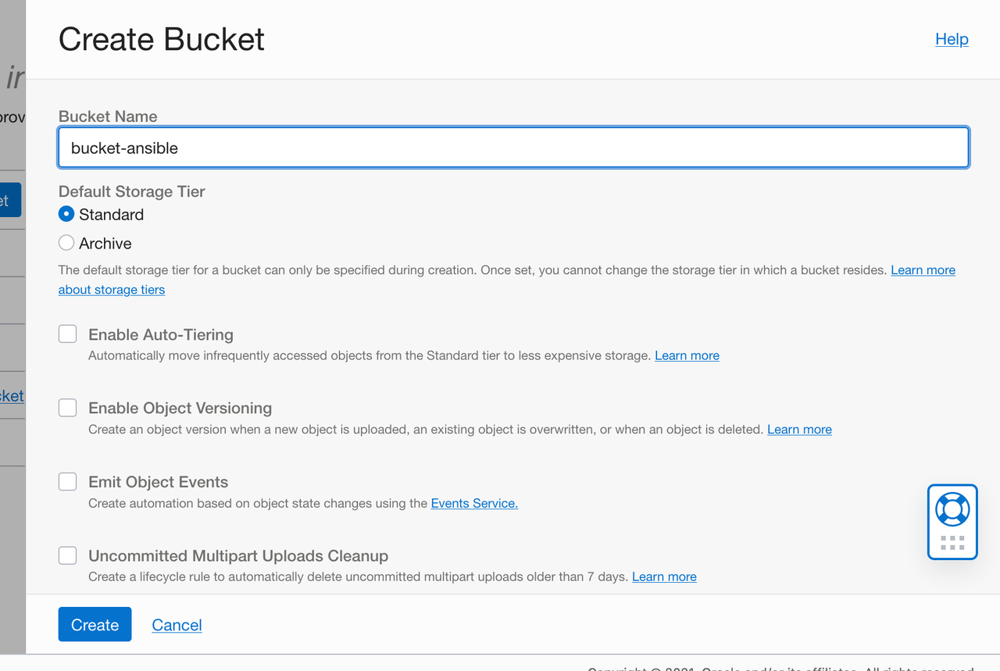
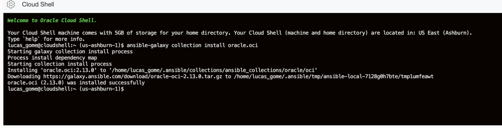
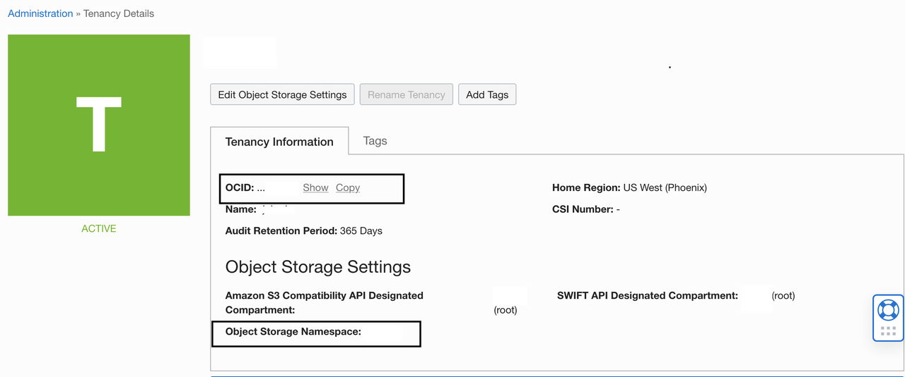
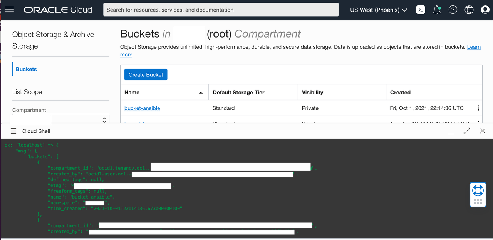

# Install Oracle Cloud Infrastructure Ansible Collection

  ## Introduction
  
  [Oracle Cloud Infrastructure Ansible Collection](https://docs.oracle.com/en-us/iaas/Content/API/SDKDocs/ansiblegetstarted.htm) provides an easy way to provision and manage resources in Oracle Cloud using Ansible. With the creation of Oracle Cloud Ansible Collection, we are providing two user benefits:
  
   **Faster Availability** - Oracle Cloud Ansible Modules will now be available to users at a faster pace on Ansible Galaxy. 
   
   **Wider Coverage** - Support for the majority of the Oracle Cloud services.

   Below is a collection ofi OCI Ansible collateral for your reference before we walk through a OCI Ansible tutorial.

   - [Ansible Galaxy Reference](https://galaxy.ansible.com/oracle/oci)

   -  [OCI Ansible Samples](https://github.com/oracle/oci-ansible-collection/tree/master/samples)

   - [OCI Ansible Solutions](https://github.com/oracle/oci-ansible-collection/tree/master/solutions)


In this tutorial, we’re going to use [OCI Cloud Shell](https://docs.oracle.com/en-us/iaas/Content/API/Concepts/cloudshellintro.htm) since Ansible comes pre-installed for your environment. We are going to create an OCI object storage bucket. We are going to then install the Oracle Cloud Infrastructure Ansible collection using OCI Cloud Shell. You then will write a sample playbook that uses Ansible modules on OCI. 

### Pre-Requisites

* Need to be an OCI Tenancy Administrator


## Task 1: Create Object Storage Bucket

1. Open the navigation menu and click ***Storage***. Under ***Object Storage***, click ***Buckets***.

2. Select a ***compartment*** from the ***Compartment list***  on the left side of the page. For this lab you will remain in the tenancy root compartment.

You will keep all of the defaults for the bucket creation.

3. Click ***Create Bucket***.

4. Enter a ***Bucket Name*** . For this lab we will name the bucket **bucket-ansible**.

   You will keep all of the defaults for the bucket creation.

5. Click ***Create*** . 


 


## Task 2: Install an OCI Ansible Collection using Cloud Shell

1. To start the Oracle Cloud shell, go to your Cloud console and click the cloud shell icon at the top right of the page.


  


   

2. From the OCI Cloud Shell, install the OCI Ansible collection from Ansible Galaxy by using the following command:

```bash
   $ ansible-galaxy collection install oracle.oci
 ```


   


## Task 3: Write a sample Ansible playbook

   After your installation is complete, you can write a sample playbook that uses Ansible modules. 


1.  Open the navigation menu and click on ***Profile*** and click ***Tenancy*** your tenancy name. Copy and make note of your **tenancy ocid** and **Object Storage Namespace** as you will use it in the next step. 


      


2. Using OCI Cloud Shell, write the following file list-buckets.yaml, that uses the oci-object-storage-bucket-facts module to fetch facts pertaining to the buckets in your compartment.
    
 ```yaml

---
- name : List summary of existing buckets in OCI object storage
  collections:
    - oracle.oci
  connection: local
  hosts: localhost
  tasks:
    - name: List bucket facts
      oci_object_storage_bucket_facts:
         namespace_name: '<yournamespace>'
         compartment_id: '<yourcompartmentocid>'
      register: result
    - name: Dump result
      debug: 
        msg: '{{result}}'

```

3. Execute the Ansible playbook using Python by invoking this command:

 ```bash
   $ ansible-playbook list_buckets.yml
 ```


 You should expect an output of listing the object storage bucket you created earlier in the lab.

 




