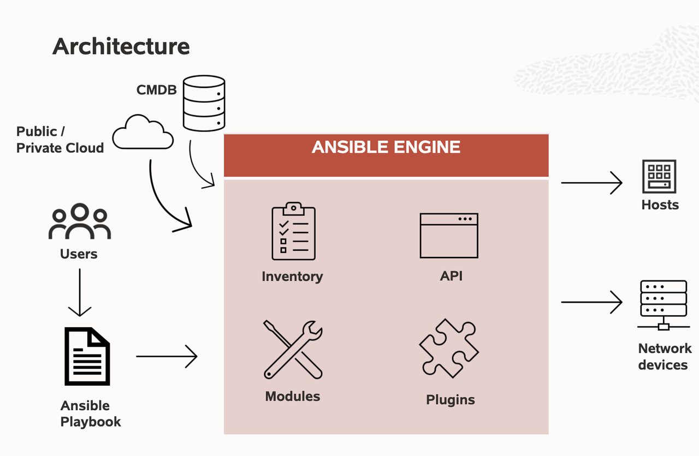

# Introduction

## What is Ansible

**Ansible** is an open-source IT automation platform that makes your applications and systems easier to deploy and maintain. Ansible handles configuration management, application deployment, cloud provisioning, ad-hoc task execution, network automation and multi-node orchestration in a language that approaches plain English, using SSH - with no agents to install on remote systems.Ansible proposal is to be the easiest IT automation system to use, ever. Some design principles:Easy to setup, with a minimal learning curveManage remote systems very quickly and in parallel; agentless, leveraging SSHDescribe infrastructure in a language that is both machine and human friendlyFocus on security and easy auditability/review/rewriting of content

## Why Ansible

### Cpnfiguration Management

- Centralizing configuration file management

- Write state description of servers (playbooks)

- Human/Machine-readable format

***Example***

- Configuration files contain the expected value, expected permissions

- Ensure services are running

### Application Deployment

- Generate, package source code, binaries, static assets

- Copy then to servers

- Start-up services

***Example***

- Build Container Images

- Build VM Images

- Build K8s Operator (Ansible Operators)

### Orchestration

- Orchestrate deployments

- Multiple remote servers and ensure things happen in a specific order

- Rolling update

***Example***

- Bring up a database before the web server

- Take a web server out of the Load Balancer one at a time to upgrade without downtime (rolling update)

## Ansible Use Cases 

### Provisioning

- On-premise
  - Bare Metal
  - Virtual Machines
  - Hypervisors
  
- Cloud Infrastructure
  - Public
  - Private
  
- Network Devices

- Storage

***Example***

- OCI Virtual Cloud Network, Load Balancer, OKE, VirtualBox, GlusterFS, Firewalls

### Continuous Delivery

- Enable Agile Software Development

-  Integrate with CI Platform

- Monitoring
  - Notifications, APM tools integration

 ***Example***

 -  Build System invoke Ansible to deploy build artifact into staging environments

 - When the stage tests pass, run a production deployment

 -  Ansible can check out your artifacts from version control on each machine, or pull artifacts from the CI server, or from a package mirror.

 ### Security Automation and Compliance

 - Integrate with security platforms
   - Firewalls
   - Intrusion detection & prevention systems (IDPS)
   - Security Information and Event Management (SIEM)
   - Privileged Access Management (PAM)

 - Automated response to security attacks

 ***Example***

 - Investigation enrichment

 - Threat hunting

 - Incident response 

### Ansible Architecture

To learn more about Ansible, please visit [Getting Started with Ansible](https://www.ansible.com/overview/how-ansible-works) 

## Acknowledgements

* **Author** - Rishi Johari, Lucas Gomes
* **Last Updated By/Date** - Rishi Johari, September, 2021
