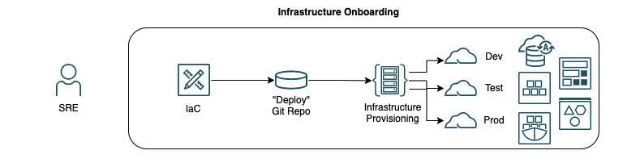
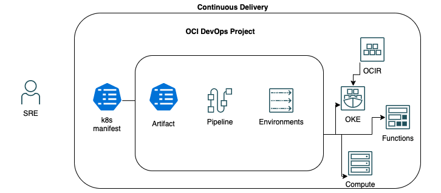

# Introduction

## Automating the Deployment of Java Apps to Oracle Cloud Infrastructure

You will learn how to build your infrastructure and automate the deployment of a Cloud Native Java application to Oracle Container Engine for Kubernetes (OKE)  using Oracle Cloud Infrastructure (OCI) DevOps. 

Estimated time: 90 minutes

## Cloud Native Applications Overview

Here is the definition of Cloud Native Applications accordingly to [Cloud Native Computing Foundation (CNCF)](https://github.com/cncf/foundation/blob/master/charter.md):

"Cloud native technologies empower organizations to build and run scalable applications in modern, dynamic environments such as public, private, and hybrid clouds. Containers, service meshes, microservices, immutable infrastructure, and declarative APIs exemplify this approach.

These techniques enable loosely coupled systems that are resilient, manageable, and observable. Combined with robust automation, they allow engineers to make high-impact changes frequently and predictably with minimal toil."

## Oracle DevOps

Oracle Cloud Infrastructure DevOps service provides an end-to-end CI/CD platform for developers. It includes *Deployment Pipelines* to automate your software delivery, and deployment process targeting OCI services: 
- Oracle Container Engine for Kubernetes (OKE)
- Oracle Functions (Fn)
- Compute instances

Automating software releases with Deployment Pipelines increases developer productivity and allows you to release features more frequently and with fewer errors. It helps avoid downtime during deployments and automates the complexity of updating applications. Oracle DevOps can be used by both customers migrating workloads to OCI (from on-prem or other clouds) and customers developing new applications on OCI.

OCI DevOps offers many deployment strategies to meet your needs – you can perform rolling updates, as well as Blue/Green (also called A/B) and Canary release strategies. With the ability to rollback a deployment coupled with support for various release strategies, Deployment Pipelines provides the capability to minimize the blast radius due to a bad deployment. You can get started with a deployment with the OCI DevOps using existing 3rd party CI platforms leveraging plugins, as well as via CLI and SDKs.

## Role Play Scenario

You are leading a company to build a new e-commerce cloud native application using microservices architecture, Kubernetes and you want to automate the software development lifecycle (SDLC) to quickly innovate, delivery new features to customers constantly and faster. There is a Developers team that is responsible for building and testing the application. There is also a SRE (Site Reliability Engineering)/Platform Engineer team that will be responsible for provisioning the infrastructure and take care of operations to ensure the business can meet their Service Level Objective (SLO).

During this lab you will play the role of an SRE/Platform Engineer which will be responsible for: 

- write Infrastructure As Code (IaC) and provision the infrastructure using OCI Resource Manager (Terraform as Service)

    

- write K8s manifest files for deploying services/endpoints/security used by application
- rollout new features/services through the Continuos Delivery pipeline
- rollback to the latest successful pipeline in case of failures

    

### Objectives

In this lab, you will:

* Provisioning Infrastructure using IaC and OCI Resource Manager 
* Deploy a Java Cloud Native Microservice to OKE Kubernetes cluster via DevOps Pipeline

### Prerequisites

1. An Oracle Free Tier(Trial), Paid or LiveLabs Cloud Account
1. [Familiarity with OCI console](https://docs.us-phoenix-1.oraclecloud.com/Content/GSG/Concepts/console.htm)
1. [Overview of Networking](https://docs.us-phoenix-1.oraclecloud.com/Content/Network/Concepts/overview.htm)
1. [Familiarity with Compartments](https://docs.us-phoenix-1.oraclecloud.com/Content/GSG/Concepts/concepts.htm)
1. Basic conceptual knowledge of containers and [Kubernetes](https://kubernetes.io/)

You may now [proceed to the next lab](#next).

## Learn More

* [Cloud Native on OCI using MuShop sample](https://oracle-quickstart.github.io/oci-cloudnative/)
* [Reference Architecture: Deploy a microservices-based application in Kubernetes](https://docs.oracle.com/en/solutions/cloud-native-ecommerce/index.html#GUID-CB180453-1F32-4465-8F27-EA7300ECF771)

## Acknowledgements

* **Author** - Lucas Gomes
* **Contributors** -  Jonathan Schreiber, Rishi Johari, Tim Graves
* **Last Updated By/Date** - Lucas Gomes, July 2021
