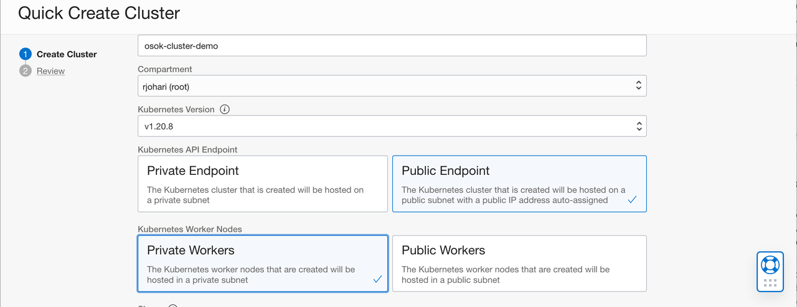
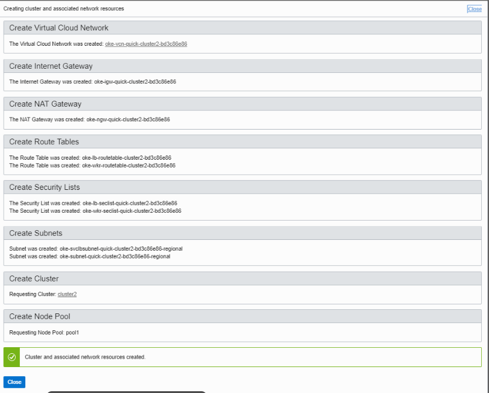
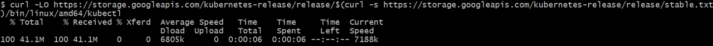
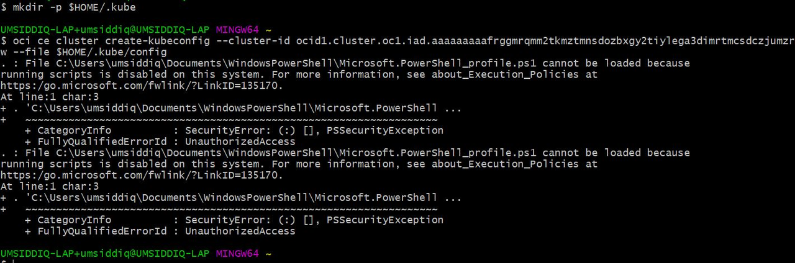

## Introduction

A Kubernetes cluster is a group of nodes. The nodes are the machines running applications. Each node can be a physical machine or a virtual machine. The node's capacity (its number of CPUs and amount of memory) is defined when the node is created. A cluster comprises:

- one or more master nodes (for high availability, typically there will be a number of master nodes)
- one or more worker nodes (sometimes known as minions)

A Kubernetes cluster can be organized into namespaces to divide the cluster's resources between multiple users. Initially, a cluster has the following namespaces:

- default, for resources with no other namespace
- kube-system, for resources created by the Kubernetes system
- kube-node-lease, for one lease object per node to help determine node availability
- kube-public, usually used for resources that have to be accessible across the cluster

# Objectives
- Create an OCI Container Engine Kubernetes cluster (OKE) deploying Oracle Container Engine for Kubernetes


### Prerequisites
- [OCI CLI Installation on your local machine](https://docs.oracle.com/en-us/iaas/Content/API/SDKDocs/cliinstall.htm)

- Need to be an OCI Tenancy Administrator


## Task 1: Create Kubernetes Cluster

1. From OCI Services menu, Click ***Container Clusters (OKE)*** under Developer Services.

    **No need to create any policies for OKE, all the policies are pre-configured**

      

    

2. Under ***List Scope***, select the compartment in which you would like to create a cluster.


3. Click ***Create Cluster***. Choose ***Quick Create*** and click ***Launch Workflow***.

4. Fill out the dialog box:

      - NAME: Provide a name (oke-cluster in this example)
      - COMPARTMENT: Choose your compartment ( we will use the root compartment)
      - Kubernetes API Endpoint: Public Endpoint
      - Kubernetes Worker Nodes: Private Worker Nodes
      - SHAPE: Choose any VM shape of your choice
      - NUMBER OF NODES: 1


     


5. Click ***Next*** and Click "***Create Cluster***".

    **We now have a OKE cluster with 1 node and Virtual Cloud Network with all the necessary resources and configuration needed**

    


## Task 2: Check OCI CLI on out local machine

OCI Command Line should be installed as a prerequisite to this lab.

1.  Check the installed version of OCI CLI. 

    ```
    <copy>
    oci -v
    </copy>
    ```
    to check OCI CLI version which should be 2.24.x or higher.


## Task 3: Install Kubectl

In this section we will install kubectl. You can use the Kubernetes command line tool kubectl to perform operations on a cluster you've created with Container Engine for Kubernetes.

1. Switch to git-bash window, Enter commands:

    ```
    <copy>
    mkdir -p $HOME/.kube
    </copy>
    ```
    ```
    <copy>
    cd $HOME/.kube
    </copy>
    ```

    ```
    <copy>
    curl -LO https://storage.googleapis.com/kubernetes-release/release/v1.15.0/bin/windows/amd64/kubectl.exe
    </copy>
    ```

    

2.  Wait for download to complete. Enter command

    ```
    <copy>
    ls
    </copy>
    ```
    and verify kubectl.exe file exists.

## Task 4: Download get-kubeconfig.sh file and Initialize your environment

1. Switch to OCI console window and navigate to your cluster. In Cluster detail window, scroll down and click ***Quick Start***, under ***Resources***.
Follow the steps under the ***Quick Start*** Section.
    

2. The ***Quick Start*** directions will direct you to copy and execute the following commands depicted below in your local terminal.

    