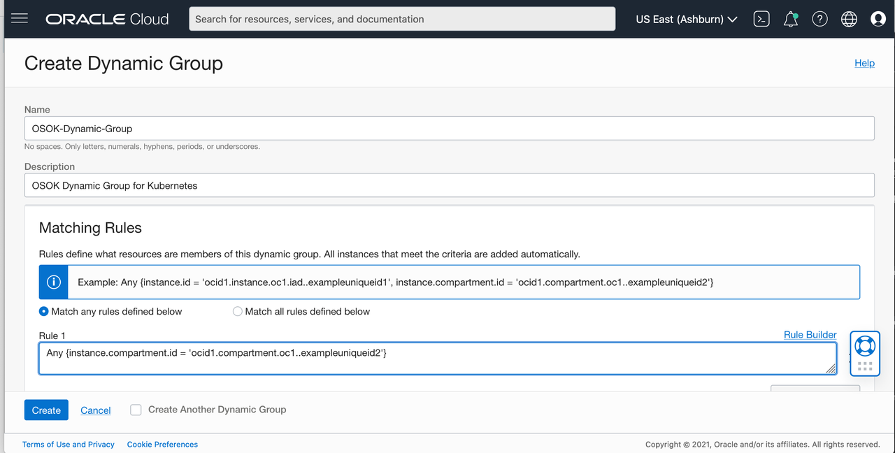

## Install Oracle Service Operator for Kubernetes

In this tutorial, you will be installing the Oracle Service Operator for Kubernetes (OSOK) and deploying it to the Kubernetes cluster you created in the previous lab. These steps are meant to be performed on your local machine. 


## Pre-Requisites

* Kubernetes Cluster
* `kubectl` to control the Kubernetes Cluster. Please make sure it points to the above Kubernetes Cluster.
* Need to be an OCI Tenancy Administrator

## Task 1: Install Operator SDK

The Operator SDK installation is documented in detail by the operator-sdk project. Please follow the document [here](https://sdk.operatorframework.io/docs/installation/) to install it.

## Task 2: Install Operator Lifecycle Manager (OLM)

### Install OLM

Install the OLM from the operator-sdk, you can use the following command:

```
    <copy>
    operator-sdk olm install
    </copy>
    ```
 Output of the above command
```bash

...
...
INFO[0079] Successfully installed OLM version "latest"
```

### Verify Installation

You can verify your installation of OLM by first checking for all the necessary CRDs in the cluster:

 ```
    <copy>
    operator-sdk olm status
    </copy>
    ```

Output of the above command
```bash
INFO[0007] Fetching CRDs for version "0.18.1"
INFO[0007] Fetching resources for resolved version "v0.18.1"
INFO[0031] Successfully got OLM status for version "0.18.1"

NAME                                            NAMESPACE    KIND                        STATUS
operators.operators.coreos.com                               CustomResourceDefinition    Installed
operatorgroups.operators.coreos.com                          CustomResourceDefinition    Installed
operatorconditions.operators.coreos.com                      CustomResourceDefinition    Installed
installplans.operators.coreos.com                            CustomResourceDefinition    Installed
clusterserviceversions.operators.coreos.com                  CustomResourceDefinition    Installed
olm-operator                                    olm          Deployment                  Installed
olm-operator-binding-olm                                     ClusterRoleBinding          Installed
operatorhubio-catalog                           olm          CatalogSource               Installed
olm-operators                                   olm          OperatorGroup               Installed
aggregate-olm-view                                           ClusterRole                 Installed
catalog-operator                                olm          Deployment                  Installed
subscriptions.operators.coreos.com                           CustomResourceDefinition    Installed
aggregate-olm-edit                                           ClusterRole                 Installed
olm                                                          Namespace                   Installed
global-operators                                operators    OperatorGroup               Installed
operators                                                    Namespace                   Installed
packageserver                                   olm          ClusterServiceVersion       Installed
olm-operator-serviceaccount                     olm          ServiceAccount              Installed
catalogsources.operators.coreos.com                          CustomResourceDefinition    Installed
system:controller:operator-lifecycle-manager                 ClusterRole                 Installed
```

## Task 3: Deploy OCI Service Operator for Kubernetes

### Enable Instance Principal

The OCI Service Operator for Kuberentes needs [OCI Instance Principal](https://docs.oracle.com/en-us/iaas/Content/Identity/Tasks/callingservicesfrominstances.htm). details to provision and manage OCI services/resources in your tenancy. This is the recommended approach for running OSOK within OCI.

To do this you are required to create a [OCI Dynamic Group](https://docs.oracle.com/en-us/iaas/Content/Identity/Tasks/managingdynamicgroups.htm#Managing_Dynamic_Groups).


### Create OCI Dynamic Group

1. Open the navigation menu and click on ***Profile*** and click ***Tenancy*** your tenancy name. Copy and make note of your tenancy ocid as you will use it later.

2. Open the navigation menu and click ***Identity & Security***. Under ***Identity***, click ***Dynamic Groups***.

3. Click ***Create Dynamic Group***.

4.  Enter the following:
    A unique name for the group. The name must be unique across all groups in your tenancy (dynamic groups and user groups). You can't change this later. Avoid entering confidential information.

5.  ***Description***: Enter a friendly description.
 
6.  Enter a Matching Rule
```
#### Below rule matches the compartment where the worker instances are running. Enter your tenancy ocid between '' in the following policy statement. Enter the tenancy ocid you noted from a previous step for the instance.compartment.id . 

Any {instance.compartment.id = instance.compartment.id = {'tenancy ocid'}

```
7. Select ***Create***

 


### Enable User Principal

The OCI Service Operator for Kubernetes needs OCI user credentials details to provision and manage OCI services/resources in the customer tenancy. This approach is recommended when OSOK is deployed outside OCI.

The users required to create a Kubernetes secret as detailed below.

The OSOK will be deployed in `oci-service-operator-system` namespace. For enabling user principals, we need to create the namespace before deployment.

Create a yaml file named oci-service-operator-system using below details
```yaml
apiVersion: v1
kind: Namespace
metadata:
  labels:
    control-plane: controller-manager
  name: oci-service-operator-system
```

Create the namespace in the kubernetes cluster using below command
```bash
$ kubectl apply -f oci-service-operator-system
```

The secret should have the below Keys and respective values for it. You can recieve assistance in obtaining these values from this [page](https://docs.oracle.com/en-us/iaas/Content/API/SDKDocs/cliinstall.htm#configfile). 

| Key | Description |
| --------- | ----------- |
| `tenancy` | The OCID of your tenancy |
| `fingerprint`    | The Fingerprint of your OCI user |
| `user`    | OCID of the user |
| `privatekey`    | The OCI User private key |
| `passphrase`    | The passphrase of the private key. This is mandatory and if the private key does not have a passphrase, then set the value to an empty string. |
| `region`    | The region in which the OKE cluster is running. The value should be in OCI region format. Example: us-ashburn-1 |

Run the below command to create Secret by name `ociCredentials`. (Replace values with your user credentials)

```bash
$ kubectl -n oci-service-operator-system create secret generic ocicredentials \
--from-literal=tenancy={CUSTOMER_TENANCY_OCID} \
--from-literal=user={USER_OCID} \
--from-literal=fingerprint={USER_PUBLIC_API_KEY_FINGERPRINT} \
--from-literal=region={USER_OCI_REGION} \
--from-literal=passphrase={PASSPHRASE_STRING} \
--from-file=privatekey={PATH_OF_USER_PRIVATE_API_KEY}
```

The name of the secret will passed in the `osokConfig` config map which will be created as part of the OSOK deployment. By default the name of the user credential secret is `ocicredentials`. Also, the secret should be created in the `oci-service-operator-system` namespace

### Deploy OSOK

The OCI Service Operator for Kubernetes is packaged as Operator Lifecycle Manager (OLM) Bundle for making it easy to install in Kubernetes Clusters. The bundle can be downloaded as docker image using below command.

 ```
    <copy>
    docker pull iad.ocir.io/oracle/oci-service-operator-bundle:1.0.0
    </copy>
    ```

The OSOK OLM bundle contains all the required details like CRDs, RBACs, Configmaps, deployment which will install the OSOK in the Kubernetes cluster.


Install the OSOK Operator in the Kubernetes Cluster using below command


```
    <copy>
     operator-sdk run bundle iad.ocir.io/oracle/oci-service-operator-bundle:1.0.0
    </copy>
    ```
    
The successful installation of the OSOK in your cluster will provide the final message as below:
```bash
INFO[0040] OLM has successfully installed "oci-service-operator.v1.0.0"
```


