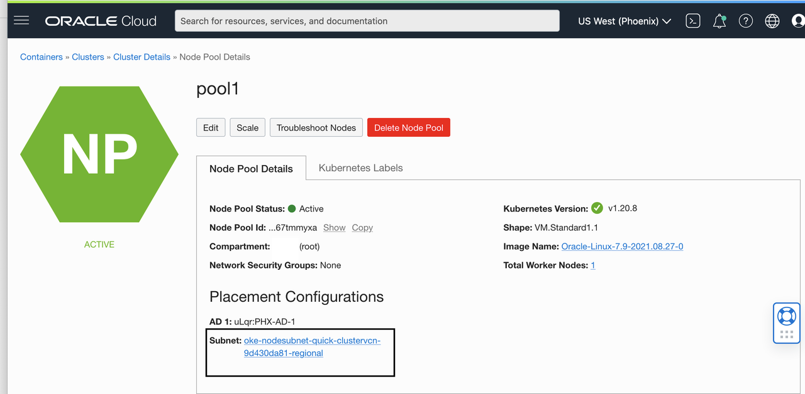

## Deploy Oracle MySQL DB System Service from Kubernetes

## Introduction

In this lab, we will use the deployed Oracle Service Operator for Kubernetes (OSOK) on your Kubernetes cluster from Lab 1 and Lab 2, to deploy the Oracle MySQL Database Service. 

[Oracle MySQL Database Service](https://www.oracle.com/mysql/) is a fully managed database service that lets developers quickly develop and deploy secure, cloud native applications using the world’s most popular open source database. Oracle MySQL Database Service is also offered via the OCI Service Operator for Kubernetes, making it easy for applications to provision and integrate seamlessly with MySQL databases.


## Task 1: Create  My SQL DB System Dynamic Group Policies


**For Instance Principle**
The OCI Service Operator dynamic group you created in the previous lab, will need the following [policies](https://docs.oracle.com/en-us/iaas/mysql-database/doc/policy-details-mysql-database-service.html#GUID-2D9D3C84-07A3-4BEE-82C7-B5A72A943F53) .
.

1. Open the navigation menu and click ***Identity & Security***. Under ***Identity***, click ***Policies***.

2. Click ***Create Policy***. 


**Sample Policy:**

```plain
Allow dynamic-group {OSOK_DYNAMIC_GROUP} to {SUBNET_READ, SUBNET_ATTACH, SUBNET_DETACH, VCN_READ, COMPARTMENT_INSPECT} in tenancy 
```
```plain
Allow dynamic-group {OSOK_DYNAMIC_GROUP} to manage mysql-family in tenancy 
```
```plain
Allow dynamic-group {OSOK_DYNAMIC_GROUP} to use tag-namespaces in tenancy
```

Without these policies, the service will not function correctly.

## Task 2: Provisioning a MySQL DB System

Provisioning of a MySQL DB System requires the user to input the admin username and admin password as a Kubernetes secret. OSOK acquires the admin usernmame and admin password from the Kubernetes secret whose name is provided in the `spec`. 
The Kubernetes secret should contain the admin username in `username` field. 
The Kubernetes secret should contain the admin password in `password` field. Create the following yaml file and name it CREATE_SECRET.yaml .

```yaml
apiVersion: v1
kind: Secret
metadata:
  name: {ADMIN_SECRET_NAME}
type: Opaque
data:
  username: {USERNAME_BASE64_ENCODED}
  password: {PASSWORD_BASE64_ENCODED}
```

Run the following command to create a secret for the Mysql DbSystem:
```sh
kubectl apply -f {CREATE_SECRET].yaml
```

The MySQL DB System can be accessed from the Secret which will be persisted as part of the provision/bind operation of the CR.

The OSOK MySqlDbSystem controller automatically provisions a MySQL DB System when you provide mandatory fields to the `spec`. The following is a sample CR yaml for MySqlDbSystem. Create a yaml file and name it CREATE_MYSQL.yaml. 

- SUBNET_OCID - OCID of the public worker node subnet created in your Kubernetes cluster from the previous lab. 

 


- CONFIGURATION-ID - [More info about Configurations](https://docs.oracle.com/en-us/iaas/mysql-database/doc/db-systems.html#GUID-E2A83218-9700-4A49-B55D-987867D81871) Get your [Configuration-id](https://console.us-ashburn-1.oraclecloud.com/mysqlaas/configurations) 


```yaml

apiVersion: oci.oracle.com/v1beta1
kind: MySqlDbSystem
metadata:
  name: {CR_OBJECT_NAME}
spec:
  compartmentId: {COMPARTMENT_OCID}
  displayName: {DISPLAY_NAME}
  shapeName: {SHAPE}
  subnetId: {SUBNET_OCID}
  configuration:
    id: {CONFIGURATION_OCID}
  availabilityDomain: {AVAIALABILITY_DOMAIN}
  adminUsername:
    secret:
      secretName: {ADMIN_SECRET}
  adminPassword:
    secret:
      secretName: {ADMIN_SECRET}
  description: {DESCRIPTION}
  dataStorageSizeInGBs: {DB_SIZE}
  port: {PORT}
  portX: {PORTX}


```
Example Yaml:

```yaml

#
# Copyright (c) 2021, Oracle and/or its affiliates. All rights reserved.
# Licensed under the Universal Permissive License v 1.0 as shown at http://oss.oracle.com/licenses/upl.
#

apiVersion: oci.oracle.com/v1beta1
kind: MySqlDbSystem
metadata:
  name: mysqldbsystem-sample
spec:
  compartmentId: ocid1.compartment.oc1..aaaaaaaaXXXXXXXXXXXXXXXXXXXXXXXXXXXXXXXXXXXXXXXX
  displayName: SampleDB
  shapeName: MySQL.VM.Standard.E3.1.8GB
  subnetId: ocid1.subnet.oc1.<region-shot-code>.aaaaaaaaXXXXXXXXXXXXXXXXXXXXXXXXXXXXXXXXXXXXXXXX
  configuration:
    id: ocid1.mysqlconfiguration.oc1..aaaaaaaaXXXXXXXXXXXXXXXXXXXXXXXXXXXXXXXXXXXXXXXX
  availabilityDomain: XXXX:US-ASHBURN-AD-1
  isHighlyAvailable: false
  adminUsername:
    secret:
      secretName: admin-secret
  adminPassword:
    secret:
      secretName: admin-secret
  description: <<Creating a Sample DB MySqlDbSystem using operators
  dataStorageSizeInGBs: 50
  port: 3306
  portX: 33060


```

Run the following command to create a CR to the cluster:
```sh
kubectl apply -f {CREATE_MYSQL}.yaml
```

Once the CR is created, OSOK will Reconcile and creates a MySQL DB System. OSOK will ensure the MySQL DB System instance is Available.

The MySqlDbSystem CR can list the MySQL DB Systems in the cluster: 
```sh
$ kubectl get mysqldbsystems
NAME                       STATUS         AGE
mysqldbsystems-sample      Active         4d
```

The MySqlDbSystem CR can list the MySQL DB Systems in the cluster with detailed information: 
```sh
$ kubectl get mysqldbsystems -o wide
NAME                         DISPLAYNAME     STATUS         OCID                                   AGE
mysqldbsystems-sample        BusyBoxDB       Active         ocid1.mysqldbsystem.oc1.iad.........   4d
```

The MysqlDbSystem CR can be described as below:
```sh
$ kubectl describe mysqldbsystems {NAME_OF_CR_OBJECT}
```
