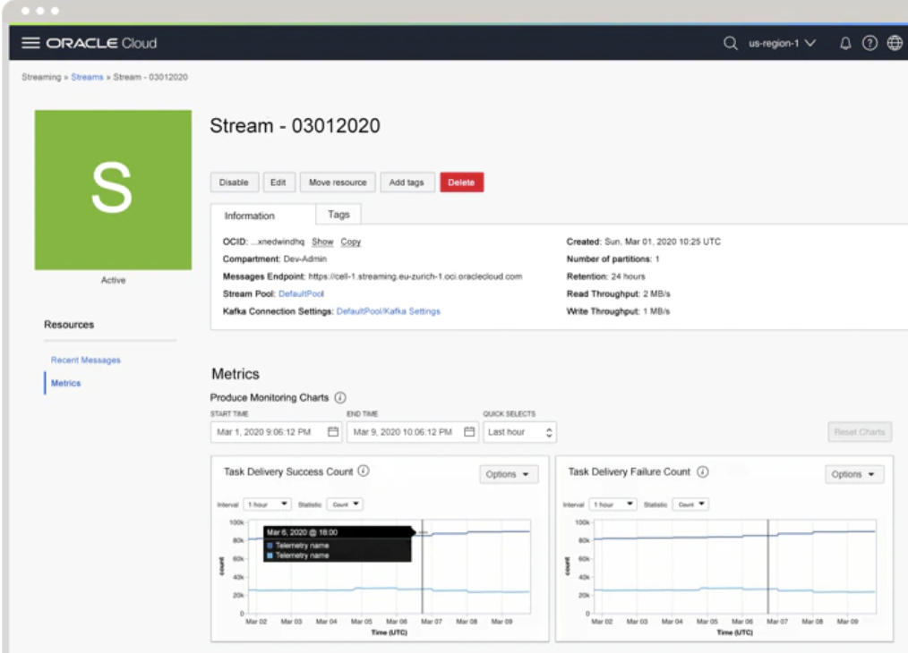
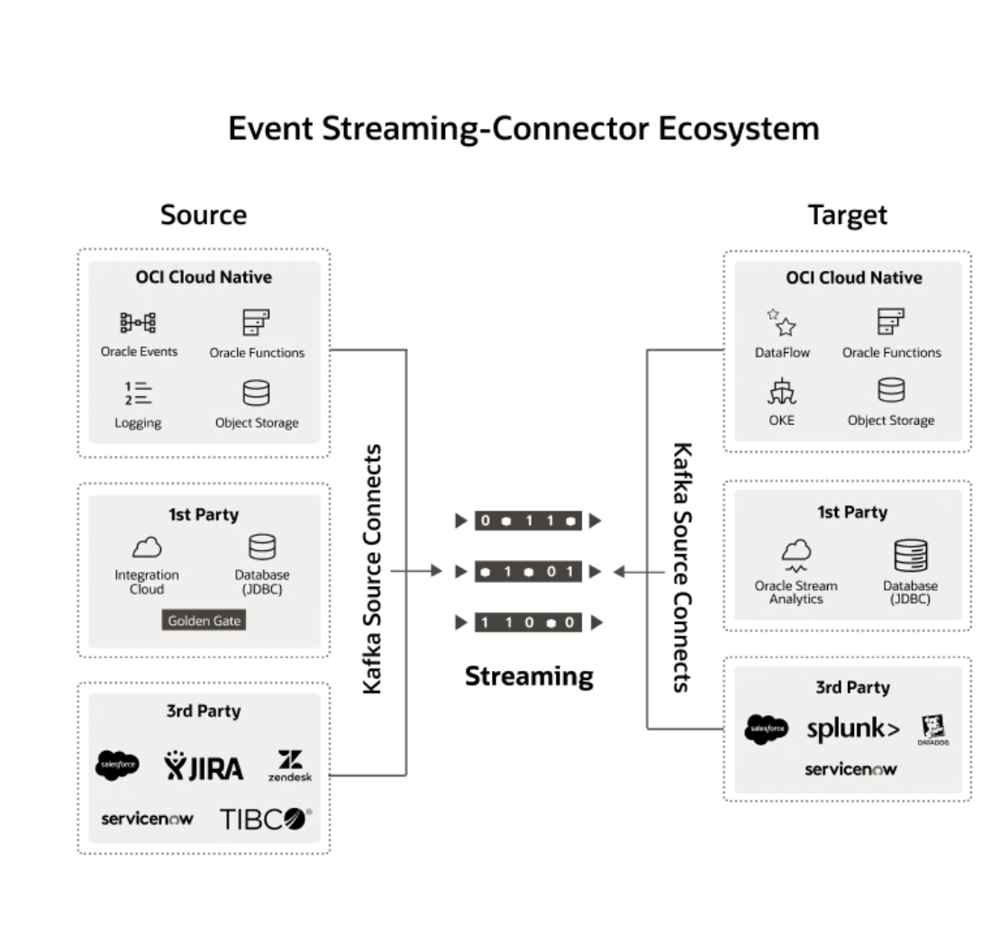
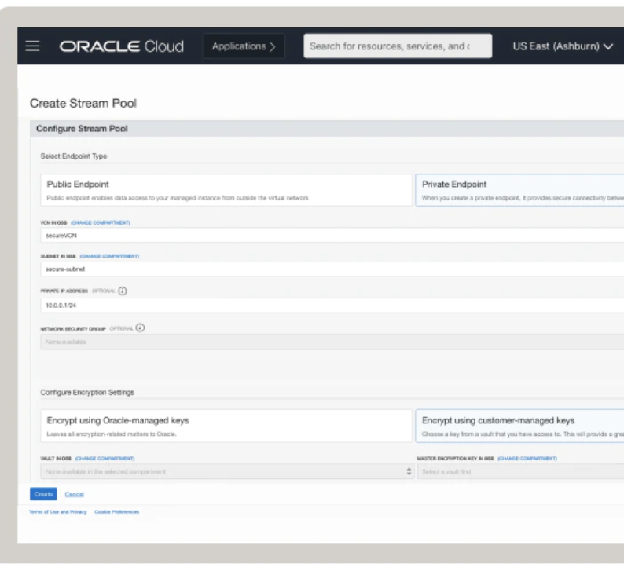

# Introduction

## What is OCI Streaming

[Oracle Cloud Infrastructure Streaming](https://www.oracle.com/cloud-native/streaming/) is a real-time, managed service, Apache Kafka-compatible event streaming platform for developers and data scientists.OCI Streaming provides a fully managed, scalable, and durable messaging solution for ingesting continuous, high-volume streams of data that you can consume and process in real time. Streaming is tightly integrated with Oracle Cloud Infrastructure (OCI), Database, GoldenGate, and Integration Cloud.  The service also provides out-of-the-box integrations for hundreds of third-party products across categories such as DevOps, databases, big data, and SaaS applications.

## Why OCI Streaming

### Serverless infrastructure

***Elastic and scalable platform***

Data engineers can easily set up and operate big data pipelines. Oracle handles all infrastructure and platform management for event streaming, including provisioning, scaling, and security patching.

 ***Deploy streaming apps at scale***

With the help of consumer groups, Streaming can provide state management for thousands of consumers. This helps developers easily build applications at scale.

***Oracle Cloud Infrastructure integrations***

Native integrations with Oracle Cloud Infrastructure services include Object Storage for long-term storage, Monitoring for observability, Resource Manager for deploying at scale, and Tagging for easier cost tracking/account management.

***Kafka Connect Harness***

The Kafka Connect Harness provides out-of-the-box integrations with hundreds of data sources and sinks, including GoldenGate, Integration Cloud, Database, and compatible third-party offerings.

### Open standards-based

***Open source Apache Kafka-compatible***

Run open source software as an Oracle-managed service. Streaming’s Kafka compatibility significantly reduces vendor lock-in and helps customers easily adopt hybrid and multi-cloud architectures.

***Choice of APIs***

Developers have the flexibility of using either Apache Kafka APIs or Oracle Cloud’s native Streaming APIs, which are available in SDKs such as Python, Java, Typescript, and Go.

***Easy transition for Kafka implementations***

Customers with existing Kafka implementations, whether deployed on-premises or on other clouds, can easily migrate to Streaming by changing a few configuration parameters.

### Security and reliability

***Encryption and privacy***

For security, the service provides data encryption both in transit and at rest. Streaming is integrated with Identity and Access Management (IAM) for fine-grained access control, as well as Private Endpoints and Vault (KMS) for data privacy.

***Fault tolerance and SLAs***

The service uses synchronous data replication across geographically distributed Availability Domains for fault tolerance and durability. Streaming is backed by a 99.95% service availability SLA. Oracle will provide credits for any breaches of this SLA.

***Consistent performance***

Streaming provides tenancy-level data isolation and eliminates “noisy neighbor” performance issues, irrespective of scale and usage.

### Industry-leading pricing

***Pay-as-you-use***

Customers pay only for what they use, making the service attractive for workloads with large spikes in usage.

***Simple pricing model***

Customers pay only for throughput and storage, with no upfront costs or early termination penalties.

***Zero-cost data movement***

Unlike other public cloud providers, Oracle does not charge any additional fees for data movement from Streaming to other Oracle Cloud Infrastructure services.

## Acknowledgements

* **Author** - Rishi Johari, Lucas Gomes
* **Last Updated By/Date** - Rishi Johari, September, 2021
