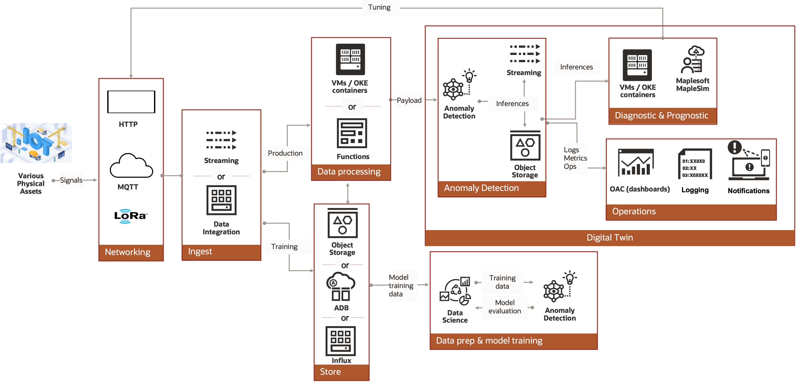

# Get Started with Digital Twin 

Companies define digital twin based on their business models. In this livelab, we define digital twin is used to detect anomaly of a machinery in the running process. 
To detect anomaly requires some form of a mathematical model that simulates the physical behavior of the system. 
The simulation models have been used to identify possible root causes of anomalies on standalone PCs for long time. Cloud technologies have enabled massive amounts of simulations to run on the server. 
Combing with other cloud technologies and MapleSim models, this hands-on lab introduce the reference architecture to massibly deploy simulation models into OCI as digital twin to generate the training data and identity the root causes of assets.

In this workshop, we use a telehandler simulation model to mimic the real telehandler. We generate training data from the simulation model. 
Then, we run the simulation models as the data source and change its parameter to mimic the condition change. The OCI anomaly detection service will detect the anomaly events happened in the digital twin and send notification to operator for diagnosis. 
Further, we can use the diagnostic result to modify the control parameter to compensate the behavior of the asset.

**Reference Architecture**:

## Introduction

Get hands-on learning with training labs about Oracle cloud solutions. The workshops featured cover various solutions, skill levels, and categories based on Oracle Cloud Infrastructure (OCI).

Estimated time: 120 minutes

## Objectives

1. Understand the refrence architecture to detect anomaly and OCI at high level
2. Understand the digital twin application at high level
3. Hands-on experience with OCI services to implement digit twin solution with OCI services and MapleSim
4. Understand the anomaly detection principle at high level 

## Prerequisites

1. An Oracle Free Tier, or Paid Cloud Account 
2. Administrator privilege of OCI tenancy required 
3. Additional prerequisites (cloud services) are mentioned per lab
4. Familiar with Python programming for SDK usage is recommended.
5. Familiar with Terraform script is recommended.
6. Familiar with asset management and conditioning monitoring

## Additional Recommended Resources

1. [OCI Training](https://cloud.oracle.com/en_US/iaas/training)
2. [Familiarity with OCI console](https://docs.us-phoenix-1.oraclecloud.com/Content/GSG/Concepts/console.htm)
3. [Overview of Networking](https://docs.us-phoenix-1.oraclecloud.com/Content/Network/Concepts/overview.htm)
4. [Familiarity with Compartments](https://docs.us-phoenix-1.oraclecloud.com/Content/GSG/Concepts/concepts.htm)

*Please proceed to the next lab.*

## Acknowledgements  --- TODO: update

- **Author** - Tony Zhang, Jiayuan Yang
- **Adapted by** -  
- **Contributors** - 
- **Last Updated By/Date** - 

