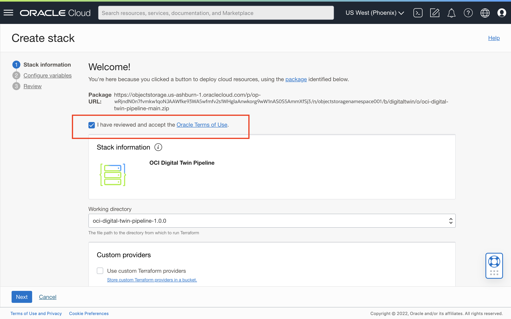
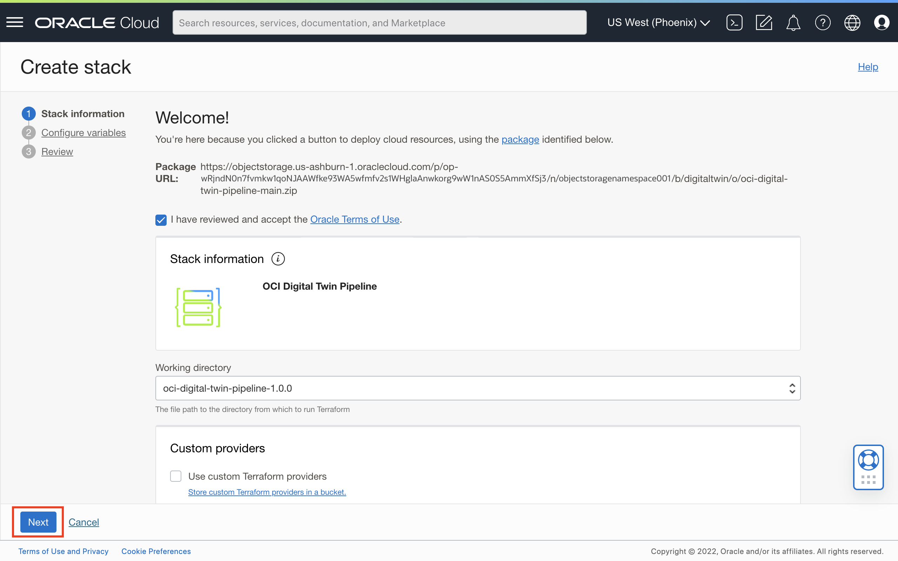
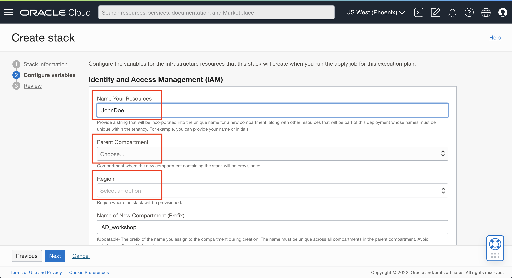
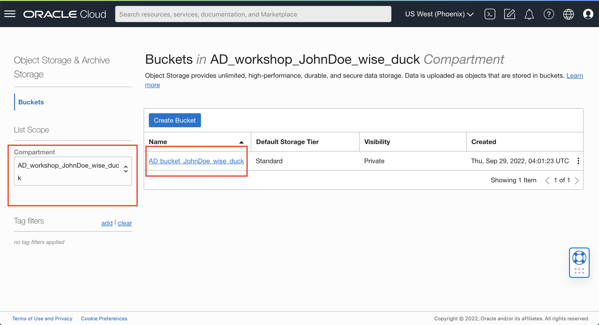

# Set Up Digital Twin Running Environment

## Introduction
In this session, we will configure OCI tenancy with required IAM resources (Compartment, Policy, and Dynamic Group), create OCI services like OKE, OCI Streaming, Object Storage, and OCI Notification service.

### Services will be provisioned in this Lab:
- **Identity and Access Management (IAM)**:
    - **Compartment**: Logical container for resources, used to manage access to resources as a function of Identity and Access Management (IAM). 
    - **Policy**: An arrangement of statements used to manage access to resources as a function of Identity and Access Management (IAM). 
    - **Dynamic Group**: An arrangement of matching rules used to manage permissions to enable specific resources to access other specified resources.
- **Oracle Data Science Platform**: Serverless platform that lets developers create, run, and scale applications without managing any infrastructure. 
- **Oracle Kubernetes Engine (OKE)**: Oracle-managed container orchestration service that can reduce the time and cost to build modern cloud native applications.
- **Anomaly Detection Service Project**: Project resource for Anomaly Detection Service (ADS). ADS is an AI service that enables developers to more easily build business-specific anomaly detection models that flag critical incidents, resulting in faster time to detection and resolution. Specialized APIs and automated model selection simplify training and deploying anomaly detection models to applications and operations—all without data science expertise.
- **Oracle Object Storage**: Securely store any type of data in its native format, with built-in redundancy.
- **Streaming**: Real-time, serverless, Apache Kafka-compatible event streaming platform for developers and data scientists.
- **Virtual Cloud Network (VCN)**: Customizable and private cloud network.

*Estimated Time*: 30 minutes

### Objectives
1. Create the OCI services needed to run digital twin model and anomaly detection solution
2. Understand the OCI services

### Prerequisites
1. Fully-privileged access to an OCI Tenancy (account).
2. Sufficient availability of resources in your OCI Tenancy. You can check resource availability [here](https://docs.oracle.com/en-us/iaas/Content/General/Concepts/servicelimits.htm#Viewing).

## Task 1 Create Resource Manager Stack

Resource Manager automates deployment and operations for all Oracle Cloud Infrastructure resources. Using the infrastructure-as-code (IaC) model, the service is based on Terraform, an open source industry standard that lets DevOps engineers develop and deploy their infrastructure anywhere

1. Log into your Oracle Cloud Infrastructure (OCI) tenancy. 

2. Click the `Deploy to Oracle Cloud` button below, opening the link into a new browser tab.

In Chrome, Firefox and Safari, you can do this with `CTRL`+`Click` > Select `Open Link in New Tab`.

3. In the `Stack Information` section, select the checkbox to confirm that you accept the [Oracle Terms of Use](https://cloudmarketplace.oracle.com/marketplace/content?contentId=50511634&render=inline).

The **OCI Digital Twin Pipeline** will pop up under `Stack Information`. Click **Next** to proceed to the `Configure Variables` section.

4. In the `Configuration variables` section, select `Parent Compartment` and `Region` to choose where you wish to deploy the infrastructure stack, and enter an email address in the `ONS Subscription Endpoint` field where you wish to receive a notification upon detection of anomalous data.

For each resource that you wish to deploy, verify that the corresponding checkbox is selected in the `Select Resources` tile. Optionally, you can customize the attributes of each selected resource once an additional tile that presents configuration options for its respective resource appears below.

When you are finished editing your variables in the `Configure Variables` section, click **Next** to proceed to the `Review` section.

5. Select the checkbox for **Run Apply**, and click **Create**. OCI Resource Manager then will start running the Job.

You can monitor the deployment by monitoring the `Logs` window.

The Job will take approximately 25 minutes to run.

## Task 2 Review Stack Job Resources

1. Once the Job state turns to `SUCCEEDED`, you can view all the resources provisioned by the stack by click **Job resources**. 

## Task 3 Verify OCI Object Storage

Oracle Cloud Infrastructure Object Storage service is an Internet-scale, high-performance storage platform that offers reliable and cost-efficient data durability. You can check and verify the Object Storage Bucket that created by the Resource Manager Job.

1. Click the Navigation Menu in the upper left, navigate to **Storage**, and select **Buckets**.

2. Select the compartments

3. Open the bucket **Ad_bucket**
