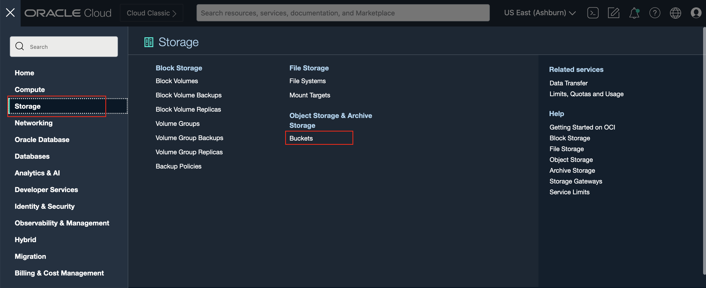

# Set Up Digital Twin Running Environment

## Introduction
In this session, we will configure OCI tenancy with required IAM resources (compartment, user/group, compartment), create OCI services like OKE, OCI Streaming, Object Storage, and OCI Notification service.

*Estimated Time*: 20 minutes

### Objectives
1. Create the OCI services needed to run digital twin model
2. Understand the OCI services

### Prerequisites
1. Fully-privileged access to an OCI Tenancy (account).
2. Sufficient availability of resources in your OCI Tenancy. You can check resource availability [here](https://docs.oracle.com/en-us/iaas/Content/General/Concepts/servicelimits.htm#Viewing).

## Task 1 Config OCI Resource Manager

Resource Manager automates deployment and operations for all Oracle Cloud Infrastructure resources. Using the infrastructure-as-code (IaC) model, the service is based on Terraform, an open source industry standard that lets DevOps engineers develop and deploy their infrastructure anywhere

1. Log into your Oracle Cloud Infrastructure (OCI) tenancy. 
2. Click the `Deploy to Oracle Cloud` button below, this will open the link into a new browser tab.

3. In the `Stack Information` section, select the checkbox to confirm that you accept the [Oracle Terms of Use](https://cloudmarketplace.oracle.com/marketplace/content?contentId=50511634&render=inline).
>screenshot

The **OCI Digital Twin Pipeline** will pop up under `Stack Information`. Click **Next** to proceed to the `Configure Variables` section.
>screenshot

4. In `Configuration variables` section, choose `Region` and `Parent Compartment` to select where you want the infrastructure stack to be deployed. 
>screenshot

For each resource that you wish to deploy, verify that the corresponding checkbox is selected in the `Select Resources` tile. Optionally, you can customize the attributes of each selected resource once an additional tile that presents configuration options for its respective resource appears below.
>screenshot

8. When you are finished editing your variables in the `Configure Variables` section, click **Next** to proceed to the `Review` section.

9. Select the checkbox for `Run Apply`, and click `Create`.
>screenshot

10. You can monitor the deployment by monitoring the `Logs` window. Once the resources in the stack have been provisioned, you can access your resources by following this sub-steps series:
\

## Task 2 OCI Streaming Service

The Oracle Cloud Infrastructure Streaming service provides a fully managed, scalable, and durable solution for ingesting and consuming high-volume data streams in real-time. Use Streaming for any use case in which data is produced and processed continually and sequentially in a publish-subscribe messaging model.

## Task 2 OCI OKE

Oracle Cloud Infrastructure Container Engine for Kubernetes is a fully-managed, scalable, and highly available service that you can use to deploy your containerized applications to the cloud. Use Container Engine for Kubernetes when your development team wants to reliably build, deploy, and manage cloud-native applications. You specify the compute resources that your applications require, and Container Engine for Kubernetes provisions them on Oracle Cloud Infrastructure in an existing OCI tenancy.

## Task 3 Verify OCI Object Storage

Oracle Cloud Infrastructure Object Storage service is an Internet-scale, high-performance storage platform that offers reliable and cost-efficient data durability. The Object Storage service can store an unlimited amount of unstructured data of any content type, including analytic data and rich content, like images and videos.

With Object Storage, you can safely and securely store or retrieve data directly from the Internet or from within the cloud platform. Object Storage offers multiple management interfaces that let you easily manage storage at scale.

Object Storage is a regional service and is not tied to any specific compute instances. You can access data from anywhere inside or outside the context of Oracle Cloud Infrastructure.

1. Click the Navigation Menu in the upper left, navigate to **Storage**, and select **Buckets**.

2. Select the compartments
3. Open the bucket **ad_bucket**