# Deploy Digital Twin Simulation Model
The digital twin model is a `docker` image including all necessary components. It runs on the OKE (Oracle Kubernetes Engine) platform. By leveraging OKE, the digital twin environment can be easily scaled to meet workload demands cost-effectively, with high availability that comes with a load balancing implementation that we will use. We can run tens, hundreds of them to analyse root causes and simulate the a specific peformance.

## Introduction
In this session, we will deploy MapleSim Digital Twin simulation model on OKE using `kubectl`.

*Estimated Time*: 20 minutes

### Objectives
Deploly the model to OKE.

## Task 1 Configure OKE access in Cloud Shell
OCI Cloud Shell is a web browser-based terminal accessible from the Oracle Cloud Console. It provides access to a Linux shell, with a pre-authenticated Oracle Cloud Infrastructure CLI (OCI-CLI), `kubectl`, docker, and other useful command-line tools.
1. Click the `Cloud Shell` icon to open the Cloud Shell.

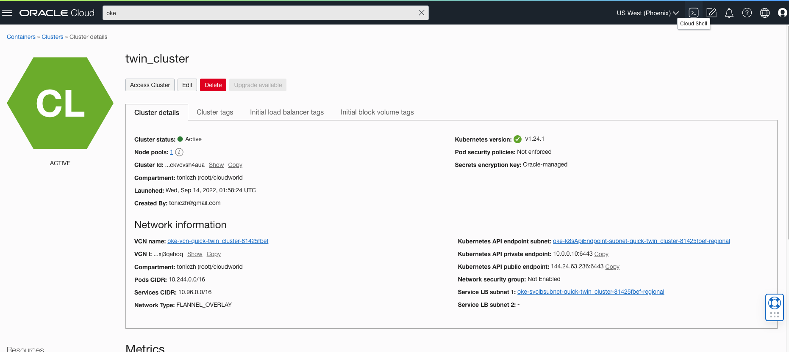

2. Click `Access Cluster` to pop up the `Access Your cluster` window. Click `Cloud Shell Access` and click copy in the menu bar.

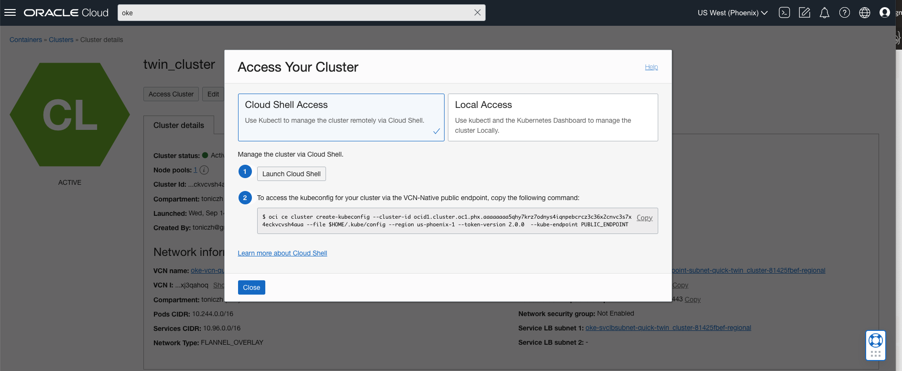

3. Run the following OCI-CLI command in Cloud Shell:

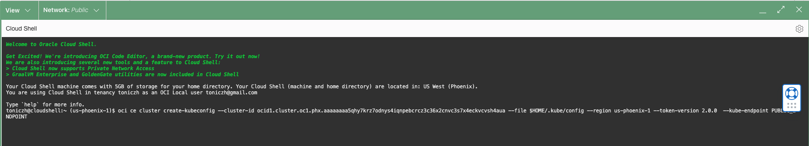

## Task 2 Deploy the service to OKE

1. Copy the deployment file for your Kubernetes cluster configuration, which can be accessed [here](https://github.com/tonyora/oci/blob/main/digital-twin/02-deploy-digitaltwin-simulation/file/digitaltwin.yaml).

Open the file and copy the content:

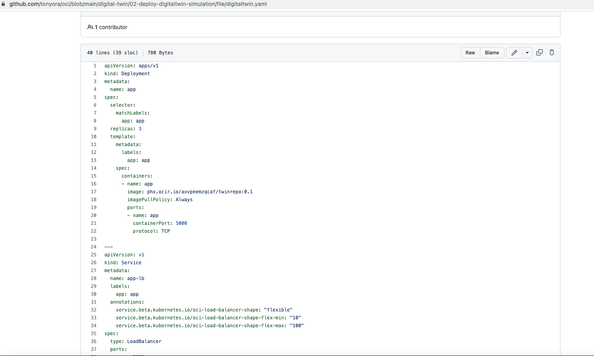

2. Open a deployment file with `vi deployment.yaml`, then enter insert-mode by pressing `i`, and paste the content from your clipboard into the `vi` editor. Then press `ESC` to escape from insert-mode, followed by `:wq` to write, i.e. save, and quit from the `vi` editor.

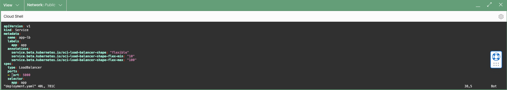

3. Deploy the application to OKE. 
On the Cloud Shell console, run the following command to deploy the application.

`kubectl apply -f deployment.yaml`

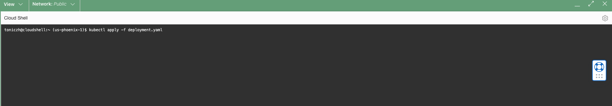

4. Get the public IP address
The deployment may take a few minutes to finish. We can run the following `kubectl` command to monitor the progress of the deployment of your Kubernetes cluster configuration:

`kubectl get all`

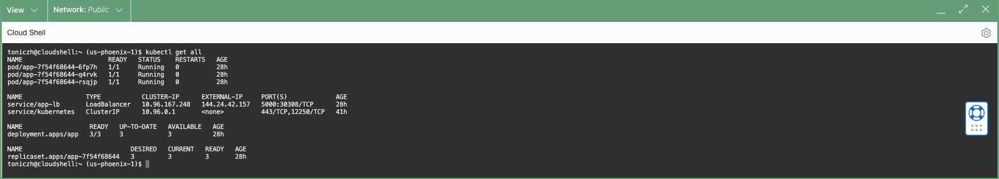

Make a note of the public IP address that corresponds to the Kubernetes service of type `LoadBalancer`, under `EXTERNAL-IP`. In this case, the public IP address is `144.24.42.157` for reference. You will use the public IP address of the Load Balancer to access your API using swagger-ui  later on in this workshop.

## Task 3 Generate the training data
We will create a fleet of digital twins in this task to generate training data to train our anomaly detection model in the next workshop. All the actions are implemented by REST API. To access the API, open a Chrome window with address http://ip-address/docs#/, e.g. 144.24.42.157:5000.
1. Create the fleet
After the pods is deployed, we will initiate the fleet with the number of digital twins in the fleet. And the fmu file that we are used for the digital twin. In the swagger-ui windown, click "Try it out"/initiate API 

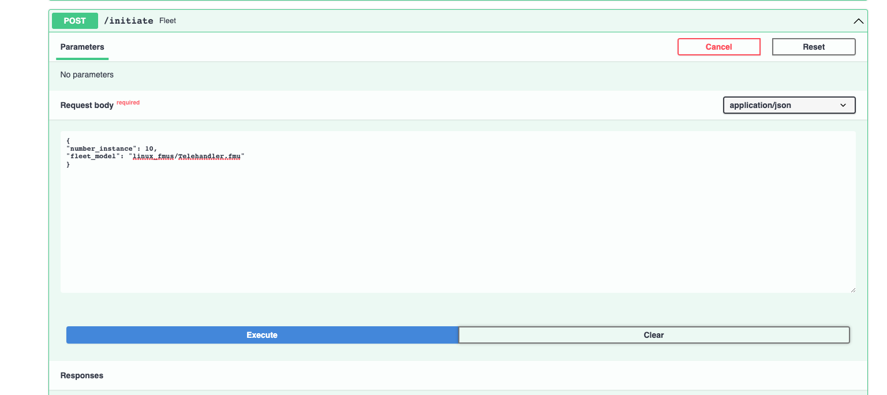

The number_instance instructs the number of digtital twins to create. The fleet_model is the mudel to be used. In the workshop we use a model that sumulate a telehandler model which created by Maplesoft. 

~~~
{
"number_instance": 10,
"fleet_model": "linux_fmus/Telehandler.fmu"
}
~~~

Then click Execute to initiate the fleet. The success of excution will reuturn the parameters that the model.

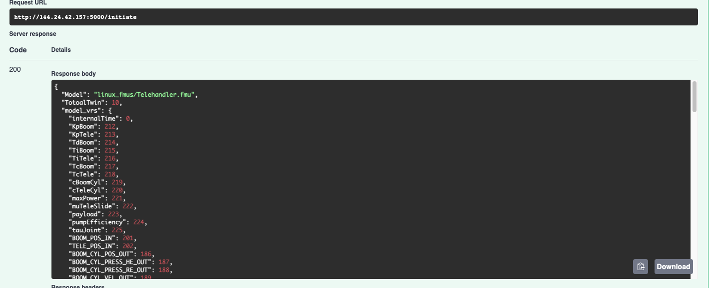

2. Generate and upload the training set to object storage
In this step, we set up a process let the model to generate the normal data in parallel and the training data will be updated to the OCI object storage we created early. Click /uploadtraining to expand the API. Click "Try it out". We put the parameters for the operation. Earch digital twin will run in the proper value in the range. At the end, all the results from each digital twin are combined into many cycles. We provide the bucket that will be used for the train dataset will be uploaded.

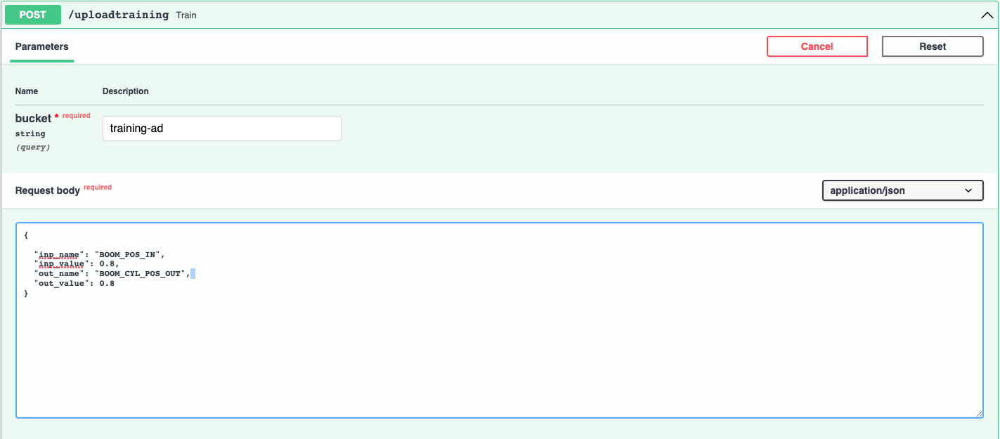

~~~
{
 
  "inp_name": "BOOM_POS_IN",
  "inp_value": 0.8,
  "out_name": "BOOM_CYL_POS_OUT",
  "out_value": 0.8
}
~~~

It takes some time depending on how many instances you are using. Once the traning finished it returned the file uploaded. 

3. Validate the generated training set
We also can type bucket in the search bar to open object storage service. Then click the bucket with the name we specificed to verify the newly generated dataset. The training set will be used for in the next lab to train anomaly detection model.

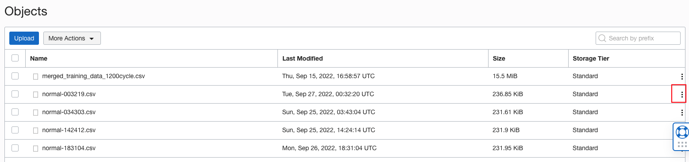

