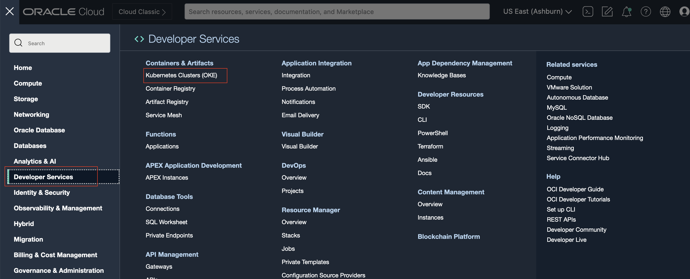
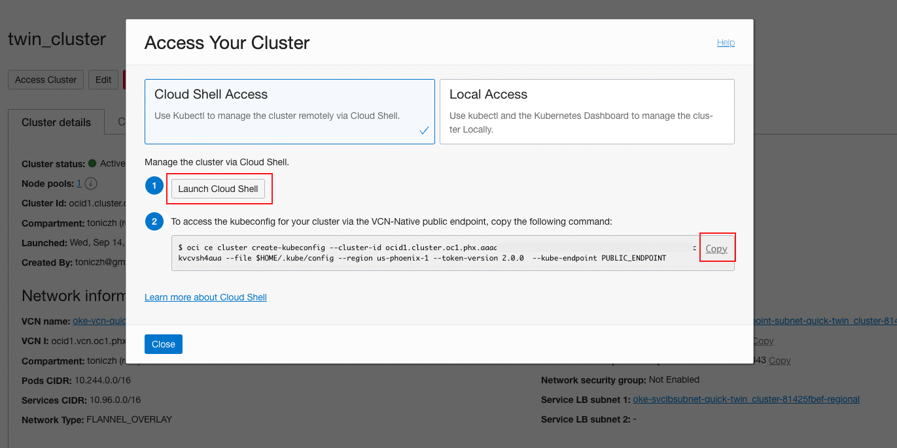
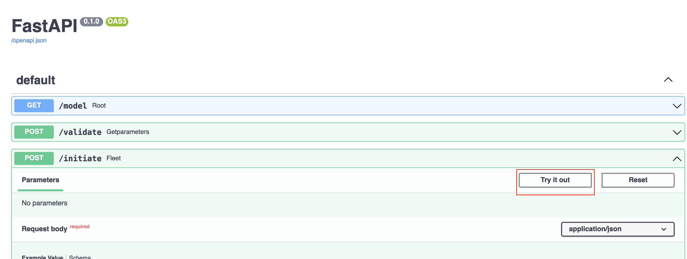

# Deploy Digital Twin Simulation Model

## Introduction
The digital twin model is a docker image including all necessary components. It runs on the OKE (Oracle Kubernetes Engine) platform. By leveraging OKE, the digital twin environment can be easily scaled to meet workload demands cost-effectively, with high availability that comes with a load balancing implementation that we will use. We can run tens, hundreds of them to analyze root causes and simulate specific performances.

In this session, we will deploy MapleSoft MapleSim Digital Twin simulation model on OKE using Kubernetes command line tool (`kubectl`).

*Estimated Time*: 20 minutes

### Objectives
1. Deploy MapleSim Digital Twin model on OKE.
2. Generate anomaly detection training dataset use Digital Twin model.

## Task 1: Configure OKE access using Cloud Shell

OCI Cloud Shell is a web browser-based terminal accessible from the Oracle Cloud Console. It provides access to a Linux shell, with a pre-authenticated Oracle Cloud Infrastructure CLI (OCI-CLI), `kubectl`, docker, and other useful command-line tools.
1. Open OCI Navigate menu, select **Developer Services**, then **Kubernetes Clusters (OKE)**. 

2. Select your OKE Cluster from console. Click `Access Cluster` to pop up the `Access Your cluster` window. Click `Cloud Shell Access`.

Click Launch Cloud Shell, this will start Cloud Shell on your screen at the bottom. Copy the command from Access Your Cluster window.

3. Paste the OCI-CLI command to Cloud Shell and run:

## Task 2: Deploy the service to OKE

1. Copy the deployment file for your Kubernetes cluster configuration, which can be accessed [here](https://objectstorage.us-phoenix-1.oraclecloud.com/p/y6hR92uVv6ejfNClhLM4wm0rftcHOasu_u9twwSl0T-XxQpS8zfB62XJyhMQAXRE/n/axvpeemzqcaf/b/cw-file/o/deployment.yaml).

Open the file and copy the content:

2. Open a deployment file with `vi deployment.yaml`, then enter insert-mode by pressing `i`, and paste the content from your clipboard into the `vi` editor. Then press `ESC` to escape from insert-mode, followed by `:wq` to write, i.e. save, and quit from the `vi` editor.

3. Deploy the application to OKE. 

On the Cloud Shell console, run the following command to deploy the application.

`kubectl apply -f deployment.yaml`

4. Get the public IP address
The deployment may take a few minutes to finish. We can run the following `kubectl` command to monitor the progress of the deployment of your Kubernetes cluster configuration:

`kubectl get all`

Make a note of the public IP address that corresponds to the Kubernetes service of type `LoadBalancer`, under `EXTERNAL-IP`. In this case, the public IP address is `144.24.42.157` for reference. You will use the public IP address of the Load Balancer to access your API using swagger-ui  later on in this workshop.

## Task 3: Generate the training data

We will create a fleet of digital twins in this task to generate training data to train our anomaly detection model in the next workshop. All the actions are implemented by REST API. To access the API, open a Chrome window with address http://ip-address/docs#/, e.g. 144.24.42.157:5000.

1. Create the fleet

After the pods is deployed, we will initiate the fleet with the number of digital twins in the fleet. And the fmu file that we are used for the digital twin. In the swagger-ui window, expand /initiate panel, then click "Try it out" 

Copy the following code and paste into Request body. The `number_instance` instructs the number of digital twins to create. The `fleet_model` is the model to be used. In this workshop we use a model that simulate a telehandler model which created by MapleSoft. 

~~~
{
"number_instance": 20,
"fleet_model": "linux_fmus/Telehandler.fmu"
}
~~~

Then click Execute to initiate the fleet. The success of excution will reuturn the parameters that the model.

2. Generate and upload the training set to object storage

In this step, we set up a process let the model to generate the normal data in parallel and the training data will be updated to the OCI object storage we created early. Click /uploadtraining to expand the API. Click "Try it out". We put the parameters for the operation. Earch digital twin will run in the proper value in the range. At the end, all the results from each digital twin are combined into many cycles. We provide the bucket that will be used for the train dataset will be uploaded.

~~~
{
 
  "inp_name": "BOOM_POS_IN",
  "inp_value": 0.8,
  "out_name": "BOOM_CYL_POS_OUT",
  "out_value": 0.8
}
~~~

It takes some time depending on how many instances you are using. Once the traning finished it returned the file uploaded. 

3. Validate the generated training set

We also can type bucket in the search bar to open object storage service. Then click the bucket with the name we specificed to verify the newly generated dataset. The training set will be used for in the next lab to train anomaly detection model.

## Acknowledgements

- **Authors**
      - Tony Zhang - Master Principal Cloud Architect 
      
- **Contributors** 
      - Jiayuan Yang - Senior Cloud Engineer 
      - Samuel Cacela, Staff Cloud Engineer
      - Adrian Alba - Staff Cloud Engineer
- **Last Updated By/Date** - 2022 October