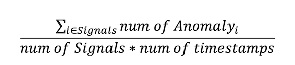

# Train Anomaly Detection Model

## Introduction

In this session, we will show you how to train an anomaly detection model using Oracle Anomaly Detection and the synthetic signal data as our training data.

Anomaly detection is the identification of rare items, events, or observations in data that differ significantly from the expectation. This can be used for several scenarios like asset monitoring, maintenance and prognostic surveillance in industries such as utility, aviation, transportation, and manufacturing.

The core algorithm of Anomaly Detection is an Oracle-patented multivariate time-series anomaly detection algorithm originally developed by Oracle Labs and had been successfully used in several industries for prognosis analysis.

Oracle Anomaly Detection will create customized Machine Learning models by taking the data uploaded by users, using the core algorithm to train the model, and hosted in the cloud to be ready for detection. Users can then send new data to the detection endpoints to get detected anomaly results.

 **Estimated Time**: 30 minutes

### Objectives
1. Understand a high level overview of the Oracle Anomaly Detection service
2. Understand the full cycle/workflow of services provided in the Oracle Anomaly Detection service
3. Hand-on activities to experience the whole pipeline of machine learning model development from training to detecting

### Assumptions
- set up policy is taken care of in lab1: set-up-environment
- training data csv is stored in object storage bucket

## Task 1: Create Anomaly Detection Project

A project is a way to organize multiple data assets, models, deployments to the same workspace

Log into the OCI Cloud Console. Using the Burger Menu on the top left corner, click  **Analytics and AI** , and then select  **Anomaly Detection** item under  **AI services**.

In the Anomaly Detection section,
- Under  **Comparment**, select the name of the compartment you created 
- Select  **Create Project**

In this form,
- Select  **AD_Workshop** as the compartment
- Type  **AD_Project** as the Name of the project

Once the details are entered, click the  **Create** Button.

 If the project is successfully created, it will show up in projects pane. (You may need to reload the page)
    - select your   **Project**

**If you have NOT completed the previous Labs (01 and 02),**
- Download the **Training Dataset** https://objectstorage.us-ashburn-1.oraclecloud.com/p/-z6yMfwSuQJ4RfpMFPu4rShFG8O8IZGzdUz_PgR_tgbNmDH9-Pjpu-vlpqBW5aKG/n/orasenatdpltintegration03/b/AD_bucket/o/AD_train_6cycle.csv
- Then **skip to Task 3: Create a Model**

## Task 2: Create a Data Asset

*** TODO: add link for downloading [data](https://objectstorage.us-ashburn-1.oraclecloud.com/p/acYNc4cXnHYGEA4r-oZZD0gMicUNspuHgSGORi96Wop10Yqwjr_xXi23XLheIXsK/n/orasenatdpltintegration03/b/AD_bucket/o/AD_train_6cycle.csv).

The Data Asset is the data utilized for training your Anomaly Detection Model. The Data Asset should be data that has NO anomalies, so that the Anomaly Detection model will be trained on data that represents the 'normal' state.

Under your project, click the   **Data Assets** menu on the left. Then click  **Create Data Asset**

in the _Create Data Asset_ menu, 
- Select  **AD_Workshop** for _Compartment_
- Type  **AD_data_asset** as the Data Asset _Name_
- Select  **Oracle Object Storage** for _Type_
- Select  **AD_bucket** for _Choose a bucket_ 
- Select  **AD_Training.csv** for _Training Data_
- Press  **Create**

The data asset should now show in the data asset main panel.

This demo only covers data from Object Storage. However, data can be imported other sources such as Oracle Autonomous Transaction Processing (ATP), InfluxDB, and more. 

## Task 3: Create a model

Now it's time to train the Anomaly Detection Model and make predictions.

Creating a model requires 3 actions:
- Select the proper compartment and data asset that we just created.
- Set training parameters
- Train a model

From here, 
- Go to **Models** on the left menu
- Click **Create and Train Model**

Make sure _Choose an existing data asset_ is toggled
Under _Choose data asset in compartment_, select  **AD_data_asset**. The click **Next**. 

### Parameter Selections

>**FAP (False Alarm Probability)**
>FAP stands for False Alarm Probability, which is the likelihood (percentage) that a timestamp is flagged as an anomaly in the anomaly-free training data (data asset). It is calculated at every signal level and then averaged across all signals as the final achieved FAP by our model.
>
>A high FAP means the likelihood of an anomaly flagged by Anomaly Detection service to be a _false alarm_ is high. If this is not desired, depending on the sensitivity requirements of a user, user can specify it to be low.
>
>Typically, FAP can be set to be around the same level of percentage of anomalies in real business scenarios, and a value 0.01 or 1% is relatively appropriate for many scenarios. Also, be aware that if specifying a lower target FAP, the model needs more time to train, and may not achieve to the target FAP.

>FAP = sum(number of anomalies in each signal) / (number of signals  * number of timestamps)
>
>**Train Fraction Ratio**
>Train Fraction Ratio specifies the division ratio of the whole training data to be used training and validation. The default value 0.7 or 70% specifies the model to use 70% of the data for training, and the rest 30% is used to produce model performance (validation).

In this demo, set...
- **AD_Workshop** as the Model _Compartment_
- **AD_Model** as the _Name_
- _FAP_ value as **0.5**
- _Train Fraction Ratio_ as  **0.7** (_default value_)

Click **Next**:

Review the model information.

Click **Create**:

The model may take 10-15 minutes to finish training.

When `Status` changes from **Creating** ...

 ... to **Active**,

Your Anomaly Detection model is ready, and you may proceed to the next task.
