# Monitor Asset

Monitoring asset uptime is key to any business that involves connected assets. Whether we monitor the asset on the board or off the board, we need a solution that can flexibly adapt to the business conditions. OCI anamaly detection service uses Oracle MSET-2 algorithm can detect the anomal signals at early stage.

## Introduction
In this session, we will show you how to and make predictions with new data using Anomaly Detection model, and how to generate notification message when there is anomaly detected by the model.

*Estimated Time*: 20 minutes

### Objectives
1. Learn the monitoring reference architecture streaming, anomaly detection serive and notification
2. Generate anomaly with an intance in the fleet

## Task 1 Simulate anomaly by adjusting the running condition
After using the normal data trained the model. We change specific parameters for a specific digital twin. The digital twin send the result to a stream. The instance id, to be simple , is an integer from 0 to mumber of instance and stream OCID is the OCI streaming service that will receive the generated signals.

1. Click streaming service to visit the availabe stream(s).

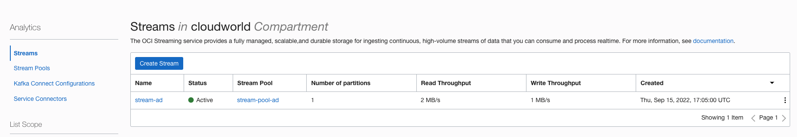

2. Click the stream name to open the detail of the strea. click copy beside the OCID

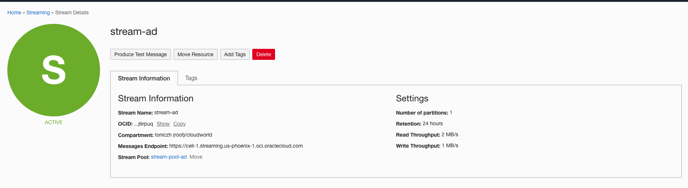

3. Trigger anomaly with a digital twin. In the sw

Input an instance ID, e.g. 1
Paste the copied OCID to stream_id field.
Input the steps that we like to try and debug. A sample of the payload is given.

~~~
{
  "inp_name": "BOOM_POS_IN",
  "inp_value": 0.8,
  "out_name": "BOOM_CYL_POS_OUT",
  "out_value": 0.8,
"params": {
"payload": 681,
"pumpEfficiency": 0.91
},
"steps": {
"2.2": {"cBoomCyl":8788,"TcBoom":1001},
"3.8": {"cBoomCyl":18788,"TcBoom":101}
}
}

~~~
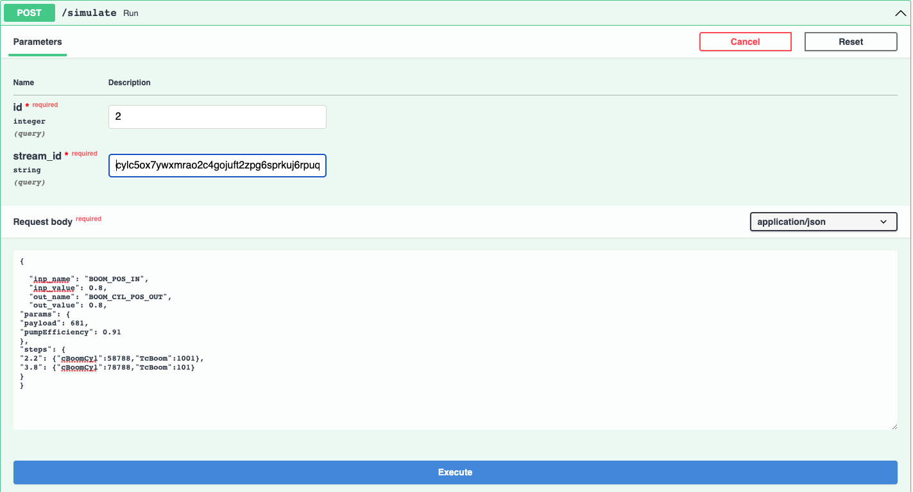

once the execution finished, it returns the message are published to the stream.

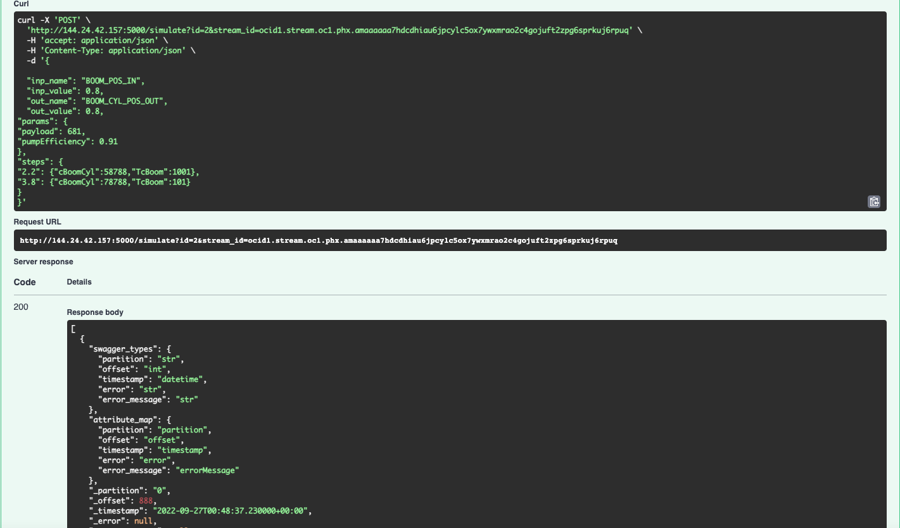

4. validate generated signals. In the streaming windown, click "Load messages" to view the signals generated.

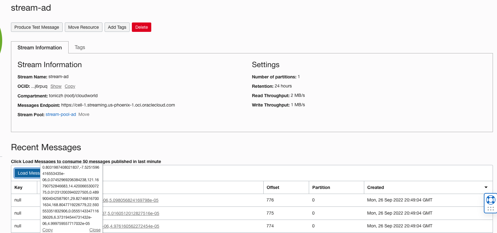

## Task 2 Detect the anomly by consuming the stream.

Now the singals are in the stream. We are using another API to restrieve the signals and send the signals to detect batch by batch. Once an anomaly is detected, a notification will be sent to the operator. Here we use email for notification. The notification support pageduty, slack, SMS etc. In the real world, all these step can be combined to run automatically.

1. Get the anomaly detection model id. Input anamly in the search bar and click anamaly detection to open project

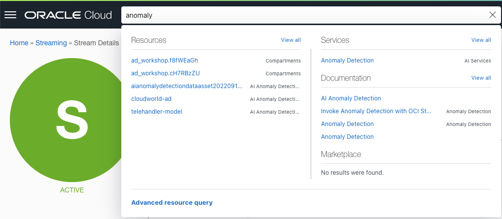

Click the project to open model
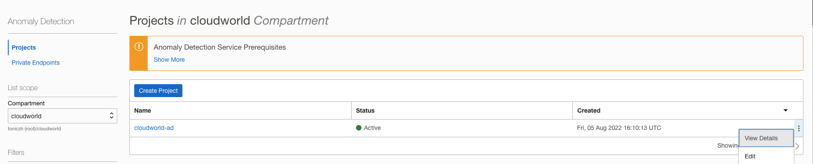

Click the model to view the detail of model

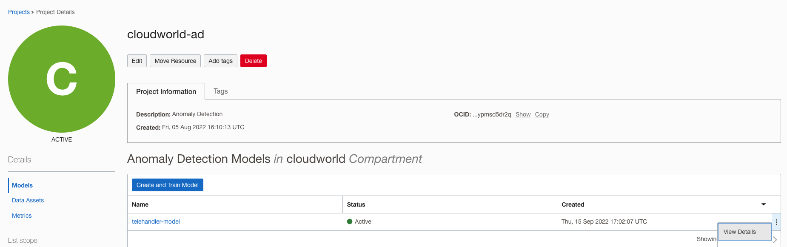

Copy the OCID of the model

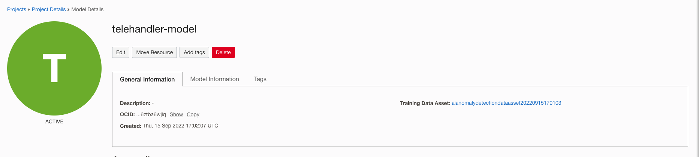

2. Get the notification topic id. Input notification in the search bar and click notifications

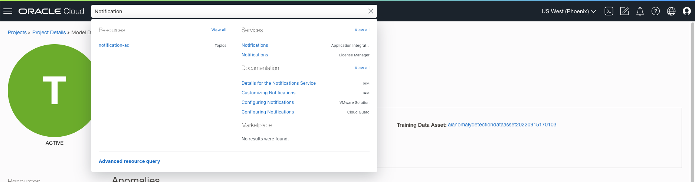

click the topic in the notification view to open the topic

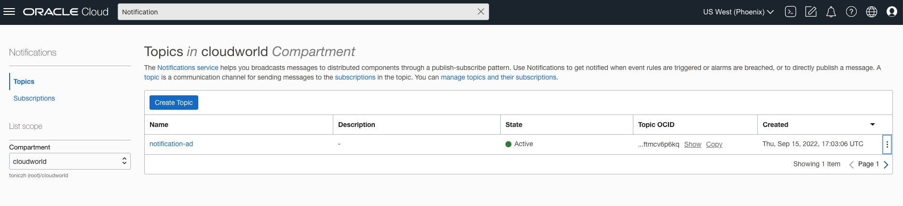

Copy the OCID of the topic

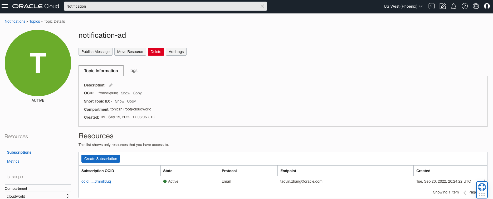

3. Click /streamdectc in the swagger-ui and expand it. Click "Try it out"

The API requires stream_id, model_id and topic_id. The next_cursor provides a machanicm to run the detection in steps. It starts as empty. After each run, it returns the current cursor can be used for next run. The stream_id is same as the stream_id in the task 1. model_id and topic_id are the OCIDs we just copied.

~~~
{
  "stream_id": "ocid1.stream.oc1.phx.amaaaaaa7hdcdhiau6jpcylc5ox7ywxmrao2c4gojuft2zpg6sprkuj6rpuq",
  "model_id": "ocid1.aianomalydetectionmodel.oc1.phx.amaaaaaa7hdcdhia3ryuiyr3p66kjv3h6hye4fm7e3tbqbpuna6ztba6wjlq",
  "topic_id": "ocid1.onstopic.oc1.phx.aaaaaaaacgnodk725ge7yzqgtmcfepif3shqf3axxnnzvy77iyftmcv6p6kq",
  "next_cursor":""
}
~~~
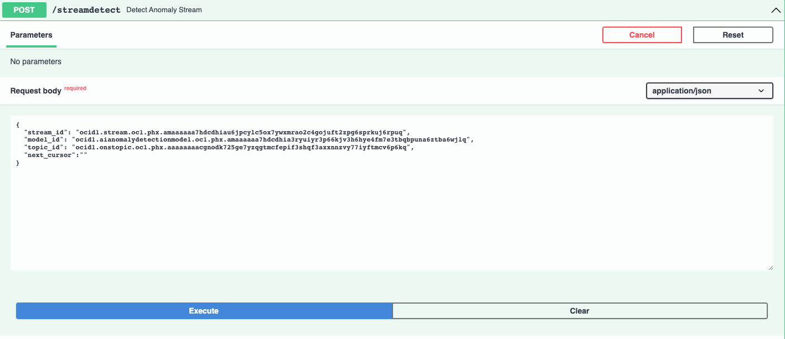

Click the Execute to detect whether there are anomalies.

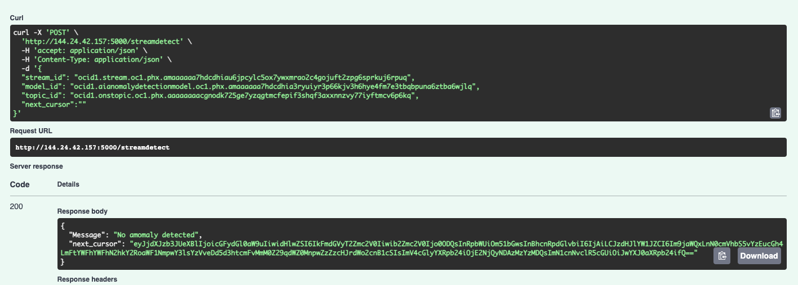

The retuned next_cursor will be used in the next run to retrieve signals from the stream.

4. Once a anomaly detected. An email will send to the designated email configured by the operation. The notification will show exactactly why the anomaly service reported the warning. Then, the operation can further diagnose the root cause.

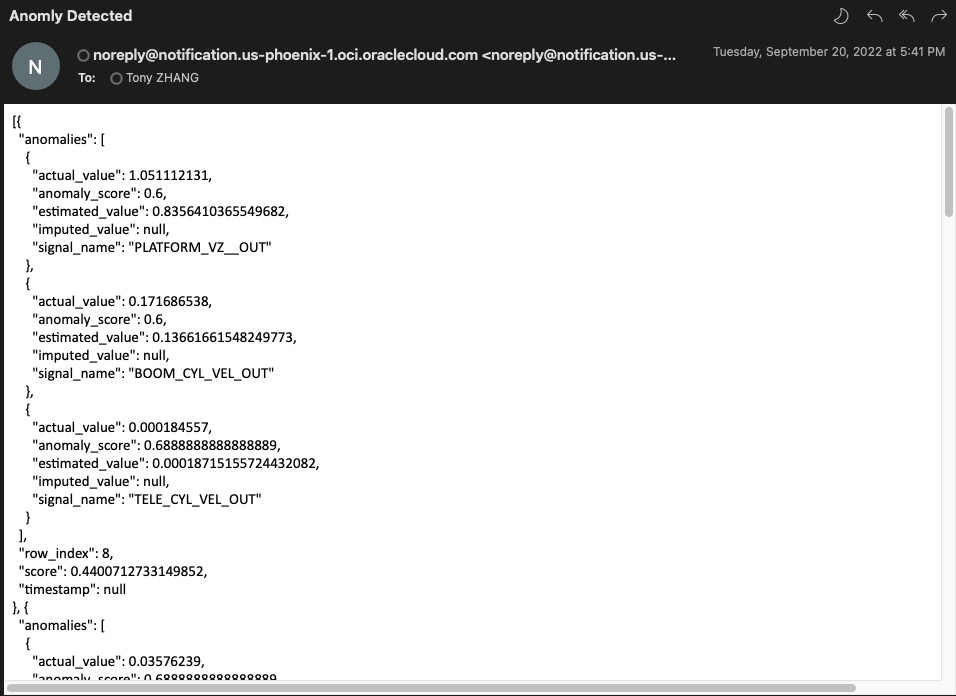

**If you have NOT completed the Labs (01 and 02),**
- Download the [AD_testing.csv](https://objectstorage.us-ashburn-1.oraclecloud.com/p/L5-dC68rtjqN_oY1rqMqJs5vRa5Y0Rph12suyFhqaYN_2lvOlOp_vdCBZPh3OcOI/n/orasenatdpltintegration03/b/AD_bucket/o/AD_Testing.csv) 

## Task 4: Detect Anomalies with Anomaly Detection (AD) GUI

The results of Anomaly Detection can be viewed in a number of ways including the AD SDK. Using the AD UI is a visual method.

To start the process of anomaly detection, click on your model and select **Detect Anomalies** on the model listing page

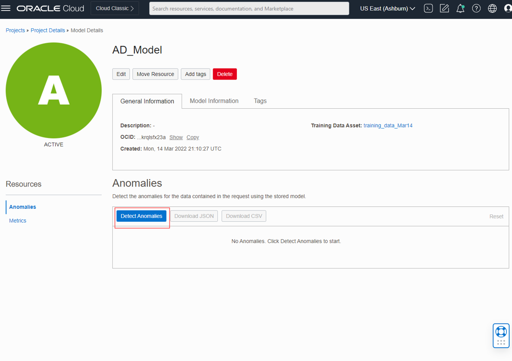

Select  **AD_testing.csv** from local filesystem or drag-and-drop the desired file.
You can leave _Sensitivity_ **BLANK** for this demo. 
Once the test file is uploaded, click **Detect**.  

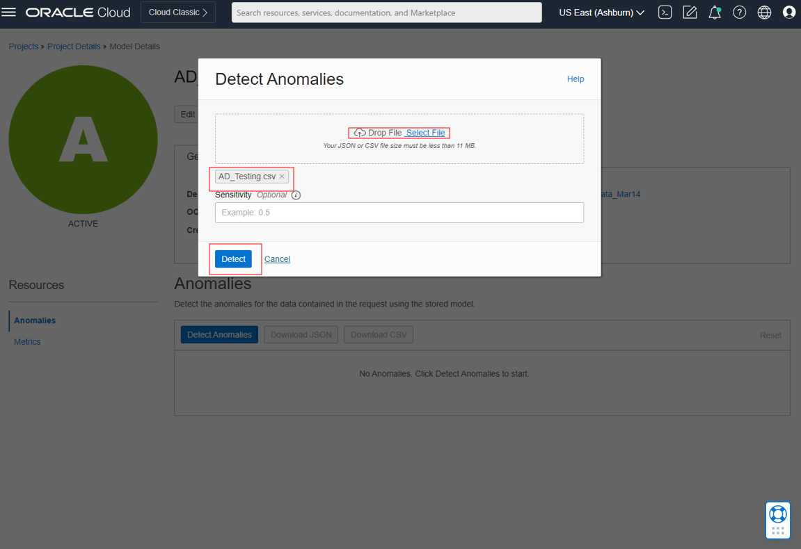

### Results Observation

Let's take a look what anomalies Anomaly Detection discovered in the data

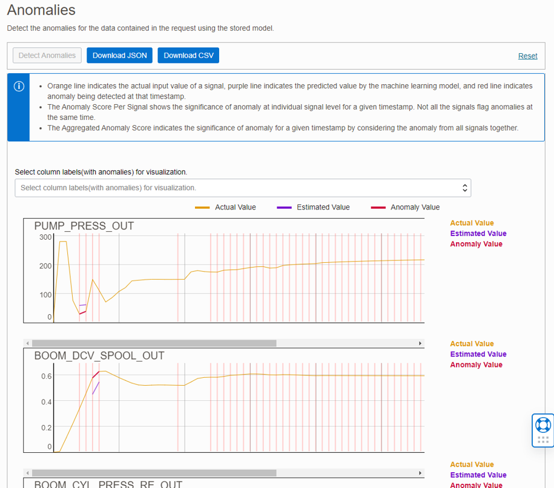

>**Graph Explanation**
>
>Each signal in your detection data can be selected to show a separate graph.
>>
>In the graph, horizontal axis represents the timestamp (or indexes if no timestamp was provied), and the vertical axis represents sensor values.
>
>In each subgraph, 
>- orange line indicates the actual input value of a signal
>- purple line indicates the predicted value by the machine learning model
>- red line indicates anomaly being detected at that timestamp.
>
There are two additional subgraphs after sensor subgraphs:
>
>_The Anomaly Score Per Signal_ shows the significance of anomaly at individual signal level for a given timestamp. Not all the signals flag anomalies at the same time.
>_The Aggregated Anomaly Score_ indicates the significance of anomaly for a given timestamp by considering the anomaly from all signals together.
>You can move your mouse over the graph, the actual value & estimated value at a certain timestamp will show at the upper right corner of the graph.