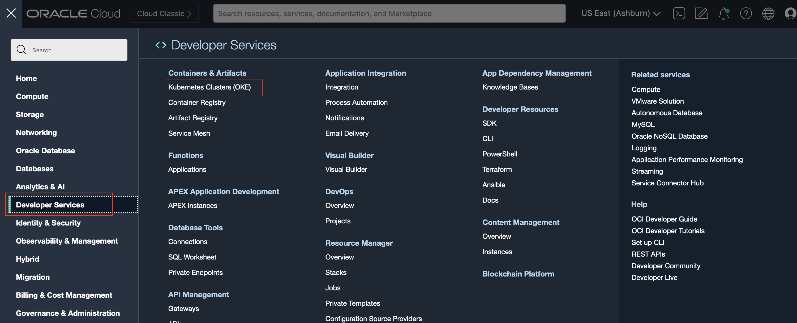
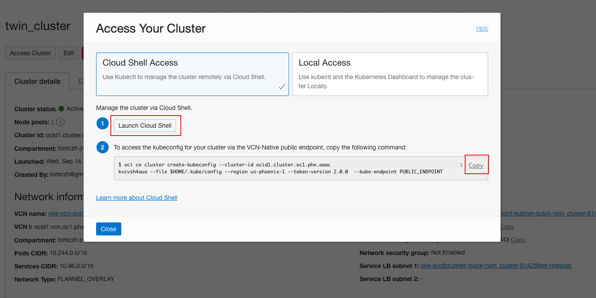
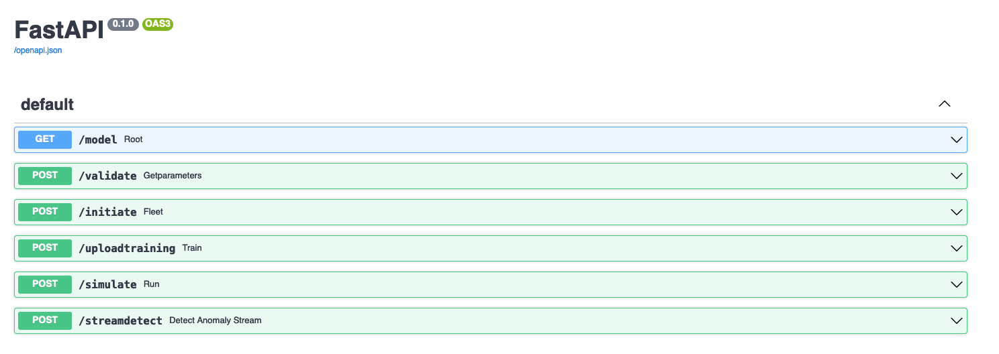
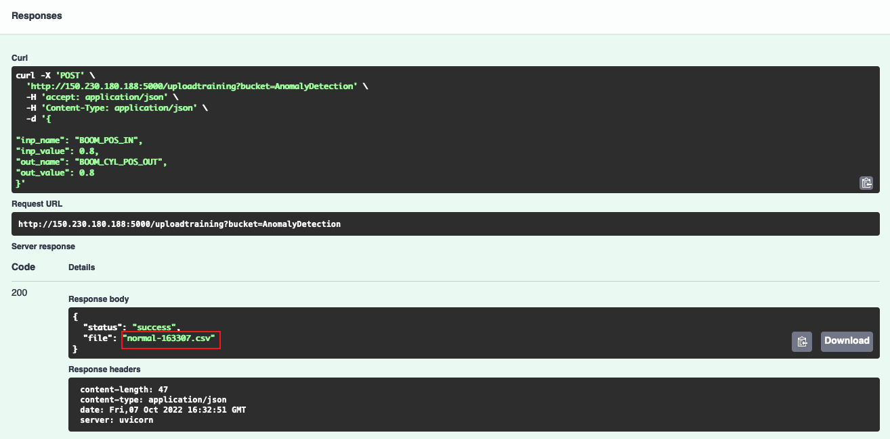
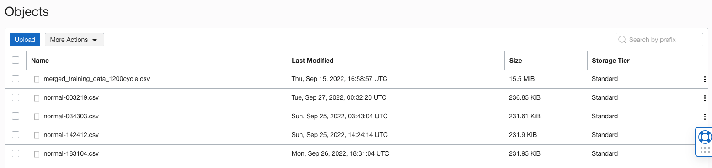

# Deploy Digital Twin Simulation Model

## Introduction

In this session, we will deploy MapleSim Digital Twin simulation model on OKE using `kubectl`.

The digital twin model is a `docker` image including all necessary components. It runs on the OKE (Oracle Kubernetes Engine) platform. By leveraging OKE, the digital twin environment can be easily scaled to meet workload demands cost-effectively, with high availability that comes with a load balancing implementation that we will use. We can run tens, hundreds of them to analyse root causes and simulate the a specific performance.

*Estimated Time*: 20 minutes

### Objectives

* Deploy the Digital Twin simulation model to OKE.
* Generate simulation data using Digital Twin

## Task 1: Configure OKE access in Cloud Shell

OCI Cloud Shell is a web browser-based terminal accessible from the Oracle Cloud Console. It provides access to a Linux shell, with a pre-authenticated Oracle Cloud Infrastructure CLI (OCI-CLI), `kubectl`, docker, and other useful command-line tools.

1. Open OCI Navigate menu, select **Developer Services**, then **Kubernetes Clusters (OKE)**. Select your OKE Cluster from console.

	

2. Click `Access Cluster` to pop up the `Access Your cluster` window. Click `Cloud Shell Access`. Click Launch Cloud Shell, this will start Cloud Shell on your screen at the bottom. Copy the command from Access Your Cluster window.

	

    

3. Paste the OCI-CLI command to Cloud Shell and run:

	

## Task 2: Deploy the service to OKE

1. Copy the deployment file for your Kubernetes cluster configuration, which can be accessed [here](https://objectstorage.us-phoenix-1.oraclecloud.com/p/y6hR92uVv6ejfNClhLM4wm0rftcHOasu_u9twwSl0T-XxQpS8zfB62XJyhMQAXRE/n/axvpeemzqcaf/b/cw-file/o/deployment.yaml). By click the link, the file will be downloaded to your local drive.

	Open the file and copy the content:

	

2. In the Cloud Shell, type `vi deployment.yaml` to open vi editor, then enter insert-mode by pressing `i`, and paste the content from your clipboard into the `vi` editor. Then press `ESC` to escape from insert-mode, followed by `:wq` to write, save, and quit from the `vi` editor.

	

3. On the Cloud Shell console, run the following command to deploy the application to OKE.

	`kubectl apply -f deployment.yaml`

	

4. Get the public IP address. The deployment may take a few minutes to finish. We can run the following `kubectl` command to monitor the progress of the deployment of your Kubernetes cluster configuration:

	`kubectl get all`

	

	If you see external-IP still pending after a while, run the following command which will also generate public IP.
    
    `kubectl expose deployment app --type=LoadBalancer --name=my-service`

	Make a note of the public IP address that corresponds to the Kubernetes service of type `LoadBalancer`, under `EXTERNAL-IP`. In this case, the public IP address is `144.24.42.157` for reference. You will use the public IP address of the Load Balancer to access your API using swagger-ui  later on in this workshop.

## Task 3: Generate the training data

We will create a fleet of digital twins in this task to generate training data to train our anomaly detection model in the next step. All the actions are implemented by REST API. 

1. To access the API, open up a browser window and type the following address. Replace ip-address with the public IP address get from previous step, e.g. 144.24.42.157:5000.
    
    `http://ip-address:5000/docs#/`
    
     You should see swagger ui like this
    
    

2. Create the fleet

	After the pods is deployed, we will initiate the fleet with the number of digital twins in the fleet. And the fmu file that we are used for the digital twin. In the swagger-ui, expand /initiate panel, then click "Try it out".

	
	
    Copy the following code and paste into Request body. The `number_instance` instructs the number of digital twins to create. The `fleet_model` is the model to be used. In this workshop we use a model that simulate a telehandler model which created by MapleSoft.

	```
	{
	"number_instance": 20,
	"fleet_model": "linux_fmus/Telehandler.fmu"
	}
	```
 
	Then click Execute to initiate the fleet. The success of execution will return the parameters of the model.

	

3. Generate and upload the training set to object storage. 
    
    In this step, we set up a process let the model to generate the normal data in parallel and the training data will be uploaded to the OCI object storage we created from Lab 1. Click /uploadtraining to expand the panel. Click "Try it out".  
	
    Provide the Object Storage bucket name that was created in Lab 1. 

    
     
    Copy the following code and paste in request body, then click execute. Each digital twin will run in the proper value in the range. At the end, all the results from each digital twin are combined into many cycles.
    
	```
	{
	
	"inp_name": "BOOM_POS_IN",
	"inp_value": 0.8,
	"out_name": "BOOM_CYL_POS_OUT",
	"out_value": 0.8
	}
	```
    
	It takes some time depending on how many instances you are using. Once the training finished it will return the data file name in the response. Take a note of the csv file name which we will use in the next lab.
    
    

4. Validate the generated training set. 
    
    You can check or download the csv file from Object Storage. Navigate to your bucket and search for the csv file generated by the fleet. Click the three dots at the right and download the csv to take a look at it. The training set will be used in the next lab to train anomaly detection model.

	

You many now **proceed to the next lab.**

## Acknowledgements

- **Authors**
      - Tony Zhang - Master Principal Cloud Architect 
      
- **Contributors** 
      - Jiayuan Yang - Senior Cloud Engineer 
      - Samuel Cacela, Staff Cloud Engineer
      - Adrian Alba - Staff Cloud Engineer
- **Last Updated By/Date** - 2022 October
