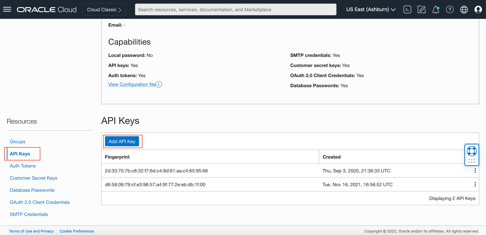
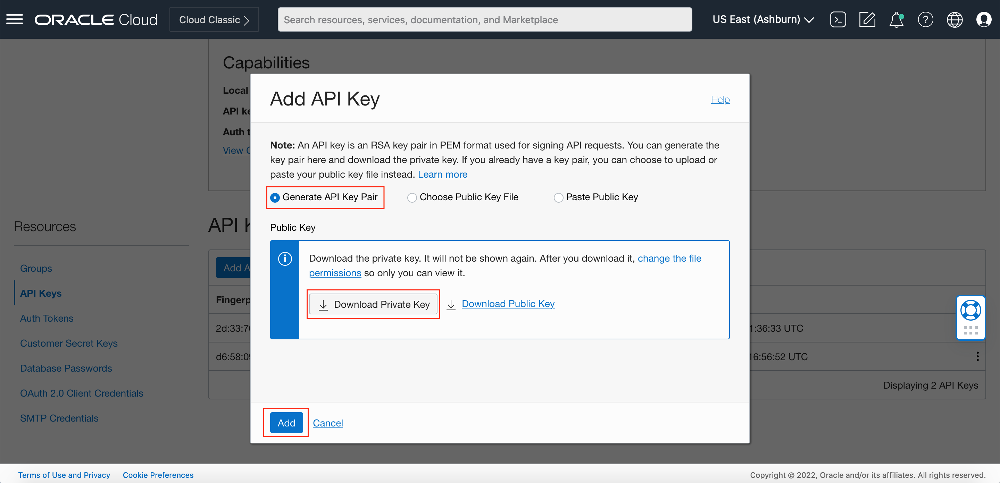
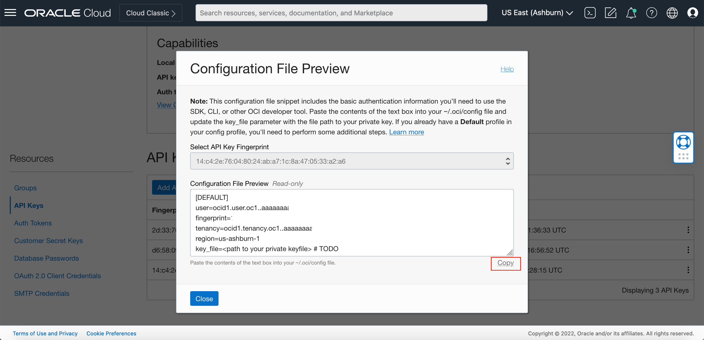
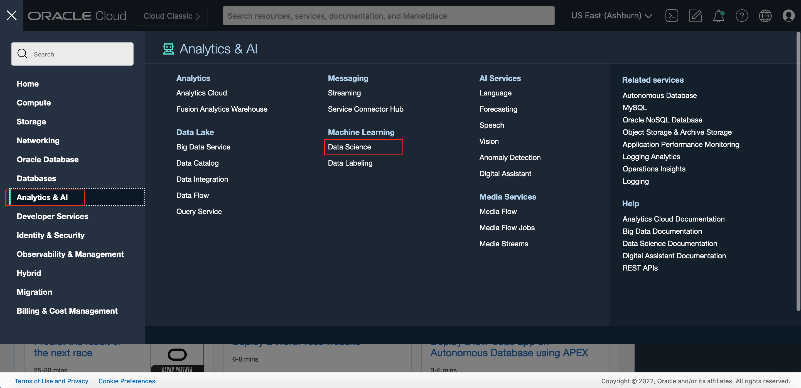

# (Advanced) Explore Anomaly Detection - Access Anomaly Detection service with REST API 

## Introduction
Our anomaly detection services also support to use CLI (Command Line Interface) tool oci and SDKs with different programming languages to make REST API calls to perform model and data operations.

In this lab session, we will show you how to set up authentication method in order to use the Python SDK to integrate with our service endpoints;

You can set up those configuration and execute those codes in the [Oracle Data Science Platform](https://www.oracle.com/artificial-intelligence/data-science/).

### Data Science Serivce Concepts
Review the following concepts and terms to help you get started with the Data Science service.

* Project: Projects are collaborative workspaces for organizing and documenting Data Science assets, such as notebook sessions and models.
* Notebook Session: Data Science notebook sessions are interactive coding environments for building and training models. Notebook sessions come with many pre-installed open source and Oracle developed machine learning and data science packages.

*Estimated Time*: 20 minutes

### Objectives
*** TODO: update objectives here

* Learn how to set up API Signing Key and Configure file
* Learn to use Python SDK to communicate with our anomaly detection service endpoints

### Prerequisites
*** TODO: update Prerequisites later

* Familiar with Python programming is required
* Have a Python environment ready in local machine or Oracle Data Science Platform
* Familiar with local editing tools, such as vi and nano, or editing IDEs, such as VS Code or Sublime
* If using cloud shell, be familiar with Oracle Cloud Shell. Refer docs here 
* You have permission to use cloud shell; ask tenancy administrator to add policy if not. 
* If using your local machine, be sure to install/Update to the most updated version of Python library oci (version 2.42.0 or higher)

### Task 1: Setup API Signing Key
We need to generate proper authentication configuration (API Signing Key pair) in order to use OCI CLI to communicate properly to the services on your behalf.
1. Open User Settings

Open the Profile menu (User menu icon) on the top right corner and click User Settings.

2. Open API Key

Navigate to API Key and then Click Add API Key.
The content is described above.

3. Generate API Key

In the dialog, select Generate API Key Pair. Click Download Private Key and save the key to your local computer, and we will upload it later to the Cloud Shell.

You can rename this pem file as _oci-api-key.pem_

Then click the Add button.
The content is described above.

4.Generate Config File

After click the Add button, a configuration file window pop up. Copy the values shown on the console, and save in your local computer, again later it will be used in the Cloud Shell.

The configuration content will be like the following:

>screenshot - oci config file

To know more about API key and config file, please visit [Generating API KEY](https://docs.oracle.com/en-us/iaas/Content/API/Concepts/apisigningkey.htm) and [SDK and CLI Configuration File](https://docs.oracle.com/en-us/iaas/Content/API/Concepts/sdkconfig.htm#SDK_and_CLI_Configuration_File)

### Task 2: Activate Data Science Platform and Configuration
1. Create a Project

Open the navigation menu, and select Data Science under Data and AI. This will open the Projects page.

Select the compartment where the project is to be created. Click Create Project 

Enter a unique name (255 character limit) for the project. If you do not provide a name, a name is automatically generated for you.

Then click **Create**. This creates the project and opens the project page.

2. Create a Notebook Session  ---- **TODO: update compute shape and screenshot using current generation**

>Notebook sessions provide access to a JupyterLab serverless environment that is managed by the Data Science service. 
Data Scientist and developer can use notebook sessions for building data science workloads, developing and running python code.

Click **Create Notebook Session**. 

Select the compartment that you want to contain the notebook session.

(Optional, but recommended) Enter a unique name for the notebook session (limit of 255 characters). If you do not provide a name, a name is automatically generated for you.

Select a VM shape. For this lab, it is recommended that you use an Intel VM.Standard3.Flex. Click the **Select** button in the compute shape. This will open the select shape window. To choose the shape, click **Intel**, then check the box beside **VM.Standard3.Flex**. 
Put 2 for Number of OCPUs, the amount of memory will automatically update proportionately. Then click Select shape. 

Enter the block storage in GB. The suggested size is 100 Gb or larger.

In the networking resources section, select the default networking option.

Click **Create**.

>A notebook session is associated with a compute instance, VCN, subnet, and block storage. There are two block storage drives that are associated with a notebook session. There is a boot volume that is initialized each time the notebook session is activated. Any data on the boot volume is lost when the notebook session is deactivated or terminated. There is an additional block storage that is persisted when a notebook session is deactivated, but it is not persisted when a notebook session is terminated. This block volume is mounted in the /home/datascience directory and it is where the JupyterLab notebooks, data files, installed custom software, and other files should be stored.

While the notebook session is being created, you can view the resource status on the console. When the notebook session is up and running, you'll see the status turn to ACTIVE. 

Generally it will take few minutes for notebook session turning into ACTIVE. While waiting, please download this [Python notebook](./files/AD_DigitalTwin_notebook.ipynb).

Once the notebook is in an ACTIVE state, click **Open**. 

>screenshot - notebook session open

Now that JupyterLab is open. By default, the left side has the file browser open but it can change based on what navigation icons are selected on the far left side of the screen. The right side of the screen contains the workspace. It will have a notebook, terminal, console, launcher, Notebook Examples, etc.

>screenshot - JupyterLab

3. Install Data Science conda

A conda environment is a collection of libraries, programs, components and metadata. It defines a reproducible set of libraries that are used in the data science environment. There is an Environment Explore that allows you to learn about the different conda environments that are available. We are going to use the General Machine Learning for CPUs conda.

Open a terminal window by clicking on **File**, **New** and then **Terminal**. Run the command: `odsc conda install -s generalml_p37_cpu_v1` 
>screenshot - Terminal window

You will receive a prompt related to what version number you want. Press Enter to select the default. Wait for the conda environment to be installed.

4. Upload Python notebook

If you haven't done so, download this [python notebook](./files/AD_DigitalTwin_notebook.ipynb) which contains all the code snippet for this lab. Upload the downloaded notebook to JupyterLab by drag and drop to the file browser on the left side of the screen. 

>screenshot - JupyterLab

### Task 3 Python SDK Code Snippets

1. Click the _DigitalTwin_notebook.ipynb_ to open in a new tab. Choose kernel by clicking the Python kernel, then select generalml_p37_cpu_v1 kernel from the drop-down list.

>screenshot - select kernel

2. Read through the document. When you encounter a chunk of code, click in the cell and press _shift + enter_ to execute it. When the cell is running a [*] will appear in the top left corner of the cell. When it is finished, a number will appear in [ ], for example [1]. 

>screenshot - code block

Execute the cells in order. If you run into problems and want to start over again, click the **restart** button then click **Restart**. 

Training Data requirements

    
- Can only contain timestamps and other numeric attributes that typically represent sensor or signal readings.
- Must be anomaly free (without outliers) and contain observations that have normal business conditions only.
- Covers all the normal business scenarios that contain the full value ranges on all attributes.
- Can be well related, belong to the same system or asset, or not. This is because the Anomaly Detection service uses both univariate and multivariate analysis methods.

