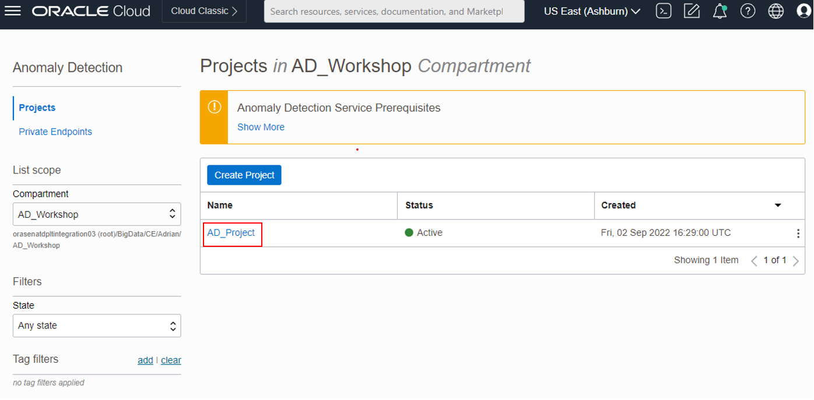

# Train Anomaly Detection Model

## Introduction
In this session, we will show you how to train an anomaly detection model using the synthetic signal data.

Anomaly Detection is the identification of rare items, events, or observations in data that differ significantly from the expectation. This can be used for several scenarios like asset monitoring, maintenance and prognostic surveillance in industries such as utility, aviation, transportation, and manufacturing.

The core algorithm of our Anomaly Detection service is an Oracle-patented multivariate time-series anomaly detection algorithm originally developed by Oracle Labs and had been successfully used in several industries for prognosis analysis.

The Oracle Cloud Infrastructure Anomaly Detection will create customized Machine Learning models by taking the data uploaded by users, using the core algorithm to train the model, and hosted in the cloud to be ready for detection. Users can then send new data to the detection endpoints to get detected anomaly results.

*Estimated Time*: 30 minutes

### Objectives
1. Understand a high level overview of the OCI Anomaly Detection Service
2. Understand the full cycle/workflow of services provided in the OCI Anomaly Detection
3. Hand-on activities to experience the whole pipeline of machine learning model development from training to detecting
##

** assumption - set up policy is taken care of in lab1: set-up-environment

** assumption - training data csv is stored in object storage bucket

###Task 1 Create Anomaly Detection Project

A project is a way to organize multiple data assets, models, deployments to the same workspace

Log into OCI Cloud Console. Using the Burger Menu on the top left corner, click *Analytics and AI* , and then select *Anomaly Detection* item under *AI services*.

In the Anomaly Detection Console,
   - Under *Comparment*, select the name of the compartment you created 
   - Select *Create Project*

In this form,
    - Specify the compartment in which to create an Anomaly Detection Project
       (In this case, use the same compartment that you created earlier in the demo)
    - Give a name to the Anomaly Detection Project
    - Once the details are entered, click the *Create Button*.

 If the project is successfully created, it will show up in projects pane.
    - select your *Project*

###Task 2

###Task 3
