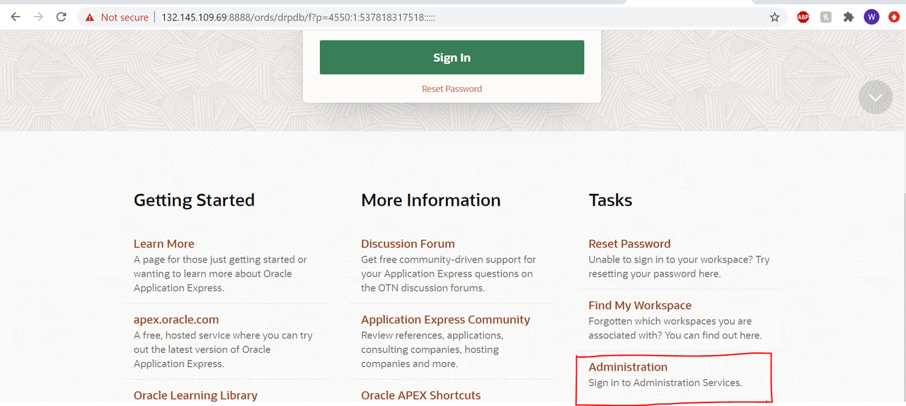
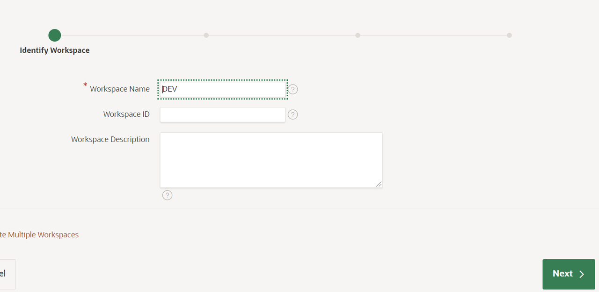
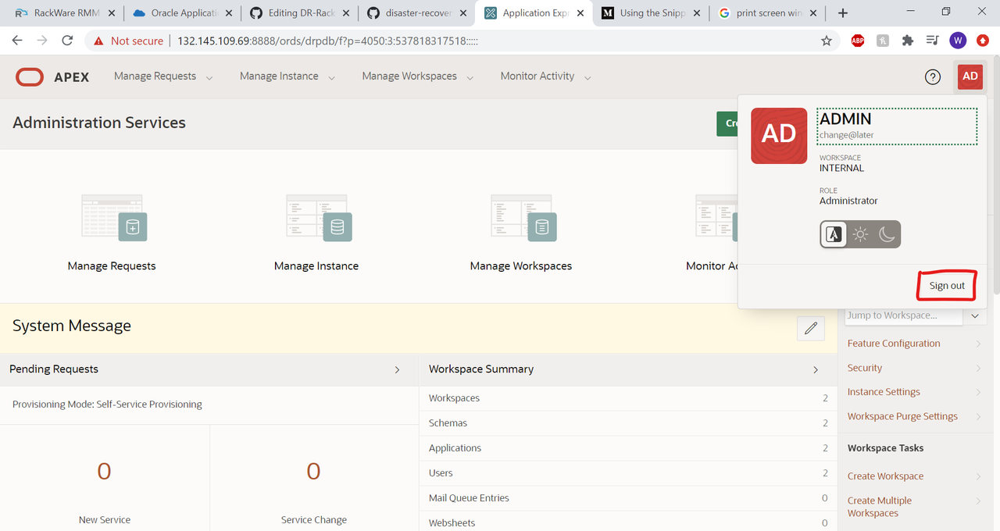
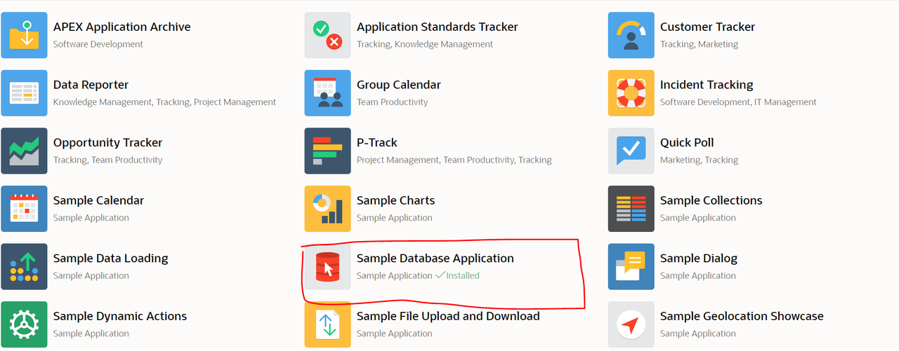
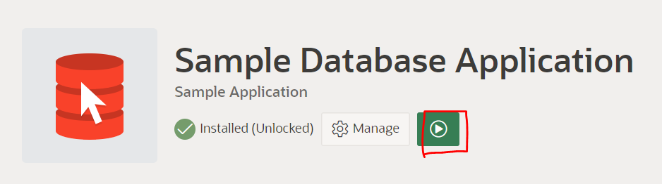
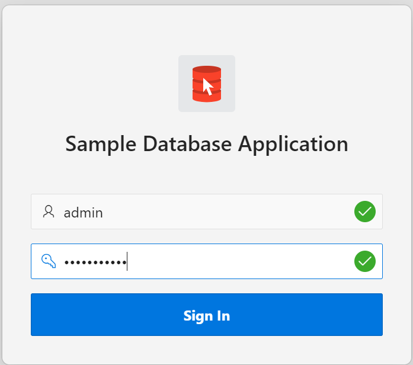
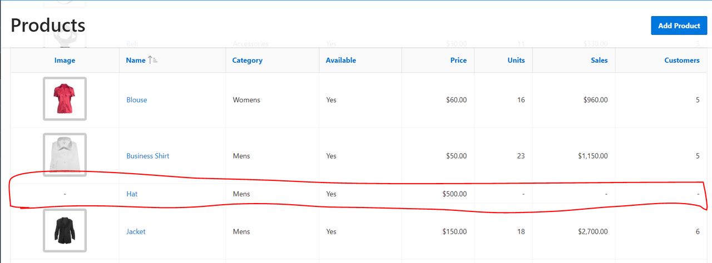

# Configure APEX instance for DR 
## Introduction
This lab configures an APEX instance to deploy a simple APEX application that can be replicated through a RackWare DR solution.

Estimated Lab Time: 10-15 minutes

### Objectives
- Connect to the APEX instance
- Create a workspace
- Install the sample application

### Prerequisites
- Successful completion of the first lab in this workshop

## Task 1: Create an APEX Workspace & Sample Application in the source instance
1. Navigate to the APEX instance through a web browser i.e https://\<public-ip>:8888/ords/drpdb and select **Administration Services** from the bottom of the page.
    
2. Login using the username *admin* and the database admin password. If prompted, reset the password upon login. Once logged in select **Create Workspace**
    
3. Give the workspace a name (e.g "DEV") and click Next.
4. Add the following settings on the "Identify Schema" page:
    - **Re-use existing schema?:** No
    - **Schema Name:** (Choose any name e.g "DEV")
    - **Schema Password:** (Choose a password that conforms to the database password constraints)
    - **Space Quota (MB):** 100
5. Add the following settings on the "Identify Administrator" page:
    - **Administrator Username:** (Choose a username e.g. "admin")
    - **Administrator password:** (Choose a password that conforms to the database password constraints)
    - First Name: *Optional*
    - Last Name: *Optional*
    - **Email:** (Enter a valid email)
6. Click **Create Workspace** on the confirmation page.
7. Once the workspace is create log out of the **Administration Services**
    
8. Enter the workspace name created in step 3 and fill in the admin login created in step 5. Click  **Sign In**
    
9. On the landing page, select **App Gallery**
    
10. Select the **Sample Database Application** and click **Install App**
    
11. Once installed, click the green play button to run the App.
    
12. Log in using the same admin credentials created in step 5.
    
13. Make a change in the application to verify the successful replication later (e.g adding a new product "Hat")
    
    
We now have an APEX application that accesses the database to be replicated using RackWare! You may now **proceed to the next lab.**

## Acknowledgements
- **Author** - Will Bullock
- **Last Updated by/date** Will Bullock, October 2020

