# Complete DR Configuration & Perform Failover
## Introduction
The final lab in this workshop will help you connect to the backup database and connect to the APEX instance replicated by RackWare (RMM).

Estimated Lab Time: 30-45 minutes

### Objectives
- Connect the target APEX instance to the backup database
- Failover to the backup database 
- Connect to the replicated APEX instance

### Prerequisites
- Succesful completion of all previous labs in this workshop

## Task 1: Connect the new instance to the Backup database
1. Start an ssh connection to the newly created instance.
2. Navigate to the root compartment and edit the *defaults.xml* file
    ```
    opc@<target-machine>$ sudo su -
    root@<target-machine>$ vi /home/oracle/conf/ords/defaults.xml
    ```
3. Change the db.hostname entry to relfect the IP of the backup database
    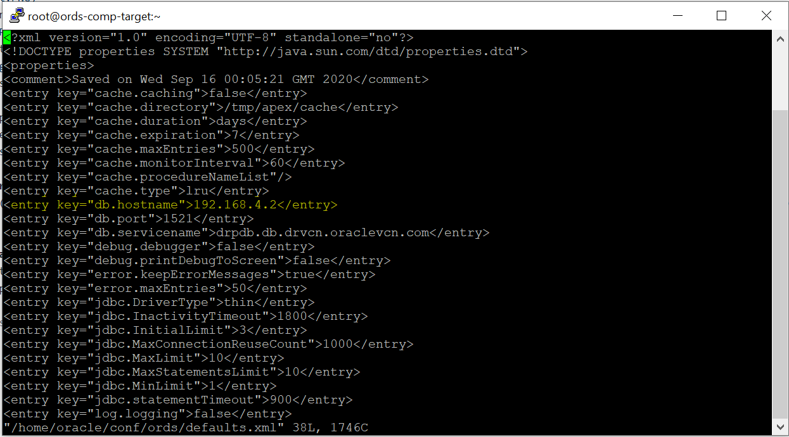

4. Update the db.hostname in *ords_params.properties* file to reflect the IP of the backup database
    ```
    root@<target-machine>$ vi /home/oracle/params/ords_params.properties
    ```
    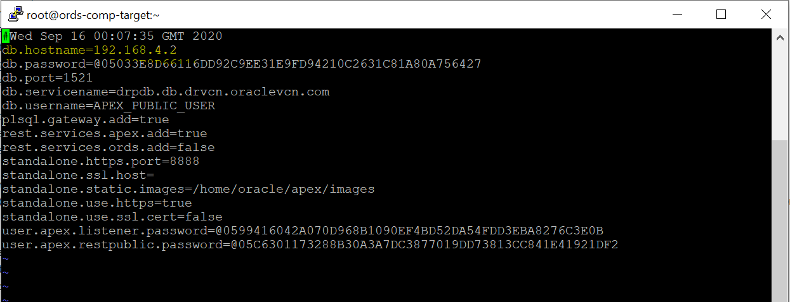
5. Start the ORDS server on the target machine *(You must complete this step after each sync)*
    ```
    root@<target-machine>$ sudo su - oracle
    oracle@<target-machine>$ ./start_ords.sh
    ```
6. Create a .txt file with the following two lines and save to your local machine:
    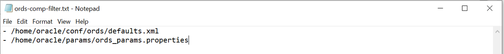
7. From the RackWare GUI, locate the wave you replicated and click the blue name.
    
8. Click the blue edit box on the row of your host machine.
    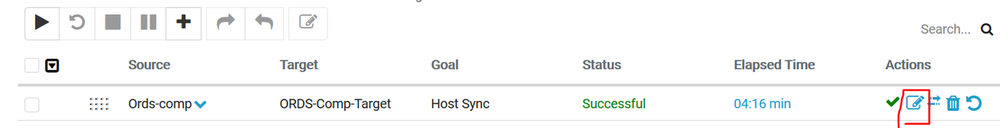
9. Under **Sync Options**, select the **Browse** button under **Upload local File** & add the .txt file created in step 6. Click **Modify**
    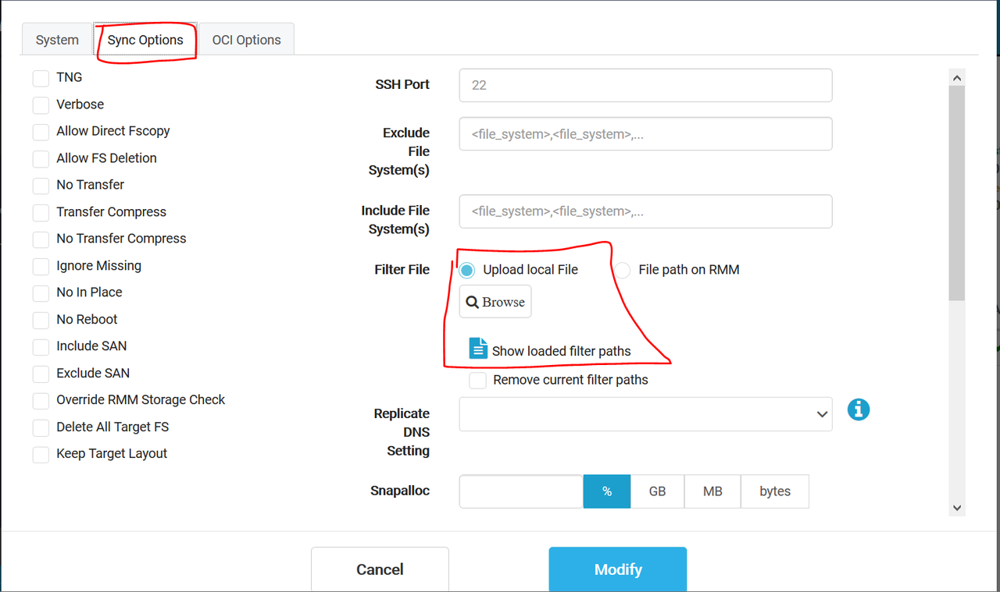
*(This will make sure the new instance points to the backup database after every sync)*


## Task 2: Conduct the failover operation to activate the backup database

1. Navigate to the standby database
    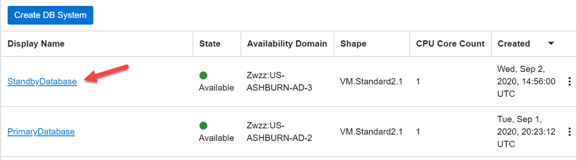
2. Click the database name under the backup DB System
    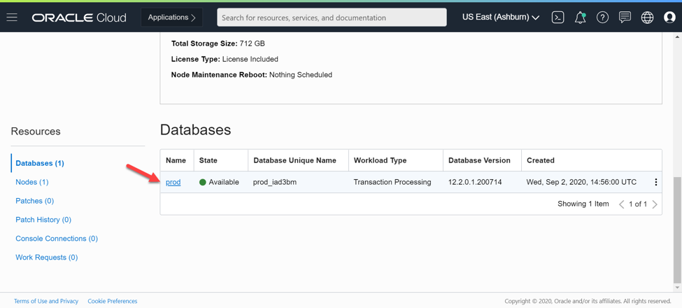
3. Under **Resources** on the left, choose Data Guard Associations. Click the three dots on the right and select **Failover**
    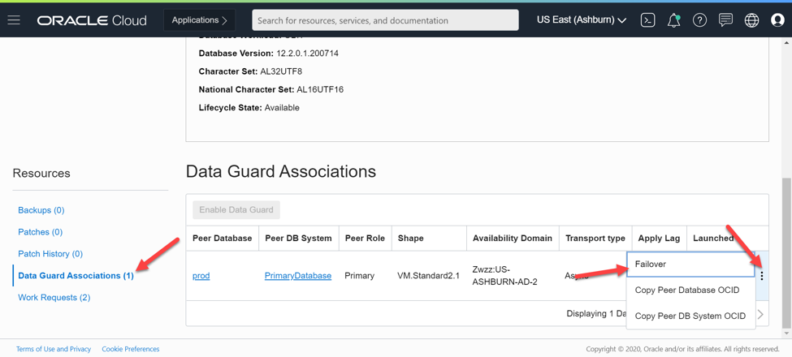
4. Enter the database password and click OK. The failover operation will take a few minutes to complete.
    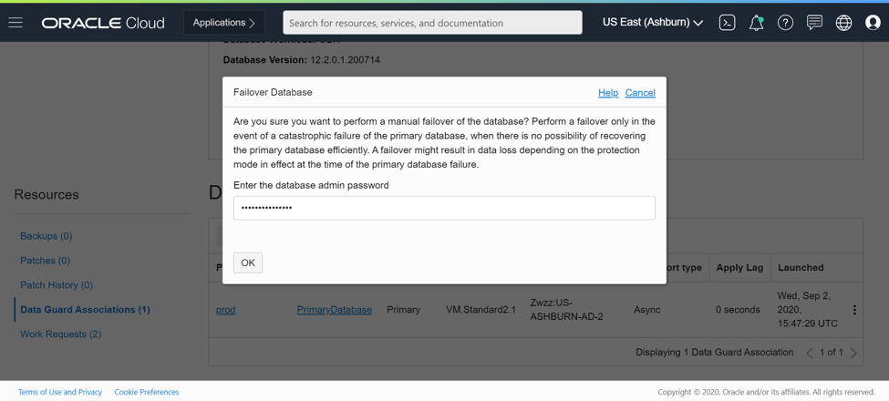
5. Navigate back to the StandbyDatabase DB system and look at the Peer Role under Data Guard Associations. It shows Disabled Standby which also reaffirms that the failover was successful.
    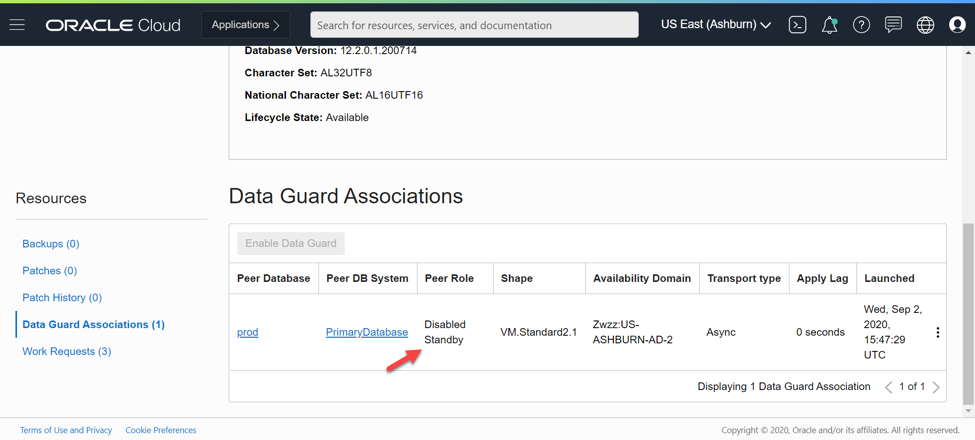

## Task 3: Verify the APEX application changes in the new Instance
1. Navigate to the new APEX instance through a web browser i.e. https://\<target-public-ip>:8888/ords/drpdb
2. Login with the same workspace & admin credentials created in step 3 & 5 of the lab **Configure APEX instance for DR**
    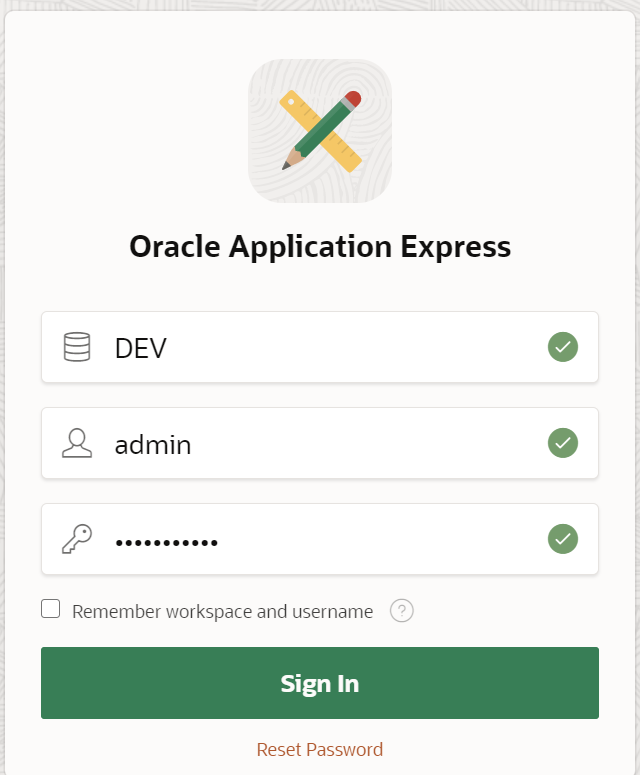
3. Select the **App Builder** icon.
    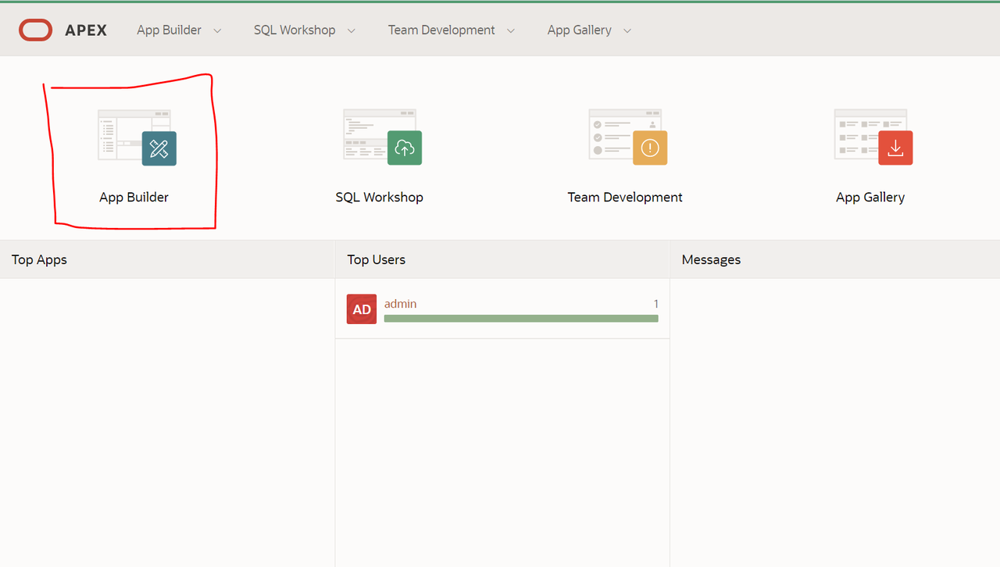
4. Run the **Sample Database Application** by pressing the play button next when you hover over the applications.
    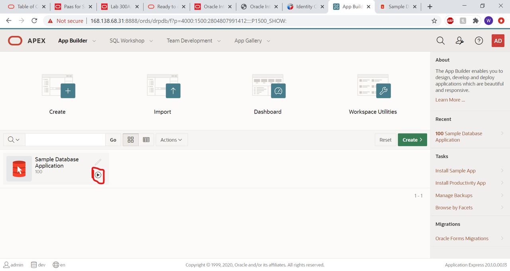
5. Navigate to the **Products** using the shopping cart icon on the left to verify the "Hat" product was added.
    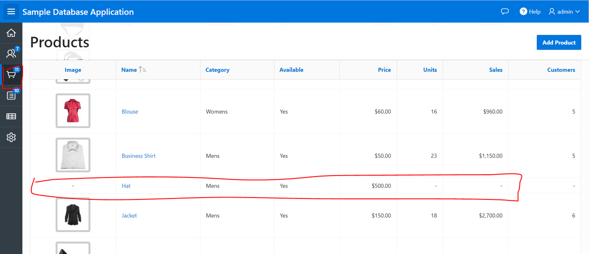
    
**Congratulations! If you see the change reflected in the new instance, you have successfully created a Disaster Recovery setup using RackWare on OCI!**

## Acknowledgements
- **Author** - Will Bullock
- **Last Updated by/date** Will Bullock, October 2020

## See an issue?
Please submit feedback using this [form](https://apexapps.oracle.com/pls/apex/f?p=133:1:::::P1_FEEDBACK:1). Please include the *workshop name*, *lab* and *step* in your request. If you don't see the workshop listed, please enter it manually. If you would like for us to follow up with you, enter your email in the *Feedback Comments* section.

