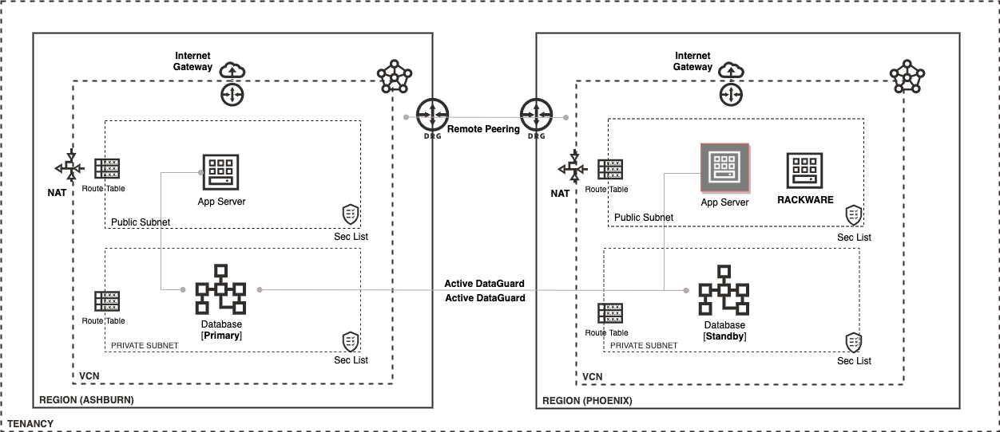

# Disaster Recovery RackWare Deployment on OCI

## Introduction
Welcome to this workshop where we will deploy the RackWare Migration Manager (RMM) on OCI as a Disaster Recovery solution.

Estimated Workshop Time: 2-3 hours

### Objectives
- Use terraform to create an APEX instance for DR
- Deploy and configure RMM on OCI
- Replicate APEX instances from source machines to autoprovision backup instances
- Perform a failover operation to simulate a DR scenario

### Prerequisites
- A paid Oracle Cloud account
- Familiarity with Oracle Cloud Infrastucture (OCI) and database terms is helpful
- An understanding of Disaster Recovery concepts would be useful for this workshop
- Verify your tenancy has the following capacity
	- 3x VM
	- 2x DBCS
	- 1x DRG
	- 1x Remote Peer
	- Ability to use Resource Manager

### Architecture Overview

## Acknowledgements
- **Author** - Will Bullock
- **Last Updated by/date** Will Bullock, November 2020
- **Lab Expiry Date** - 11/30/2021

