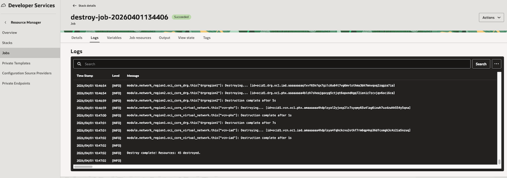

# Cleanup

## Introduction

Once the workshop is complete, you should remove the resources to avoid unnecessary costs.

Estimated Time: 5 minutes

### Objectives

Delete all infrastructure using Oracle Resource Manager.

### **Prerequisites**

This lab assumes you have:

* An Oracle Cloud account
* Administrator privileges or access rights to the OCI tenancy

## Task 1: Cleanup the resources

1. In order to cleanup the resources, simply go to Resource Manager in the OCI Web Console and select **Destroy**. This will destroy all of the provisioned resources.

    

2. Wait for the job to finish and then from **More Actions** menu select **Delete Stack**

## Acknowledgements

**Authors**

* **Cristian Cozma**, Principal Cloud Architect, NACIE
* **Cristian Vlad**, Master Principal Cloud Architect, NACIE
* Last Updated By/Date - Cristian Vlad, May 2026