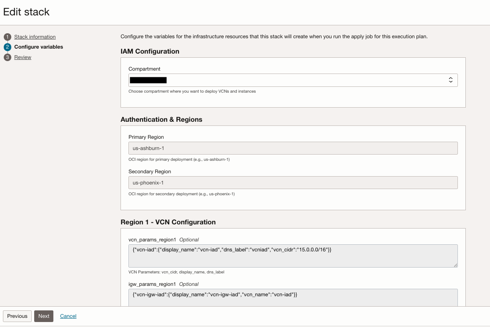
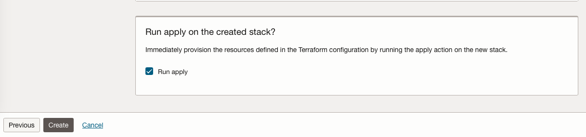
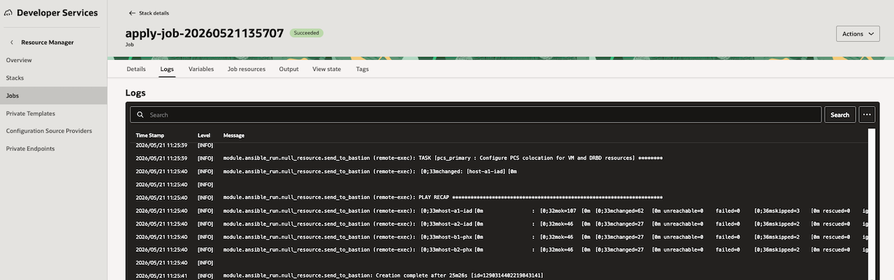

# Environment setup using terraform and resource manager

## Introduction

In this lab, we will provision the OCI infrastructure across two regions and configures a DRBD + Pacemaker/Corosync (PCS) + KVM stack.

Estimated Time: 30 minutes

### **Objectives**

Deployment of the infrastructure with DRBD + Pacemaker/Corosync (PCS) + KVM stack using OCI Resource Manager.

### **Prerequisites**

This lab assumes you have:

* An Oracle Cloud account
* Administrator privileges or access rights to the OCI tenancy

## Task 1: Provision resources

1. Download the terraform files  
    Go to Resource manager -> Stacks -> Create Stack. Choose My configuration and upload the provided folder and click Next: [drbd-pcs-kvm-automation.zip](https://github.com/vladcristi/drbd-pcs-kvm-automation/archive/refs/heads/main.zip)

    

2. Provide the following information: 

    **Select Compartment**: Choose the appropriate compartment for the VCN and instances.

    **Write your linbit details**: At the bottom of the variables page linbit username, linbit password, linbit cluster id (put 0 here), pcs password should be completed with your details

    And leave all the other variables as they are.

3. Once all of the variables are configured click **Next** and after that click apply.

    

4. Wait for the job to complete, which may take 25-30 minutes before the infrastructure is fully provisioned. When job is complete you should see a succes message.
    

    You may now proceed to the next lab.

## Acknowledgements

**Authors**

* **Cristian Cozma**, Principal Cloud Engineer, NACIE
* **Cristian Vlad**, Master Principal Cloud Engineer, NACIE
* Last Updated By/Date - Cristian Vlad, May 2026