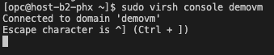
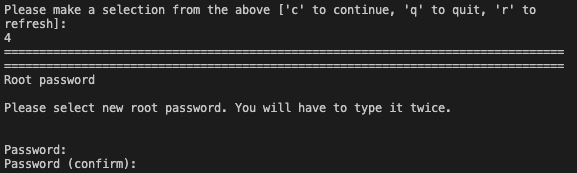
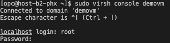
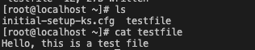
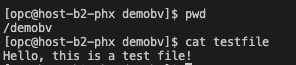
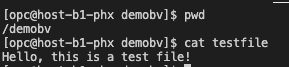
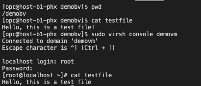

# Replication in action

## Introduction

In this lab, we will see the DRBD replication in action for files and guest VMs.

Estimated Time: 10 minutes

### Objectives

See how DRBD setup with Corosync and Pacemaker automatically replicates files into other nodes in the HA cluster when a primary node is down.

### **Prerequisites**

This lab assumes you have:

* Lab 2 completed with success.

## Task 1: Create file in guest VM in primary node of DRBD HA Cluster
1. First we will run the following command into the primary node: `sudo virsh console demovm` and we will be shown the following prompt:
    

    Here we need to give multiple enters until we get an window with option.

    Then we write 4 to select root password setup and write the password we want to use with root (two times for confirmation):
    

    Then we write q to quit and then do Ctrl+] to exit this console.

2. We connect again to the console using the same `sudo virsh console demovm` command and after a press of Enter, you will be prompted a localhost login where you specify root and the password that you set previously:
    

3. Create a file named *testfile* with the string *Hello, this is a test file* in it. 
    

4. Exit guest VM by writting *exit* and then pressing Ctrl+]

## Task 2: Create file in host VM in /demo mounted path in primary node of DRBD HA Cluster

1. Change directory to /demobv and create a file named *testfile* with the string *Hello, this is a test file* in it
     

## Task 3: Shutdown the primary DRBD node to see HA cluster configuration in action
1. Force shutdown the primary DRBD node from OCI console and you will see if you do `sudo watch pcs status` how the primary node is moving on another node.

2. Once the failover is ready, ssh into the new primary node and do a `lsblk` to see the /demobv mounted, then `ls` into it to see the *testfile* there and for further validation you can look into the file to see the content is the same as it was in the previous primary node.
    

3. Then login into the guest VM and verify the *testfile* created in the VM is there and the content is the same.
    

    Now we can proceed to final livelab to cleanup all the resources to not generate unwanted consumption.

## Acknowledgements

**Authors**

* **Cristian Cozma**, Principal Cloud Architect, NACIE
* **Cristian Vlad**, Master Principal Cloud Architect, NACIE
* Last Updated By/Date - Cristian Vlad, May 2026