# DRBD Setup Verification

## Introduction

In this lab, we will verify all the components are installed in place.

Estimated Time: 5 minutes

### Objectives

Verify that all components are deployed in OCI and running on VMs.

### **Prerequisites**

This lab assumes you have:

* Lab 1 completed with success.

## Task 1: Verify all hosts are deployed in both regions
1. Get into OCI console and go first to Ashburn region to verify bastion and two hosts are deployed there
    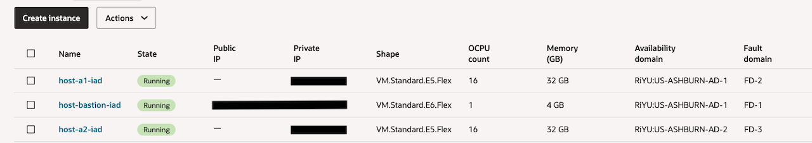
2. Get into OCI console to Phoenix region to verify two hosts are deployed there
    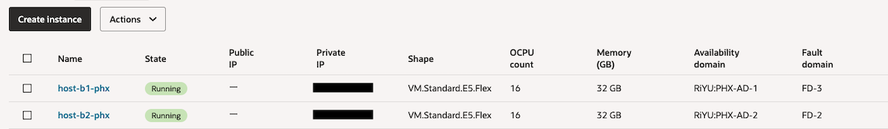

## Task 2: Copy SSH Key from terraform state to ssh into bastion
1. Get into OCI console to Resource Manager, to stacks, your stack, and go to "View state" and search for *private\_key\_pem* string. Copy the string value for *private\_key\_pem* in a local ssh file and replace the \n from the file with line breaks to have a proper format for the ssh private key.

    Use the ssh private key file into the following command to ssh into bastion: `ssh -i <sshkey-filename> opc@<bastion-public-ip>`

## Task 3: Verify drbd and pcs are installed and running
1. Once you are in bastion you can ssh into any of the four hosts created for HA cluster replication.
    In order to see the primary-standby relation of nodes in DRBD you can ssh into a primary node and a secondary node and give the following command: `drbdadm status`
   
    Primary view:
    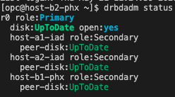
    Secondary view:
    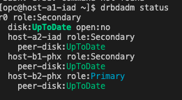

2. If you want to see a volume was mounted into the primary node you can give the following command: `lsblk` and you'll see the difference between a primary and a secondary node. 
    
    Primary view:
    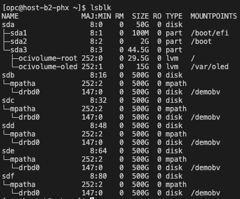
    Secondary view:
    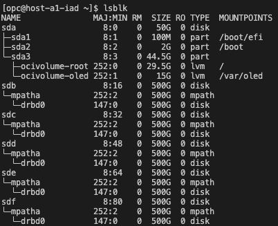

    In the screenshots above you can see also the multipath was enabled for block volumes in the instances. This is most probably needed in most of the scenarios when you need high latency for read and writes on disk.

3. Now lets see also the PCS (Corosync + Pacemaker) is installed: we do this by running the following command: `pcs status`

    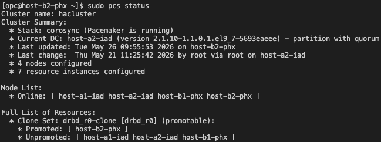
    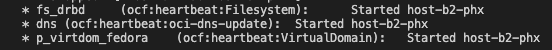
    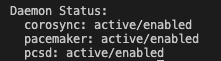

    The same output will be on all nodes.

## Task 4: Verify libvirt daemon is running and virsh can reach it to see guest VMs
1. In order to see we have guest VMs deployed in our hosts for VM replication demo using DRBD, we use the following command: `sudo virsh list --all`
    
    Primary view:
    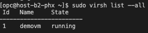
    Secondary view:
    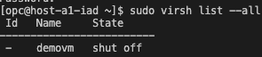

    From the screenshots above you see a guest VM is running into the primary node, and there is also VM created, but shut off in secondary node.

2. Now that we have all things deployed in place, we should proceed to next lab to test replication. 

## Acknowledgements

**Authors**

* **Cristian Cozma**, Principal Cloud Architect, NACIE
* **Cristian Vlad**, Master Principal Cloud Architect, NACIE
* Last Updated By/Date - Cristian Vlad, May 2026