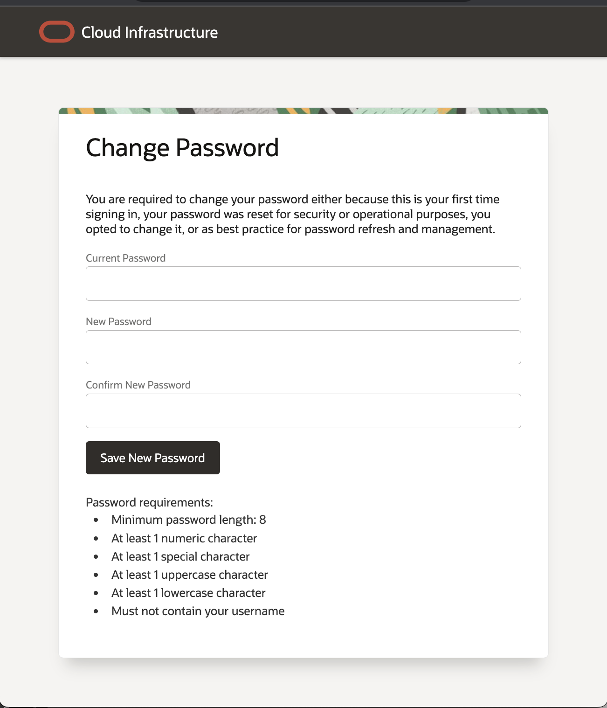

# Get Started

## Introduction
Oracle Cloud is the industry's broadest and most integrated cloud provider, with deployment options ranging from the public cloud to your data center. Oracle Cloud offers best-in-class services across Software as a Service (SaaS), Platform as a Service (PaaS), and Infrastructure as a Service (IaaS).

The new experience for Fusion Applications Environment Management unifies the administrative experience for Cloud Infrastructure and Applications services and provides:
* Integrated administrative experience, providing a "single pane of glass" visibility for all Oracle Cloud services.
* Self-service end-to-end lifecycle management of Fusion Apps environments via Oracle Cloud Console
* Better Security, and highly available cloud experiences for our applications customers

### Objective
* Learn how to log in to your Oracle Cloud Account
* Configure the Cloud Account for the workshop

Estimated Lab Time: 5+ minutes.

## Task 1: Log in to Oracle Cloud Console
1. Open the site https://cloud.oracle.com/applications
2. Enter the Cloud Account Name = PMPreProd, Click Next

3. Make sure the default Identity domain is selected, Click Next

4. Enter the password given to you and Change the password,

5. OR Enter the username/password provided to you
6. Take the OCI tour. Click on Begin Tour

## Task 2: Account setup

## Acknowledgements
* **Author** - <Name, Title, Group>
* **Contributors** -  <Name, Group> -- optional
* **Last Updated By/Date** - <Name, Month Year>
