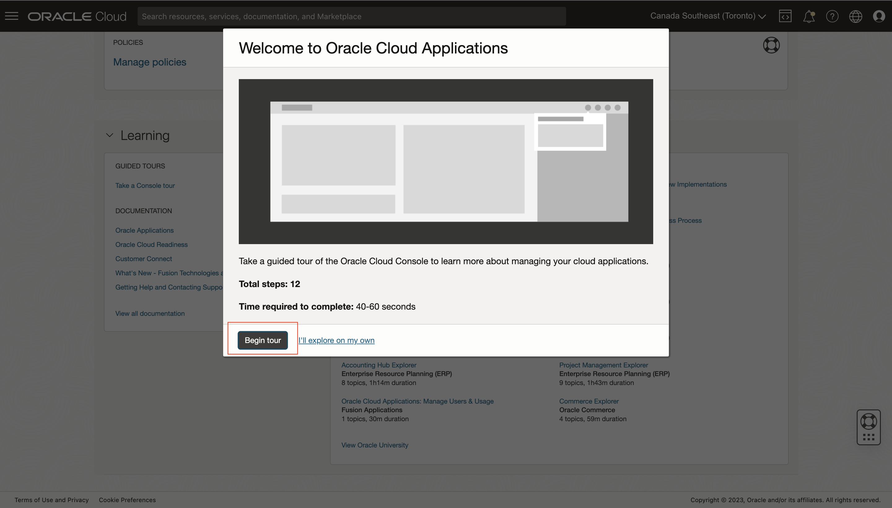
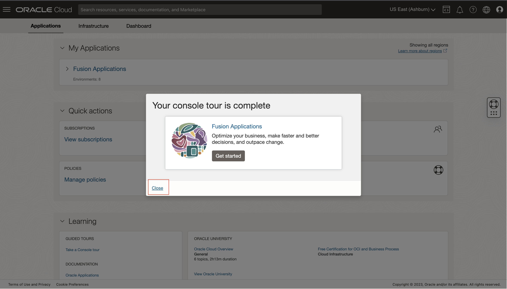

# Get Started

## Introduction
Oracle Cloud is the industry's broadest and most integrated cloud provider, with deployment options ranging from the public cloud to your data center. Oracle Cloud offers best-in-class services across Software as a Service (SaaS), Platform as a Service (PaaS), and Infrastructure as a Service (IaaS).

The new experience for Oracle Fusion Applications Environment Management unifies the administrative experience for Cloud Infrastructure and Applications services and provides:
* Integrated administrative experience, providing a "single pane of glass" visibility for all Oracle Cloud services.
* Self-service end-to-end lifecycle management of Fusion Apps environments via Oracle Cloud Console
* Better Security, and highly available cloud experiences for our applications customers

Estimated Time: 5+ minutes.

[Get Started](videohub:1_ouvfqnqc)

### Objectives
* Learn how to log in to your Oracle Cloud Account
* Get to know the Oracle Cloud Console navigation

### Prerequisites
Below login details will be provided during the workshop:
* Cloud Account Name
* Username
* Password

## Task 1: Log in to Oracle Cloud Console
1. Open the site by clicking https://cloud.oracle.com
2. Enter the Cloud Account Name = PMPreProd, Click **Next**

  

3. Make sure the default Identity domain is selected, Click **Next**

  

4. Enter the username/password given to you and Click **Sign In**

  

5. Take the Console tour. On the bottom of the Applications page, **Learning section** / **GUIDED TOURS** click on **Take a Console tour**. The tour will walk you through the console user experience in 12 steps and will take about a minute or so to complete. Close the tour once finished.
  
  
  
  

You may now [proceed to the next lab](#next).

## Acknowledgements
* **Author** - Ankit Kumar, Product Manager in FAaaS
* **Contributors** -  Tirthankar Nayak, Pranjal Jain, Sai Krishna Palagummi, Pratik Agrawal, Suby Thomas
* **Last Updated By/Date** - Tirthankar Nayak - August 2023
