# Perform LCM operations

## Introduction

Perform Lifecycle Management activities on the Fusion Applications environment

Estimated Time: 20+ minutes

[Perform LCM operations](videohub:1_zc80s34q)

### Objectives
* Learn how to refresh and mask data on test or development environment
* Learn how to edit a language pack
* Learn how to enable network restrictions
* Learn how to edit maintenance
* Learn how to enable custom keys

### Prerequisites
* This lab requires completion of **Lab 1**, in the Contents menu on the left.

## Task 1: Refresh Environment
An environment refresh copies data from a source environment to a target environment, making a copy of the source environment onto the target environment. Environment refreshes ensure a predictable experience during testing activities by providing a comparable non-production environment for testing and validation, before applying changes to your production environment. For more info refer to [documentation](https://docs.oracle.com/en-us/iaas/Content/fusion-applications/refresh-environment.htm).

1. Click **ORACLE Cloud** (upper left-hand corner to go to the Applications tab) Open My Applications, Fusion Applications chevron, and click on test or dev environment. **Note**: You cannot refresh a production Environment, so make sure you are working on Test or development environment.

  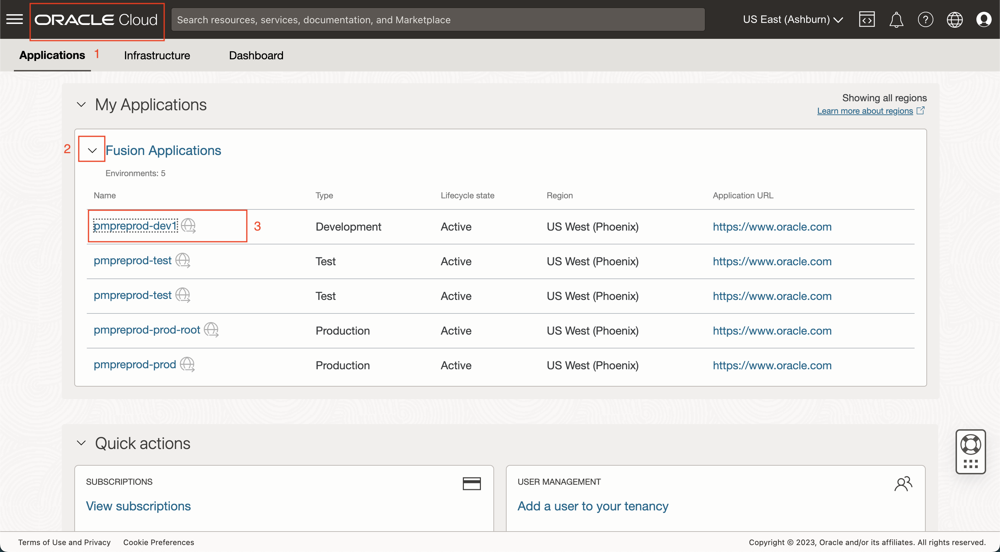

2. Click on **Refresh** Tab in the Resources section on the left-hand side.

  

3. Click on **Refresh environment** button and enter the following details
    - Source environment = pmpreprod-prod
    - Refresh start time = Refresh now
    - Check - I acknowledge that upon refresh, the environment will be unavailable for up to several hours.
    - Check - Enable data masking. Note: Data masking ability is available because the subscription is added to the family.
4. Click **Submit**

  

5. Refresh confirmation modal pops up. Enter the environment name and click **Refresh**

  

6. When the refresh task is successfully submitted, A refresh schedule is posted on the screen with the current timestamp.

  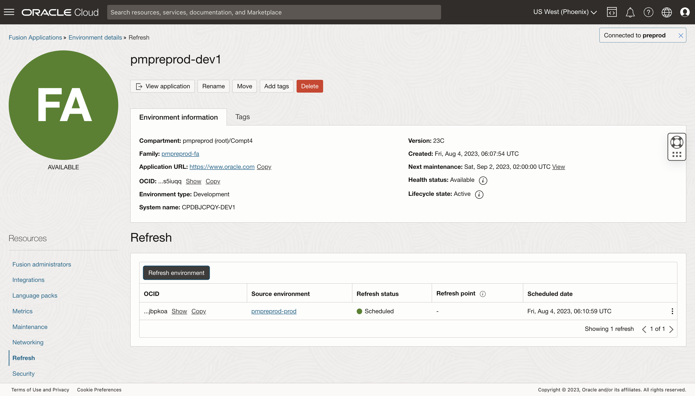

7. Click on **Work Request** in the left-hand resources section to see the Refreshing environment work request created with a 0% completed state. **Note**: Since this is a simulation of a refresh. The job will be completed within minutes. In actual environments Refresh can take a few hours to complete.

  

8. Go back to the Refresh resource and refresh the page. Notice the Last refresh date is stamped in the header and the status in the details is Succeeded.

  

9. Go back to Work requests in the Resources section and notice the Operation Refreshing environment Status has changed to Succeeded and % Complete 100%

  

10. Go back to Refresh under resources and click on Refresh Environment and schedule another one for a future date.
    - Source environment = pmpreprod-prod
    - Refresh start time = Refresh later
    - Schedule refresh = any future date. **Note**: Refreshes cannot be scheduled within four days of an upcoming maintenance, or within seven days of an already scheduled refresh. Refer to Refresh [documentation](https://docs.oracle.com/en-us/iaas/Content/fusion-applications/refresh-environment.htm#refresh-reqs-lims) for more details.
    - Check - Enable data masking.
11. Click **Submit**

  

12. Enter the environment name and click **Refresh**

  

13. Notice that the Scheduled job is posted in the Refresh tab

  

14. There is an option to re-schedule / cancel a refresh. Click on the 3 dots next to the Scheduled refresh and open the menu. Click on **Reschedule** refresh option.

  

15. Enter the **New refresh date** and **environment name** to confirm the re-schedule refresh. Click **Reschedule**.

  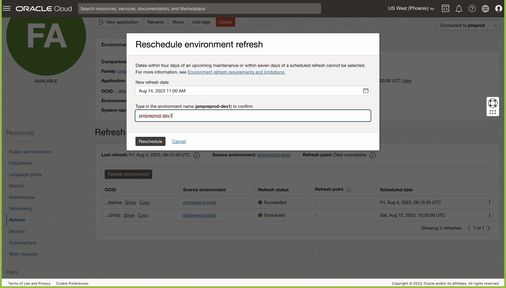

16. The refresh should now be scheduled the new date.

  

17. In case a user forgets to mask data during refresh, or there are additional sources of data in the fusion environment that needs to be masked, users can run data masking as a standalone job. Go to the **Security** tab of the Resources section and then open the **Data Masking** tab

  

18. Click on Run data masking. The data masking confirmation modal pops up. Enter the environment name and click on Run data masking.

  

19. The data masking job will be seen in the tab with the status In progress, which will change to Succeeded in a few minutes. you might need to refresh the browser to see the updates. **Note**: Since this is a simulation of a data masking job, it will be completed within a few minutes. The actual job will take a few hours. Also, the environment is unavailable during this time.

  

20. Work request will be created as well, where you can monitor the progress.

  

21. Click on the **Bell-Announcement** icon in the top right-hand corner to go to the announcements page. Click on the **Announcements** and make sure your compartment is selected. You will see the announcement for the fusion environments you created. Notice the **Environment Refresh Completed** announcement.

  

22. Check your email for the announcement

  

## Task 2: Edit Language Pack
You can add language packs to an environment. For more information about language packs, see [Understanding Language Packs](https://docs.oracle.com/en-us/iaas/Content/fusion-applications/plan-environment.htm#about-language-packs). Note that you can't remove a language pack.

1. Navigate to the environment details page: Click on the **Oracle Cloud icon** to go to the **Applications Homepage**, and click **Fusion Applications**. On the **Overview** page, find the environment family for the environment, and then click on any environment name to go to the details page.
2. Under **Resources**, click **Language packs**.
3. Click **Install**.
    - Select the check box for the language to include. You can add two language packs at a time.
    - Click **Install**.
    
      
    
    - Follow the confirmation prompts, and enter 1 or 2 based on the number of languages selected. Click **Install**
    
      

4. Go to Work request and notice that the Updating environment Work request is Accepted, then In progress, and then Succeeded in a few minutes.

  

5. Go back to the Language Packs resource and notice that Spanish has been added.

  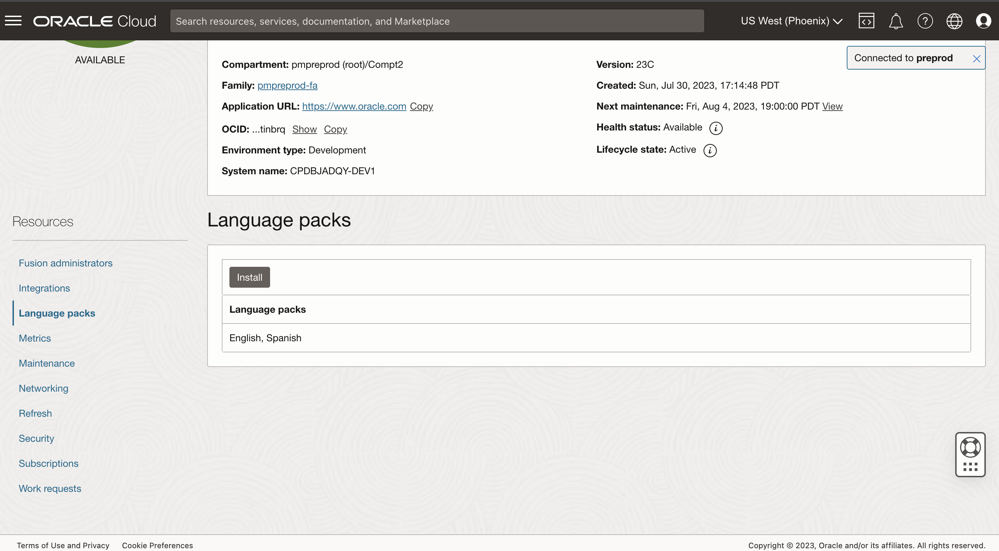

## Task 3: Enable Network Restrictions
Users can allow access to Fusion Application only from selected public IPs. You can configure CIDR ranges or VCNs. In this exercise, we will enter a CIDR/IP range.

1. Click **Networking** from the resources section
2. In the Networking tab, Access control rules. Click **Create rule** and select the following values
    - IP notification type = CIDR block
    - CIDR Block = 0.0.0.0/0
3. Click on **Create rule**

  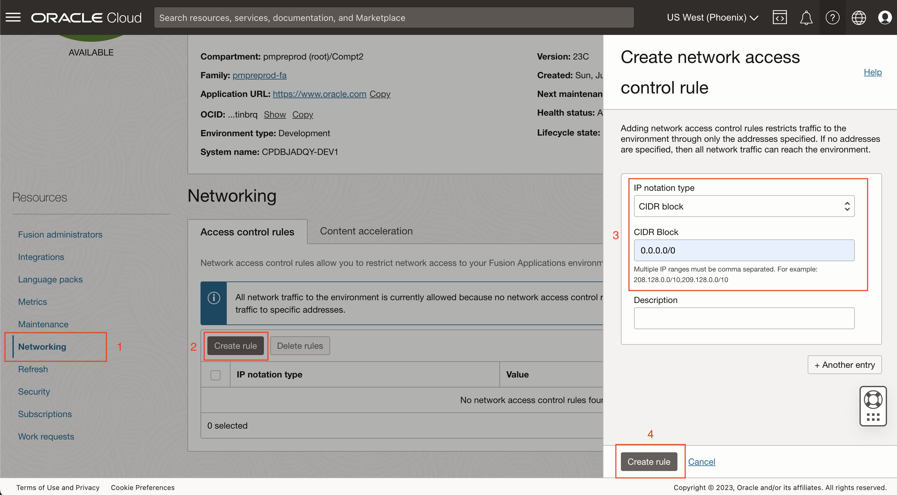

4. Check the Work request for the same
5. Go back to Networking to see the CIDR block entry in the Access control rules

  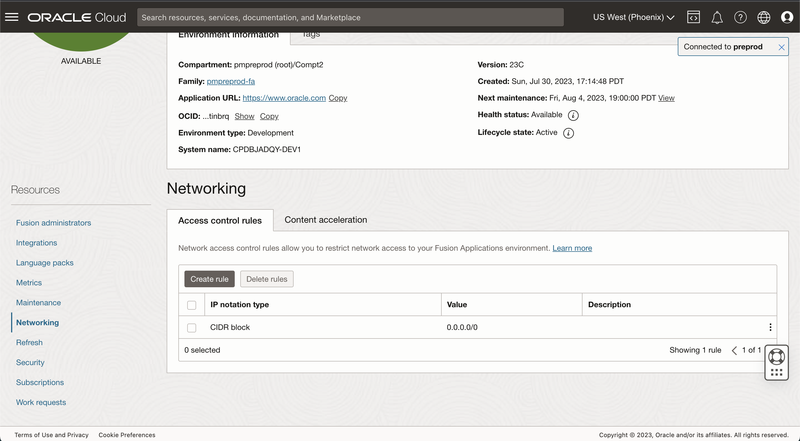

## Task 4: Edit Maintenance
1. Note down the Next Maintenance date for the environment. Make sure you are working on a dev or test environment.

  

2. Go to **Maintenance** under Resources
3. Click on **Edit maintenance**.
4. Click on **Custom**.

  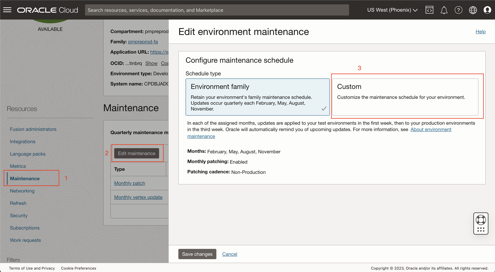

5. Change Patching cadence to **Production**. and **Save changes**.

  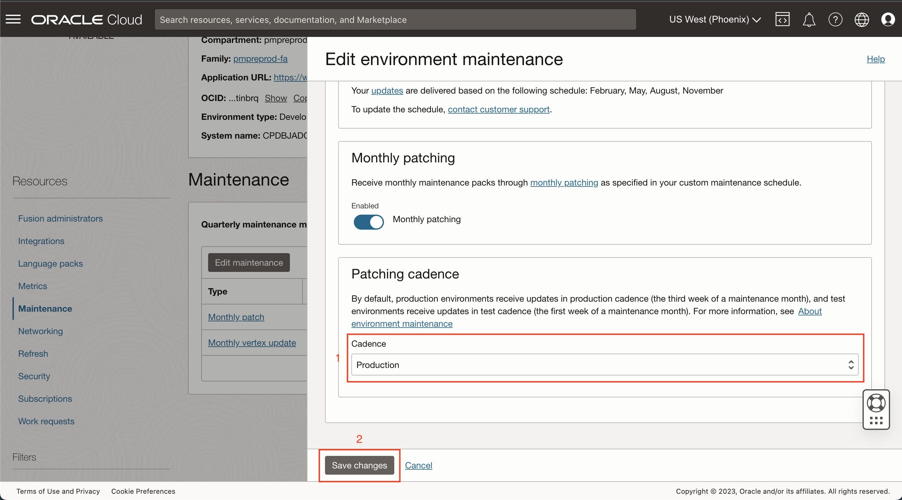

6. Note the change in Next maintenance date for the environment, it would have moved 2 weeks ahead. Maintenance can be performed in the first week of the month (non-production cadence) or in the third week of the month (production cadence). Typically, for test and development environments you would choose non-production and for production environments, you would choose production. See [Types of Maintenance and Schedules](https://docs.oracle.com/en-us/iaas/Content/fusion-applications/plan-environment-family.htm#maint-types) for more details.
7. Check the Work request for **Updating environment**.

## Task 5: Edit Encryption
By default, your Fusion Applications environments are protected by Oracle-managed encryption keys. By subscribing to the Oracle Break Glass and Database Vault service, you are offered the customer-managed keys feature that allows you to provide and manage the encryption keys that protect your environments. Fusion Applications leverages the OCI Vault service to enable you to create and manage encryption keys to secure the data stored at rest in your production and non-production environments. You can set up keys on your environment either during environment creation or you can add the key to an existing environment. Before you assign the Vault and Keys to the Environment, you need to create Vault and AES-256 type Key in your account and assign permissions by writing policies for the same For more info please refer to the [documentation](https://docs.oracle.com/en-us/iaas/Content/fusion-applications/manage-security-key-management.htm).

1. Go to Security under Resources and click on Edit encryption key.

  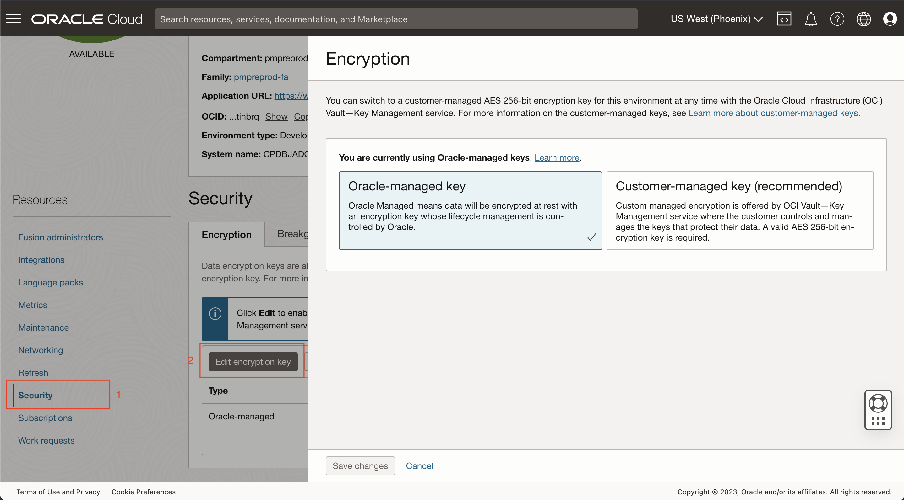

2. Click on the **Customer-managed key** and enter the details as follows
    - Change **compartment** for the vault to pmpreprod (root)
    - Select the **FusionVault** 
    - Select **FusionKey** in the Master encryption key field
3. Note the Encryption scheduling alert - Updating the encryption of an existing environment will be done during the next maintenance downtime. **Save changes**

  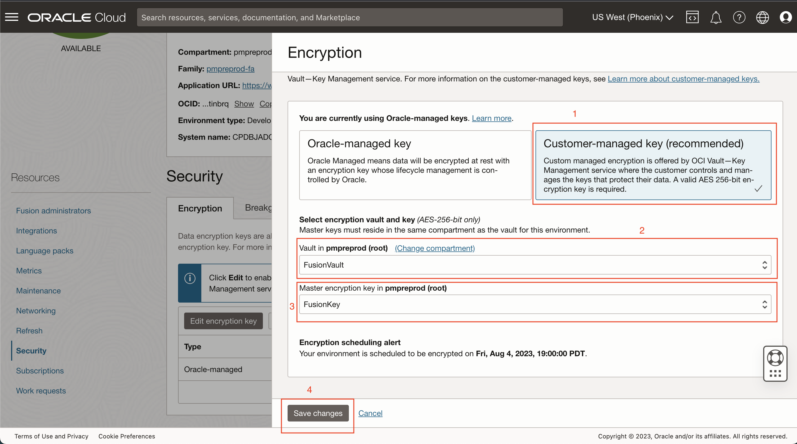

4. Notice the Customer-managed encryption is scheduled. Click on the Key Status - **Scheduled**

  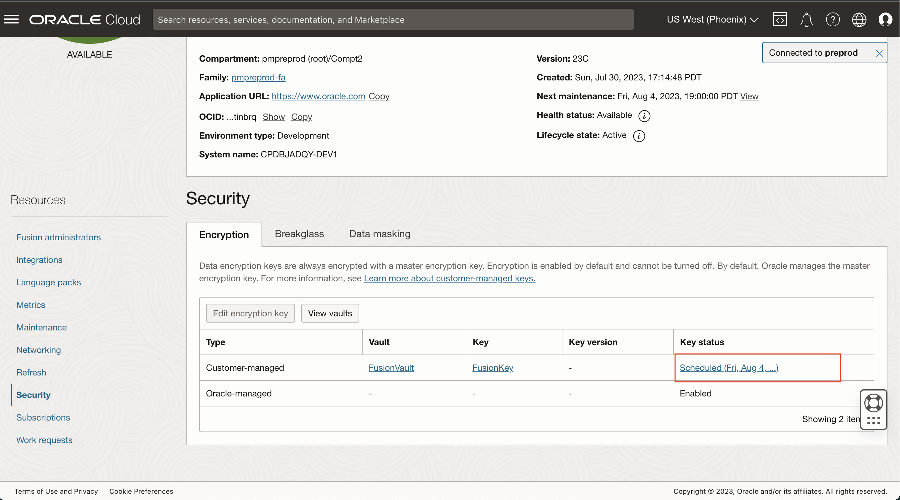
  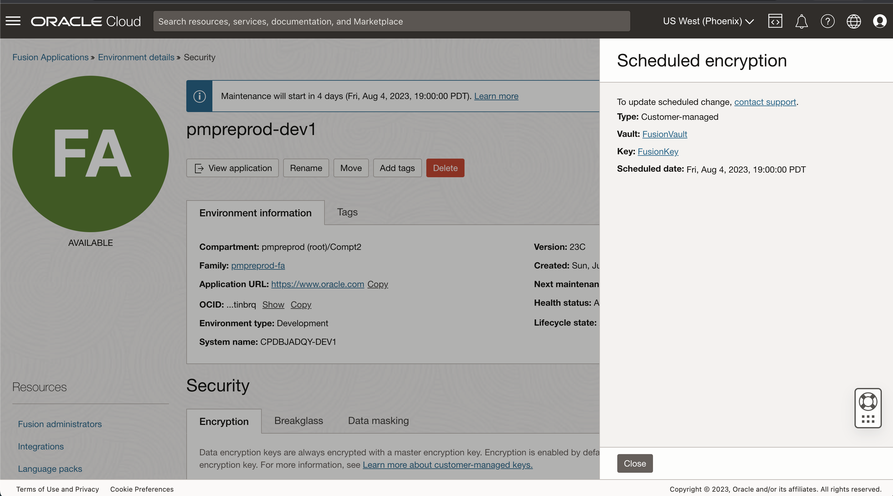

5. Check the Work request for the same - Updating environment.

**Note**: When the custom key is active, the key version will be displayed on the screen and you can go to the Key management screen, by clicking the Key link and perform Key management operations such as:
- Key Rotate, Key Rotate with external key/BYOK (Bring your own key) - Key rotation creates a new key version. Fusion will automatically change the key version and will reflect the new version in the Encryption resource of the environment detail page. This change is seamless for the fusion application user and required no downtime.
- Enable/Disable key to remove access to fusion environments from the user interface and also from the backend. Key Disable operation affects Fusion environments in a few minutes while enabling the Key back will take an hour or so.

  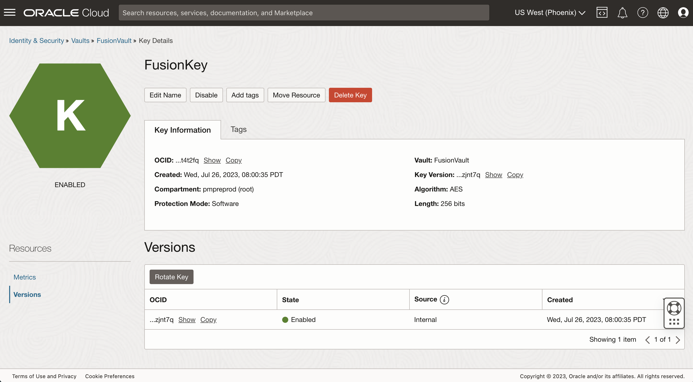

You may now [proceed to the next lab](#next).

## Learn More
* See the [documentation](https://docs.oracle.com/en-us/iaas/Content/fusion-applications/manage-environment.htm) on managing Fusion Environments.

## Acknowledgements
* **Author** - Ankit Kumar, Product Manager in FAaaS
* **Contributors** -  Tirthankar Nayak, Pranjal Jain, Sai Krishna Palagummi, Pratik Agrawal, Suby Thomas
* **Last Updated By/Date** - Tirthankar Nayak - August 2023
