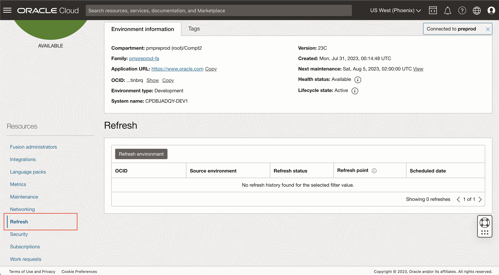
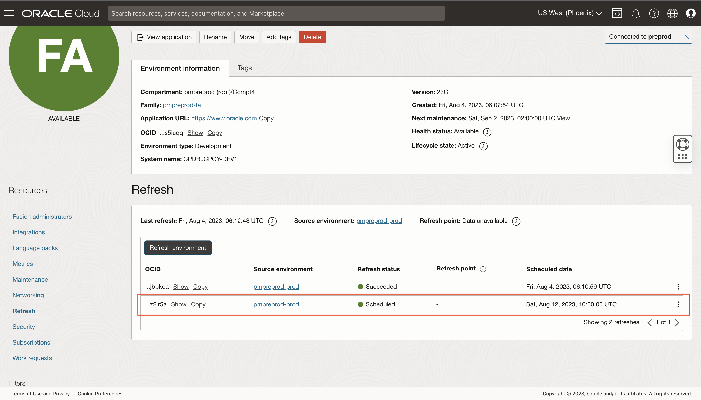
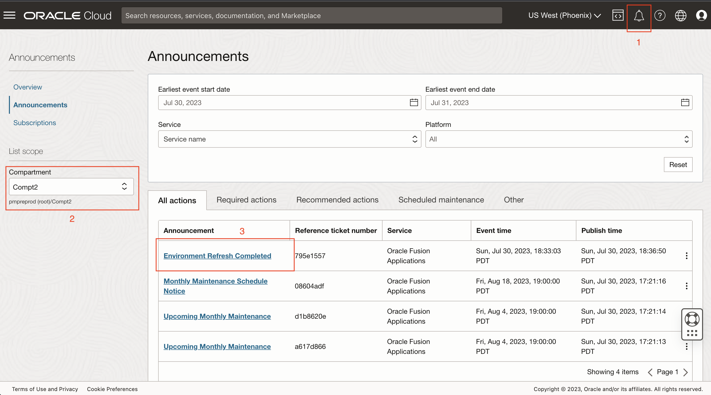

# Perform LCM operations

## Introduction

Perform Lifecycle Management activities on the pod

### Objective
* Learn how to refresh an environment and mask data on test or development environment
* Learn how to edit a language pack
* Learn how to enable network restrictions
* Learn how to edit maintenance
* Learn how to enable custom keys

Estimated Time: 20+ minutes

## Task 1: Refresh Environment
1. Go back to Fusion environment detail page. Click ORACLE Cloud (upper left-hand corner to goto the Applications tab) Open My Applications, Fusion Applications chevron, and click on test or dev environment.

2. Click on **Refresh** Tab in the Resources section on the left-hand side.

3. Click on **Refresh environment** button and enter the following details
    - Source environment = pmpreprod-prod
    - Refresh start time = Refresh now
    - Check - I acknowledge that upon refresh, the environment will be unavailable for up to several hours.
    - Check - Enable data masking. Note: Data masking ability is available because the subscription is added to the family.
4. Click **Submit**

5. Refresh confirmation modal pops up. Enter the environment name and click **Refresh**

6. When the refresh task is successfully submitted, A refresh schedule is posted on the screen with the current timestamp.

7. Click on **Work Request** in the left-hand resources section to see the Refreshing environment work request created with 0% completed state. **Note**: Since this is a simulation of refresh. The job will be completed within minutes. In actual environments Refresh can take a few hours to complete.

8. Go back to the Refresh resource. Notice the Last refresh date is stamped in the header and status in the details is Succeeded.

9. Go back to Work requests in the Resources section and notice the Operation Refreshing environment Status has changed to Succeeded and % Complete 100%

10. Go back to Refresh under resources and click on Refresh Environment and schedule another one for a future date.
    - Source environment = pmpreprod-prod
    - Refresh start time = Refresh later
    - Schedule refresh = any future date. **Note**: Refreshes cannot be scheduled within four days of an upcoming maintenance, or within seven days of an already scheduled refresh. Refer to Refresh [documentation](https://docs.oracle.com/en-us/iaas/Content/fusion-applications/refresh-environment.htm#refresh-reqs-lims) for more details.
    - Check - Enable data masking.
11. Click **Submit**

12. Enter the environment name and click **Refresh**

13. Notice that the Scheduled job is posted in the Refresh tab

14. In case a user forgets to mask data during refresh, or there is additional sources of data in the fusion environment that needs to be masked, users can run data masking as a standalone job. Go to the **Security** tab of the Resources section and then open the **Data Masking** tab

15. Click on Run data masking. Data masking confirmation modal pops up. Enter the environment name and click on Run data masking.

16. Data masking job will be seen in the tab with the status In progress, which will change to Succeeded in a few minutes. you might need to refresh the browser to see the updates. **Note**: Since this is a simulation of a data masking job, it will be completed within a few minutes. The actual job will take a few hours. Also, the environment is unavailable during this time.

17. Work request will be created as well, where you can monitor the progress.

18. Click on the **Bell-Announcement** icon on the top right-hand corner to go to the announcements page. Click on the **Announcements** and make sure your compartment is selected. You will see the announcement for the fusion environments you created. Notice the **Environment Refresh Completed** announcement.

19. Check your email for the announcement

## Task 2: Edit Language Pack
Add Spanish, etc.

watch work request
## Task 3: Enable Network Restrictions
Add cidr rule

watch work request
## Task 4: Edit Maintenance
For a pod, enable monthly patching, update the patching cadence to production

watch work request
## Task 5: Edit Encryption
Create Vault, Key, Create policy, update pod with vault/key to schedule

## Acknowledgements
* **Author** - <Name, Title, Group>
* **Contributors** -  <Name, Group> -- optional
* **Last Updated By/Date** - <Name, Month Year>
