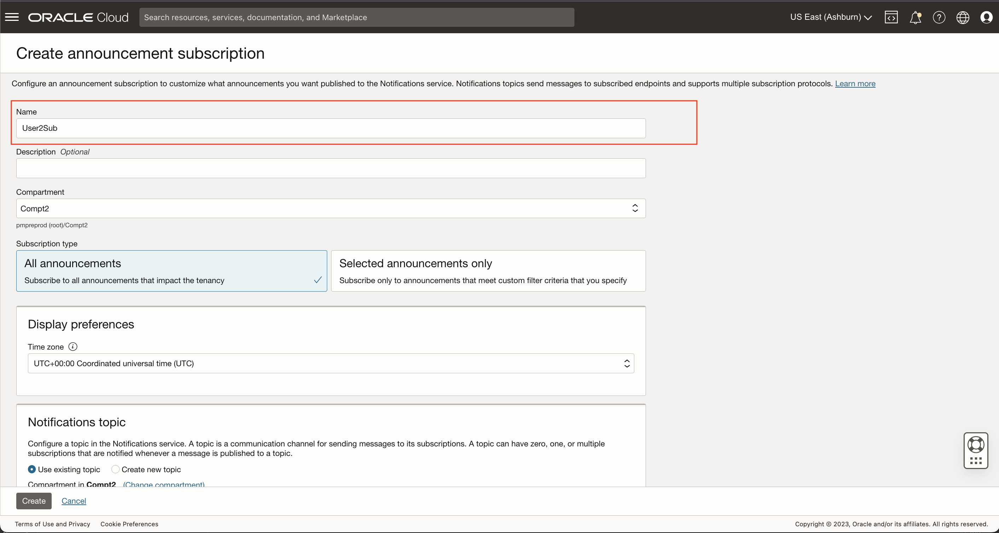
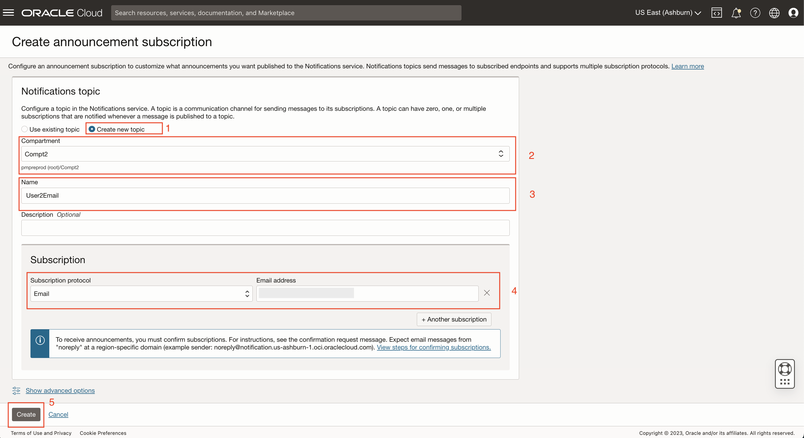

# Provision Fusion Environments

## Introduction

Use the wizard and provision pods, and explore the console with FAaaS and OCI platform features. review the pod details that was just created.

Show in overview page as well. Go to audit, notification? create a tag, tag based audit trail . highlight cross- platform saas console function. how to leverage oci. 

Explore the Applications homepage, region dropdown, ? icon, bell icon, timezone, mfa?, infra page

other stuff on Oracle Cloud Console?

Estimated Lab Time: -- minutes

## Task 1: Subscribe to Announcements

Per pod, maintenance notifications will be delivered. An announcement Email will be received for Env refresh later

1. After you are successfully logged in. Click on the Bell - Announcement Icon on the top right hand corner to land on the Announcements page.

2. On the left hand side. Change the Compartment from Pmpreprod (root) to your compartment Compt2 in this case.

3. Click on the *Subscription* page on the left hand side and then click on the button *Create announcement subscription*

4. Enter a Name for the Announcement subscription.

5. Click on the button *Selected announcements only*. Enter a Filter Name, Create 2 filters Type: Service, Value: Oracle Fusion Application; Type: Compartment, Value: <your comartment> Compt2 in this case. This step filters only Fusion-related announcements that are for the environments that will be created(or exist) in the Compartment specified.

6. Select your time zone. This allows the timestamps in the announcements to be shown in the specified timezone.

7. In the Notification Topic section, click the *Create new topic* button. Enter the name of the topic. In the Subscription section, for the Subscription protocol = Email, Enter your email address. Click Create. This allows you to specify the channel where you want to deliver the announcements when they are created in the system.

8. Click on the *Subscribed topic* you just created. User2Email in this case.

9. It will open a new tab. Notice the *State* of the subscription *Pending*.

10. Go to your email and open the email from Oracle Cloud and click on *Confirm Subscription*
11. It will open a new tab with the Subscription confirmed message
12. Go back to the Topic in the browser tab, you were on and refresh to see the Pending state change to *Active*. You are now subscribed to receive email announcements for the environments you are about to create.

13. Close the Subscription confirmed tab and Topic tab and return to the Subscriptions page as seen in step 8. Click on the Subscription Name. USer2sub in the case. Confirm that Filter group has compartment and service added.

14. You can close all the Oracle cloud tabs. We will open the Fusion provisioning wizard via a link in the next lab.

## Task 2: Provision Fusion Environments
1. Click on https://cloud.oracle.com/facp/overview?open=quick-start to open the Fusion Provisioning wizard. The wizard is available in cloud accounts where there are no existing Fusion environments. Since in this workshop, we are using a common tenancy shared with all workshop users, there are existing environments in the tenancy. Note: You have access to create Fusion Environments in your compartment only. You have read-only access to Fusion Environments in other locations.

2. Update the environment family name to your username.

## Task 3: Review Audit Trail

## Task 4: Review Environment Details
pod type, Version, Next Maintenance, Health Status, Lifecycle state

Fusion Admin, Encryption

## Acknowledgements
* **Author** - <Name, Title, Group>
* **Contributors** -  <Name, Group> -- optional
* **Last Updated By/Date** - <Name, Month Year>
