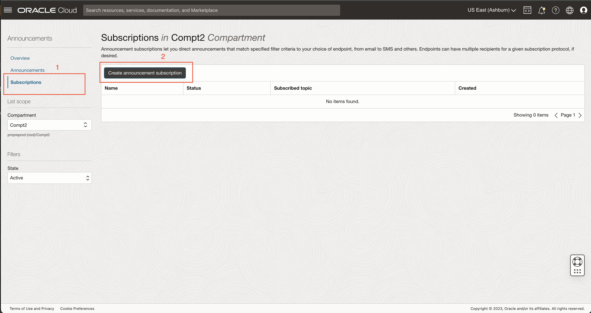
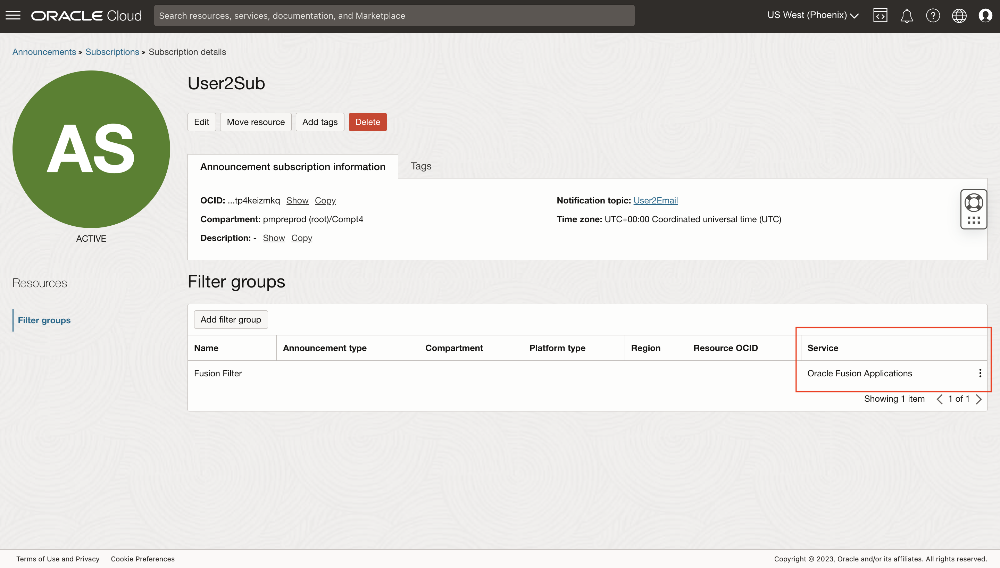
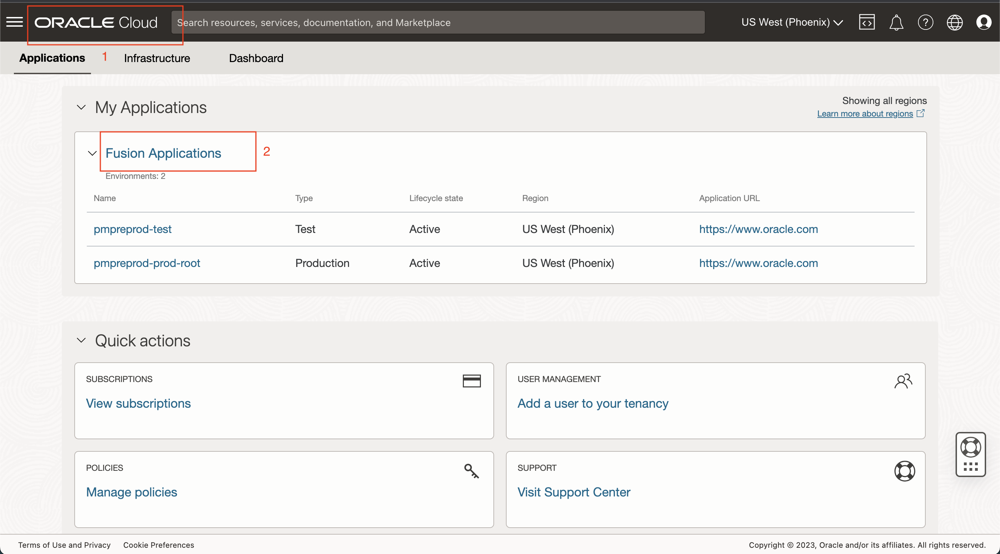
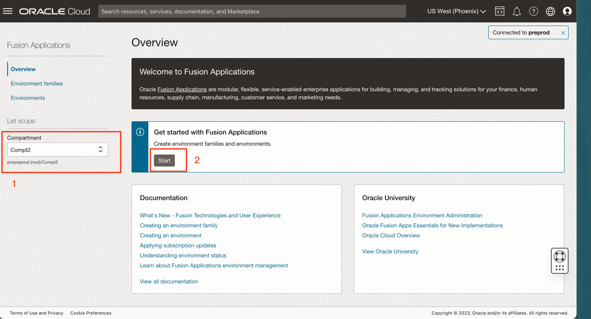
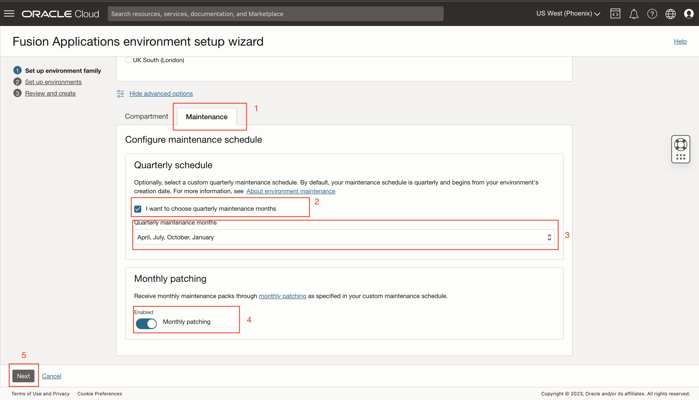
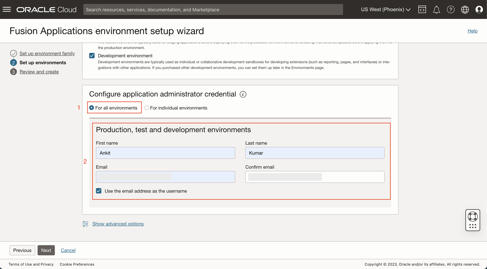
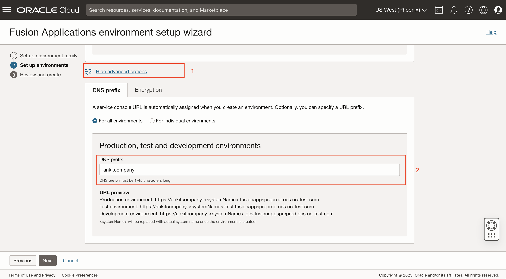
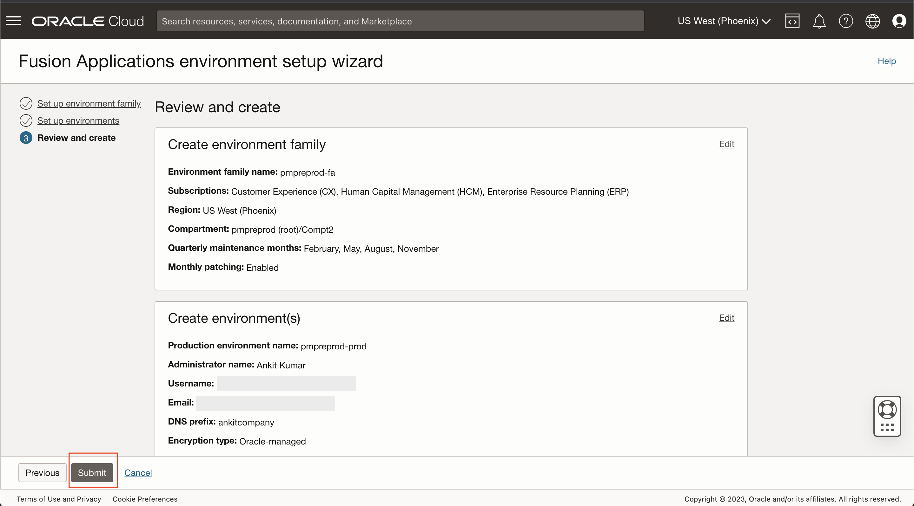
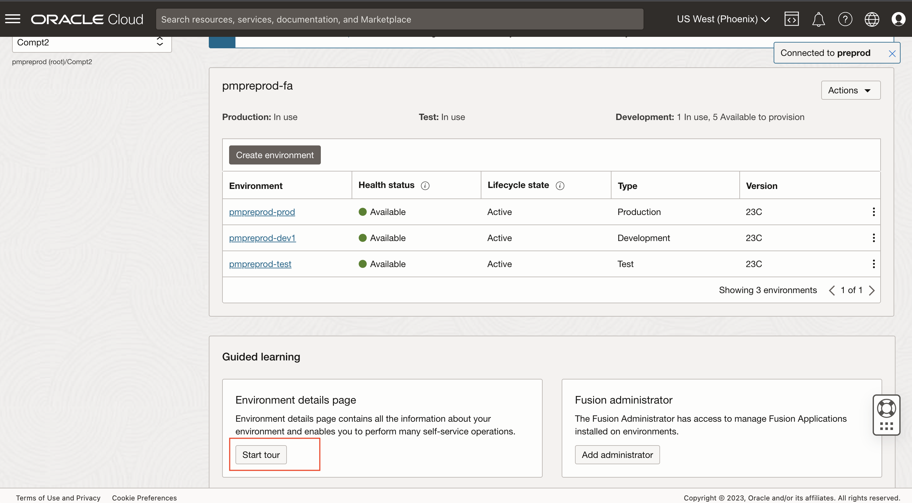

# Provision Fusion Environments

## Introduction
Set up your user account, by subscribing to announcements.

Use the wizard and provision fusion environments. review the details of the environment that was just created. **Note**: This workshop is built on a special cloud account/tenancy. It will simulate the actual fusion environment provisioning, and the wizard will be able to create mock environments within minutes, instead of a few hours. The resulting simulated environments may have limitations compared to actual ones.

Explore the Fusion overview page. Explore the audit trail security functionality in the console.

### Objective
* Subscribe to notifications
* Learn to provision Fusion Applications Environments
* Review environment details
* Review Audit trail

### Prerequisites
* This lab requires completion of the Get Started section in the Contents menu on the left.

Estimated Time: 20+ minutes

## Task 1: Subscribe to Announcements
By subscribing to announcements, Oracle automatically notifies you by email to let you know about maintenance-related activities, including the dates for the next scheduled maintenance. For more info refer to the [documentation](https://docs.oracle.com/en-us/iaas/Content/fusion-applications/about-notifications.htm).

1. Click on the **Bell - Announcement Icon** on the top right-hand corner to land on the Announcements page. New or unread announcements are indicated by a little green dot on the bell icon.

  

2. On the left hand side. Change the **Compartment** from **Pmpreprod (root)** to your compartment **Compt2** in this case.

  

3. Click on the Subscription page on the left hand side and then click on the button **Create announcement subscription**

  

4. Enter a Name for the Announcement subscription.

  

5. Select option **Selected announcements only**. Enter the **Filter group name**. Under Filters section, add filter for **Type** = Service, **Value** = Oracle Fusion Applications. This step filters only Fusion-related announcements that are for the environments that will be created(or exist). 

  

6. Select your time zone. This allows the timestamps in the announcements to be shown in the specified timezone.

  

7. In the Notification Topic section, select **Create new topic**. Select the **Compartment** assigned to you. Enter the **Name** of the topic. In the Subscription section, select Subscription **Protocol** = Email,  and enter your **email address**. Click **Create**. This allows you to specify the channel where you want to deliver the announcements when they are created in the system.

  

8. Click on the Subscribed topic you just created. User2Email in this case.

  

9. It will open a new tab. Notice the State of the subscription **Pending**

  

10. Go to your email and open the email from Oracle Cloud and click on **Confirm Subscription**

  

11. It will open a new tab with the Subscription confirmed message

  

12. Go back to the Topic in the browser tab, you were on and refresh to see the Pending state change to Active. You are now subscribed to receive email announcements for the environments you are about to create.

  

13. Close the Subscription confirmed tab and Topic tab and return to the Subscriptions page as seen in step 8. Click on the Subscription Name. User2Sub in the case. Confirm that Filter group has service added.

  

## Task 2: Provision Fusion Environments
The Oracle Cloud Console provides self-service management of the environments where you provision, run, and maintain your Fusion Applications.

When you subscribe to Fusion Applications, you are allotted one production environment, one test environment, and you have the option of purchasing development environments. Before you provision these environments, you set up an environment family. The environment family ensures that the applications on all your environments are maintained, upgraded, and patched at the same levels.

When you create an environment you can configure some options specifically for each environment in the family, including some maintenance schedule options, language packs, and network access control rules. After you create an environment, you can fully manage the lifecycle of the environment, including:
View metrics and availability
- Get detailed information about upcoming scheduled maintenance
- Monitor maintenance in progress
- Manage other services that are integrated with your Fusion Applications environment
- Refresh test and development environments
- Edit options such as language packs, network access control rules, and some maintenance schedule settings

For more info refer to the [documentation](https://docs.oracle.com/en-us/iaas/Content/fusion-applications/overview.htm).

1. Go back to the Application homepage by clicking the **Oracle Cloud** icon on the top left-hand corner.
2. Click on **Fusion Applications** link from the Applications to go to the Fusion Applications Overview page.

  

3. Change the **Compartment** selection on the Fusion Overview page. **Note**: The workshop user is set up by the Tenancy/Cloud Account administrator as Fusion Administrator and has permission to create fusion resources in the specified compartment only. Compartment information will be delivered to individual workshop users in the lab.
4. Open the Fusion Provisioning wizard by clicking **Start** in the banner - get started with Fusion Applications.

  

5. Step 1 : The first step of the wizard will setup the Fusion environment family.
    - Environment Family is a group for environments and is set up to facilitate the management of the related environments that share the same subscription. It also ensures that the applications on all your environments are maintained, upgraded, and patched at the same levels. You set up an environment family before you provision your environments.  Environment family is prefilled to the tenancy name. Choose the subscriptions as per the diagram below. You can select and add all 3 fusion pillar subscriptions to the family. CX = 111111111, ERP = FACP\_TEST\_DM_BG\_FEATURES, and HCM = 666666666. 
      
      
    
    - Explore the individual subscriptions by clicking on the down arrow/Chevrons to see the Individual service products and quantity. Notice the ERP subscription has Data Masking, Database Vault, Breakglass, and ATEs added.
      
      
    
    - Notice the region section. Based on the products, the region availability is displayed. make sure US West(Phoenix) home region is selected for the workshop. Customers can choose any region they like based on where their users are located and data sovereignty requirements. 
    - Click on the **Show advanced options** to make sure the right compartment is selected.
    
      
    
    - Click on the **Maintenance** tab in the advanced options and notice the Quarterly schedule and Monthly patching. Oracle releases new features and major enhancements four times a year and applies them in the quarterly update. These updates are mandatory for all customers and are applied to your environments as per the quarterly maintenance months. The quarterly schedule setting at the family is inherited by all the environments in the family. Monthly patching is an optional offering that you can choose. When you select monthly patching, your environments receive bug fixes every month. Enabling it at the family level will enable it for all environments in the family. You can modify this setting at a later point in time as well for individual environments or for all the family level.
    - Click on "I want to choose quarterly maintenance months" to select the quarterly schedule. Make sure **April, July, October, January** cohort is selected.
    - Enable the monthly patching as shown.
    - Click **Next** to go to the 2nd step of the wizard to set up environments.
    
      

6. Step 2: Setup environments 
    - The wizard lets you create 3 environments. Notice the Environment name field is pre-filled with the cloud account name. The prod, test, and dev environments will have -prod. -test, -dev appended to it automatically when they are created. 
    
      
    
    - Enter your application administrator credentials. Customers have a choice to enter different admins for each environment. We will enter one admin for all in the workshop. **Note**: Since this workshop is built on a special cloud account/tenancy, It is a simulation of the actual fusion environment provisioning, and the wizard will be able to create mock environments within minutes, instead of a few hours. You will also not be able to set up a password for the admin and cannot log in to the fusion application. We have another lab. where we will test it on an active Fusion Application.
    
      
    
    - Click on the **Show advanced options** and enter a DNS prefix. The preview will append the fusion application urls with the provided text. Users can setup different DNS for the individual environments.
    
      
    
    - Click on the **Encryption** tab in the advanced options and select any environment. Notice the wizard allows you to change the default Oracle-managed key to the Customer-managed key option since the subscription selected for the family has the service. We will change the key in the later lab. Keep it as Oracle-managed for now and click **Next**.
7. Step 3: review the information and click **Submit**

  

8. The next screen will start creating resources. **Note**: The wizard takes the request and submits the environment creation request. Click **Close**.

  

9. After successfully completing the wizard, you will be navigated to the Fusion Overview page where you can see the Fusion resources you just created. Since this is a simulation, the environments will be available and active within a few minutes.

  

## Task 3: Review Environment Details
1. Scroll down in the Fusion Overview page to see the Guided Learning section. Click on the first tour **Start Tour** for the Environment detail page and follow the instructions. Notice some key details from the tour - Step 1: Environment information - Version indicated the current Fusion Application version installed.  Next maintenance date is the upcoming quarterly maintenance date. Health status shows the real-time status of the Fusion Application. Lifecycle state ensures that no 2 operations are performed on the environment at the same time. Users can still access the applications when some updates are occurring on the environment, even though modifications on the environment are disabled. Refer to the [documentation](https://docs.oracle.com/en-us/iaas/Content/fusion-applications/manage-environment.htm) for more information. Since this is a simulation the environments wont have any integrations. Customers get auto-provisioned pre-configured Oracle SaaS/PaaS services based on type of environment and subscriptions available, such as -Oracle Digital Assistant, VB Studio, and Integration Cloud.

  

You may now [proceed to the next lab](#next).

## Task 4: Review Audit Trail (Optional)
1. Search Audit in the search bar in the console and click on **Audit - Logging** service.

  

2. Add filters as described below and in the same sequence as below
    - Compartment = Comp2 (the compartment given to you)
    - User = User2 (your username)
    - Filter by time = past hour
    - Request action types = Post
    - Event Type = com.oraclecloud.FusionApps.CreateFusionEnvironment.begin
3. The result will show that you have created 3 environments

  

## Learn More
* See the [documentation](https://docs.oracle.com/en-us/iaas/Content/fusion-applications/overview.htm) on overview of Oracle Fusion Applications Environment Management.

## Acknowledgements
* **Author** - Ankit Kumar, Product Manager in FAaaS
* **Contributors** -  Tirthankar Nayak, Pranjal Jain, Sai Krishna Palagummi, Pratik Agrawal, Suby Thomas
* **Last Updated By/Date** - Tirthankar Nayak - August 2023
