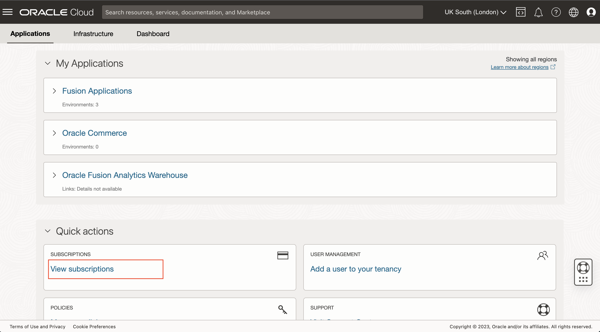
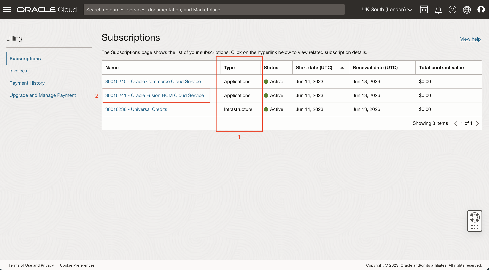
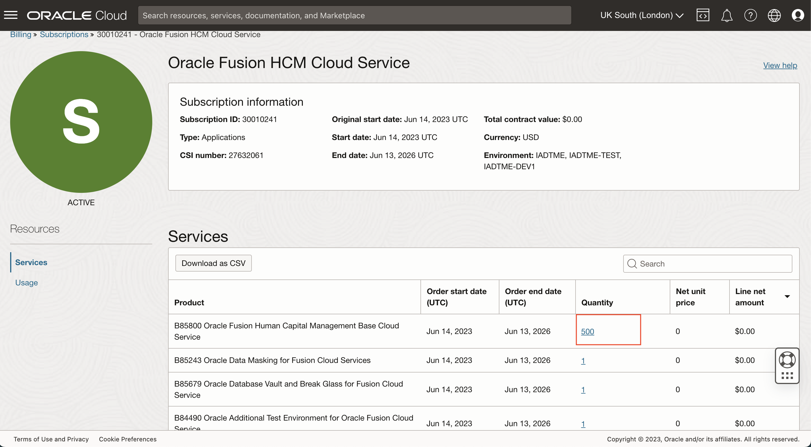
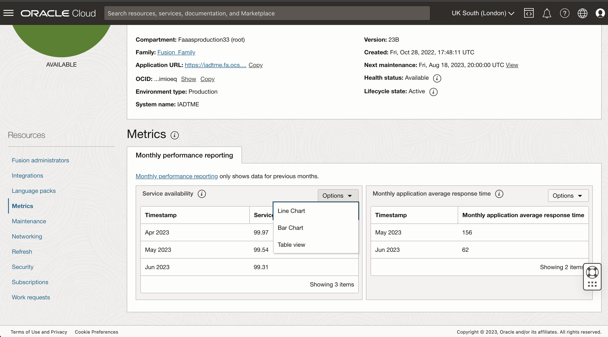
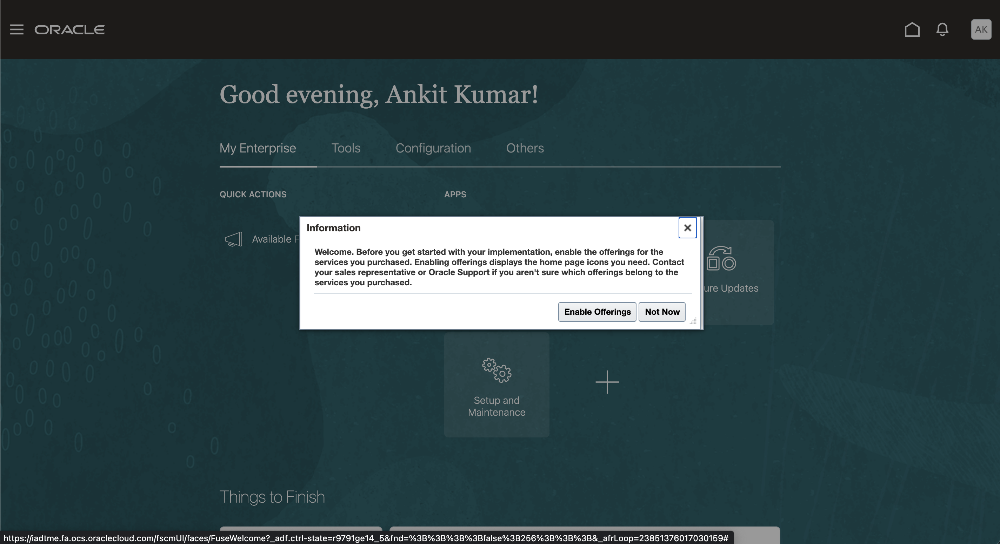
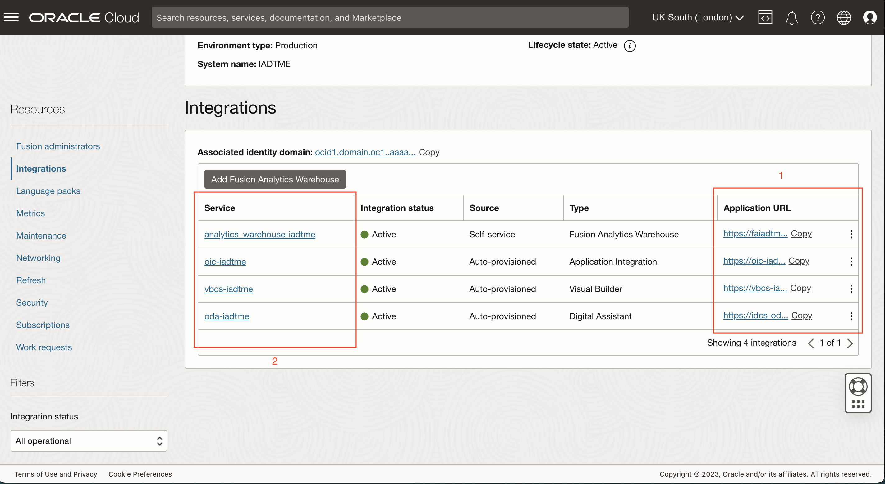
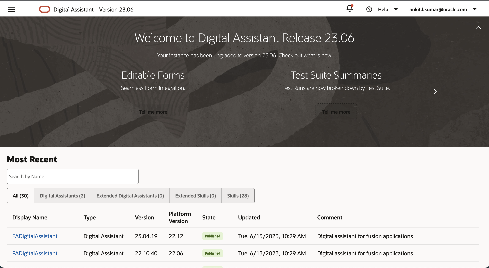
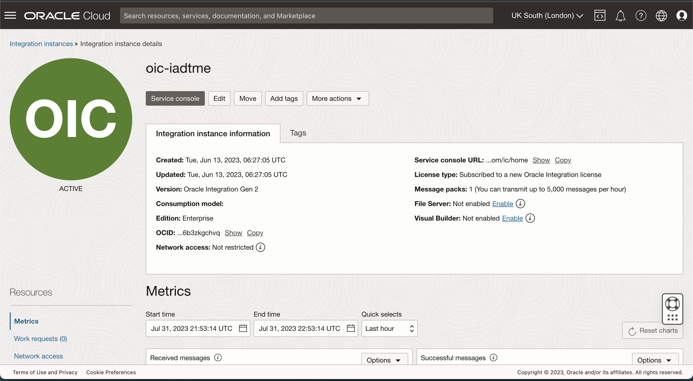
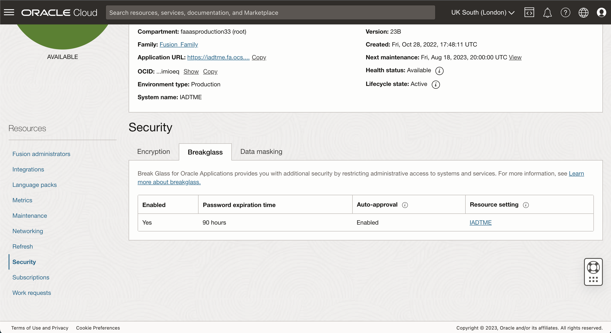

# Review Fusion Environment

## Introduction
In this lab we will log into another cloud account and look at an actual environment. We will see metrics, integration, encryption and lockbox features. We will also log into Fusion, ODA, and VBCS applications.

### Objective
* Review subscription service
* Learn about key metrics for the production environment 
* Review integrations
* Review lockbox

Estimated Time: 20+ minutes

## Get Started
1. Log out of your workshop account. Click on Sign out from the profile icon at the top right-hand corner of the screen.

2. Login to https://cloud.oracle.com Faaasproduction33 tenancy. Username/password will be provided in the lab.

## Task 1: Subscription
1. Go to the Quick Actions on the Applications homepage and click on View subscriptions

2. Notice the subscriptions in the account. Type tells you if it is an Application or Infrastructure service.

3. Click on Fusion subscription and notice the Service Products in it

4. Click on 1st product quantity for HCM Base product 500 and see more details on the product.

## Task 2: Metrics
Monthly performance metrics for a specific month are displayed after the end of the calendar month. After the end of the month, calculations are run to determine the overall performance for the month. There are 2 charts available - 
- Monthly Service Availability - % of application availability that is caused by unplanned downtime
- Monthly application average response time - average page responses by the server in milliseconds

For more info please refer to the [documentation](https://docs.oracle.com/en-us/iaas/Content/fusion-applications/metrics.htm).

1. Go back to the **Applications** homepage by clicking on **ORACLE Cloud** and then click on the **Fusion-prod** Production environment.

2. Go to Metrics section of Resources for the environment

3. Hover over the bars to see. the exact value for each month. Additionally, you can change the chart type by clicking on Options and changing from Bar to Table view

## Task 3: Integrations
You can discover and manage the services that are integrated with your Fusion Applications environments.

When you provision an environment, additional services are provisioned and integrated with your Fusion Applications. These services extend the functionality of your applications. The set of additional services that are provisioned varies depending on the subscriptions (or SKUs) you purchased and the type of environment (production or non-production). The Integrations feature of environment management lets you discover and manage these additional services from a single interface.

After your environment is provisioned, you can add integration with Fusion Analytics Warehouse, if you have purchased the subscription.

The 4 integrations we will be testing are:
1. Fusion Analytics Warehouse - Configurable data warehouse with pre-built reports for Fusion Applications
2. Application Integration - used to automate processes and integrations for public sector use cases
3. Visual Builder - used for building new applications and extending Fusion Applications
4. Digital Assistant - chat bot with pre-installed and configured skills such as intelligent document recognition for expenses and invoices

For more info please refer to the [documentation](https://docs.oracle.com/en-us/iaas/Content/fusion-applications/manage-integrations.htm).

1. Login to Fusion Application for the production environment, by clicking on **View Application** or **Application URL**. Username/password will be provided in the lab.

2. Go to **Integrations** resources for the production fusion environment and click on the **Application URL** for all 4 services - Fusion Analytics Warehouse, Application Integration, Visual Builder, and Digital Assistant. The 4 Integration Applications will open in new tabs. Notice that you are able to login to all integrations with Single Sign on from Fusion Application Identity.

3. Return to the Fusion - Integrations Resource page and click on the Service URLs. Open all 4 of them in new tabs. Similar to Fusion environment detail pages you can view the respective integration resource detail pages.

## Task 4: Lockbox
In case when Oracle-authorized personnel needs to access resources to troubleshoot or help resolve an issue with your applications environment. Break Glass provides you with the ability to temporarily grant access to Oracle Support using a securely administered workflow.

Key features of Break Glass with Oracle Managed Access include:
- Provides the operator temporary user credentials for a specific duration.
- Specifies the access level for the representative.
- Creates logs of all actions, providing an audit trail.

For more info please refer to [documentation](https://docs.oracle.com/en-us/iaas/Content/fusion-applications/manage-security-break-glass.htm).

1. Go to **Security** resource and click on **Breakglass**

2. Notice the lockbox details -
    - Auto-approval is enabled. 
    - Password expiration time = 90 minutes. Each time an access request is granted, the password is valid for 90 hours.
3. Users can view and modify the lockbox settings. Click on the **Resource setting** link.

4. Users can modify the access duration and customize approval templates. Click on **Edit** and then **Cancel**

## Acknowledgements
* **Author** - <Name, Title, Group>
* **Contributors** -  <Name, Group> -- optional
* **Last Updated By/Date** - <Name, Month Year>
