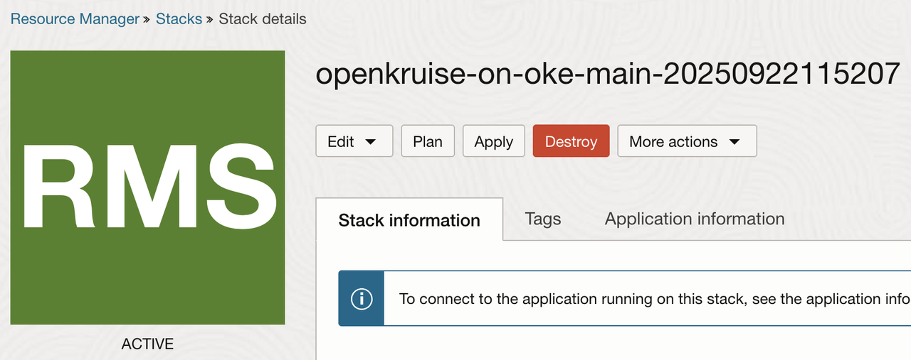

# Clenaup

## Introduction

Once the workshop is complete, you should remove the resources to avoid unnecessary costs.

Estimated Time: 30 minutes

### **Objectives**

Delete workloads, Falco, and OKE cluster resources.

### **Prerequisites**

This lab assumes you have:

* An Oracle Cloud account.
* Administrator privileges or sufficient access rights to create and manage OKE resources.
* Basic understanding of Kubernetes concepts (pods, Helm charts, namespaces).

## Task 1: Cleanup the resoruces

1. In order to cleanup the resources, simply go to Resource Manager in the OCI Web Console and select **Destroy**. This will destroy all of the provisioned resources.

2. Wait for the job to finish and then from **More Actions** menu select **Delete Stack**

End of LiveLab – You have successfully deployed Falcoon OKE and tested a few of its use cases!

## Acknowledgements

**Authors**

* **Adina Nicolescu**, Principal Cloud Architect, NACIE
* Last Updated - Adina Nicolescu, November 2025
