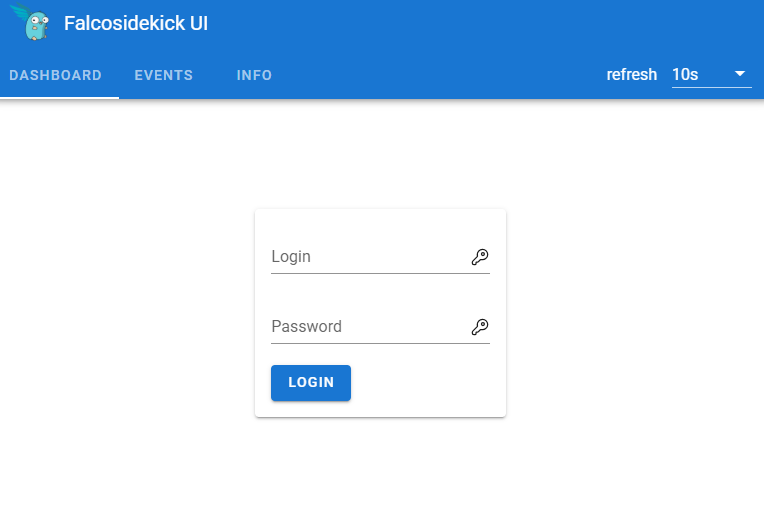
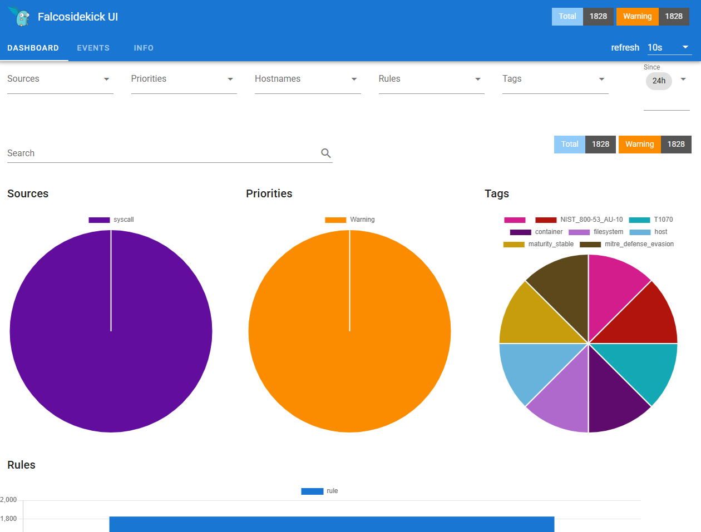
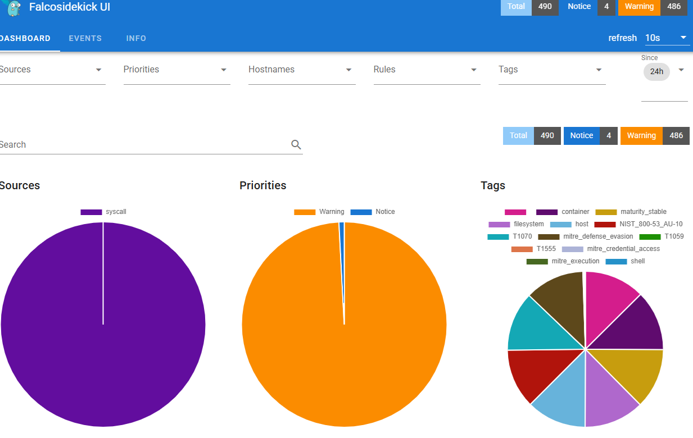
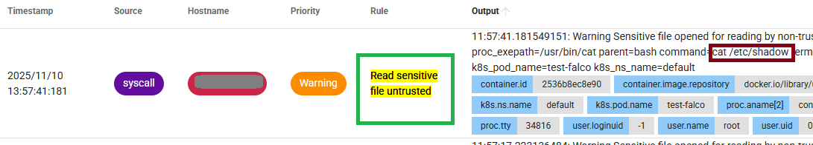
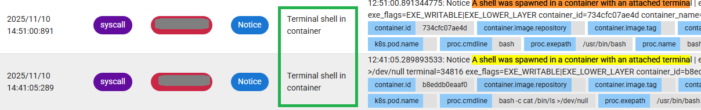
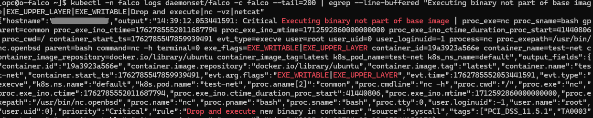
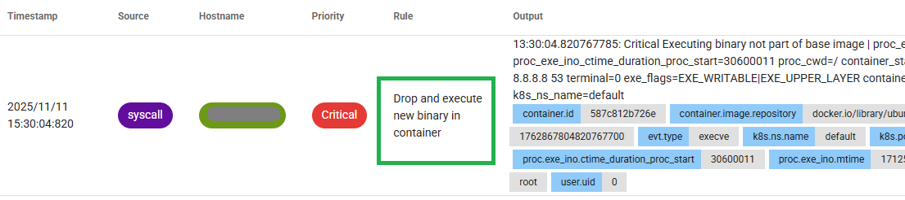
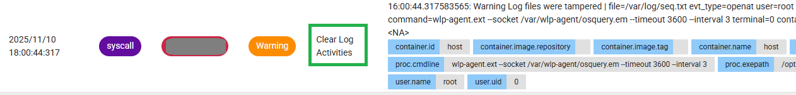
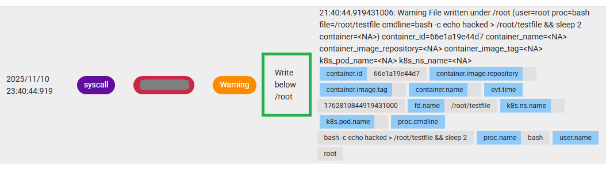

# Explore Falco use cases 

## Introduction

In this chapter, we will explore several real-world scenarios that demonstrate how Falco detects and reports suspicious activity in a Kubernetes environment.

Estimated Time: 30 minutes

### **Objectives**

Hands-on experience with:

- Detecting suspicious runtime behaviors using Falco  
- Forwarding and visualizing events with Falcosidekick and its Web UI  
- Running test scenarios to trigger Falco security alerts

### **Prerequisites**

* An Oracle Cloud account.
* Administrator privileges or sufficient access rights to create and manage OKE resources.
* Basic understanding of Kubernetes concepts (pods, Helm charts, namespaces).
* Access to a command-line environment such as **OCI Cloud Shell** (or a local setup) with:
  - `kubectl`
  - `helm`
  - `oci cli` configured for your tenancy.

## Task 1 — Identify access IPs and connect to the Falco Operator via Bastion

1. Once the Resource Manager job finishes running, go to the *Outputs* section, observe the *bastion* public IP and the *operator* private IP, and copy the `ssh_to_operator` value. 

    

2. Run it in your terminal in order to be connected to the operator.

**Note on Terminals**

 During this lab, you will use multiple terminal sessions:

   - **Terminal A – Falco raw events:** Shows Falco’s detections directly from the kernel-level sensor.  
   - **Terminal B – Sidekick forwarded events:** Displays Falcosidekick logs as events are relayed to the Web UI.  
   - **Terminal C – UI port forwarding:** Keeps the `kubectl port-forward` process running so the Falcosidekick-UI remains accessible in your browser.  
   - **Terminal D – Operator / main control terminal:** Used for running commands, triggering detections, and managing Falco.

Keep **A**, **B**, and **C** open to monitor activity and maintain the tunnel, but perform all operational steps in **Terminal D**.


## Task 2 - Identify Falco pods and services

1. **Get Falco related resources:**

    ```<copy>
    kubectl get pods -n falco
    ```

    You should see a structure similar to this:

    ```
    pod/falco-...                              2/2   Running
    pod/falco-falcosidekick-...                1/1   Running
    pod/falco-falcosidekick-...                1/1   Running
    pod/falco-falcosidekick-ui-...             1/1   Running
    pod/falco-falcosidekick-ui-...             1/1   Running
    pod/falco-falcosidekick-ui-redis-0         1/1   Running
    ```

    **Interpretation**:

* Falco DaemonSet:
  * `falco-...` → main sensor pod running 2 containers (`falco` + `driver-loader`).
  * Responsible for kernel-level event detection and rule evaluation.
* Sidekick (receiver):
  * 2 pods: `falco-falcosidekick-....`
  * Forwards Falco alerts to external outputs (e.g., Web UI, Slack, Loki, etc.).
  * Exposed internally on port **2801–2802**.
* Falcosidekick-UI (visual interface):
  * 2 pods: `falco-falcosidekick-ui-....`
  * Provides a web-based dashboard to visualize Falco alerts in real time.
  * Connects to Falcosidekick and Redis for event storage and filtering.
  * Exposed through the service `falco-falcosidekick-ui` on port **2802**.
* Redis (backend cache for UI):
  * StatefulSet pod `falco-falcosidekick-ui-redis-0`.
  * Stores recent Falco events for quick retrieval by the UI.

  These components work together: Falco captures events → Sidekick forwards alerts → Redis stores them → the UI displays them.

1. **The logging resources**
  
  * Tail Falco and Sidekick logs (on the operator). You’ll use:
     * Pod falco-... for raw Falco logs.
     * Deployment falco-falcosidekick for event forwarding logs.
     * Deployment falco-falcosidekick-ui for UI logs.

  * Before triggering any rules, open two terminal windows on the operator.

    **Terminal A** - Falco raw events - shows Falco’s kernel-level detections in real time.

    ```
    kubectl -n falco logs pod/falco-... -c falco
    ```

    **Terminal B** - Sidekick forwarding events - shows events after they are forwarded to Falcosidekick-UI.

    ```
    kubectl -n falco logs deploy/falco-falcosidekick
    kubectl -n falco logs -f -l app.kubernetes.io/name=falcosidekick
    ```
    
    Sample output:
    ```
    [opc@o-falco ~]$ kubectl -n falco logs -f deploy/falco-falcosidekick
    Found 2 pods, using pod/falco-falcosidekick-54dc9b5f47-n7gx9
    2025/11/11 08:58:36 [INFO]  : Falcosidekick version: 2.32.0
    2025/11/11 08:58:36 [INFO]  : Enabled Outputs: [WebUI]
    2025/11/11 08:58:36 [INFO]  : Falcosidekick is up and listening on :2801
    ```


## Task 3 — Access the Falcosidekick UI

You’ll need an extra terminal session in order to access the UI from your local browser.

1. **Terminal C - your local machine** - forward the UI port through the bastion and operator. Replace the IPs below with the ones from your *Resource Manager Output*:

    ```
    ssh -L 2802:localhost:2802 -o ProxyCommand="ssh -W %h:%p opc@<bastion_public_ip>" opc@<operator_private_ip>
    ```
2. Run on the operator in the same terminal:

    ```
    kubectl -n falco port-forward svc/falco-falcosidekick-ui 2802:2802
    ```

    You should see this output which shows that the port-forwarding tunnel is active and traffic from your local machine’s port **2802** is securely forwarded to the **Falcosidekick-UI** service running inside the cluster.

    ```
    [opc@o-falco ~]$ kubectl -n falco port-forward svc/falco-falcosidekick-ui 2802:2802
    Forwarding from 127.0.0.1:2802 -> 2802
    Forwarding from [::1]:2802 -> 2802
    ```
    **Note:**: Leave this terminal running because the port-forward command must remain active. Open a new one (Terminal D) for the next steps.

3. **Open the UI** on your local browser:

    ```
    http://127.0.0.1:2802
    ```

    You should be able to see the Falcosidekick UI login page.

    

5. Use the following credentials for login: 

    ```
    admin/admin
    ```

    You are now inside the Falcosidekick UI:

    

    Also check the output of the port-forward command in **Terminal C**, which shows that connections are being established successfully between your local machine and the Falcosidekick-UI service.

    ```
    [opc@o-falco ~]$ kubectl -n falco port-forward svc/falco-falcosidekick-ui 2802:2802
    Forwarding from 127.0.0.1:2802 -> 2802
    Forwarding from [::1]:2802 -> 2802
    Handling connection for 2802
    Handling connection for 2802
    Handling connection for 2802
    Handling connection for 2802
    Handling connection for 2802
    Handling connection for 2802
    Handling connection for 2802
    Handling connection for 2802
    Handling connection for 2802
    ```


## Task 4: Validate Falco Detection Rules

Now that Falco and the UI are running, let’s generate security events and watch them propagate through each component. 
You’ll now generate real-time Falco alerts to verify that Falco, Sidekick, and the Web UI work together correctly. 

Perform each test in the fourth new **Terminal D**, connected to the operator, while keeping Terminals A, B, C and the browser UI open.

Each test should generate an alert visible in:

* Falco logs (Terminal A)
* Sidekick logs (Terminal B)
* Falcosidekick-UI at http://127.0.0.1:2802 → *Events* tab.

**Test 1 - Read sensitive file (`/etc/shadow`)**

  * **Purpose**: Validate Falco detects non-trusted programs reading sensitive credential files (credential access detection).

  * **Command**:
      ```
      kubectl run -i --tty --rm test-falco --image=ubuntu -- bash -c 'cat /etc/shadow >/dev/null' || true
      ```

  * **Expected result**:
      - Terminal A (Falco): Check for a log entry containing `Read Sensitive file untrusted`, or just run:
      ```
      kubectl -n falco logs -f pod/falco-... -n falco | grep untrusted
      kubectl -n falco logs ds/falco -c falco --tail=200 | egrep "Read sensitive file|/etc/shadow|Sensitive file opened"
      ```
      - Terminal B (Sidekick): Forwarded event including /bin/evil.sh.
      - Falcosidekick UI: Check the Dashboard and see that a *Notice* appeared under **Priorities** pie chart.

        

      - Check the **Events** tab, filter by **Rule** 'Read sesitive file untrusted'.

        


**Test 2 - Terminal shell in container**

  * **Purpose**: Validate Falco detects when a user spawns an interactive shell inside a container (execution detection).. 

  * **Command**: 
      ```
      kubectl run -i --tty --rm test-shell --image=ubuntu -- bash
      ```    
  * **Expected result**:
    - Terminal A (Falco): Check for a log entry containing `A shell was spawned in a container with an attached terminal`:
      ```
      kubectl -n falco logs ds/falco -c falco --tail=200 | egrep "shell was spawned"
      ```

      Output would look like this:
      ```
      {"hostname":"...","output":"12:51:00.891344775: Notice A shell was spawned in a container with an attached terminal | evt_type=execve user=root user_uid=0 user_loginuid=-1 process=bash proc_exepath=/usr/bin/bash parent=conmon command=bash terminal=34816 exe_flags=EXE_WRITABLE|EXE_LOWER_LAYER container_id=734cfc07ae4d container_name=<NA> container_image_repository=<NA> container_image_tag=<NA> k8s_pod_name=<NA> k8s_ns_name=<NA>","output_fields":{"container.id":"734cfc07ae4d","container.image.repository":null,"container.image.tag":null,"container.name":null,"evt.arg.flags":"EXE_WRITABLE|EXE_LOWER_LAYER","evt.time":1762779060891344775,"evt.type":"execve","k8s.ns.name":null,"k8s.pod.name":null,"proc.cmdline":"bash","proc.exepath":"/usr/bin/bash","proc.name":"bash","proc.pname":"conmon","proc.tty":34816,"user.loginuid":-1,"user.name":"root","user.uid":0},"priority":"Notice","rule":"Terminal shell in container","source":"syscall","tags":["T1059","container","maturity_stable","mitre_execution","shell"],"time":"2025-11-10T12:51:00.891344775Z"}
      ```
    - Falcosidekick UI: Check the Events tab for entries with the same rule:
      


**Test 3 - Drop and execute new binary in container**

  * **Purpose**: Validate that Falco detects when a container installs or executes a binary that was not part of its original image — a common indicator of runtime compromise or persistence.

  * **Command**:
      ```
      kubectl run --restart=Never test-net --image=ubuntu -- bash -c \
      'apt-get update >/dev/null && apt-get install -y netcat-openbsd >/dev/null || true; nc -vz 8.8.8.8 53 || true'
      ```

  * **Expected result**:
  - Falco (Terminal A):
    ```
    kubectl -n falco logs ds/falco -c falco --tail=200 | egrep "Drop and execute new binary in container"
    kubectl -n falco logs daemonset/falco -c falco --tail=200 | egrep "Executing binary not part|EXE_UPPER_LAYER|nc.openbsd"
    ```
    
    - A Critical alert with rule “Drop and execute new binary in container” or “Executing binary not part of base image”.
    - Log fields include:
      ```
      exe_flags=EXE_WRITABLE|EXE_UPPER_LAYER
      proc.exepath=/usr/bin/nc.openbsd
      container_name=test-net
      command=nc -vz 8.8.8.8 53
      ```

  - Falcosidekick UI
    
    


**Test 4 - Clear Log Activities (truncate / tamper log files)**

  **Purpose** - Detect attempts to tamper with or truncate log files (attacker trying to remove forensic evidence). This validates Falco’s detection of suspicious file truncation/unlink operations and the `Clear Log Activities` rule.

  **Command** 
  ```
  kubectl run --restart=Never test-clear --image=ubuntu -- bash -c 'bash -c ">/var/log/auth.log" || true'
  ```

  **Expected result**:
  - Confirm pod completed/where it ran:
    ```
    kubectl get pod test-clear -o wide
    ```
  - Falco (Terminal A):
    ```
    kubectl -n falco logs daemonset/falco -c falco --tail=200 | egrep "Clear Log Activities|Log files were tampered|truncate|unlink|/var/log/auth.log"
    ```
  - Falcosidekick UI 
  
    

## Task 5: Explore Falco Rules and Add Custom Ones

Falco detects suspicious activity by evaluating rules written in YAML.
These rules live inside the Falco container and describe system call patterns that indicate specific behaviors — for example, file access, process execution, or network activity.

1. **View where Falco rules are stored**

    Each Falco pod loads rules from YAML files under `/etc/falco/`.

    You can confirm the paths and included files with:

    ```
    kubectl -n falco exec -it \
    $(kubectl -n falco get pods -l app.kubernetes.io/name=falco -o jsonpath='{.items[0].metadata.name}') \
    -c falco -- grep -A4 "rules_files" /etc/falco/falco.yaml
    ```

    The output will give you something like:
    
      ```
      rules_files:
      - /etc/falco/falco_rules.yaml
      - /etc/falco/falco_rules.local.yaml
      - /etc/falco/rules.d
      ```

2. **List currently active(loaded) rules:**

      ```
      kubectl -n falco exec -it \
      $(kubectl -n falco get pods -l app.kubernetes.io/name=falco -o jsonpath='{.items[0].metadata.name}') \
      -c falco -- grep "^-" /etc/falco/falco_rules.yaml | head -n 20
      ```

3. **Add a custom rule** - create a rule that detects file writes under `/root`:

      ```
      cat > falco_rules.local.yaml <<EOF
      - rule: Write below /root
        desc: Detect any process writing a file under /root
        condition: evt.type in (open,openat) and evt.arg.flags contains O_WRONLY and fd.name startswith "/root/"
        output: "File written under /root (user=%user.name proc=%proc.name file=%fd.name cmdline=%proc.cmdline container=%container.name)"
        priority: WARNING
        tags: [filesystem,container]
      EOF
      ```

      **Note**: You can use any writable path (e.g., /etc, /tmp) to test different detection scopes.

4. **Create a ConfigMap** in order to have the rule persistently stored even through DaemonSet restarts:

      ```
      kubectl -n falco create configmap falco-custom-rules \
      --from-file=falco_rules.local.yaml -o yaml --dry-run=client | kubectl apply -f -
      ```

5. **Patch Falco** to load the ConfigMap:
      ```
      kubectl -n falco patch daemonset falco \
    --type='json' \
    -p='[
      {"op":"add","path":"/spec/template/spec/containers/0/volumeMounts/-","value":{"name":"falco-custom-rules","mountPath":"/etc/falco/falco_rules.local.yaml","subPath":"falco_rules.local.yaml"}},
      {"op":"add","path":"/spec/template/spec/volumes/-","value":{"name":"falco-custom-rules","configMap":{"name":"falco-custom-rules"}}}
    ]'
    ```

6. **Restart Falco and verify the rule**

      ```
      # restart Falco
      kubectl -n falco rollout restart daemonset falco

      # watch until the DaemonSet is ready
      kubectl -n falco get ds -w

      # verify the rule
      kubectl -n falco logs daemonset/falco -c falco --tail=100 | grep "falco_rules.local.yaml"
      ```

      Expected output:
      ```
      /etc/falco/falco_rules.local.yaml | schema validation: ok
      ```

      To confirm the file contents:
      ```
      kubectl -n falco exec -it \
      $(kubectl -n falco get pods -l app.kubernetes.io/name=falco -o jsonpath='{.items[0].metadata.name}') \
      -c falco -- cat /etc/falco/falco_rules.local.yaml
      ```

7. **Trigger the rule:**

      ```
      kubectl delete pod root-writer --ignore-not-found
      kubectl run --restart=Never root-writer --image=ubuntu -- \
      bash -c 'echo hacked > /root/testfile && sleep 2'
      ```

8. **Check the detection**:

      ```
      kubectl -n falco logs daemonset/falco -c falco --tail=200 | grep "File written under /root"
      ```

      Expected output:
      ```
      Warning File written under /root (user=root proc=bash file=/root/testfile ...)
      ```

      Also visible in Falcosidekick UI:

      

You may now **proceed to the next lab**.

## Acknowledgements

**Authors**

* **Adina Nicolescu**, Principal Cloud Architect, NACIE
* Last Updated - Adina Nicolescu, November 2025
