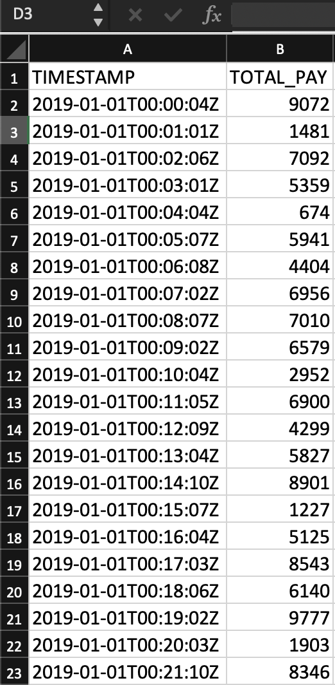
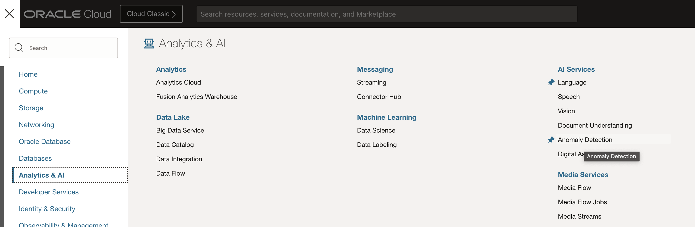
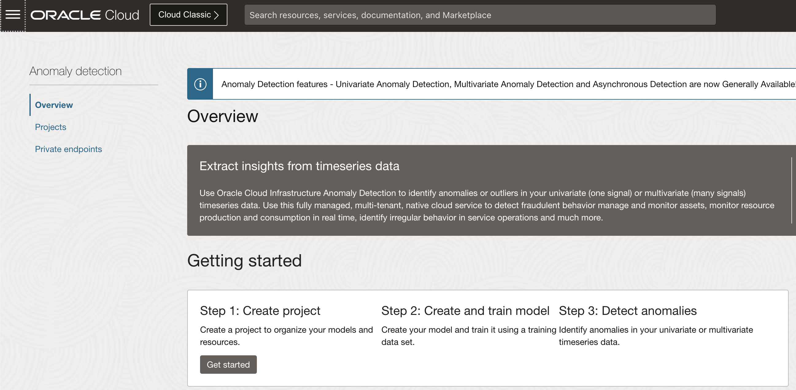
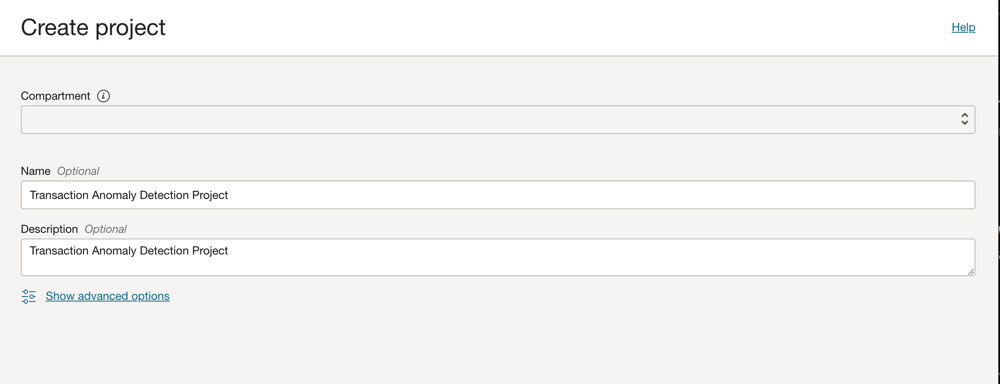
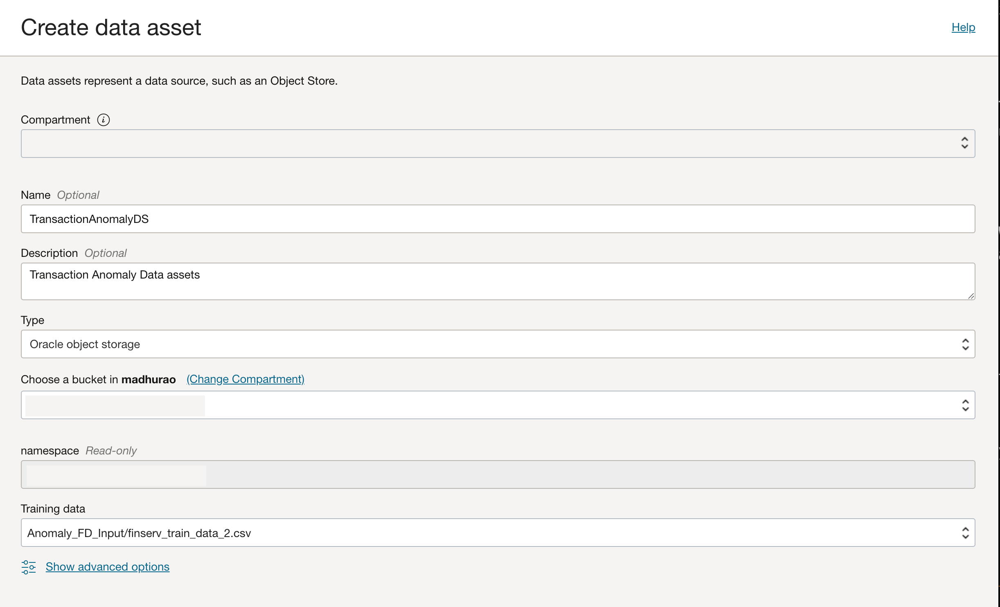
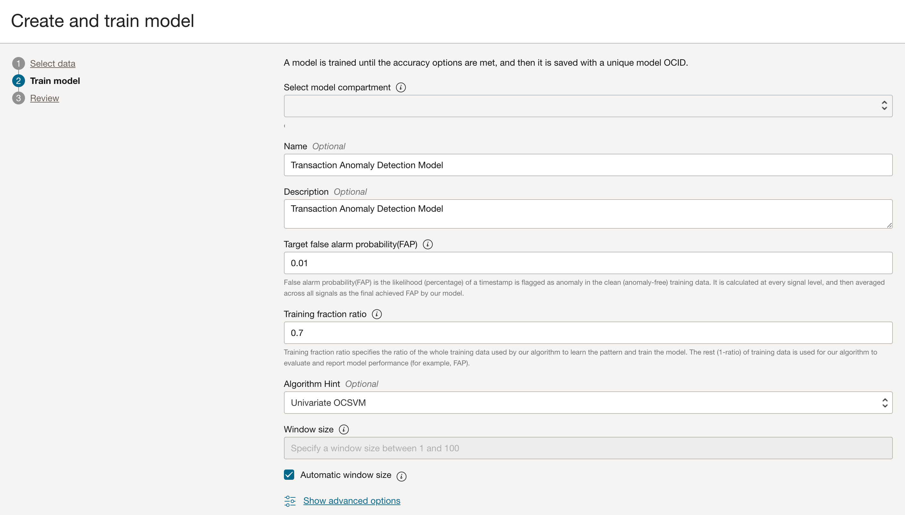
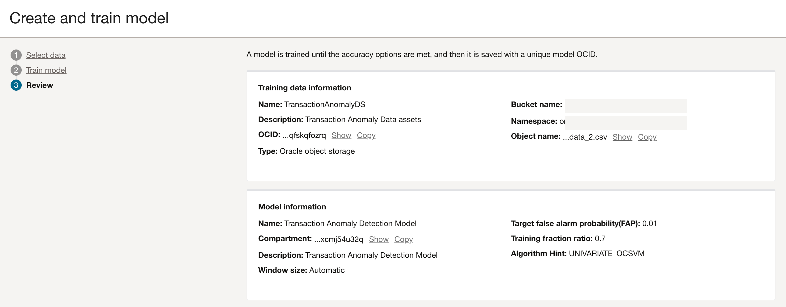
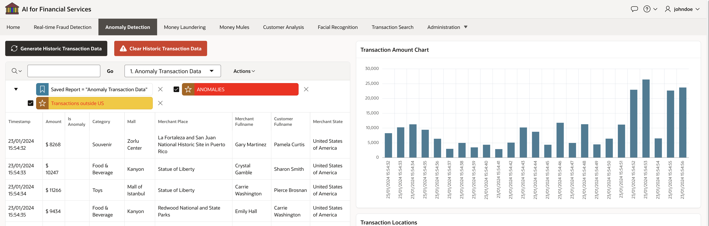
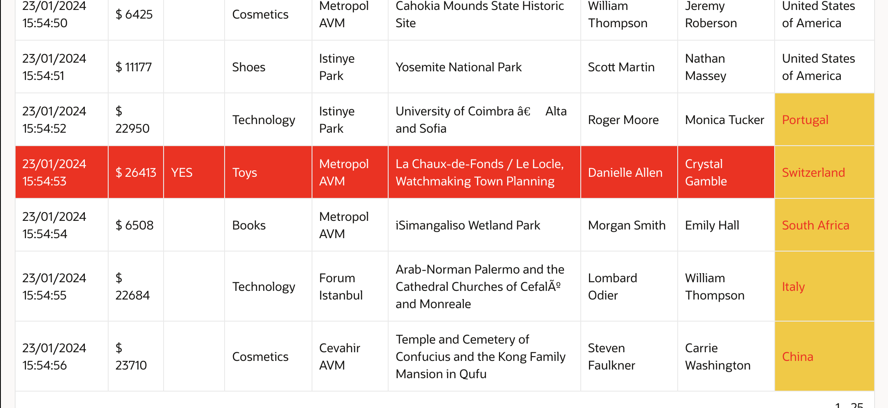

# Detect Transaction Anomalies

## Introduction

In this Lab, we will learn how to detect anomalies using the Anomaly detection AI service. 

Estimated Time: 30 minutes.  
 
### Objectives

In this lab, you will:
 
* Create and Train the Anomaly Detection Transaction Model
* Run Oracle APEX Application for Anomaly Detection 

### Prerequisites

This lab assumes you have:

* You have Completed **Get Started** and have required access to Create OCI Anomaly Detection Models and OCI Object storage
   
### About OCI Anomaly Detection

[**OCI Anomaly Detection**](https://www.oracle.com/in/artificial-intelligence/anomaly-detection/) is an AI service that provides real-time and batch anomaly detection for univariate and multivariate time series data. Through a simple user interface, organizations can create and train models to detect anomalies and identify unusual behavior, changes in trends, outliers, and more. 
  
## Task 1: Create and Train the Anomaly Detection Transaction Model
 
1. You can programmatically generate time series data containing transaction timestamps and transaction values for regular transactions without fraud. You can also download one such sample file from here. This CSV file will have two column headers, TIMESTAMP and TOTAL_PAY, as shown below.  
      
2. Login to cloud.oracle.com, under left navigation select **Analytics & AI** and under **AI Service** select **Anomaly Detection** 
    
3. Click on **Projects** tab in the left navigation and **Create** a project
      
4. Create Project
    
5. Create Dataset, select **Object storage** and select the path to folder where model training .csv file is stored. 
6. It is assumed that you have access to create OCI Bucket and Upload Objects to OCI Bucket, if not please verify previous labs in this workshop. From the top left navigation of cloud.oracle.com under **Storage** services select **Buckets** 
    
7. Create and train model
    
8. Review settings and finish.
    
      
## Task 2: Run Oracle APEX Application for Anomaly Detection

You can view the latest transaction data; those records (or transactions) detected as abnormal by the Anomalous Detection AI service will be marked in a red-coloured row. With the database table flag Is Anomalous = Yes

1. Access OCI Object storage Bucket and Upload CSV file. 

    
     

2. The following code is places in the process PL/SQL code block of APEX page, 

    ```sql
    <copy>
        declare  
        GC_WC_CREDENTIAL_ID        CONSTANT VARCHAR2(50)   := '<Your-Web-Credentials>';  
        GC_OCI_DOC_AI_URL          CONSTANT VARCHAR2(500)  
        := 'https://anomalydetection.aiservice.us-phoenix-1.oci.oraclecloud.com/20210101/detectAnomalyJobs'; 
        BASE_URL CONSTANT VARCHAR2(500) 
        := 'https://anomalydetection.aiservice.us-phoenix-1.oci.oraclecloud.com/20210101';
        compartmentId CONSTANT VARCHAR2(500) := '<Your-Compartment-Id>';
        projectId CONSTANT VARCHAR2(500) := '<Your-Project-Id>';
        AI_URL CONSTANT VARCHAR2(500) := BASE_URL||'/models?compartmentId='||compartmentId||'&projectId='||projectId||'&limit=10&sortOrder=ASC&sortBy=timeCreated';
        json_input_str3 VARCHAR2(4000) ;  
        request_payload_small_ds   varchar2(32000)   ; 
        l_request_json        VARCHAR2(32000); 
        l_response_json       CLOB; 
        v_id VARCHAR2(100);
        v_filename VARCHAR2(100);
        l_obj_name VARCHAR2(500);
        l_base_path VARCHAR2(500) 
        := 'https://objectstorage.<Your-Region>.oraclecloud.com/n/<Your-Tenancy>/b/<Your-Bucket>/o/';
        l_docjob_json_url VARCHAR2(4000) ;
        l_json                CLOB;
        v_time_diff number := 1; 
        v_tx_timestamp FD_TX_HISTORIC_DATA.TX_TIMESTAMP%TYPE;
        v_total_pay FD_TX_HISTORIC_DATA.TOTAL_PAY%TYPE;

        cursor c1 is 
        SELECT  JSON_ARRAYAGG(
                    JSON_OBJECT
                    (
                            'timestamp' VALUE TO_CHAR((  TX_TIMESTAMP  ), 'YYYY-MM-DD"T"HH24:MI:SS".000Z"' ), 
                            'values' VALUE json_array(TOTAL_PAY)   
                    ) ORDER BY TX_TIMESTAMP   )  as TX_DATA  
        FROM FD_TX_HISTORIC_DATA  ;

        cursor c2 is 
            SELECT   TX_TIMESTAMP,  TOTAL_PAY 
                FROM FD_TX_HISTORIC_DATA order by TX_TIMESTAMP ;
        
        begin   
            -- clear previous set of transactions --
            delete from FD_TX_HISTORIC_DATA;

            -- create random data inserts into FD_TX_HISTORICDATA_INSERTS table --
            FOR Lcntr IN 1..7 LOOP
                    v_total_pay := round(DBMS_Random.Value(1,12000),0);  
                    FD_TX_HISTORICDATA_INSERTS (v_time_diff, v_total_pay);
                    v_time_diff := v_time_diff + 1;
            END LOOP;

            FOR Lcntr2 IN 1..7 LOOP
                    v_total_pay := round(DBMS_Random.Value(1,55000),0);  
                    FD_TX_HISTORICDATA_INSERTS (v_time_diff, v_total_pay);
                    v_time_diff := v_time_diff + 1;
            END LOOP;
 
            For row_2 In C2 Loop
            v_tx_timestamp := row_2.TX_TIMESTAMP; 
            v_total_pay := row_2.TOTAL_PAY;  
            End Loop; 

            For row_1 In C1 Loop
            json_input_str3 := row_1.TX_DATA; 
            End Loop;

            -- request payload for Anomaly Detection AI service
            request_payload_small_ds   := '
            {
                "compartmentId": "<Your-Compartment-Id>",
                "description": "AD",
                "displayName": "AD",
                "modelId": "<Your-AnomalyDetection-ModelId>",
                "inputDetails": {
                    "inputType": "INLINE",
                        "signalNames":["TOTAL_PAY"],
                            "data":   '||json_input_str3||'
                        },
                "outputDetails": {
                    "namespaceName": "<Tenancy-Namespace>",
                    "bucketName": "<Bucket-Name>",
                    "outputType": "OBJECT_STORAGE",
                    "prefix": "AD"
                    } 
                }
            ';
        
            apex_web_service.g_request_headers.DELETE; 
            apex_web_service.g_request_headers(1).name  := 'Content-Type'; 
            apex_web_service.g_request_headers(1).value := 'application/json'; 
    
            -- Call the Document AI analyzeDocument REST Web Service. 
            l_response_json := apex_web_service.make_rest_request 
            (p_url                  => GC_OCI_DOC_AI_URL, 
            p_http_method          => 'POST', 
            p_body                 => request_payload_small_ds, 
            p_credential_static_id => GC_WC_CREDENTIAL_ID); 
            --Htp.p(l_response_json);

            apex_json.parse (l_response_json);
            v_id := apex_json.get_varchar2 ('id'); 
            l_docjob_json_url   := l_base_path||'AD/'||v_id||'/'||v_id||'-result.json';  
            INSERT INTO FD_ANM (ANOMALY_OCID, TX_TIMESTAMP, JSON_URL) 
                VALUES (v_id, current_timestamp, l_docjob_json_url);
             
        end; 
    </copy>
    ```  

3. The following procedure generates Random records for Historic transaction data.

    ```sql
    <copy>
        create or replace PROCEDURE FD_TX_HISTORICDATA_INSERTS (v_time_diff IN number, v_tot_pay IN number)
        AS  
        v_TOTAL_PAY FD_TX_HISTORIC_DATA.TOTAL_PAY%TYPE; 
        v_TX_TIMESTAMP   FD_TX_HISTORIC_DATA.TX_TIMESTAMP%TYPE;  
        BEGIN
            
            dbms_output.put_line('BEGIN GENERATING RANDOMS -------------------------------');   
            v_TOTAL_PAY := v_tot_pay;   
            v_TX_TIMESTAMP := current_timestamp + numToDSInterval( v_time_diff, 'second' ); 
            dbms_output.put_line('BEGIN INSERT          -------------------------------');  
            INSERT INTO FD_TX_HISTORIC_DATA 
            ( 
                TOTAL_PAY,   
                TX_TIMESTAMP 
            ) 
            values
            ( 
                v_TOTAL_PAY,   
                v_TX_TIMESTAMP 
            ); 
            
        END;
        /
    </copy>
    ```  

4. DDL for FD\_TX\_HISTORIC\_DATA Table

    ```sql
    <copy>
          CREATE TABLE "FD_TX_HISTORIC_DATA" 
            (	
                "ID" NUMBER GENERATED BY DEFAULT ON NULL AS IDENTITY MINVALUE 1 
                MAXVALUE 9999999999999999999999999999 INCREMENT BY 1 START WITH 1 CACHE 20 NOORDER  
                NOCYCLE  NOKEEP  NOSCALE  NOT NULL ENABLE, 
                "TX_TIMESTAMP" TIMESTAMP (9) WITH TIME ZONE, 
                "TOTAL_PAY" NUMBER, 
                "IS_ANOMALY" VARCHAR2(50), 
                "INV_NO" VARCHAR2(50), 
                "CATEGORY" VARCHAR2(50), 
                "CUST_ID" NUMBER, 
                "CREDIT_CARD_NO" NUMBER, 
                "TRANS_STATUS" VARCHAR2(20), 
                "TRANSACTION_STATUS" VARCHAR2(50), 
                "MERCHANT_ID" NUMBER, 
                "MERCHANT_CITY" VARCHAR2(100), 
                "MERCHANT_REGION" VARCHAR2(255), 
                "MERCHANT_STATE" VARCHAR2(100), 
                "MERCHANT_PLACE" VARCHAR2(100), 
                "LONGITUDE" NUMBER, 
                "LATITUDE" NUMBER, 
                "MERCHANT_PLACE_ID" NUMBER, 
                "CUSTOMER_FULLNAME" VARCHAR2(100), 
                "MERCHANT_FULLNAME" VARCHAR2(100), 
                "MALL" VARCHAR2(50), 
                PRIMARY KEY ("ID")
                USING INDEX  ENABLE
            ) ;
    </copy>
    ```  

 
    > **Congratulations**, you have completed **Detect Transaction Anomalies** Lab. The subsequent labs are optional. 
 
## Learn More

* [**OCI Anomaly Detection**](https://www.oracle.com/in/artificial-intelligence/anomaly-detection/)  

## Acknowledgements

* **Author** - Madhusudhan Rao B M, Principal Product Manager, Oracle Database
* **Last Updated By/Date** - Jan 22nd, 2024