# Database Chatbots with SQL Dialog Skills

## About this workshop

In this lab, we'll provision the Oracle Digital Assistant [ODA] from Oracle Cloud Infrastructure services.
 
Estimated Time: 20 minutes

### Objectives

To set up the Oracle Digital Assistant on the OCI tenancy, you will:

* Oracle Digital Assistant for natural language processing(NLP), natural language understanding (NLU) 
* Provision Oracle Digital Assistant from OCI services
* Create Oracle Digital Assistant Skill 
* Adding Knowledge document for Frequently asked questions (FAQs)
* Train the Oracle Digital Assistant Model
* Preview the Model and Skill
* Add Auto Complete Suggestion and Utterances.
* Create Web Channel for a Skill

### Prerequisites

* Oracle Autonomous Database and Oracle Digital Assistant Instance are already provisioned on Oracle Cloud. 
* Download Oracle Digital Assistant Native Client SDK
* A sample Database table with transaction data is created. You can download this table from [my GitHub repo](https://github.com/madhusudhanrao-ppm/code-assets/tree/main/AI-for-Financial-Services-Application/Chatbot) or create your own table.
* Oracle APEX environment is available 

### Chatbot Demo video

[Chatbot Demo video](youtube:OgqoPueySIA:large)
 
### About Oracle Digital Assistant
  
Oracle Digital Assistant delivers a complete AI platform to create conversational experiences for business applications through text, chat, and voice interfaces.

### Conversational AI

Natural language understanding and machine learning
Oracle Digital Assistant applies deep semantic parsing using natural language processing, natural language understanding (NLU), and custom algorithms to understand common conversations to derive accurate intent and context.

### AI-powered voice

Eliminate reliance on third-party offerings with Oracle’s AI-powered voice. Users can communicate with their business application using voice commands with an assistant that understands their business-specific vocabulary and enables naturally expressive interactions. Give your customers more control of their data by providing end-to-end security and compliance with privacy standards, such as PII and GDPR.

### Analytics and insights

Gain customer insights through built-in analytics that identify conversational bottlenecks and usage patterns and make data-driven decisions that continually improve the user experience.

### SQL Dialog Skills 

SQL Dialogs are skills that can translate a user's natural language utterances into SQL queries, send the queries to a backend data source, and display the response. This version of SQL Dialogs supports integration with Oracle database services, such as Oracle Enterprise Database Service.

When writing skills that provide database information to end users, developers typically need to define the use cases, write custom components to retrieve the data, create intents for the use cases, map user utterances to intents, and write the dialog flow to handle every intent. With SQL Dialog skills, you don't need to do these steps. Instead, you map the users' mental models of the data to the physical data source, and the skill uses the map to dynamically generate SQL from natural language utterances.

For example, users might know that employees belong to departments that are in various locations, for example users can ask "How many transactions were approved" , "list the customer names whose transactions have been rejected" etc


## Task 1: Log into OCI

1. Login into OCI

    To setup environment, you need OCI administrator's privileges. If you've got these privileges, login into OCI at [cloud.oracle.com](https://www.oracle.com/cloud/sign-in.html). the below image indicates SSO Login as an administrative user. If you have administrative previleges and complete access over a tenancy then you need not create any of the policies below steps.

    

2. If you do not have administrative privileges into tenancy, you might have to login as federated user, that is the user created by the administrator

    

    In case you haven't got OCI administrator's privileges, you should ask your OCI administrator to perform the rest of the tasks in this lab.

## Task 2: Provision Oracle Digital Assistant from OCI services
 
1.  On the Oracle Cloud Infrastructure Console Home page, click the Navigation Menu in the upper-left corner, select **Analytics & AI**, and then select **Digital Assistant**.

  

2.  On the OCI Digital Assistants page,  click on the **Create digital assistant instance** button

    
    


3.	Select the  compartment where you want to create the digital assistant, provide a name,  description for the digital assistant and select development as the shape and click **Create** button.
  
4.  The Oracle Digital Assistant is being provisioned and below screen shows the current status and the final status of the ODA provision.
 
     The Oracle Digital Assistant is provisioned, click on **Service console** button.
  

  In the sign-in box, provide the **Tenancy**  name and click on **Continue**

   and Login as Options in Task 1

## Task 3: Login to Oracle Digital Assistant and Create Database Connection

1. Log in to Oracle Digital Assistant. In the left navigation menu, select Settings -> Additional Services -> Data (Tab) -> Add Data Service. Establish Database connection using Autonomous Database Cloud Wallet and its corresponding password.
  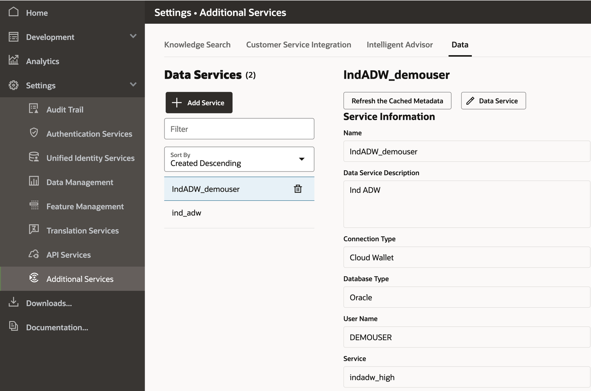

## Task 4: Create or View Transaction Table

1. You can also view this table from Oracle APEX
  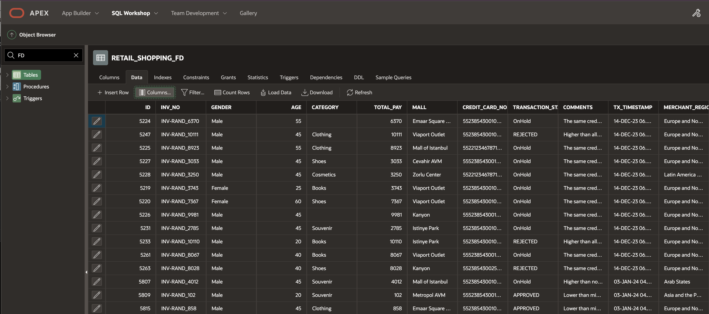
2. Optionally, if Oracle APEX is not installed you can view the table from Autonomous Database SQL Web Developer
  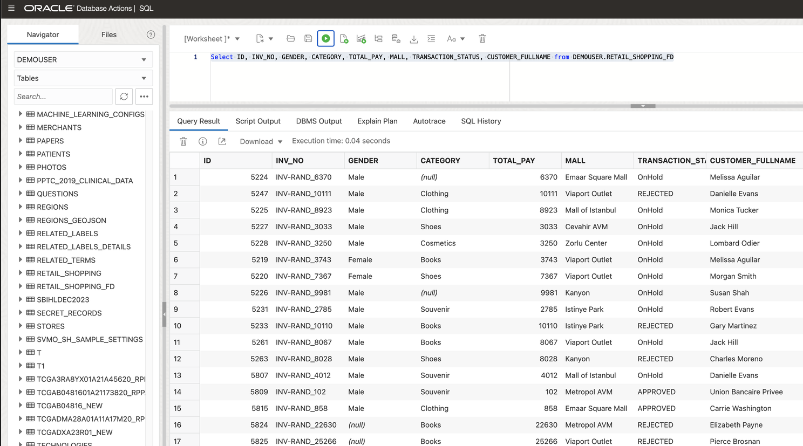

## Task 5: Create Skill and Entity

From Oracle Digital Assistant Navigation Menu

1. Create Skill, Provide any name. However, the Dialog Mode should be Visual for this use case.
   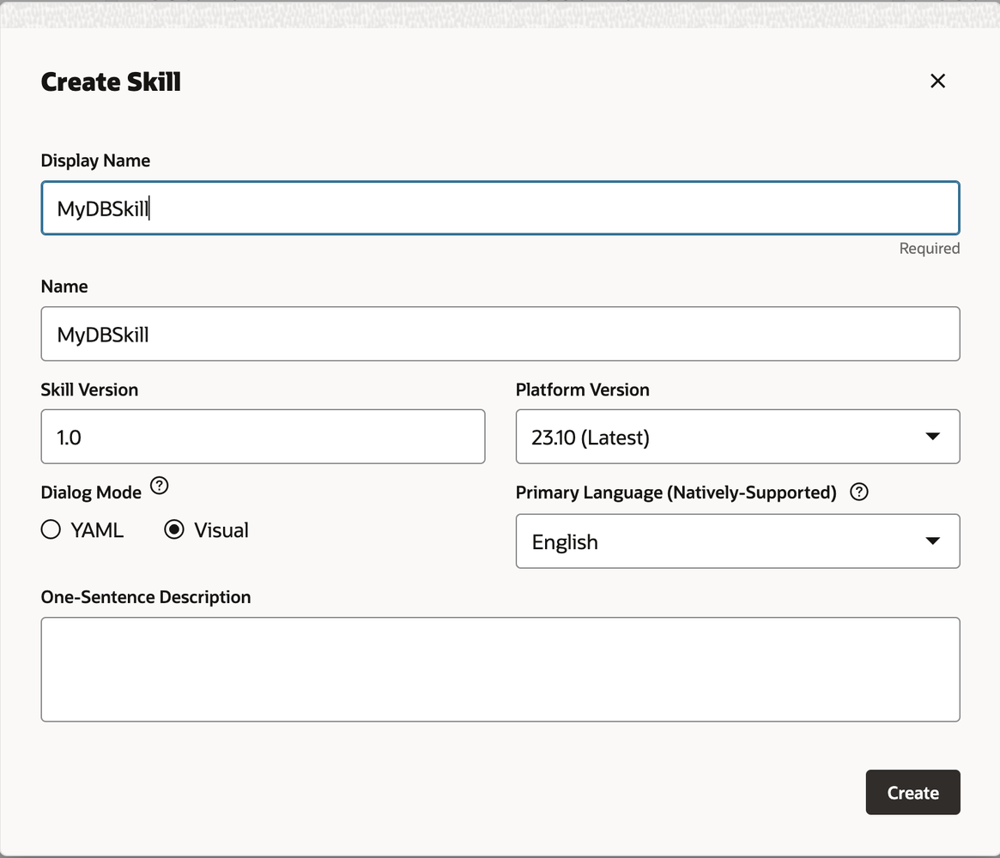 
2. Under Entities, Select the Tables that we want.
   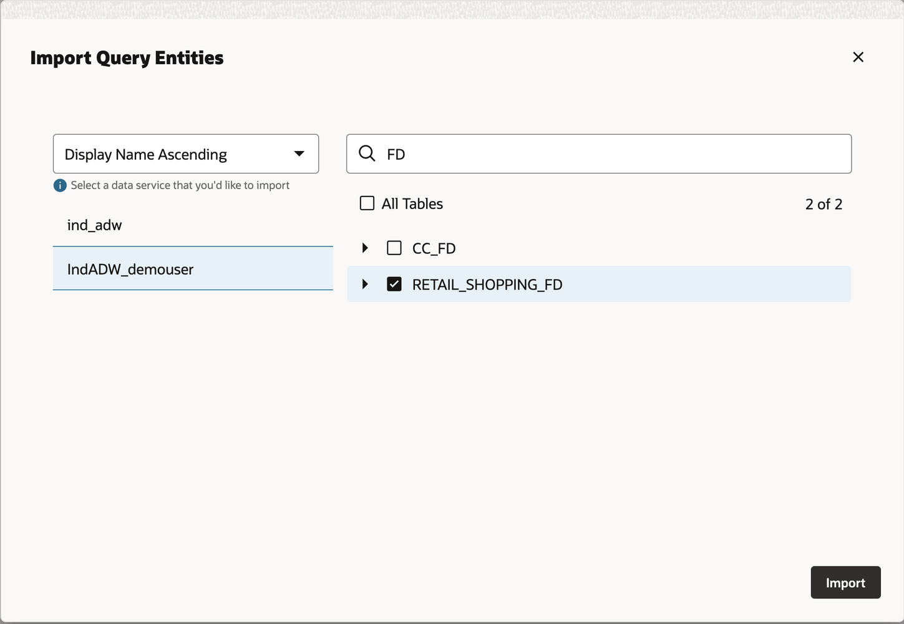
3. The database table will now be listed under Entities.
   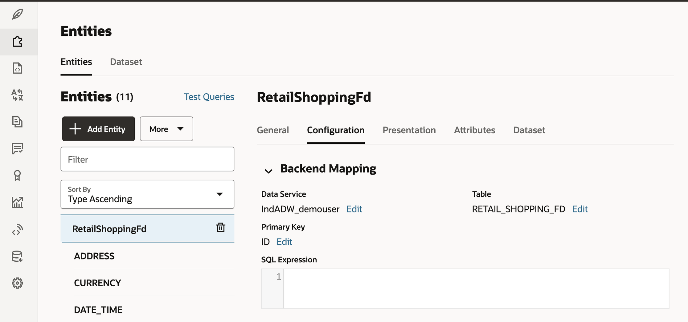

## Task 6: Train the Model

1. Select Train in the top navigation and then select "A Linguistics-based model", later select "A Machine learning-based model". It will take some time for the training to be completed.
   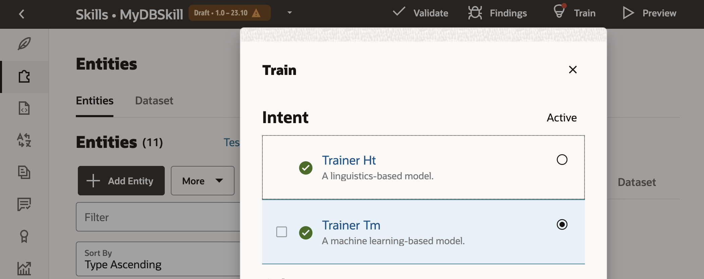 

## Task 7: Test the Model

1. Click on the Preview icon in the top navigation and start testing the model and its generated SQL. 
    ```
    <copy>
    Chatbot User: How many transactions were rejected
    </copy>
    ``` 
  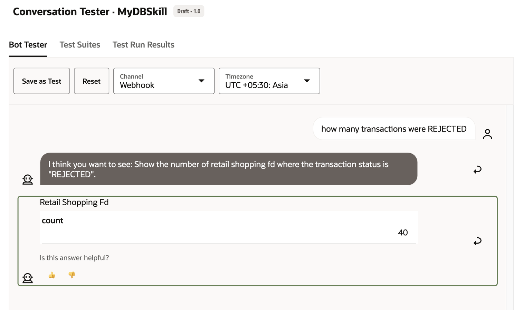 
2. Ask for number of transactions
    ```
    <copy>
    Chatbot User: Show me the total number of transactions
    </copy>
    ``` 
    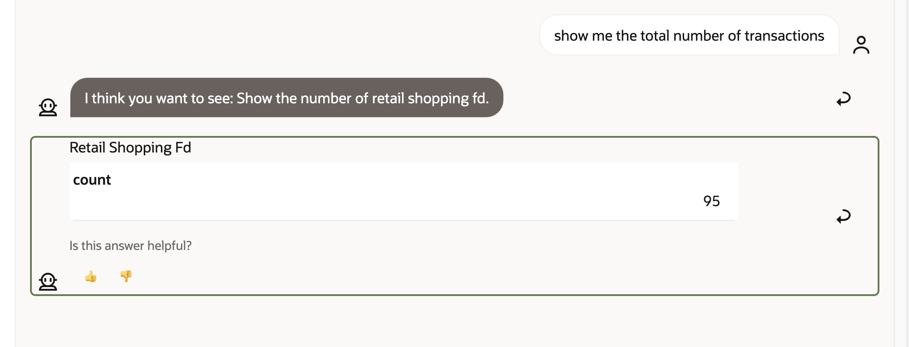 
3. List the latest transaction
    ```
    <copy>
    Chatbot User: List the latest transaction
    </copy>
    ```  
  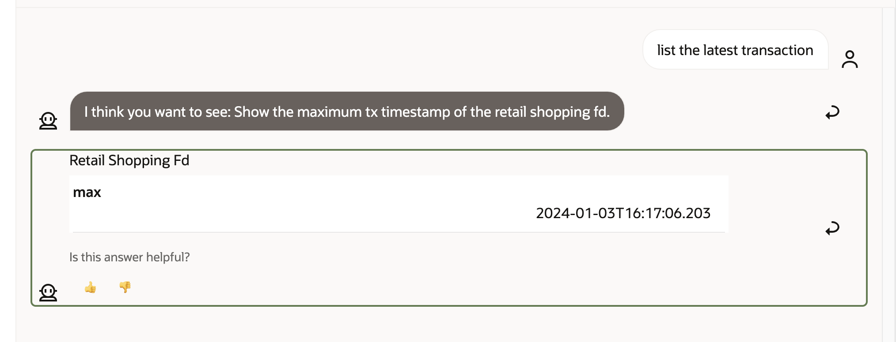
4. List the transaction related to a specific credit card 
    ```
    <copy>
    Chatbot User: List the transaction with credit card *****
    </copy>
    ``` 
  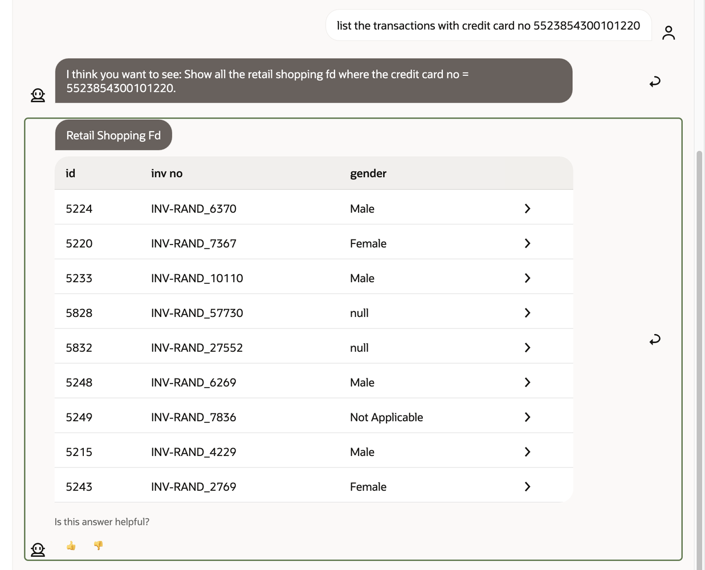

## Task 8: Review the SQL Generated

For every chatbot response, there will be an SQL Dialog where you can verify the OMRQL and corresponding SQL. 

1. The same queries can be tuned or changed if required while training the bot for more accuracy.
 
  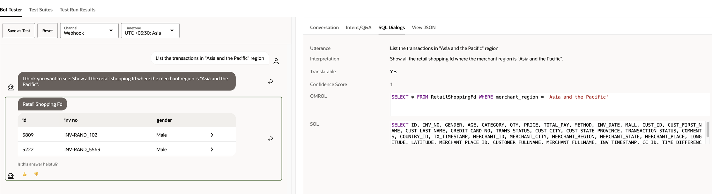

    ```
    <copy>
    Chatbot User: List the transaction by Jeremy Robertson.
    </copy>
    ``` 

  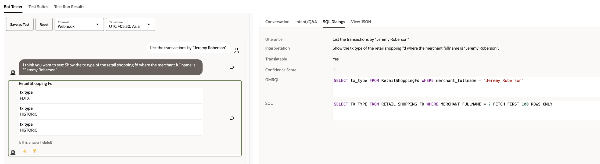

2. Review the Conversation auto generated.
   
  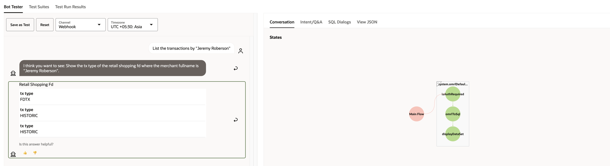
  
## Task 9: Create a web channel for our Skill.

Under left navigation -> Development -> Channels -> Add Channel and create Oracle Web channel. 

1. We would need this channel ID and Digital Assistant website URL later.
   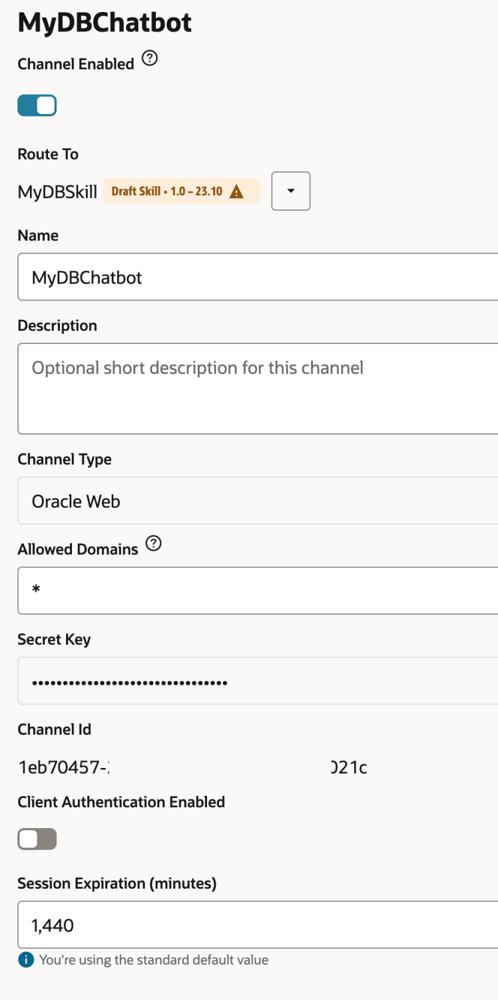
   Optionally, you can turn off client authentication.

## Task 10: Configure chatbot SDK Javascript file

1. Configure chatbot SDK Javascript file

  [Download web client SDK](https://docs.oracle.com/en/cloud/paas/digital-assistant/sdks.html). Extract on your local system. Update settings.js and change the URI (matching the Digital Assistant URL on the web browser and channel ID; the user ID can be left blank.
  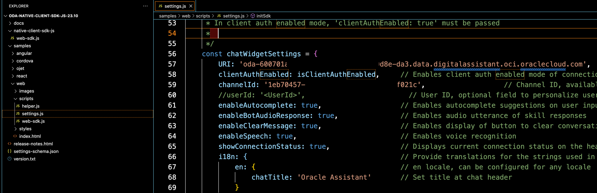
    
2. Run the web client

  We can now run the index.html web page as a stand-alone or Live Server of Visual Studio code. from here, we are all set to put the chatbot on any static website. CSS can be customised as required. all it needs is the following lines of HTML code

    ```
    <copy>
      <link rel="stylesheet" href="./styles/redwood-base.css">
    <script src="scripts/settings.js" defer></script>
    <script src="scripts/web-sdk.js" onload="initSdk('Bots')" defer></script>
    </copy>
    ``` 
    

## Task 11: Run chatbot on Oracle APEX page

1. If you plan to run this chatbot on your APEX application, upload the settings.js, web-sdk.js and redwood-base.css into APEX application folder under shared components -> Static Application Files.

2. Create APEX page and just create a static html region with following code, change the path if required.
    ```
      <copy>
        <html lang="en-US" class="no-js" >
        <head>
            <script src="#APP_FILES#oda/settings#MIN#.js"></script>
            <script src="#APP_FILES#oda/web-sdk.js" onload="initSdk('Bots')"></script>
            <link rel="stylesheet" href="#APP_FILES#oda/redwood-base.css" >  
        </head>
        </html>
      </copy>
      ``` 
      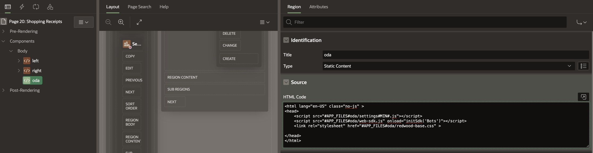
      ```
      <copy>
      Chatbot User: what is the total sum value of all transactions
      </copy>
      ``` 
      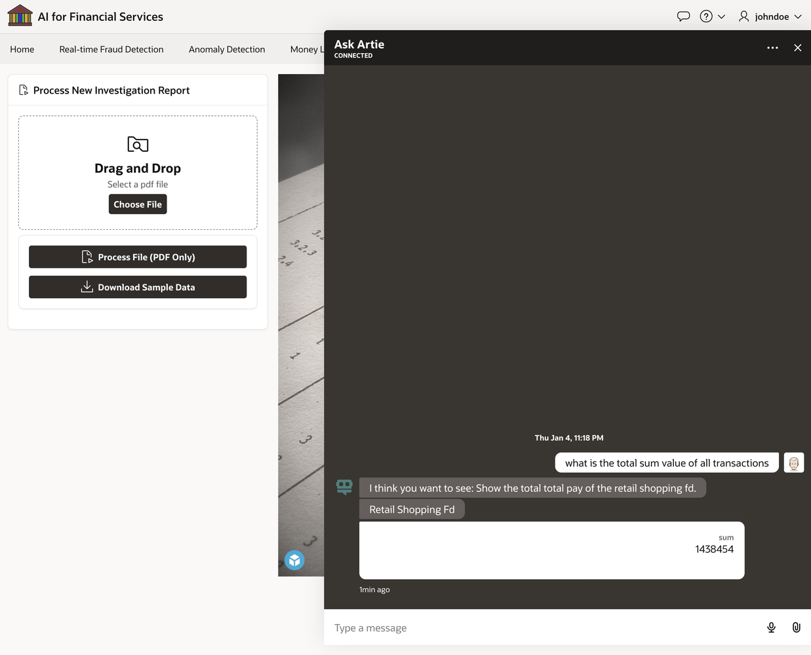
    
 
You may now **proceed to the next lab.**

## Acknowledgements
 
* **Architect, Author and Developer** - [Madhusudhan Rao B M](https://www.linkedin.com/in/madhusudhanraobm/), Principal Product Manager, Oracle Database
* **Last Updated By/Date** - Dec 4th, 2023.