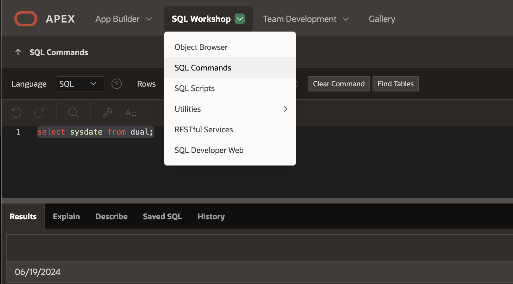
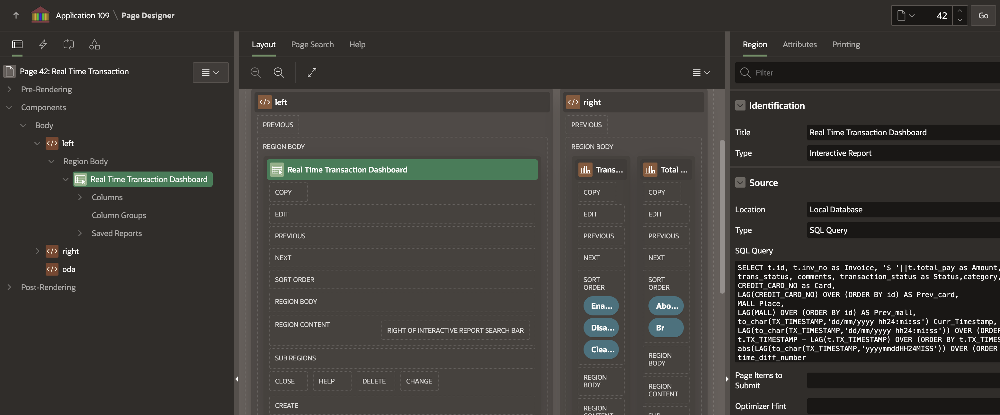
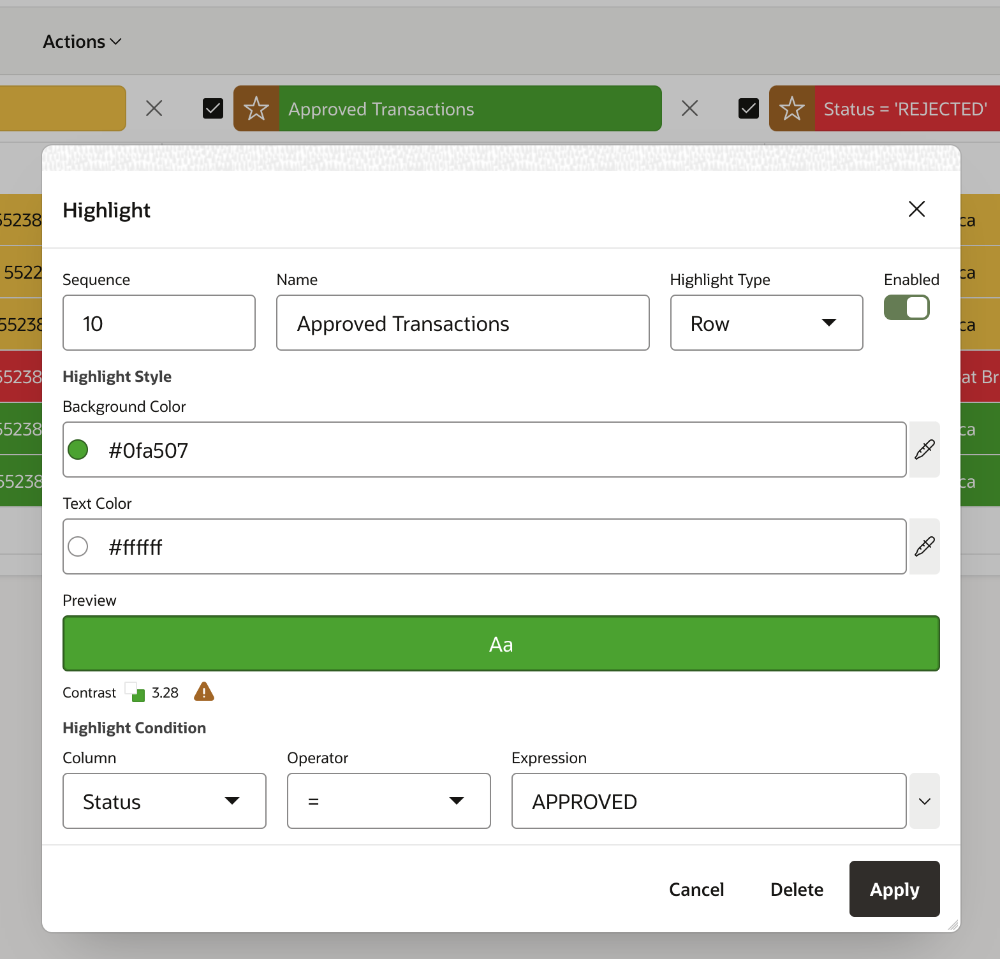
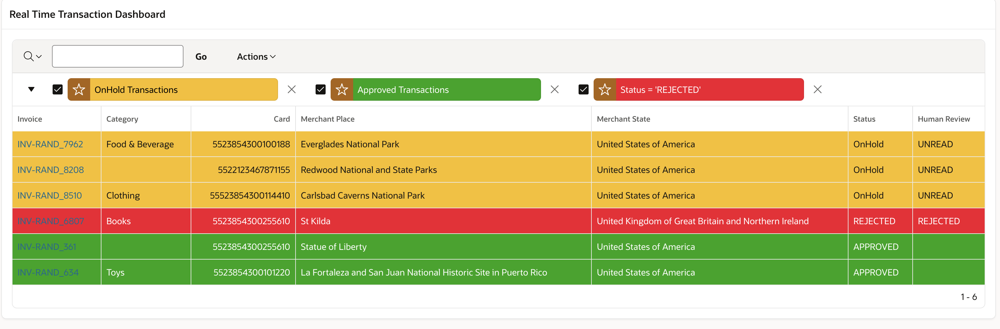
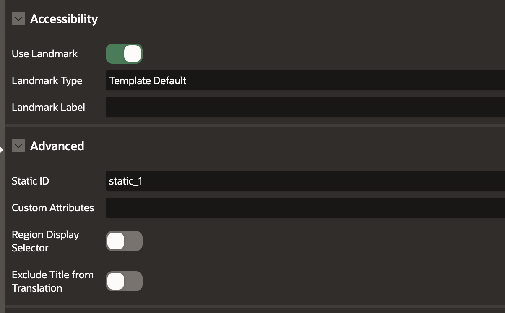
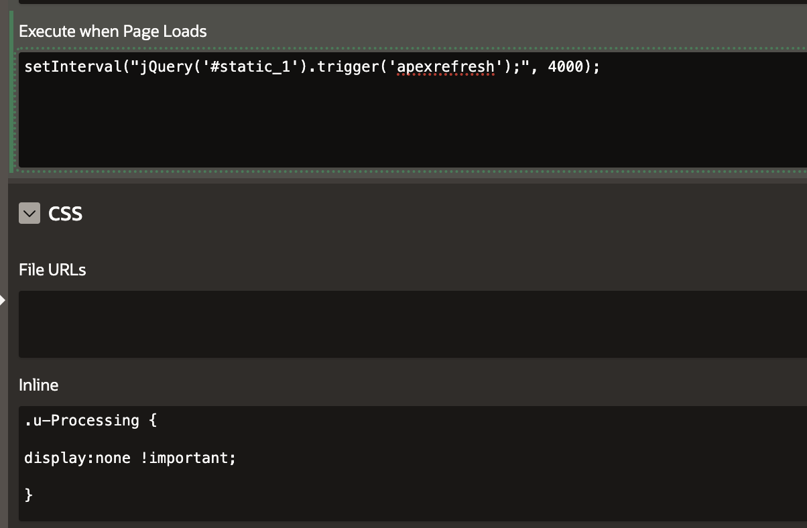
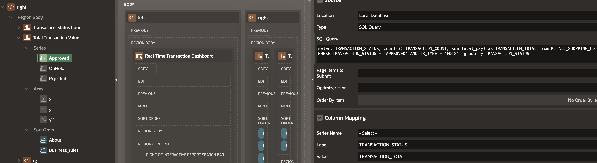
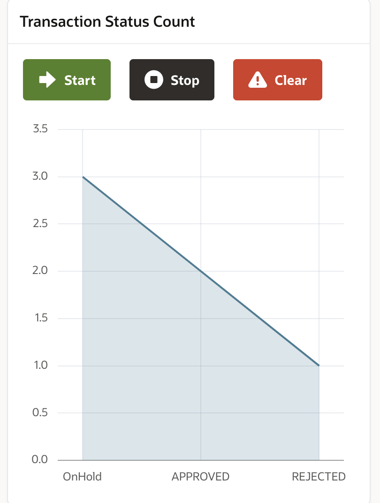
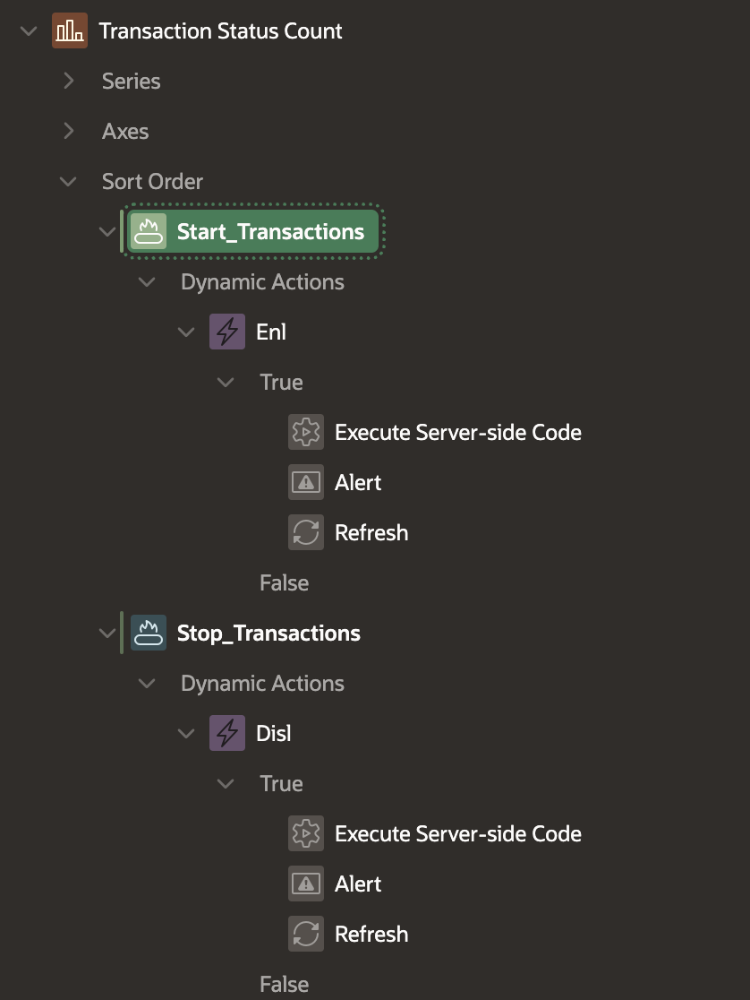

# Create Real-time Dashboard

## Introduction

In this lab, we will create an Oracle APEX Real-time Dashboard to monitor the data of financial services.

Estimated Time: 30 minutes

### Objectives

In this lab, you will:
 
- Create a real-time Oracle APEX dashboard to monitor transactions. These transactions are auto-generated  

### Prerequisites

- This lab requires completing the get started and creating an Oracle Autonomous Database Instance lab.
- Basic knowledge of Oracle APEX and PL/SQL

## Task 1: Create Schema

1. Login to Oracle APEX SQL Developer as run the following **SQL Workshop** > **SQL commands**

    
 
2. Let us create base table **RETAIL\_SHOPPING\_FD** which will store complete financial services transaction data. typically as used in a retail shopping scenario to purchase essential items using a debit or credit card.

    ```sql
    <copy> 
    CREATE TABLE RETAIL_SHOPPING_FD  (	
        ID NUMBER GENERATED BY DEFAULT ON NULL AS IDENTITY MINVALUE 1 MAXVALUE 999999 
        INCREMENT BY 1 START WITH 1 CACHE 20 NOORDER  NOCYCLE  NOKEEP  NOSCALE  NOT NULL ENABLE, 
        INV_NO VARCHAR2(50), 
        GENDER VARCHAR2(50), 
        AGE NUMBER, 
        CATEGORY VARCHAR2(50), 
        QTY NUMBER, 
        PRICE NUMBER, 
        TOTAL_PAY NUMBER, 
        METHOD VARCHAR2(50), 
        INV_DATE TIMESTAMP (6), 
        MALL VARCHAR2(50), 
        CUST_ID NUMBER, 
        CUST_FIRST_NAME VARCHAR2(100), 
        CUST_LAST_NAME VARCHAR2(100), 
        CREDIT_CARD_NO NUMBER, 
        TRANS_STATUS VARCHAR2(20), 
        CUST_CITY VARCHAR2(100), 
        CUST_STATE_PROVINCE VARCHAR2(100), 
        TRANSACTION_STATUS VARCHAR2(50), 
        COMMENTS VARCHAR2(500), 
        COUNTRY_ID VARCHAR2(50), 
        TX_TIMESTAMP TIMESTAMP (6), 
        MERCHANT_ID NUMBER, 
        MERCHANT_CITY VARCHAR2(50), 
        MERCHANT_REGION VARCHAR2(255), 
        MERCHANT_STATE VARCHAR2(100), 
        MERCHANT_PLACE VARCHAR2(100), 
        LONGITUDE NUMBER, 
        LATITUDE NUMBER, 
        MERCHANT_PLACE_ID NUMBER, 
        CUSTOMER_FULLNAME VARCHAR2(50), 
        MERCHANT_FULLNAME VARCHAR2(50), 
        INV_TIMESTAMP TIMESTAMP (6) WITH LOCAL TIME ZONE, 
        CC_ID NUMBER, 
        TIME_DIFFERENCE_NUMBER NUMBER, 
        TX_TYPE VARCHAR2(20), 
        PRIMARY KEY (ID) USING INDEX  ENABLE
        ) ;
    </copy>
    ```  

 3. Let us create another table to hold our business rules **FD\_BUSINESS\_RULES** 
 4. For this demo we will consider following Business rules, the threshold values are stored in **FD\_BUSINESS\_RULES** table

    - Rule 1 (Based on Transaction Value)
        - If Transaction Amount < 2000 -> It is auto Approved
        - If Transaction Amount >= 2000 and < 10,000 -> It is OnHold - Under Human Review
        - If Transaction Amount >= 10000 -> Transaction is Rejected, 
        - In such cases the card is Blocked from Further Transactions
    - Rule 2 (Based on Location)
        - If the same credit card is used in less than 15 seconds in different locations, then that transaction will be rejected.
    - Rule 3
        - If the same credit card is used in more than 15 seconds in the same locations AND If Transaction Amount >= 2000 and < 10,000 -> It is OnHold, 
        - In such cases that card will NOT be blocked.
    - Rule 4 (Based on Time)
        - The same credit card has been used in less than 15, and then the card is blocked.

    ```sql
    <copy>
          CREATE TABLE FD_BUSINESS_RULES (
            ID NUMBER GENERATED BY DEFAULT ON NULL AS IDENTITY MINVALUE 1 MAXVALUE 99999999 
            INCREMENT BY 1 START WITH 1 CACHE 20 NOORDER  NOCYCLE  NOKEEP  NOSCALE  NOT NULL ENABLE, 
            UNIT VARCHAR2(50), 
            UNIT_VALUE NUMBER, 
            DESCRIPTION VARCHAR2(200), 
            PRIMARY KEY (ID) USING INDEX  ENABLE
        ) ;
    -- Insert Sample Data --
    insert into FD_BUSINESS_RULES (UNIT, UNIT_VALUE, DESCRIPTION)
    values ('Minimum Time Frequency',15,'Minimum time frequency between transactions before transaction is blocked');
    insert into FD_BUSINESS_RULES (UNIT, UNIT_VALUE, DESCRIPTION) values
    ('Approved Purchase',2000,'Minimum transaction value to be auto approved');
    insert into FD_BUSINESS_RULES (UNIT, UNIT_VALUE, DESCRIPTION) values
    ('Rejected Purchase',10000,'Maximum transaction value to be auto rejected');
    </copy>
    ``` 

    > **Note:**  You can add your own business rules or change if required.

 1.  Create Transaction Location table **TX\_LOCATION** with Latitude and Longitude information.
    
    ```sql
    <copy> 
    CREATE TABLE TX_LOCATION  (	
        ID NUMBER GENERATED BY DEFAULT ON NULL AS IDENTITY MINVALUE 1 MAXVALUE 999999 
        INCREMENT BY 1 START WITH 1 CACHE 20 NOORDER  NOCYCLE  NOKEEP  NOSCALE  NOT NULL ENABLE, 
        CATEGORY VARCHAR2(50), 
        STATES_NAME_EN VARCHAR2(255), 
        REGION_EN VARCHAR2(255),  
        NAME_EN VARCHAR2(255), 
        SHORT_DESCRIPTION_EN VARCHAR2(32767),  
        LONGITUDE NUMBER, 
        LATITUDE NUMBER,  
        CATEGORY_SHORT VARCHAR2(1),  
        TRANSBOUNDARY NUMBER,   
        PRIMARY KEY (ID)
        USING INDEX  ENABLE
    );
    </copy>
    ```

 2. Create the required **Trigger** on **RETAIL\_SHOPPING\_FD** table and enable trigger

    ```sql
    <copy> 
    CREATE OR REPLACE EDITIONABLE TRIGGER RETAIL_SHOPPING_FD_TRG 
    before
    insert on RETAIL_SHOPPING_FD 
    for each row
    declare
            v_ccid number;
            v_n number := 0;
            v_min_time_diff_number number;
            v_min_tx_value number;
            v_max_tx_value number;
    begin 
        SELECT unit_value into v_min_time_diff_number from FD_BUSINESS_RULES where unit = 'Minimum Time Frequency';
        SELECT unit_value into v_min_tx_value from FD_BUSINESS_RULES where unit = 'Approved Purchase';
        SELECT unit_value into v_max_tx_value from FD_BUSINESS_RULES where unit = 'Rejected Purchase'; 
        SELECT id
        INTO v_ccid 
        FROM cc_fd
        WHERE cc_no = :new.credit_card_no;   
        -- begin if loop --
        if inserting then
            if :new.total_pay < v_min_tx_value then
                    :new.transaction_status := 'APPROVED';
                    :new.comments := 'Lower than minimum amount of $ '||v_min_tx_value||'';
            elsif :new.total_pay >= v_min_tx_value AND :new.total_pay < v_max_tx_value then
                    :new.transaction_status := 'OnHold';
                    :new.trans_status := 'UNREAD';
            else 
                    :new.transaction_status := 'REJECTED';
                    :new.comments := 'Higher than allowed amount of $ '||v_max_tx_value||'';
            end if; 
            :new.cc_id := v_ccid;    
        end if;
        -- end if loop --
    
    end;
    /
    ALTER TRIGGER RETAIL_SHOPPING_FD_TRG ENABLE;
    </copy>
    ```    

## Task 2: Bank Accounts and Transfers

1. Create Bank Accounts **BANK\_ACCOUNTS** table.
    ```sql
            <copy> 
            CREATE TABLE BANK_ACCOUNTS  (
                ID NUMBER, 
                NAME VARCHAR2(400), 
                BALANCE NUMBER(20,2), 
                PRIMARY KEY (ID)
                USING INDEX  ENABLE 
                );
            </copy>
        ```

2. Create Bank Account transfer **BANK\_TRANSFERS** table.
    ```sql
            <copy> 
                CREATE TABLE BANK_TRANSFERS  (	
                TXN_ID NUMBER, 
                SRC_ACCT_ID NUMBER, 
                DST_ACCT_ID NUMBER, 
                DESCRIPTION VARCHAR2(400), 
                AMOUNT NUMBER, 
                PROFILE VARCHAR2(20), 
                INV_NO VARCHAR2(50), 
                MERCHANT_REGION VARCHAR2(100), 
                MERCHANT_STATE VARCHAR2(100), 
                MERCHANT_PLACE VARCHAR2(100), 
                PRIMARY KEY (TXN_ID)
                USING INDEX  ENABLE 
                ); 
            ALTER TABLE BANK_TRANSFERS ADD FOREIGN KEY (SRC_ACCT_ID) REFERENCES BANK_ACCOUNTS (ID) ENABLE;
            ALTER TABLE BANK_TRANSFERS ADD FOREIGN KEY (DST_ACCT_ID) REFERENCES BANK_ACCOUNTS (ID) ENABLE;
            </copy>
        ```

3. Create retail shopping data table **RETAIL\_SHOPPING** which is a master list of all shopping malls available in a given region. 

    ```sql
    <copy> 
      CREATE TABLE RETAIL_SHOPPING  (	
        ID NUMBER GENERATED BY DEFAULT ON NULL AS IDENTITY MINVALUE 1 MAXVALUE 9999999  
        INCREMENT BY 1 START WITH 1 CACHE 20 NOORDER  NOCYCLE  NOKEEP  NOSCALE  NOT NULL ENABLE, 
        INV_NO VARCHAR2(50), 
        GENDER VARCHAR2(50), 
        AGE NUMBER, 
        CATEGORY VARCHAR2(50), 
        QTY NUMBER, 
        PRICE NUMBER, 
        TOTAL_PAY NUMBER, 
        METHOD VARCHAR2(50), 
        INV_DATE DATE, 
        MALL VARCHAR2(50), 
        CUST_ID NUMBER, 
        CUST_FIRST_NAME VARCHAR2(100), 
        CUST_LAST_NAME VARCHAR2(100), 
        CREDIT_CARD_NO NUMBER, 
        TRANS_STATUS VARCHAR2(32767), 
        CUST_CITY VARCHAR2(32767), 
        CUST_STATE_PROVINCE VARCHAR2(32767), 
        COUNTRY_ID VARCHAR2(32767), 
        PRIMARY KEY (ID) USING INDEX  ENABLE  
        );
    </copy>
    ```

4. Create a random list of available Credit cards table **CC\_FD** 

    ```sql
    <copy> 
    CREATE TABLE CC_FD  (	
        ID NUMBER GENERATED BY DEFAULT ON NULL AS IDENTITY MINVALUE 1 MAXVALUE 99999999 
        INCREMENT BY 1 START WITH 1 CACHE 20 NOORDER  NOCYCLE  NOKEEP  NOSCALE  NOT NULL ENABLE, 
        CUST_ID NUMBER, 
        CC_NO NUMBER, 
        STATUS VARCHAR2(50), 
        VALIDITY DATE, 
        FIRST_NAME VARCHAR2(50), 
        LAST_NAME VARCHAR2(50), 
        BANK_NAME VARCHAR2(50), 
        COMMENTS VARCHAR2(100), 
        PRIMARY KEY (ID) USING INDEX  ENABLE );
    </copy>
    ```

  

## Task 3: Create Random Transaction

1. Let us create a procedure **FD\_TX\_INSERTS**. This will generate Random Transaction Data and insert these records into **RETAIL\_SHOPPING\_FD** 

    ```sql
    <copy> 
    create or replace PROCEDURE FD_TX_INSERTS  
    AS  
        v_INV_NO RETAIL_SHOPPING_FD.INV_NO%TYPE;
        v_CATEGORY RETAIL_SHOPPING_FD.CATEGORY%TYPE;
        v_TOTAL_PAY RETAIL_SHOPPING_FD.TOTAL_PAY%TYPE; 
        v_CUST_ID RETAIL_SHOPPING_FD.CUST_ID%TYPE;
        v_MERCHANT_ID RETAIL_SHOPPING_FD.MERCHANT_ID%TYPE;
        v_CUSTOMER_FULLNAME RETAIL_SHOPPING_FD.CUSTOMER_FULLNAME%TYPE; 
        v_MERCHANT_FULLNAME RETAIL_SHOPPING_FD.MERCHANT_FULLNAME%TYPE;  
        v_MERCHANT_PLACE_ID   RETAIL_SHOPPING_FD.MERCHANT_PLACE_ID%TYPE; 
        v_MERCHANT_PLACE   RETAIL_SHOPPING_FD.MERCHANT_PLACE%TYPE; 
        v_LONGITUDE   RETAIL_SHOPPING_FD.LONGITUDE%TYPE;
        v_LATITUDE   RETAIL_SHOPPING_FD.LATITUDE%TYPE; 
        v_MERCHANT_REGION   RETAIL_SHOPPING_FD.MERCHANT_REGION%TYPE := 'Europe and North America';
        v_MERCHANT_STATE   RETAIL_SHOPPING_FD.MERCHANT_STATE%TYPE := 'United States of America';  
        v_MALL  RETAIL_SHOPPING_FD.MALL%TYPE;
        v_CREDIT_CARD_NO   RETAIL_SHOPPING_FD.CREDIT_CARD_NO%TYPE; 
        v_TX_TIMESTAMP   RETAIL_SHOPPING_FD.TX_TIMESTAMP%TYPE; 
        v_GENDER  RETAIL_SHOPPING_FD.GENDER%TYPE; 
        v_AGE  RETAIL_SHOPPING_FD.AGE%TYPE;  
        v_rand_no number;
        v_which_country number;
    BEGIN
        
        dbms_output.put_line('BEGIN GENERATING RANDOMS -------------------------------');  
        v_TOTAL_PAY := round(DBMS_Random.Value(1,11000),0); 
        v_INV_NO := 'INV-RAND_'||v_TOTAL_PAY;  
        v_CUST_ID := round(DBMS_Random.Value(1,40),0);
        select distinct FIRST_NAME||' '||LAST_NAME, GENDER, AGE into v_CUSTOMER_FULLNAME, v_GENDER, v_AGE 
        from FINBANK_ACCOUNTS where id = v_CUST_ID;
        v_MERCHANT_ID := round(DBMS_Random.Value(1,40),0);

        select distinct FIRST_NAME||' '||LAST_NAME, GENDER, AGE into v_MERCHANT_FULLNAME, v_GENDER, v_AGE 
        from FINBANK_ACCOUNTS where id = v_MERCHANT_ID; 
        SELECT category into v_CATEGORY FROM 
        ( select distinct category  from RETAIL_SHOPPING  ORDER BY DBMS_RANDOM.RANDOM) WHERE  rownum < 2; 
    
        v_which_country := round(DBMS_Random.Value(1,6),0); 
        if (v_which_country <= 4) then 
                select  ID, NAME_EN, LONGITUDE, LATITUDE into v_MERCHANT_PLACE_ID,  v_MERCHANT_PLACE, v_LONGITUDE, v_LATITUDE
                from 
                (select ID, NAME_EN, LONGITUDE, LATITUDE  from TX_LOCATION 
                where REGION_EN = 'Europe and North America' AND STATES_NAME_EN = 'United States of America' 
                ORDER BY DBMS_RANDOM.RANDOM) WHERE  rownum < 2;  
            else  
                select  ID, NAME_EN, LONGITUDE, LATITUDE , REGION_EN, STATES_NAME_EN  into v_MERCHANT_PLACE_ID, v_MERCHANT_PLACE,  
                v_LONGITUDE, v_LATITUDE, v_MERCHANT_REGION, v_MERCHANT_STATE 
                from 
                (select ID, NAME_EN, LONGITUDE, LATITUDE, REGION_EN, STATES_NAME_EN  from TX_LOCATION ORDER BY DBMS_RANDOM.RANDOM) 
                WHERE  rownum < 2;  
        end if;  
            
        select  mall into v_MALL from (select distinct mall from RETAIL_SHOPPING where mall is not null ORDER BY DBMS_RANDOM.RANDOM) WHERE  rownum < 2;
        select  CC_NO into v_CREDIT_CARD_NO from (select CC_NO from CC_FD where STATUS = 'Active' ORDER BY DBMS_RANDOM.RANDOM) WHERE  rownum < 2;
    
        v_rand_no := round(DBMS_Random.Value(1,59),0);  
        v_TX_TIMESTAMP := current_timestamp + numToDSInterval( v_rand_no, 'second' ); 
        dbms_output.put_line('BEGIN TX INSERT -------------------------------');  
        INSERT INTO RETAIL_SHOPPING_FD 
        (
            INV_NO,  CATEGORY,  TOTAL_PAY,   MALL, 
            CUST_ID,  CREDIT_CARD_NO,  TX_TIMESTAMP,  MERCHANT_ID, 
            MERCHANT_REGION,  MERCHANT_STATE,  MERCHANT_PLACE,  LONGITUDE, 
            LATITUDE,  MERCHANT_PLACE_ID,  CUSTOMER_FULLNAME, MERCHANT_FULLNAME,
            TX_TYPE, GENDER, AGE
        ) 
        values
        (
            v_INV_NO,  v_CATEGORY,  v_TOTAL_PAY, v_MALL, 
            v_CUST_ID,  v_CREDIT_CARD_NO,  v_TX_TIMESTAMP,  v_MERCHANT_ID, 
            v_MERCHANT_REGION,  v_MERCHANT_STATE,  v_MERCHANT_PLACE,  v_LONGITUDE, 
            v_LATITUDE,  v_MERCHANT_PLACE_ID,  v_CUSTOMER_FULLNAME,  v_MERCHANT_FULLNAME,
            'FDTX',  --- Non money laundering case
            v_GENDER, v_AGE
        );

        dbms_output.put_line('BEGIN INSERT INTO BANK TRANSFERS -------------------------------');  
        -- Money is moving from source account to destination account during money transfer 
            insert into BANK_TRANSFERS (TXN_ID, SRC_ACCT_ID, DST_ACCT_ID, AMOUNT, DESCRIPTION) 
            values ( EMP_SEQ.NEXTVAL , v_CUST_ID, v_MERCHANT_ID, v_TOTAL_PAY, 'FDTX');
        
    END;
    /
    </copy>
    ```

## Task 4: Apply Business Rules

1. Let us update transaction data in the **RETAIL\_SHOPPING\_FD** table, considering that some transactions might repeat in different locations using the same credit or debit cards within a fraction of a few seconds. In those cases, the credit card needs to be temporarily blocked, and the transactions should be set on Hold until further investigation by the system or by a human reviewer. This PL/SQL code consists of the business logic used in this demo. 
2.  For this demo we will consider following Business rules, the threshold values are stored in **FD\_BUSINESS\_RULES** table

    - Rule 1 (Based on Transaction Value)
        - If Transaction Amount < 2000 -> It is auto Approved
        - If Transaction Amount >= 2000 and < 10,000 -> It is OnHold - Under Human Review
        - If Transaction Amount >= 10000 -> Transaction is Rejected, 
        - In such cases the card is Blocked from Further Transactions
    - Rule 2 (Based on Location)
        - If the same credit card is used in less than 15 seconds in different locations, then that transaction will be rejected.
    - Rule 3
        - If the same credit card is used in more than 15 seconds in the same locations AND If Transaction Amount >= 2000 and < 10,000 -> It is OnHold, 
        - In such cases that card will NOT be blocked.
    - Rule 4 (Based on Time)
        - The same credit card has been used in less than 15, and then the card is blocked.
3. Feel free to update or write your own business logic as per your needs.

    ```sql
    <copy> 
        create or replace function my_dashboard ( name_in IN varchar2 ) RETURN number
        IS
                v_id number;
                v_total_pay number;
                v_this_credit_card varchar2(50);
                v_previous_card  varchar2(50);
                v_this_mall varchar2(50);
                v_previous_mall varchar2(50);
                v_time_diff_number number;
                v_comment varchar2(500);
                v_credit_card_no varchar2(50);
                v_category varchar2(50);
                v_trans_status varchar2(50);
        
                Cursor C1 IS   
                SELECT t.id, t.inv_no, t.total_pay, trans_status, comments, transaction_status,CATEGORY,  
                CREDIT_CARD_NO this_credit_card, 
                LAG(CREDIT_CARD_NO) OVER (ORDER BY id) AS Prev_card, 
                MALL this_mall, 
                LAG(MALL) OVER (ORDER BY id) AS prev_mall,  
                to_char(TX_TIMESTAMP,'dd/mm/yyyy hh24:mi:ss') Curr_Timestamp,   
                LAG(to_char(TX_TIMESTAMP,'dd/mm/yyyy hh24:mi:ss')) OVER (ORDER BY id)  Prev_Timestamp, 
                t.TX_TIMESTAMP - LAG(t.TX_TIMESTAMP) OVER (ORDER BY t.TX_TIMESTAMP) AS time_difference, 
                (LAG(to_char(TX_TIMESTAMP,'yyyymmddHH24MISS')) OVER (ORDER BY id)  - to_char(TX_TIMESTAMP,'yyyymmddHH24MISS') ) AS time_diff_number 
                FROM RETAIL_SHOPPING_FD t  
                order by id desc;

                v_min_time_diff_number number;
                v_min_tx_value number;
                v_max_tx_value number;
        
        BEGIN

                dbms_output.put_line('Begin Table updates ----- '); 

                SELECT unit_value into v_min_time_diff_number from FD_BUSINESS_RULES where unit = 'Minimum Time Frequency';
                SELECT unit_value into v_min_tx_value from FD_BUSINESS_RULES where unit = 'Approved Purchase';
                SELECT unit_value into v_max_tx_value from FD_BUSINESS_RULES where unit = 'Rejected Purchase';

                For row_1 In C1 Loop
                ------------------------------------------------------------------------------------------------------------
                        v_id := row_1.id; 
                        v_time_diff_number := abs(row_1.time_diff_number);
                        v_comment := row_1.comments; 
                        v_total_pay := row_1.total_pay; 
                        v_category := row_1.category; 
                        v_this_mall := row_1.this_mall;
                        v_previous_mall := row_1.prev_mall;
                        v_trans_status := row_1.trans_status;
                        v_this_credit_card := row_1.this_credit_card; 
                        -- Add Business logic here
                        -- Feel free to update these conditions as per your business requirements.
                        if   (v_time_diff_number <= v_min_time_diff_number AND v_comment is null) then 
                        -----------------------------------------------------------------------------------------------
                        v_comment := 'The same credit card has been reused in less than 
                        '||v_min_time_diff_number||' seconds and '||v_this_credit_card||' is blocked'; 
                        UPDATE RETAIL_SHOPPING_FD SET COMMENTS = v_comment, TIME_DIFFERENCE_NUMBER = v_time_diff_number, 
                        TRANSACTION_STATUS='REJECTED', TRANS_STATUS = 'REJECTED' WHERE ID = v_id AND 
                        (TRANS_STATUS != 'UNDER REVIEW' OR  TRANS_STATUS != 'REVIEW COMPLETED');
                        dbms_output.put_line('v_id '||v_id||' time_diff_number '||v_time_diff_number||'v_comment '||v_comment); 
                        ----------- Block credit card ------------------------------------------------------------------
                        UPDATE CC_FD SET STATUS='Blocked', COMMENTS='Card Auto Blocked' WHERE CC_NO = v_this_credit_card;
                        ------------------------------------------------------------------------------------------------
                        elsif   (v_time_diff_number > v_min_time_diff_number AND v_comment is null AND  v_total_pay >= v_max_tx_value) then 
                        ------------------------------------------------------------------------------------------------
                        v_comment := 'Exceeds max allowed amount of $ '||v_max_tx_value||' for '||v_category||' '; 
                        UPDATE RETAIL_SHOPPING_FD 
                        SET COMMENTS = v_comment, TIME_DIFFERENCE_NUMBER = v_time_diff_number, TRANSACTION_STATUS='REJECTED'  WHERE ID = v_id  
                        AND (TRANS_STATUS != 'UNDER REVIEW' OR  TRANS_STATUS != 'REVIEW COMPLETED');
                        dbms_output.put_line('v_id '||v_id||' time_diff_number '||v_time_diff_number||'v_comment '||v_comment); 
                        ------------------------------------------------------------------------------------------------
                        elsif   (v_time_diff_number > v_min_time_diff_number AND v_comment is null AND  v_total_pay >= v_min_tx_value 
                        AND  v_total_pay < v_max_tx_value AND  (v_this_mall = v_previous_mall) ) then 
                        ------------------------------------------------------------------------------------------------
                        v_comment := 'Higher than normal amount of $ '||v_min_tx_value||' for '||v_category||' in same location '; 
                        UPDATE RETAIL_SHOPPING_FD SET COMMENTS = v_comment, TIME_DIFFERENCE_NUMBER = v_time_diff_number,  
                        TRANSACTION_STATUS='OnHold'  WHERE ID = v_id 
                        AND (TRANS_STATUS != 'UNDER REVIEW' OR  TRANS_STATUS != 'REVIEW COMPLETED');
                        dbms_output.put_line('v_id '||v_id||' time_diff_number '||v_time_diff_number||'v_comment '||v_comment);
                        ------------------------------------------------------------------------------------------------ 
                        elsif   (v_time_diff_number > v_min_time_diff_number AND v_comment is null AND  
                        v_total_pay >= v_min_tx_value AND  v_total_pay < v_max_tx_value AND  (v_this_mall != v_previous_mall) ) then  
                        ------------------------------------------------------------------------------------------------ 
                        v_comment := 'Higher than normal amount of $2000 '||v_category||' Location:Different '; 
                        UPDATE RETAIL_SHOPPING_FD SET COMMENTS = v_comment, TIME_DIFFERENCE_NUMBER = v_time_diff_number,  
                        TRANSACTION_STATUS='OnHold'   WHERE ID = v_id  
                        AND (TRANS_STATUS != 'UNDER REVIEW' OR  TRANS_STATUS != 'REVIEW COMPLETED');
                        dbms_output.put_line('v_id '||v_id||' time_diff_number '||v_time_diff_number||'v_comment '||v_comment); 
                        ------------------------------------------------------------------------------------------------ 
                        elsif   (v_time_diff_number > v_min_time_diff_number AND v_comment is null AND 
                            v_total_pay <= 2000 AND (v_this_mall = v_previous_mall) )   then 
                        ------------------------------------------------------------------------------------------------ 
                        v_comment := 'Valid amount for '||v_category||' Location:Same '; 
                        UPDATE RETAIL_SHOPPING_FD SET COMMENTS = v_comment, TIME_DIFFERENCE_NUMBER = v_time_diff_number, 
                        TRANSACTION_STATUS='APPROVED', TRANS_STATUS = 'APPROVED' WHERE ID = v_id  
                        AND (TRANS_STATUS != 'UNDER REVIEW' OR  TRANS_STATUS != 'REVIEW COMPLETED');
                        dbms_output.put_line('v_id '||v_id||' time_diff_number '||v_time_diff_number||'v_comment '||v_comment); 
                        ------------------------------------------------------------------------------------------------ 
                        end if; 
                ------------------------------------------------------------------------------------------------------------
                End Loop;  
                return (1);  
        END;
        /
        </copy>
    ```

## Task 5: Create Database Jobs.
 
1. Create a job to run every 20 seconds to call the stored procedure to **Insert** new random records.

    ```sql
    <copy> 
    begin
        dbms_scheduler.create_job (
            job_name           =>  'FD_TX_INSERT_JOB',
            job_type           =>  'STORED_PROCEDURE',
            job_action         =>  'FD_TX_INSERTS',
            start_date         =>  systimestamp, 
            repeat_interval    =>  'freq=SECONDLY; interval = 20;',
            enabled            =>  true,
            comments           => 'Job to randomly generate transaction dashboard data'
        );
    end; 
    </copy>
    ```

2. Jobs can be started with **dbms\_scheduler.enable**, Jobs can be stopped with **dbms\_scheduler.disable** or update any attributes with **dbms\_scheduler.set\_attribute** as shown below.

    ```sql
    <copy> 
    begin 
        dbms_scheduler.disable('FD_TX_INSERT_JOB',TRUE );
        dbms_scheduler.set_attribute ( name => 'FD_TX_INSERT_JOB',  attribute => 'repeat_interval',  value => 'freq=SECONDLY; interval = 5;'); 
        dbms_scheduler.enable('FD_TX_INSERT_JOB');
    end;
    </copy>
    ```

3. Create procedure to update dashboard.

    ```sql
    <copy> 
    create or replace procedure FD_TX_UPDATE_DASHBOARD_PROC is 
        -- use input if required to pass any input variables while creating dashboard
        v_input varchar2(20) := '';
        v_n number;
    begin
        v_n := my_dashboard ( v_input );
    end;
    </copy>
    ```

4. Create a Job to update records based on the latest available data. For example, the same credit card might have been used in different locations within a short interval of time. <br/> This job runs every second, as shown below. It also allows blocking a credit card that has been potentially misused.

    ```sql
    <copy> 
    begin
    dbms_scheduler.create_job (
        job_name           =>  'FD_TX_UPDATE_Job',
        job_type           =>  'STORED_PROCEDURE',
        job_action         =>  'FD_TX_UPDATE_DASHBOARD_PROC',
        start_date         =>  systimestamp, 
        repeat_interval    =>  'freq=minutely; interval = 1;',
        enabled            =>  true,
        comments           => 'Job to update transaction status and credit card blocking'
    );
    end;
    </copy>
    ```

5. View all jobs from **USER\_SCHEDULER\_JOBS** table
   
    ```sql
    <copy> 
        select job_name, job_type, job_action, schedule_type, repeat_interval, enabled, last_start_date, comments from USER_SCHEDULER_JOBS
    </copy>
    ```

## Task 6: Transaction Dashboard.

1. Create Oracle APEX page and add Interactive report. The SQL query for this report will be as shown below

    ```sql
    <copy> 
    SELECT t.id, t.inv_no as Invoice, '$ '||t.total_pay as Amount, 
        trans_status, comments, transaction_status as Status,category, 
        time_difference_number, merchant_state, merchant_place,
        CREDIT_CARD_NO as Card,  LAG(CREDIT_CARD_NO) OVER (ORDER BY id) AS Prev_card, 
        MALL Place,  
        LAG(MALL) OVER (ORDER BY id) AS Prev_mall, to_char(TX_TIMESTAMP,'dd/mm/yyyy hh24:mi:ss') Curr_Timestamp,   
        LAG(to_char(TX_TIMESTAMP,'dd/mm/yyyy hh24:mi:ss')) OVER (ORDER BY id)  Prev_Timestamp, 
        t.TX_TIMESTAMP - LAG(t.TX_TIMESTAMP) OVER (ORDER BY t.TX_TIMESTAMP) AS time_difference, 
        abs(LAG(to_char(TX_TIMESTAMP,'yyyymmddHH24MISS')) OVER (ORDER BY id)  - to_char(TX_TIMESTAMP,'yyyymmddHH24MISS') )
        AS  time_diff_number
    FROM RETAIL_SHOPPING_FD t  
    WHERE TX_TYPE = 'FDTX' order by id desc 
    </copy>
    ```
 
     
 
2. Rows can be highlighter with Interactive grid Highlighter component under **Actions > Format > Highlight** menu as shown below.

    

3. When you run the page this will show Interactive dashboard as shown below.

     
  
4. Oracle APEX page component refresh. In order to refresh the Interactive Report component, create a static id as shown below

    

5. And on page load refresh this component at a given interval of time to fetch the latest data.

    ```js
    <copy> 
    setInterval("jQuery('#static_1').trigger('apexrefresh');", 4000); 
    </copy>
    ```

    

## Task 7: Transaction Value v/s Status.

1. We can also keep track of transaction amount value status that is what is the sum total values of transactions rejected, approved or onHold waiting for review for this create a bar chart. 

    

    The corresponding SQL for Approved transactions is shown below

    ```sql
    <copy> 
    select TRANSACTION_STATUS, count(*) TRANSACTION_COUNT, sum(total_pay) as TRANSACTION_TOTAL 
    from RETAIL_SHOPPING_FD WHERE TRANSACTION_STATUS = 'APPROVED' AND TX_TYPE = 'FDTX'  
    group by TRANSACTION_STATUS 
    </copy>
    ```

2. Run the page to view real time transaction value v/s status of transactions

    

    Refresh of this component is controlled by clicking on **Attribute** tab of the **Bar Chart** and setting **Automatic Refresh** to say 4 seconds

## Task 8: Starting and Stopping transactions.

1. It would be nice to have a button to start or stop real time transactions with a button click, this would essentially start or stop the required jobs
2. This can be done by adding 2 buttons with dynamic action as shown below
    
    

    Start Transactions.

    ```sql
    <copy>  
    begin 
    DBMS_SCHEDULER.ENABLE( 'FD_TX_INSERT_JOB');
    DBMS_SCHEDULER.ENABLE( 'FD_TX_UPDATE_Job');
    end;
    </copy>
    ```

    Stop Transactions.

    ```sql
    <copy> 
    begin  
    DBMS_SCHEDULER.DISABLE( 'FD_TX_UPDATE_Job');
    DBMS_SCHEDULER.DISABLE( 'FD_TX_INSERT_JOB');
    end;
    </copy>
    ```
  
You may now **proceed to the next lab**.

## Learn more

- See the [Autonomous Database GetStarted Guide](https://docs.oracle.com/en/cloud/paas/autonomous-database/adbsa/getting-started.html)  for using Autonomous Data Warehouse. 

## Acknowledgements

- **Author** - Madhusudhan Rao, Oracle Database Product Manager 
- **Last Updated By/Date** - Madhusudhan Rao on 19th June 2024.