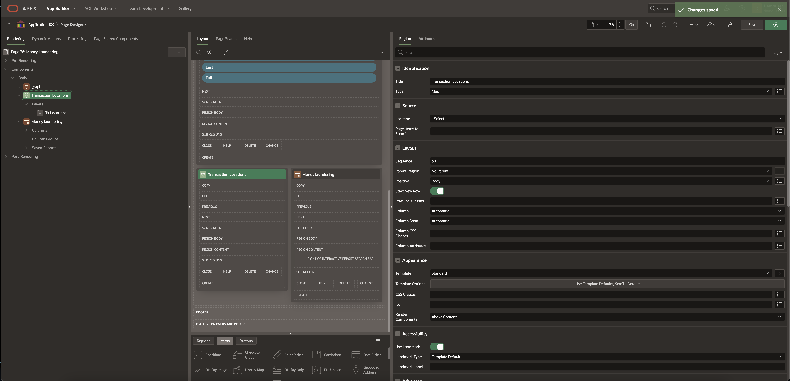
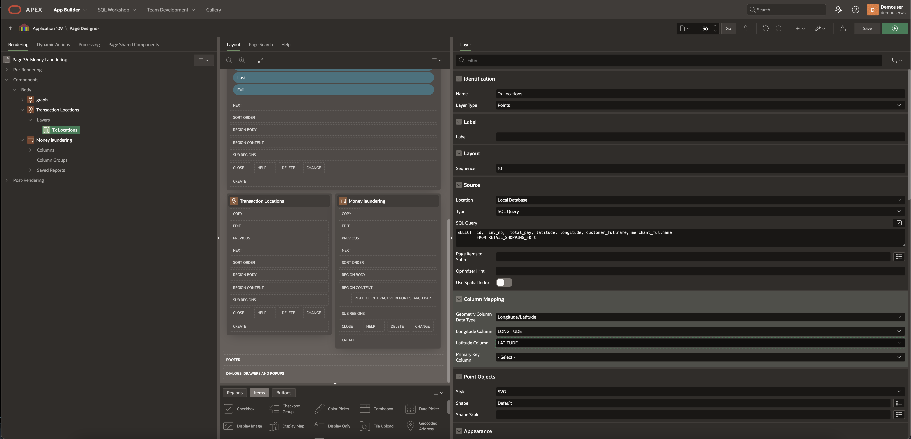
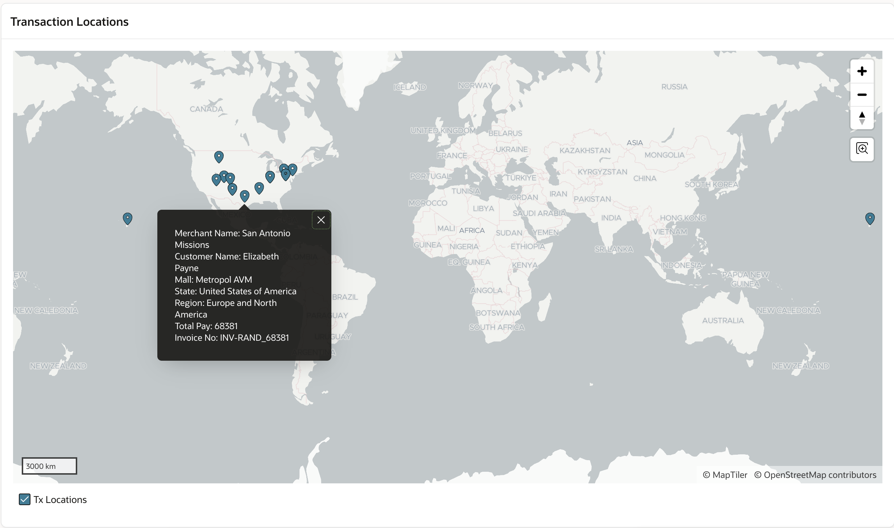
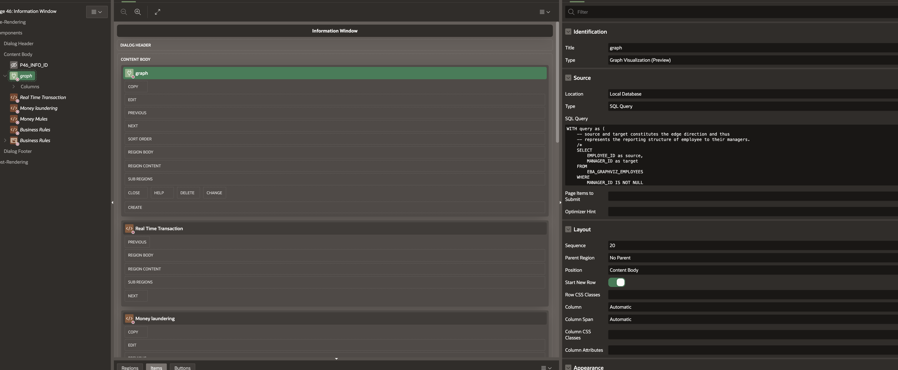
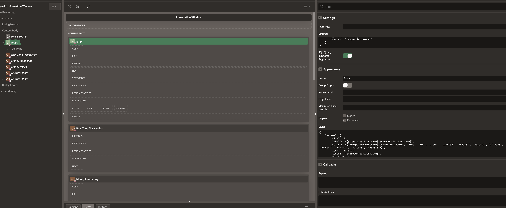
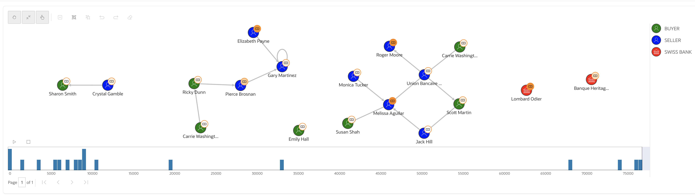
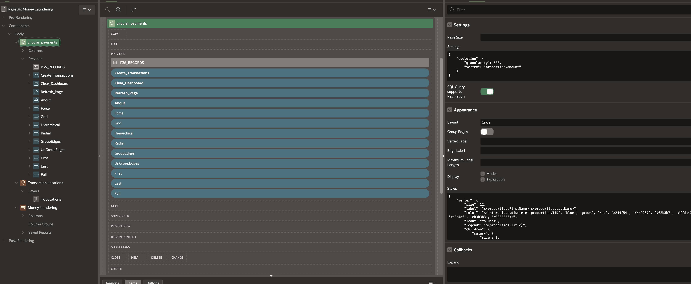
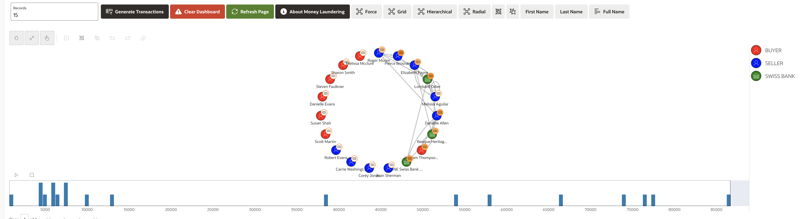
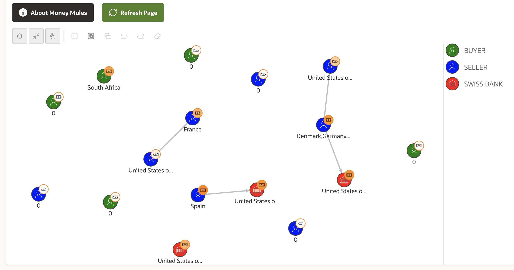

# Detecting Money Laundering and Money Mules

## Introduction

In this lab, we will see how Graphs and Spatial Maps can be generated for various cases using Transaction data.

Estimated Time: 30 mins.
  
### Objectives

In this lab, you will learn how to:

- Create a spatial map based on financial services transactions.
- Create a graph to detect money laundering and money mules in the system.

### Prerequisites

This lab assumes you have:

* Completed previous labs of this workshop: **Setup environment** and logged into **Oracle APEX workspace**  
* Familiarity with Database is desirable
* Some understanding of cloud and database terms is helpful
* Familiarity with SQL is helpful
* Familiarity with Oracle Property Graph is helpful
* Graph plugin has already been installed

### About Spatial Geometry Objects

Spatial geometry objects are drawn on the background map based on data in a table. That table can be sourced from local table or a SQL query. Maps created using the Create Page Wizard or in Page Designer, support both local database tables, REST Enabled SQL, and from REST Data Sources. Maps support a rich set of built-in marker icons and shapes. Supported spatial geometry objects include:

* Points - Points (for example, customer or supplier locations) display as markers.
* Lines - Lines represent features like roads or paths. 
  
You can source spatial geometry objects from either:

* Geometry Column - Supported datatypes include SDO_GEOMETRY, VARCHAR2, or CLOB. VARCHAR2 and CLOB columns must contain geometry information in GeoJSON format.
* Two Numeric Columns - These columns must contain longitude and latitude values. This option only applies to Point and Heat Map objects.

### About Spatial Data

Oracle Database stores spatial data (points, lines, polygons) in a native data type called SDO_GEOMETRY. Oracle Database also provides a native spatial index for high performance spatial operations. This spatial index relies on spatial metadata that is entered for each table and geometry column storing spatial data. Once spatial data is populated and indexed, robust APIs are available to perform spatial analysis, calculations, and processing.

The SDO_GEOMETRY type has the following general format:

  ```sql
<copy>
    SDO_GEOMETRY( 
        [geometry type],           --ID for point/line/polygon
        [coordinate system],       --ID of coordinate system
        [point coordinate],        --for points only
        [line/polygon info],       --for lines/polygons only
        [line/polygon coordinates] --for lines/polygons only
    )
</copy>
```

### About Money Laundering

Mule fraud involves a person, called a money mule, who transfers illicit goods. This can involve drugs but when it comes to the financial industry, usually involves money. The money mule transfers money to his or her own account, and the money is then transferred to another scam operator who is usually in another country.

With graph technology, users can take the transaction information as edges and generate more features of the accounts based on surrounding relationships and transactions. For example, by using graph-based centrality scores, users can determine how close certain accounts are to known mule accounts.

Graph users can quickly discover the accounts with similar relationships or the accounts involved with patterns like circulation and flag them for further investigation. graph technology can enhance machine learning models trained to discover money mules and mule fraud.

### About Money Mules

Mule fraud involves a person, called a money mule, who transfers illicit goods. This can include drugs, but when it comes to the financial industry, it usually involves money. The money mule transfers money to their account, which is then transferred to another scam operator, usually in another country. Traditionally, rule-based models create alerts, and humans flag suspicious accounts. 

This is where graphs and spatial can help. With graph technology, users can take the transaction information as edges and generate more features of the accounts based on surrounding relationships and transactions. For example, by using graph-based centrality scores, users can determine how close certain accounts are to known mule accounts.

## Task 1: Create Transactions Map

1. Create an APEX page, add region of type **Map**. 
   
   

2. Inside this region create a layer with title as **Transaction Locations**. layer type should be **Point**, Location as **Local Database** Type as **SQL Query**. Copy paste this SQL query, you can modify the SQL query but most important is to have **latitude** and **longitude** columns.

    ```sql
    <copy>
        SELECT  id,  inv_no,  total_pay, latitude, longitude, customer_fullname, merchant_fullname FROM RETAIL_SHOPPING_FD  
    </copy>
    ```  

  

  Under column mappings map **latitude** and **longitude** columns.

3. If you want to display all the transactions with in certain region, the updated query will be

    ```sql
    <copy>
        SELECT  id, inv_no,  total_pay, trans_status, this_mall, latitude, longitude, customer_fullname, merchant_fullname, merchant_place, merchant_state, merchant_region  
        FROM RETAIL_SHOPPING_FD 
        where merchant_state = '<region name>'   
    </copy>
    ```  
  
    replace &lt;region name&gt; as required, for example 'United States of America'

4. In the right navigation menu, Enable **advanced formatting** below the **info window** add the following HTML expression. This will display Map onclick items

    ```
    <copy>
          Merchant Name: &MERCHANT_PLACE. <br/>
    Customer Name: &CUSTOMER_FULLNAME. <br/> 
    Mall: &THIS_MALL. <br/>
    State: &MERCHANT_STATE. <br/>
    Region: &MERCHANT_REGION. <br/>
    Total Pay: &TOTAL_PAY. <br/>
    Invoice No: &INV_NO. <br/>
    </copy>
    ```  

5. Run the APEX page

  

## Task 2: Create Basic Transactions Graph using Graph Visualization

1. Create an APEX page and add graph region, select type as **Graph Visualization**, replace SQL query as shown below.

    ```sql
    <copy>
    WITH query as (
    -- source and target constitutes the edge direction and thus
    -- represents the reporting structure of employee to their managers. 
      select 
          SRC_ACCT_ID as source , 
          DST_ACCT_ID as target  
          from bank_transfers where DESCRIPTION = 'FDTX'  
        ),
        page AS ( 
            SELECT
                *
            FROM
                query
            ORDER BY
                source,
                target OFFSET :page_start ROWS FETCH NEXT :page_size ROWS ONLY 
        ),
        vertices AS ( 
            SELECT
                JSON_OBJECT( 
                    'id' VALUE FINBANK_ACCOUNTS.ID,
                    'properties' VALUE JSON_OBJECT(
                        'FirstName' VALUE finbank_accounts.FIRST_NAME,
                        'LastName' VALUE finbank_accounts.LAST_NAME, 
                        'Department' VALUE finbank_accounts.DEPARTMENT_ID,
                        'TxDate' VALUE finbank_accounts.ACC_DATE,
                        'JobId' VALUE finbank_accounts.JOB_ID,
                        'JobTitle' VALUE jobs.JOB_TITLE,
                        'Amount' VALUE bank_transfers.Amount 
                    )
                ) AS vertex
            FROM 
                FINBANK_ACCOUNTS finbank_accounts 
                LEFT OUTER JOIN EBA_GRAPHVIZ_JOBS jobs ON finbank_accounts.JOB_ID = jobs.JOB_ID
                LEFT OUTER JOIN BANK_TRANSFERS bank_transfers ON finbank_accounts.ID = bank_transfers.SRC_ACCT_ID  
            WHERE 
                bank_transfers.SRC_ACCT_ID in (
                    SELECT
                        source
                    from
                        page
                )
                or bank_transfers.DST_ACCT_ID in (
                    SELECT
                        target
                    from
                        page
                ) 
        ),
        edges AS ( 
            SELECT
                JSON_OBJECT('source' VALUE source, 'target' VALUE target) AS edge
            FROM
                page
        )
        SELECT 
            JSON_OBJECT(
                'vertices' VALUE (
                    SELECT
                        JSON_ARRAYAGG(vertex returning clob)
                    FROM
                        vertices
                ),
                'edges' VALUE (
                    SELECT
                        JSON_ARRAYAGG(edge returning clob)
                    FROM
                        edges
                ),
                'numResults' VALUE (
                    SELECT
                        COUNT(*)
                    FROM
                        query
                ) returning clob
            ) json
        FROM
            SYS.DUAL  
    </copy>
    ```  

  

1. Click on **Attributes** tab, provide **settings** as shown below.
   
    ```
    <copy>
    {
        "evolution": {
          "granularity": 500,
          "vertex": "properties.Amount"
        }
    }
    </copy>
    ```    

2. Provide **Styles** as shown below.

    ```
    <copy>
    {
      "vertex": {
          "size": 12,
          "label": "${properties.FirstName} ${properties.LastName}",
          "color": "${interpolate.discrete('properties.JobId', 'blue', 'red', 'green', '#244f54', '#449287', 
                    '#62b3b7', '#ffda40', '#dda831', '#e96e4c', '#e8b4af', '#b3b3b3', '#333333')}",
          "icon": "fa-user",
          "legend": "${properties.JobTitle}",
          "children": {
              "salary": {
                  "size": 8,
                  "color": "${interpolate.color('properties.Amount', 'white', '#FB8500')}",
                  "icon": {
                      "class": "fa-money",
                      "color": "black"
                  },
                  "border": {
                      "width": 1,
                      "color": "#FB8500"
                  }
              }
          }
      },
      "vertex[!!properties.Country]": {
          "children": {
              "flag": {
                  "size": 10,
                  "image": {
                      "url": "https://flagcdn.com/40x30/${(properties.Country === 'UK' ? 'GB' : properties.Country).toLowerCase()}.png",
                      "scale": 0.8
                  }
              }
          }
      },
      "vertex[['VP', 'SWISS BANK', 'FI_MGR', 'AC_MGR', 'SA_MAN', 'PU_MAN', 'ST_MAN'].indexOf(properties.JobId) >= 0]": {
          "icon": "fa-university"
      }
    }
    </copy>
    ```  

  

4. Run the page as to see graph as shown below.

   
 
## Task 3: Create Graph for Money Laundering

1. Create an APEX page and add graph region, select type as **Graph Visualization**, replace SQL query as shown below.

    ```sql
    <copy>
    WITH query as (
    -- source and target constitutes the edge direction and thus  
    select 
      SRC_ACCT_ID as source , 
      DST_ACCT_ID as target  
      from bank_transfers where DESCRIPTION = 'ML'  
    ),
    page AS (
        -- pagination
        SELECT
            *
        FROM
            query
        ORDER BY
            source,
            target OFFSET :page_start ROWS FETCH NEXT :page_size ROWS ONLY 
    ),
    vertices AS ( 
        SELECT
            JSON_OBJECT( 
                'id' VALUE FINBANK_ACCOUNTS.ID,
                'properties' VALUE JSON_OBJECT(
                    'FirstName' VALUE finbank_accounts.FIRST_NAME,
                    'LastName' VALUE finbank_accounts.LAST_NAME, 
                    'Department' VALUE finbank_accounts.DEPARTMENT_ID,
                    'TxDate' VALUE finbank_accounts.ACC_DATE,
                    'TID' VALUE finbank_accounts.JOB_ID,
                    'Title' VALUE jobs.JOB_TITLE,
                    'Amount' VALUE bank_transfers.Amount 
                )
            ) AS vertex
        FROM 
            FINBANK_ACCOUNTS finbank_accounts 
            LEFT OUTER JOIN EBA_GRAPHVIZ_JOBS jobs ON finbank_accounts.JOB_ID = jobs.JOB_ID
            LEFT OUTER JOIN BANK_TRANSFERS bank_transfers ON finbank_accounts.ID = bank_transfers.SRC_ACCT_ID   
        WHERE 
            bank_transfers.SRC_ACCT_ID in (
                SELECT
                    source
                from
                    page
            )
            or bank_transfers.DST_ACCT_ID in (
                SELECT
                    target
                from
                    page
            )

    ),
    edges AS ( 
        SELECT
            JSON_OBJECT('source' VALUE source, 'target' VALUE target) AS edge
        FROM
            page
    )
    SELECT 
        JSON_OBJECT(
            'vertices' VALUE (
                SELECT
                    JSON_ARRAYAGG(vertex returning clob)
                FROM
                    vertices
            ),
            'edges' VALUE (
                SELECT
                    JSON_ARRAYAGG(edge returning clob)
                FROM
                    edges
            ),
            'numResults' VALUE (
                SELECT
                    COUNT(*)
                FROM
                    query
            ) returning clob
        ) json
    FROM
        SYS.DUAL 
    </copy>
    ```   

1. Click on **Attributes** tab, provide **settings** as shown below. under Appearance select layout as **Circle**
   
    ```
    <copy>
    {
        "evolution": {
          "granularity": 500,
          "vertex": "properties.Amount"
        }
    }
    </copy>
    ```    

    

2. Provide **Styles** as shown below.

    ```
    <copy>
    {
      "vertex": {
          "size": 12,
          "label": "${properties.FirstName} ${properties.LastName}",
          "color": "${interpolate.discrete('properties.JobId', 'blue', 'red', 'green', '#244f54', '#449287', 
                    '#62b3b7', '#ffda40', '#dda831', '#e96e4c', '#e8b4af', '#b3b3b3', '#333333')}",
          "icon": "fa-user",
          "legend": "${properties.JobTitle}",
          "children": {
              "salary": {
                  "size": 8,
                  "color": "${interpolate.color('properties.Amount', 'white', '#FB8500')}",
                  "icon": {
                      "class": "fa-money",
                      "color": "black"
                  },
                  "border": {
                      "width": 1,
                      "color": "#FB8500"
                  }
              }
          }
      },
      "vertex[!!properties.Country]": {
          "children": {
              "flag": {
                  "size": 10,
                  "image": {
                      "url": "https://flagcdn.com/40x30/${(properties.Country === 'UK' ? 'GB' : properties.Country).toLowerCase()}.png",
                      "scale": 0.8
                  }
              }
          }
      },
      "vertex[['VP', 'SWISS BANK', 'FI_MGR', 'AC_MGR', 'SA_MAN', 'PU_MAN', 'ST_MAN'].indexOf(properties.JobId) >= 0]": {
          "icon": "fa-university"
      }
    }
    </copy>
    ```  
  
4. Run the page as to see graph as shown below. This shows transactions in **Circular payments**

   

## Task 4: Create Graph for Money Mules

1. Create an APEX page and add graph region, select type as **Graph Visualization**, replace SQL query as shown below.

    ```sql
    <copy>
    WITH query as ( 
    select 
    SRC_ACCT_ID as source , 
    DST_ACCT_ID as target  
    from bank_transfers where DESCRIPTION = 'ML'
    AND MERCHANT_STATE != 'United States of America'
    ),
    page AS (
        -- pagination
        SELECT
            *
        FROM
            query
        ORDER BY
            source,
            target OFFSET :page_start ROWS FETCH NEXT :page_size ROWS ONLY 
    ),
    vertices AS ( 
        SELECT
            JSON_OBJECT( 
                'id' VALUE FINBANK_ACCOUNTS.ID,
                'properties' VALUE JSON_OBJECT(
                    'FirstName' VALUE FINBANK_ACCOUNTS.FIRST_NAME,
                    'LastName' VALUE FINBANK_ACCOUNTS.LAST_NAME, 
                    'Department' VALUE FINBANK_ACCOUNTS.DEPARTMENT_ID,
                    'HireDate' VALUE FINBANK_ACCOUNTS.ACC_DATE,
                    'JobId' VALUE FINBANK_ACCOUNTS.JOB_ID,
                    'JobTitle' VALUE jobs.JOB_TITLE,
                    'MERCHANT_STATE' VALUE bank_transfers.MERCHANT_STATE,
                    'Amount' VALUE bank_transfers.Amount
                  
                )
            ) AS vertex
        FROM
            
            FINBANK_ACCOUNTS finbank_accounts 
            LEFT OUTER JOIN EBA_GRAPHVIZ_JOBS jobs ON finbank_accounts.JOB_ID = jobs.JOB_ID
            LEFT OUTER JOIN BANK_TRANSFERS bank_transfers ON finbank_accounts.ID = bank_transfers.SRC_ACCT_ID  
        WHERE
            
            bank_transfers.SRC_ACCT_ID in (
                SELECT
                    source
                from
                    page
            )
            or bank_transfers.DST_ACCT_ID in (
                SELECT
                    target
                from
                    page
            )

        ),
    edges AS (
      
        SELECT
            JSON_OBJECT('source' VALUE source, 'target' VALUE target) AS edge
        FROM
            page
    )
    SELECT 
        JSON_OBJECT(
            'vertices' VALUE (
                SELECT
                    JSON_ARRAYAGG(vertex returning clob)
                FROM
                    vertices
            ),
            'edges' VALUE (
                SELECT
                    JSON_ARRAYAGG(edge returning clob)
                FROM
                    edges
            ),
            'numResults' VALUE (
                SELECT
                    COUNT(*)
                FROM
                    query
            ) returning clob
        ) json
    FROM
        SYS.DUAL 
    </copy>
    ```   

2. Click on **Attributes** tab, under Appearance select layout as blank
      
3. Provide **Styles** as shown below.

    ```
    <copy>
    {
      "vertex": {
          "size": 12,
          "label": "${properties.MERCHANT_STATE}",
        "color": "${interpolate.discrete('properties.JobId', 'blue', 'red', 'green', '#244f54', '#449287', '#62b3b7', '#ffda40', '#dda831', '#e96e4c', '#e8b4af', '#b3b3b3', '#333333')}",
          "icon": "fa-user",
          "legend": "${properties.JobTitle}",
          "children": {
              "salary": {
                  "size": 8,
                  "color": "${interpolate.color('properties.Amount', 'white', '#FB8500')}",
                  "icon": {
                      "class": "fa-money",
                      "color": "black"
                  },
                  "border": {
                      "width": 1,
                      "color": "#FB8500"
                  }
              }
          }
      },
      "vertex[!!properties.Country]": {
          "children": {
              "flag": {
                  "size": 10,
                  "image": {
                      "url": "https://flagcdn.com/40x30/${(properties.Country === 'UK' ? 'GB' : properties.Country).toLowerCase()}.png",
                      "scale": 0.8
                  }
              }
          }
      },
        "vertex[['SWISS BANK', 'AD_VP', 'FI_MGR', 'AC_MGR', 'SA_MAN', 'PU_MAN', 'ST_MAN'].indexOf(properties.JobId) >= 0]": {
            "icon": "fa-university"
        }
    } 
    </copy>
    ```  
  
4. Run the page as to see graph as shown below. This shows transactions outside the customer region that is in this case outside **North America** or in **Unknown locations**

   

## Learn More

* [Getting Started with Oracle Property Graphs](https://docs.oracle.com/en/database/oracle/property-graph/21.2/spgdg/getting-started-oracle-property-graphs.html) 
* [Apps and Plug-ins](https://oracle.github.io/apex/)
* [Interactive Graph Visualization in Oracle APEX Applications](https://docs.oracle.com/en/cloud/paas/autonomous-database/csgru/apex-graph-visualization-plug.html)

## Acknowledgements

* **Author** - Architect, Author and Developer - Madhusudhan Rao B M, Principal Product Manager, Oracle Database
* **Last Updated By/Date** - Jan 10th, 2024