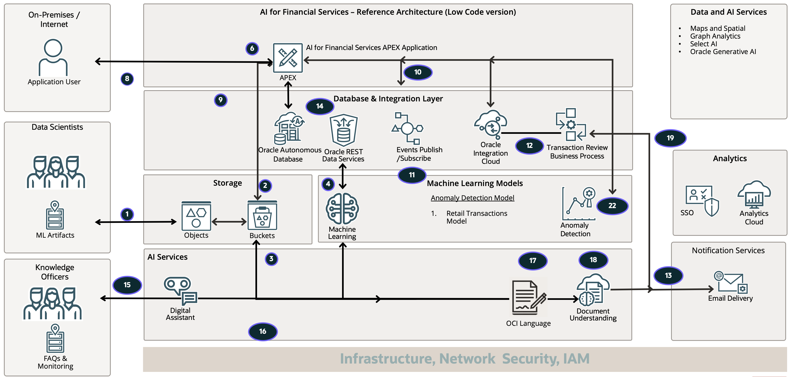

# Introduction

## About this Workshop

Real-time Financial Services Transaction Monitoring

In the financial services banking sector, money transfer transactions run over millions in a given second, and there are multiple modes of money transfer over the Internet from person to person and bank to bank. It can be via debit cards, credit cards, internet banking, unified payment interface, etc.

Fraud prevention plays a significant role in fraud detection. For example, the transaction monitoring system will approve genuine transactions, reject fraudulent transactions, or on-hold those in question based on multiple business rules, such as transaction amount, location of customer and merchant, purchase category, the time between two consecutive transactions (frequency), etc. By detecting transactional fraud, intelligent systems can prevent recurring fraud by temporarily blocking cards or payment interfaces. 

The on-hold transactions can undergo a human review and approval process. Reviewers can also take action on suspected transactions using customer profile document verifications or previous transaction history.

This workshop covers financial services use cases, such as fraud detection, money laundering, and money mules in the system on a simulated real-time transaction dashboard.
  
Estimated Workshop Time: 2 Hours

### Objectives

In this workshop, you will learn how to:

* Detect fraudulent credit/debit card transactions with a real-time dashboard. 
* Detect money laundering and money mules in the transaction system. 

### Prerequisites
 
This lab assumes you have the following:

* An Oracle cloud account
* Familiarity with Oracle APEX and PL/SQL.  
* Familiarity with Database is desirable  
* Familiarity with Oracle Property Graph is helpful
* Familiarity with cloud and database terms is helpful
 
<!-- ### AI for Financial Services - Complete Demo and Architecture video

[Demo video on AI for Financial Services](youtube:R7UIFywtkno:large)

 -->

## Learn More

* [Oracle APEX](https://apex.oracle.com/en/)
* [Autonomous Database](https://www.oracle.com/in/autonomous-database/)  
* [Process Automation](https://www.oracle.com/in/integration/process-automation/) 

## Acknowledgements

* **Author** - Architect, Author and Developer - Madhusudhan Rao B M, Principal Product Manager, Oracle Database
* **Last Updated By/Date** - July 2024
