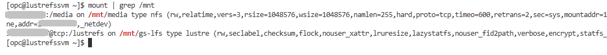
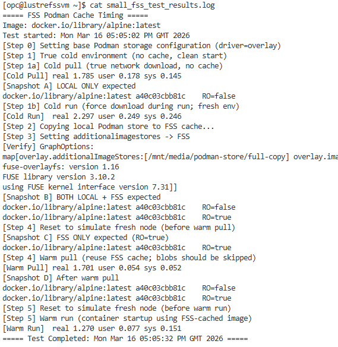

# Explore FSS and Lustre benchmarking scenarios

## Introduction

In the previous lab, you provisioned the OCI environment and prepared the VM for benchmarking through cloud-init. 
In this lab, you will explore several practical scenarios for running the benchmarking script on the provisioned VM to evaluate container image reuse and startup performance with FSS and Lustre.

Estimated Time: 30 minutes

### Objectives

Hands-on experience with:

- Running the benchmarking script on the provisioned VM
- Testing different storage backends: OCI File Storage Service (FSS) and OCI Lustre File Storage
- Comparing cold vs warm image pulls and container starts
- Evaluating container image reuse across different image profiles

### **Prerequisites**

- The provisioning lab has been completed successfully
- Access to the provisioned compute instance through SSH
- Basic familiarity with Linux command-line usage
- The benchmarking script is available on the VM under `/tmp`
- Podman, FSS, and Lustre have been configured successfully by the provisioning workflow

## Task 1 — Review the deployed environment

1. Open the extracted Terraform repository in VS Code and review the main input files:
    - `terraform.tfvars`
    - `provider.auto.tfvars`

    These files define the OCI provider settings, tenancy information, and deployment-specific variables used by the lab.

2. Review the OCI resources created in your tenancy from the OCI Console.
Confirm that the deployment created the expected components, such as:

    - Networking resources
    - Compute instance
    - OCI File Storage Service (FSS)
    - OCI Lustre File Storage

3. From the Terraform directory, inspect the deployment outputs:

    ```
    terraform output
    ```

    This displays useful information such as the public IP address of the provisioned VM.

4. List the Terraform-managed resources:

    ```
    terraform state list
    ```

    This helps you understand which OCI resources were created and are currently tracked in Terraform state.

## Task 2 — Connect to the provisioned VM

1. Use SSH to connect to the provisioned compute instance:

    ```<copy>
    ssh opc@<instance_public_ip>
    ```

2. Once connected, this VM will be the main environment used for verification, inspection, and benchmarking in the next steps.


## Task 3 — Verify the FSS and Lustre mounts

1. Before benchmarking, confirm that the FSS mount is available:

    ```
    mount | grep \mnt
    ```

    

2. This verifies that OCI File Storage Service was mounted successfully on the VM, typically under `/mnt/media`, and Lustre unde `\mnt\gs-lfs\`.
If cloud-init is still running, wait until the provisioning workflow completes before continuing. 

**Note:** Refer to the previous lab for how to verify that cloud-init has completed.


## Task 4 — Inspect the shared Podman cache locations on FSS

1. Become root and inspect the shared storage locations prepared for Podman image reuse:

    ```
    sudo -i
    ls /mnt/media/podman-store
    ls /mnt/media/podman-store/full-copy
    ```

2. These directories are prepared by the provisioning workflow and will be used by Podman to store and reuse image data on shared storage.

3. After running the benchmark script, you can inspect the populated cache content in locations such as:

    ```
    cd /mnt/media/podman-store/full-copy/overlay-images
    ls
    cd /mnt/media/podman-store/full-copy/overlay
    ls
    ```

    Once the benchmark populates these directories, identical image layers can be reused from shared storage instead of being downloaded and unpacked again.

4. What these locations represent:

    - `overlay-images` contains image metadata and references
    - `overlay` contains unpacked layer data used during container startup

    Once populated, these shared cache locations help reduce repeated downloads and improve container startup time across systems that use the same storage.

## Task 5 — Verify the benchmarking script

- Confirm that the benchmarking script is present on the VM:

    ```
    ls /tmp
    ```
    You should see:

    ```
    lustre_fss_test_script.sh
    ```


## Task 6 — Run the benchmarking script in interactive mode

1. Change to the directory where the script is located:

    ```
    cd /tmp
    ```

2. Run the script in interactive mode:

    ```
    ./lustre_fss_test_script.sh
    ```

3. When prompted, select:

    - the storage backend: FSS OR Lustre
    - the image profile: small OR medium OR large

4. The script will guide you step by step through the benchmark flow and pause between stages so you can observe what happens.

5. At the end of the run, the results are saved under:

    ```
    /home/opc/*_test_results.log 
    ```


## Task 7 — Review the benchmark results

1. After the script completes, review the generated log file:

    ```
    ls /home/opc/*_test_results.log
    cat /home/opc/*_test_results.log
    ```

2. In the output, identify the measured sections:

    - **Cold Pull**
    - **Cold Run**
    - **Warm Pull**
    - **Warm Run**

3. Compare the timings to observe how shared storage improves reuse:

    - Cold pull shows the cost of downloading image data from the registry
    - Warm pull shows reuse of cached layers from shared storage
    - Cold run includes image retrieval plus container startup
    - Warm run shows container startup using already available cached content

4. You should observe that warm scenarios are faster because the image data is reused from shared storage instead of being downloaded and prepared again.


## Task 8 — Inspect the populated shared cache after the benchmark

1. After the benchmark run, inspect the shared cache directories created on FSS or Lustre.

    For FSS:

    ```
    sudo -i
    cd /mnt/media/podman-store/full-copy/overlay-images
    ls
    cd ../overlay
    ls
    ```

    For Lustre:

    ```
    sudo -i
    cd /mnt/gs-lfs/podman-store/full-copy/overlay-images
    ls
    cd ../overlay
    ls
    ```

2. These locations now contain the image data prepared by Podman during the benchmark.
  
    - `overlay-images` contains image metadata and layer references
    - `overlay` contains unpacked layer content used during container startup
  
3. This illustrates how shared storage enables reuse across runs and across systems that access the same cache.

    - **Warm pull** can reuse existing image layers instead of downloading them again
    - **Warm run** can reuse already prepared image content instead of unpacking it again

4.  Because identical layers are stored once and identified by digest, multiple systems can reference the same cached content, which helps reduce image download and startup time.


## Task 9 — Run additional benchmark scenarios

1. Re-run the script with different backend and image profile combinations.

    Example:

    ```
    BACKEND=fss IMAGE_PROFILE=small /tmp/lustre_fss_test_script.sh
    BACKEND=fss IMAGE_PROFILE=large /tmp/lustre_fss_test_script.sh
    BACKEND=lustre IMAGE_PROFILE=small /tmp/lustre_fss_test_script.sh
    BACKEND=lustre IMAGE_PROFILE=large /tmp/lustre_fss_test_script.sh
    ```

2. Compare the generated log files in:

    ```
    /home/opc/*_test_results.log
    ```

    
    

3. This helps you observe how cache reuse behavior changes depending on:

    - the selected backend
    - the image size/profile


You may now **proceed to the next lab**.

## Acknowledgements

**Authors**

* **Adina Nicolescu**, Principal Cloud Architect, NACIE
* Last Updated - Adina Nicolescu, March 2026
