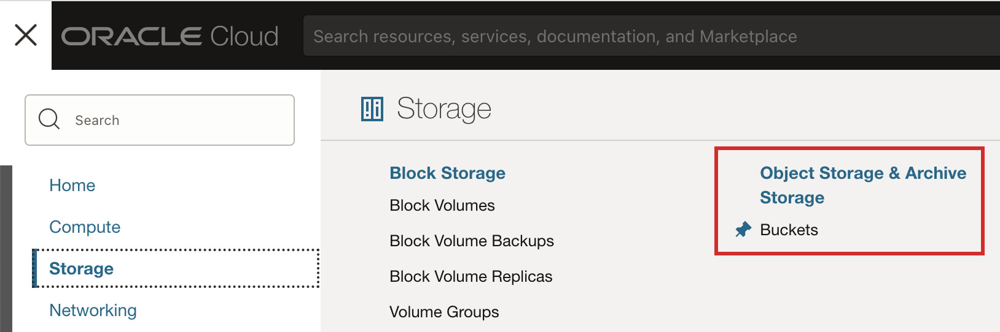
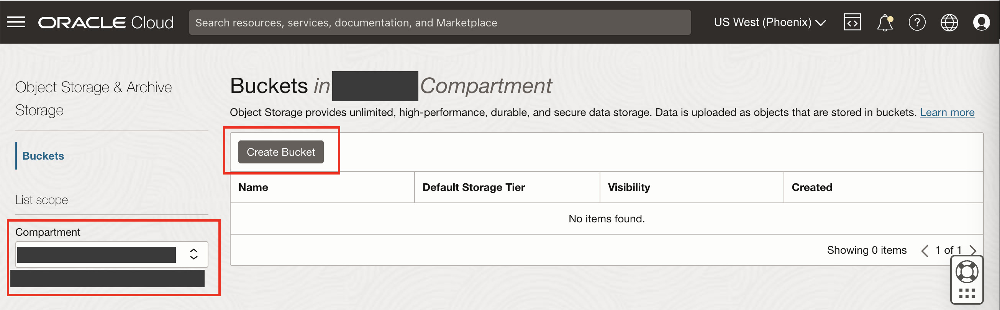
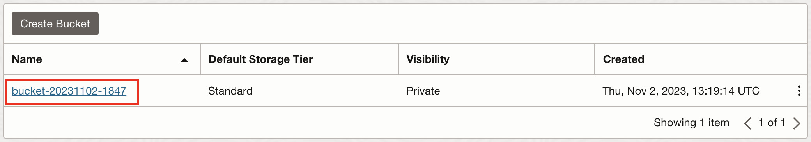
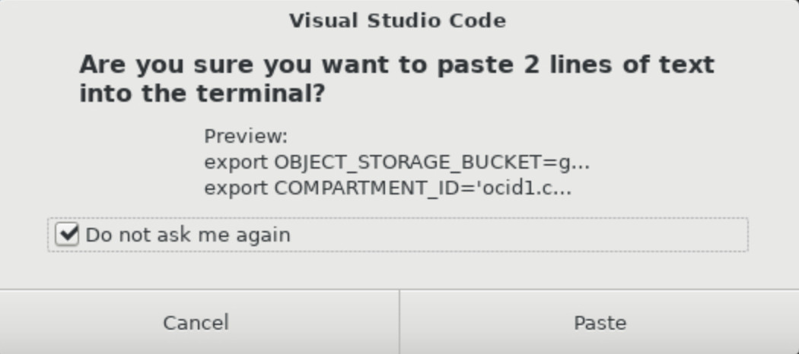

# Provision an OCI Object Storage Bucket

## Introduction

This lab describes the steps to create a new OCI Object Storage Bucket using the OCI CLI.

Estimated Lab Time: 10 minutes

### Objectives

In this lab, you will:

* Create an Object Storage bucket
* View the bucket from the Oracle Cloud console
* Set environment variables

## Task 1: Create an Object Storage Bucket

1. From the Oracle Cloud Console, open the navigation menu, click **Storage**. Under **Object Storage & Archive Storage**, click **Buckets**.

   

2. Select your lab compartment from the **Compartment** drop down list on the left. To find your compartment name, return to the **Login Details** screen, then click **Oracle Cloud**, copy the value from the **Compartment Name** field, paste it in the **Compartment** drop down list in the Oracle Cloud Console and select the filtered compartment.

   

3. Click **Create Bucket**.

   

4. On the **Create Bucket** screen, leave the default values unchanged and click **Create**.

   **Note:** OCI Object Storage bucket names are case-sensitive and must be unique in the tenancy.

   

   The bucket gets created in a few seconds. The next task describe how to view the bucket details.

<!-- 5. Alternatively, create a bucket using the OCI CLI with Instance Principals Auth.

   Run the following OCI CLI command to create the Object Storage bucket in your lab compartment.

	``` bash
	<copy>
	oci os bucket create --compartment-id $COMPARTMENT_ID --name $OBJECT_STORAGE_BUCKET --auth instance_principal
	</copy>
	``` -->

## Task 2: View the Bucket Details

1. You will see your bucket in the **Buckets** list. Click the bucket name hyperlink to go to the bucket details screen.

   

2. On the bucket details screen, scroll down to the **Objects** list. There are no objects listed because the bucket is empty.

   

3. Copy the bucket name. You will need it in the next lab.

<!-- ## Task 3: Set Environment Variables

1. Open a new terminal in VS Code using the **Terminal > New Terminal** menu.

2. Set the environment variable `OBJECT_STORAGE_BUCKET` with a unique bucket name. Set the environment variable `COMPARTMENT_ID` with your workshop compartment OCID.

   **Note:** OCI Object Storage bucket names are case-sensitive and must be unique in the tenancy.

	``` bash
	<copy>
	export OBJECT_STORAGE_BUCKET=gcn-luna-bucket-275553
	export COMPARTMENT_ID=ocid1.compartment.oc1..aaaa...eqba
	</copy>
	```

   

3. Place your cursor in the terminal in VS Code and paste (`CTRL+SHIFT+V`) the script you copied. A dialog box will ask **Are you sure you want to paste 2 lines of test in to the terminal?**. Select the **Do not ask me again** check box and click **Paste** to proceed.

   

   Press the enter (return) key. This script will set two environment variables: `OBJECT_STORAGE_BUCKET` to a unique bucket name; and `COMPARTMENT_ID` to your workshop compartment OCID. These environment variables are used to create the Object Storage bucket. -->

Congratulations! In this lab, you created a new OCI Object Storage bucket in your lab compartment.

You may now **proceed to the next lab**.

## Acknowledgements

* **Author** - [](var:author)
* **Contributors** - [](var:contributors)
* **Last Updated By/Date** - [](var:last_updated)
