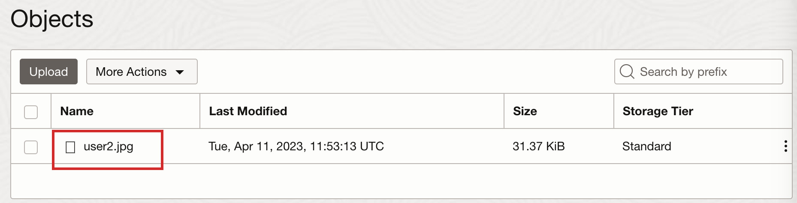
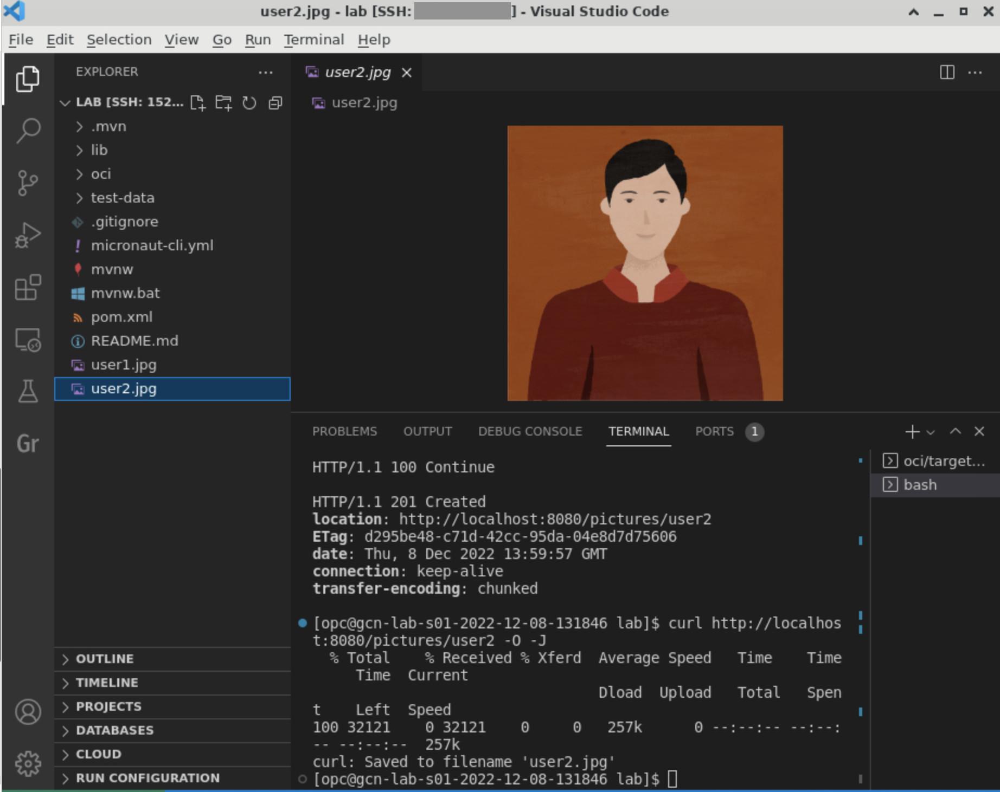

# Build and Run a Native Executable

## Introduction

This lab describes how to build and run a native executable for the application, and use it to upload, download, and delete pictures from the OCI Object Storage bucket.

You will use [GraalVM Native Image](https://docs.oracle.com/en/graalvm/jdk/17/docs/overview/)’s ahead-of-time compilation to build a native executable for the application.

At build time, GraalVM analyzes a Java application and its dependencies to identify just what classes, methods, and fields are absolutely necessary, and then generates a native executable with optimized machine code for just these elements.

Native executables built with GraalVM require less memory, are smaller in size, and start upto 100x faster than just-in-time compiled applications running on a Java Virtual Machine.

Estimated Lab Time: 15 minutes

### Objectives

In this lab, you will:

* Build and run a native executable for the application
* Upload a picture
* Download the picture
* Delete the picture
* Stop the application
* Cleanup

## Task 1: Build and run a native executable for the application

1. In the first terminal in VS Code, check the version of the GraalVM native-image utility:

	``` bash
	<copy>
	native-image --version
	</copy>
	```

2. To generate a native executable using Maven, run the following command:

	``` bash
	<copy>
	./mvnw install -pl lib -am && ./mvnw package -pl oci -Dpackaging=native-image
	</copy>
	```

   It can take approximately 3-4 minutes to generate the native executable.

3. The native executable is created in the _oci/target_ directory and can be run with the following command:

	``` bash
	<copy>
	oci/target/oci
	</copy>
	```

   The native executable starts instantaneously.

## Task 2: Upload a picture

1. From the second terminal in VS Code, send an HTTP POST request to the `/pictures/{userId}` endpoint to upload a picture to the bucket:

	``` bash
	<copy>
	curl -i -F 'fileUpload=@test-data/pic2.jpg' http://localhost:8080/pictures/user2
	</copy>
	```

2. Check the bucket contents. Go to the **OCI Console** >> **Storage** >> **Object Storage & Archive Storage** >> **Buckets** >> **Bucket Details** screen opened in the browser.

   Refresh the screen and scroll down to the **Objects** list. You should see an object named _user2.jpg_.

   

## Task 3: Download the picture

1. From the second terminal in VS Code, send an HTTP GET request to the `/pictures/{userId}` endpoint to download the picture from the bucket:

	``` bash
	<copy>
	curl http://localhost:8080/pictures/user2 -O -J
	</copy>
	```

2. You should see the profile picture _user2.jpg_ downloaded in the _LAB_ directory in VS Code. Click the picture to view it.

   

## Task 4: Delete the picture

1. From the second terminal in VS Code, send an HTTP DELETE request to the `/pictures/{userId}` endpoint to delete the picture from the bucket:

	``` bash
	<copy>
	curl -X DELETE http://localhost:8080/pictures/user2
	</copy>
	```

2. Check the bucket contents. Go to the **OCI Console** >> **Storage** >> **Object Storage & Archive Storage** >> **Buckets** >> **Bucket Details** screen opened in the browser.

   Refresh the screen and scroll down to the **Objects** list. The object _user2.jpg_ has been deleted from the bucket.

   

## Task 5: Stop the application

1. In the first terminal in VS Code, use `CTRL+C` to stop the application.

## Task 6: Cleanup

From the Oracle Cloud Console, clean up the resources provisioned for this workshop:

1. From **Storage >> Object Storage & Archive Storage >> Buckets**, delete the **Bucket**.

2. From **Resource Manager >> Stacks >> Stack Details** screen, first run **Destroy** to delete VCN and Compute instance. Next, delete the **Stack**.

<if type="tenancy">
3. From **Identity & Security >> Identity >> Policies**, delete the Instance Principals **Policy**.
</if>

Congratulations! You've successfully completed this lab. Your Java application native executable can successfully upload, download and delete pictures from the OCI Object Storage bucket.

You may now **proceed to the next lab**.

## Acknowledgements

* **Author** - [](var:author)
* **Contributors** - [](var:contributors)
* **Last Updated By/Date** - [](var:last_updated)
