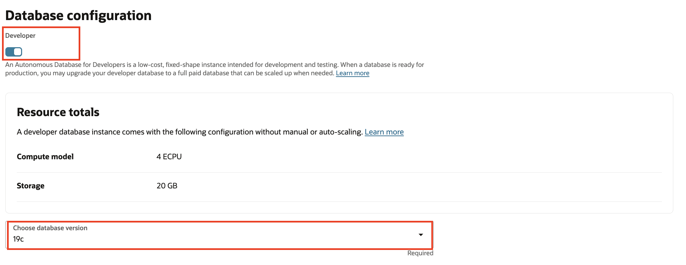

# Provision an OCI Autonomous Database

## Introduction

This lab describes the steps to create a new OCI Autonomous Database instance.

Estimated Lab Time: 10 minutes

### Objectives

In this lab, you will:

* Create an Autonomous Database instance

## Task 1: Create an Autonomous Database instance

1. From the Oracle Cloud Console, open the navigation menu, click **Oracle Database** and then click **Autonomous Database**.

   

2. Select your workshop compartment from the **Compartment** drop down list. Click **Create Autonomous Database**. <if type="desktop">To find the compartment name, return to the **Login Details** screen, then copy the value of the **Compartment Name**, paste it in the **Compartment** drop down list in the Oracle Cloud Console and select the filtered compartment. 

</if>

   

3. You will see the **Create Autonomous Database Serverless** screen with default values.

    

4. Select the workload type as **Transaction Processing**.

    

5. Under the **Configure the database** section, enable the **Developer mode**. In the **Choose database version** dropdown, select 19c.

    

6. Under the **Create administrator credentials** section, enter a password of your choice (must be at least 12 characters and contain a number and an uppercase letter).

    

7. Select the network access type as **Secure access from everywhere**.

    

8. Leave the contact email blank, and click **Create**.

    

   It takes about 2-3 minutes to provision an OCI Autonomous Database instance. Meanwhile, proceed to the next step.

Congratulations! In this lab, you created a new OCI Autonomous Database instance in your workshop compartment.

You may now **proceed to the next lab**.

## Acknowledgements

* **Author** - 
* **Contributors** - 
* **Last Updated By/Date** - 
