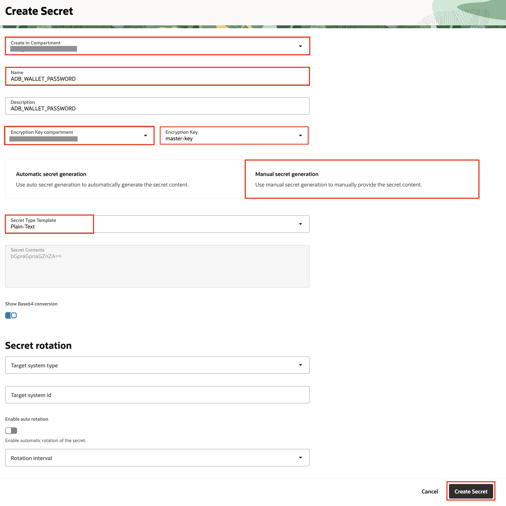
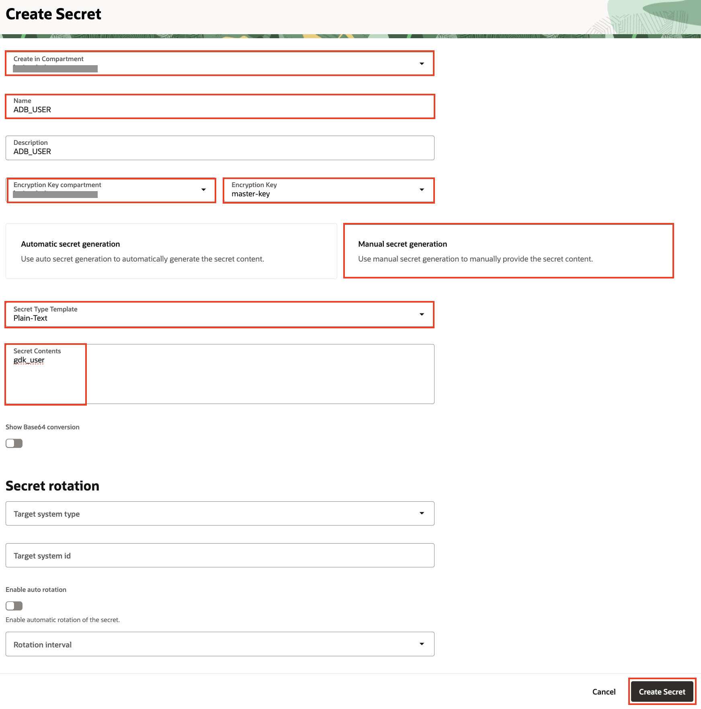
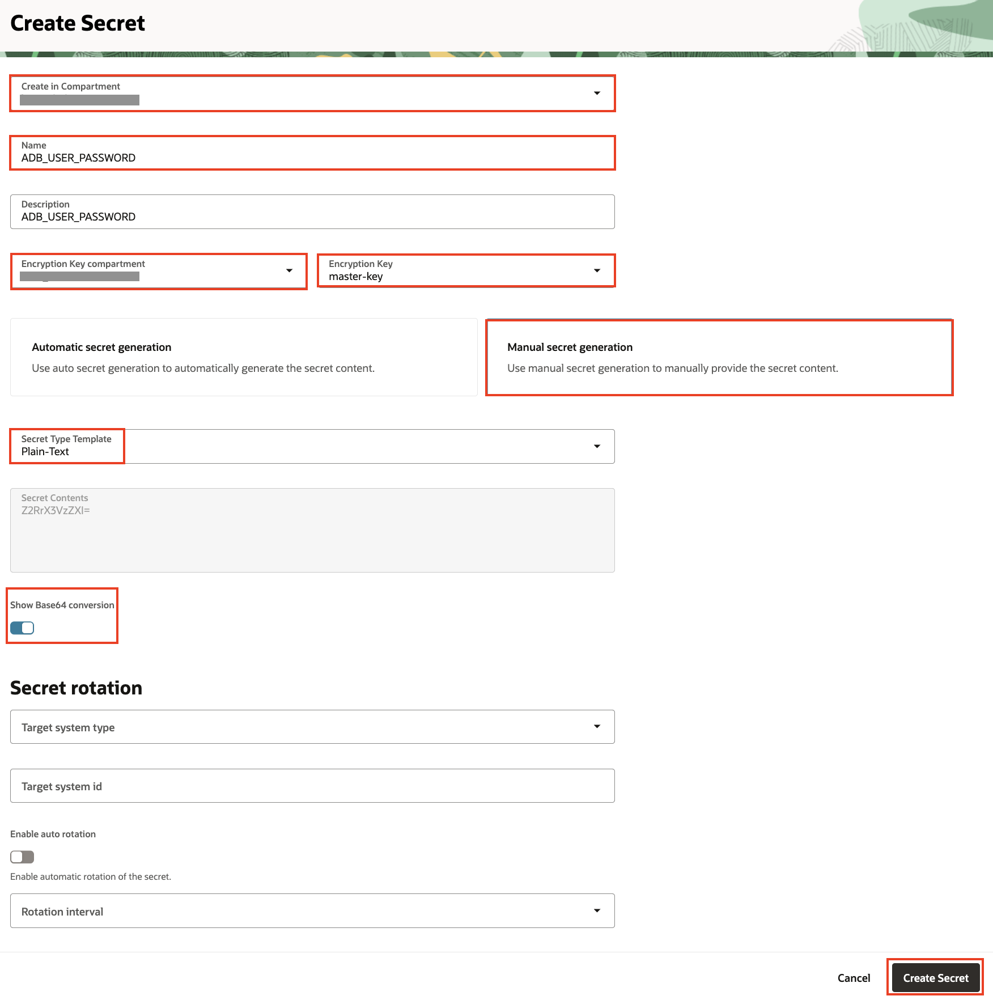

# Configure the OCI Autonomous Database Instance

## Introduction

This lab provides instructions to configure the the OCI Autonomous Database instance.

Flyway will create the database tables the first time the application starts, but you must create a database user first.

Estimated Lab Time: 05 minutes

### Objectives

In this lab, you will:

* Create the Autonomous Database schema user and password
* Create secrets in the Vault for the wallet password, database schema user and password

## Task 1: Create the Autonomous Database schema user and password

1. From the **Autonomous Database details** screen opened in the browser, click **Database actions**.

   

2. From the **Database Actions** drop-down menu, click **SQL** to open the SQL web console.

   

3. From the **SQL** screen, close the `Warning` and the `SQL History` dialog boxes.

   

4. Copy and paste the following SQL commands into the worksheet:

      ```
      <copy>
      CREATE USER gdk_user IDENTIFIED BY "XXXXXXXXX";
      GRANT CONNECT, RESOURCE TO gdk_user;
      GRANT UNLIMITED TABLESPACE TO gdk_user;
      </copy>
      ```

      The schema user password must be at least 12 characters and contain a number and an uppercase letter. Replace the text **XXXXXXXXX** with the schema user password.

5. Back in the **SQL** screen, paste the script you copied into the Worksheet section.

   

6. Click **Run Script** to run the SQL commands. The commands will create a database user, password, and grant all the privileges to the user.

   

## Task 2: Create secrets in the Vault for the wallet password, database schema user and password

1. In the **Vault** you created, navigate to **Secrets**, click **Create Secret**.

2. Created three secrets - `ADB_WALLET_PASSWORD`, `ADB_USER`, and `ADB_USER_PASSWORD` - in the your workshop compartment.

3. Enter the following details:

      ```
      Name: ADB_WALLET_PASSWORD

      Encryption Key: master-key (Select the master key created in the previous lab)

      Manual secret generation 

      Secret Type Template: Plain-Text

      Secret Contents: (Enter a value at least eight characters long and must include at least one letter and either one numeric character or one special character)

      Show Base64 conversion: YES
      ```

      


4. Enter the following details:

      ```
      Name: ADB_USER

      Encryption Key: master-key (Select the master key created in the previous lab)

      Manual secret generation

      Secret Type Template: Plain-Text

      Secret Contents: gdk_user

      Show Base64 conversion: YES
      ```

      

5. Enter the following details:

      ```
      Name: ADB_USER_PASSWORD

      Encryption Key: master-key (Select the master key created in the previous lab)

      Manual secret generation

      Secret Type Template: Plain-Text

      Secret Contents: (Paste the secret value created in the above task)

      Show Base64 conversion: YES
      ```

      


Congratulations! In this section, you created a database schema user and password, and the secrets in OCI Vault.

You may now **proceed to the next lab**.

## Acknowledgements

* **Author** - [](var:author)
* **Contributors** - [](var:contributors)
* **Last Updated By/Date** - [](var:last_updated)
