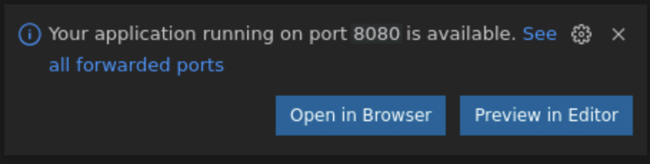

# Build and Run the Application

## Introduction

This lab takes you through the steps to build and run the sample application, and use it to connect to the OCI Autonomous Database instance.

Estimated Lab Time: 10 minutes

### Objectives

In this lab, you will:

* Build and run the application
* Send an HTTP POST request to add a Genre
* Send an HTTP GET request to fetch all the Genres from the database
* Stop the application

## Task 1: Build and run the application

1. In the same terminal in VS Code, run the following command(s):

<if type="mn_run">
   Use `mn:run` to build and start the application on port 8080.

	``` bash
	<copy>
	./mvnw install -pl lib -am && MICRONAUT_ENVIRONMENTS=oraclecloud ./mvnw mn:run -pl oci
	</copy>
	```
</if>

<if type="jar">
   Build an executable JAR file and then use `java -jar` to run it.

	``` bash
	<copy>
	./mvnw install -pl lib -am && MICRONAUT_ENVIRONMENTS=oraclecloud ./mvnw package -pl oci

	MICRONAUT_ENVIRONMENTS=oraclecloud java -jar oci/target/oci-adb-demo-oci-1.0-SNAPSHOT.jar
	</copy>
	```
</if>

## Task 2: Send an HTTP POST request to add a Genre

1. Open a second terminal in VS Code using the **Terminal>New Terminal** menu.

2. From the second terminal in VS Code, add a genre using the command below, and the `GENRE` table will now contain an entry.

	``` bash
	<copy>
	curl -X "POST" "http://localhost:8080/genres" -H 'Content-Type: application/json; charset=utf-8' -d '{ "name": "fiction" }' | jq
	</copy>
	```

   VS Code may prompt you to open the URL in a browser as shown below. Just click the **Configure Notifications** gear icon and then click **Don't Show Again**.

   

   

## Task 3: Send an HTTP GET request to fetch all Genres from the database

1. From the same terminal in VS Code, check the `genres` present in the database using the `/list` endpoint exposed by the application:

	``` bash
	<copy>
	curl localhost:8080/genres/list | jq
	</copy>
	```

## Task 4: Stop the application

1. In the first terminal in VS Code, use `CTRL+C` to stop the application.

Congratulations! You've successfully completed this lab. Your Java application can successfully use the OCI Autonomous Database instance as its backend database, with secrets in OCI Vault.

You may now **proceed to the next lab**.

## Acknowledgements

* **Author** - [](var:author)
* **Contributors** - [](var:contributors)
* **Last Updated By/Date** - [](var:last_updated)
