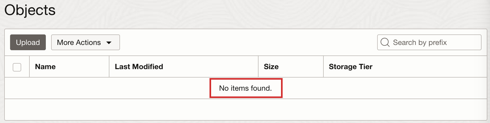

# Build and Run the Application

## Introduction

This section of the lab takes you through the steps to build and run the sample application and then send emails.

Estimated Lab Time: 10 minutes

### Objectives

In this lab, you will:

* Build and run the application
* Send a simple plain-text email
* Send a templated email
* Send an email with an attachment
* Stop the application

## Task 1: Build and run the application

1. In the same terminal in VS Code, run the following command(s).

<if type="mn_run">
   Use `mn:run` to build and start the application on port 8080.

	``` bash
	<copy>
	./mvnw install -pl lib -am && MICRONAUT_ENVIRONMENTS=oraclecloud ./mvnw mn:run -pl oci &
	</copy>
	```
</if>

<if type="jar">
   Build an executable JAR file and then use `java -jar` to run it.

	``` bash
	<copy>
	./mvnw install -pl lib -am && ./mvnw package -pl oci

	MICRONAUT_ENVIRONMENTS=oraclecloud java -jar oci/target/oci-email-demo-oci-1.0-SNAPSHOT.jar &
	</copy>
	```
</if>

2. Press the enter (return) key. Send a simple plain-text email using the following command:

   ```
	<copy>
	curl -X POST localhost:8080/email/basic
	</copy>
	```
    Check the personal email you provided in step **3.4**. You should see the basic email in your Inbox or Spam folder.

3. Send a templated email using the following command:

	```
	<copy>
	curl -X POST localhost:8080/email/template/test
	</copy>
	```

	Check the personal email you provided in step **3.4**. You should see the templated email in your Inbox or Spam folder.

4. Send an email with an attachment using the following command: 

	```
	<copy>
	curl -X POST \
		-H "Content-Type: multipart/form-data" \
		-F "file=@ README.md" \
		localhost:8080/email/attachment
	</copy>
	```

	Check the personal email you provided in step **3.4**. You should see the attachment email in your Inbox or Spam folder.

5. Bring the running application to the foreground:

	``` bash
	fg
	```

6. Once the application is running in the foreground, press `CTRL+C` to stop it.

## Task 2: Send a simple plain-text email

1. Open a second terminal in VS Code using the **Terminal** >> **New Terminal** menu.

2. From the second terminal, send an HTTP POST request to the `/pictures/{userId}` endpoint to upload a picture to the bucket:

	``` bash
	<copy>
	curl -i -F 'fileUpload=@test-data/pic1.jpg' http://localhost:8080/pictures/user1
	</copy>
	```

   VS Code may prompt you to open the URL in a browser as shown below. Just click the **Configure Notifications** gear icon and then click **Don't Show Again**.

   

   

3. Check the bucket contents. Go to the **OCI Console** >> **Storage** >> **Object Storage & Archive Storage** >> **Buckets** >> **Bucket Details** screen opened in the browser.

   Refresh the screen and scroll down to the **Objects** list. You should see an object named _user1.jpg_.

   

## Task 3: Download the picture

1. From the second terminal in VS Code, send an HTTP GET request to the `/pictures/{userId}` endpoint to download the picture from the bucket:

	``` bash
	<copy>
	curl http://localhost:8080/pictures/user1 -O -J
	</copy>
	```

2. You should see the profile picture _user1.jpg_ downloaded in the _LAB_ directory in VS Code. Click the picture to view it.

   

## Task 4: Delete the picture

1. From the second terminal in VS Code, send an HTTP DELETE request to the `/pictures/{userId}` endpoint to delete the picture from the bucket:

	``` bash
	<copy>
	curl -X DELETE http://localhost:8080/pictures/user1
	</copy>
	```

2. Check the bucket contents. Go to the **OCI Console** >> **Storage** >> **Object Storage & Archive Storage** >> **Buckets** >> **Bucket Details** screen opened in the browser.

   Refresh the screen and scroll down to the **Objects** list. The object _user1.jpg_ has been deleted from the bucket.

   

## Task 5: Stop the application

1. In the first terminal in VS Code, use `CTRL+C` to stop the application.

Congratulations! You've successfully completed this lab. Your Java application can successfully upload, download and delete pictures from the OCI Object Storage bucket.

You may now **proceed to the next lab**.

## Acknowledgements

* **Author** - [](var:author)
* **Contributors** - [](var:contributors)
* **Last Updated By/Date** - [](var:last_updated)
