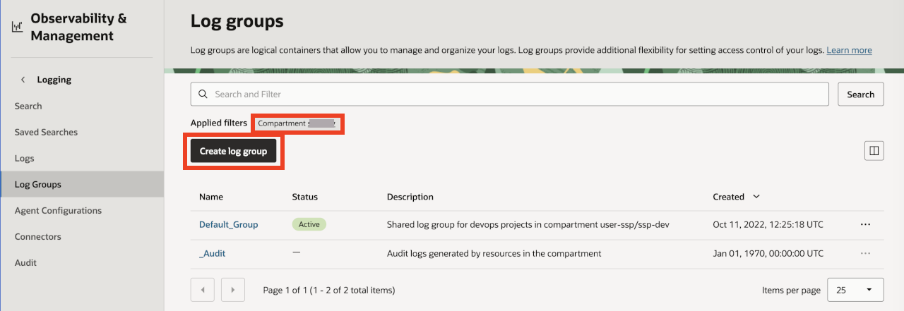
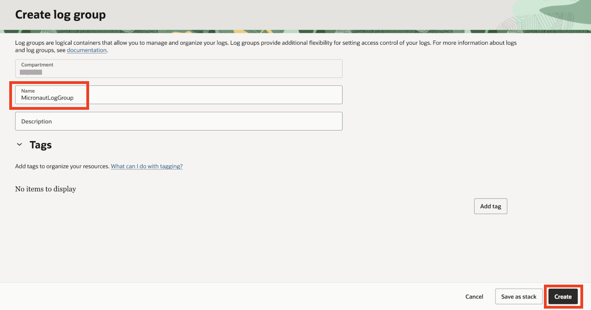
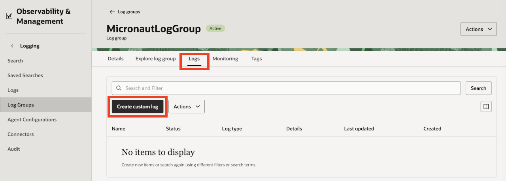
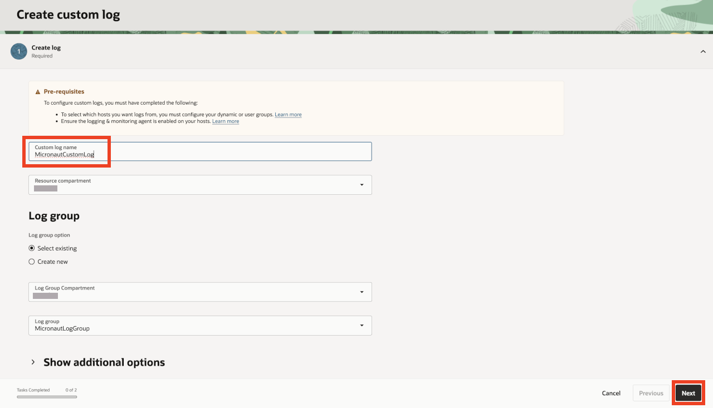
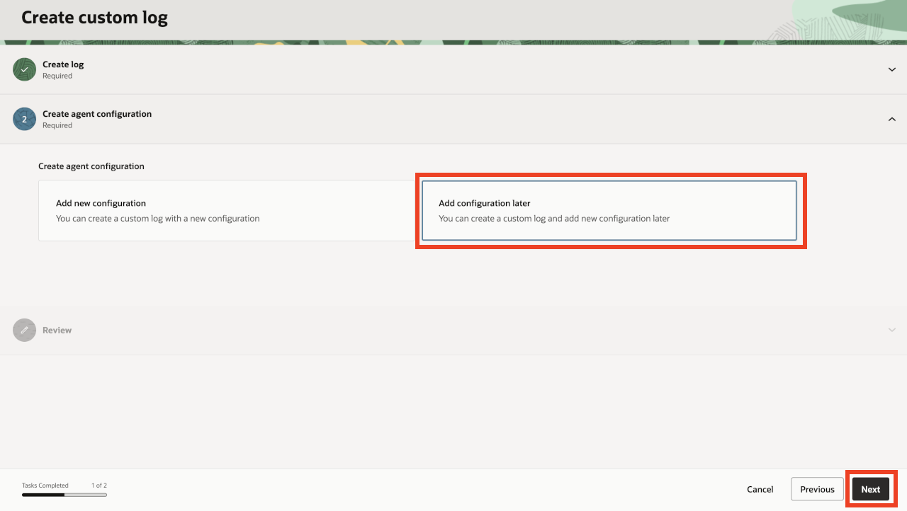
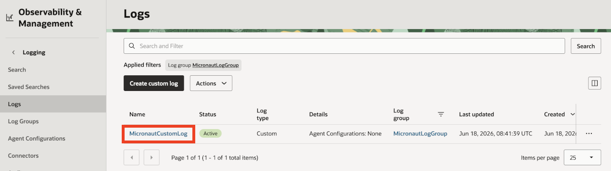
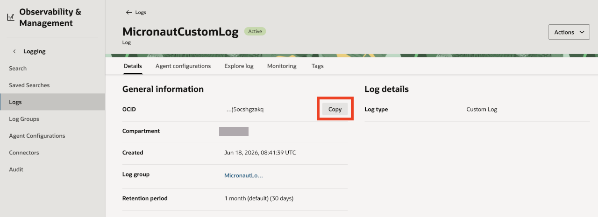

# Configure OCI Logging

## Introduction

This lab provides instructions to configure the OCI Logging service.

Estimated Lab Time: 05 minutes

### Objectives

In this lab, you will:

* Create a Log Group
* Create a Custom Log

## Task 1: Create a Log Group

1. From the Oracle Cloud Console navigation menu, go to **Observability & Management**. Under **Logging**, click **Log Groups**.

    

2. Under **Applied filters**, select your workshop compartment. Click **Create log group**.

    

3. You will see the **Create Log Group** screen. Enter the Name as "MicronautLogGroup". Click **Create** to create the Log Group.

    

## Task 2: Create a Custom Log

1. From the **MicronautLogGroup** details screen, click **Logs**, under **Applied filters**, if visible on the screen, select your workshop compartment. Click **Create custom log**.

    

2. You will see the **Create custom log** wizard. Enter the Custom log name as "MicronautCustomLog". Select Log group as "MicronautLogGroup" from the drop down list (if it's not already selected). Click **Next** to proceed to **Create agent config**.

    

3. On the **Create agent configuration** screen, select the **Add configuration later** option. Click **Next**. Review the information presented on the screen and click **Create**.

    

4. From the Logs list, click **MicronautCustomLog** to go to the Log details screen.

    

15. From the **Details** tab of the **MicronautCustomLog** screen, click **Copy** to copy the Log OCID. You’ll need it to configure the application in the next step.

    

Congratulations! In this lab, you configured OCI Logging by creating a Log Group and a Custom Log object.

You may now **proceed to the next lab**.

## Acknowledgements

* **Author** - 
* **Contributors** - 
* **Last Updated By/Date** - 
