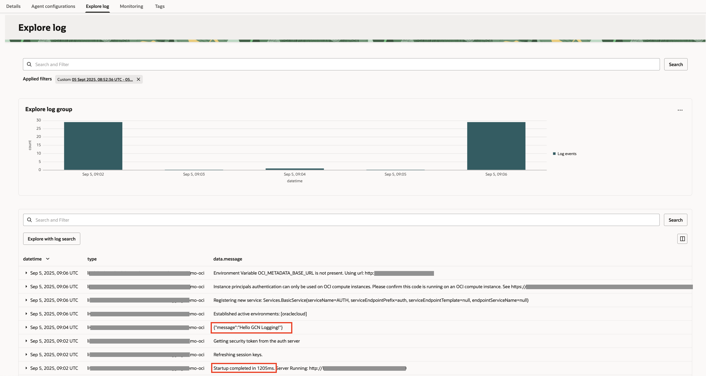

# Build and run the application and view the logs in OCI Logging

## Introduction

This section of the lab takes you through the steps to build and run the sample application and send application logs to OCI Logging.

Estimated Lab Time: 10 minutes

### Objectives

In this lab, you will:

* Build and run the application
* Send an HTTP POST request
* View the application logs in OCI Logging

## Task 1: Build and run the application

1. Open a new terminal in VS Code using the **Terminal > New Terminal** menu.

2. Run the following command to build application:

<if type="mn_run">

   Use `mn:run` to build and start the application on port 8080.

	``` bash
	<copy>
	./mvnw install -pl lib -am && MICRONAUT_ENVIRONMENTS=oraclecloud ./mvnw mn:run -pl oci
	</copy>
	```
</if>

<if type="jar">

   Build an executable JAR file and then use `java -jar` to run it.

	``` bash
	<copy>
	./mvnw install -pl lib -am && ./mvnw package -pl oci

	MICRONAUT_ENVIRONMENTS=oraclecloud java -jar oci/target/oci-logging-demo-oci-1.0-SNAPSHOT.jar
	</copy>
	```
</if>

## Task 2: Send an HTTP POST request

1. Open a second terminal in VS Code using the **Terminal>New Terminal** menu.

2. From the second terminal, send an HTTP POST request to the `/greet` endpoint:

	``` bash
	<copy>
	curl -X POST -H "Content-Type: application/json" -id '{"message":"Hello GCN Logging!"}' http://localhost:8080/greet
	</copy>
	```

	VS Code may prompt you to open the URL in a browser as shown below. Just click the **Configure Notifications** gear icon and then click **Don't Show Again**.

   

   

## Task 3: Stop the application

1. In the first terminal in VS Code, use `CTRL+C` to stop the application.

## Task 4: View the application logs in OCI Logging

1. Go to the **OCI Console >> Logging >> Log Groups >> MicronautLogGroup >> MicronautCustomLog >> Custom Log (MicronautCustomLog) Details** screen opened in the browser. The application logs should appear in the **Explore Log** section. (If necessary, refresh the browser.)

	You can select a different value such as "Past 15 minutes" or "Past hour" in the **Filter by time** drop down list to refresh the logs table view.

   

Congratulations! You've successfully completed this lab. Your Java application can successfully send logs to OCI Logging.

You may now **proceed to the next lab**.

## Acknowledgements

* **Author** - [](var:author)
* **Contributors** - [](var:contributors)
* **Last Updated By/Date** - [](var:last_updated)
