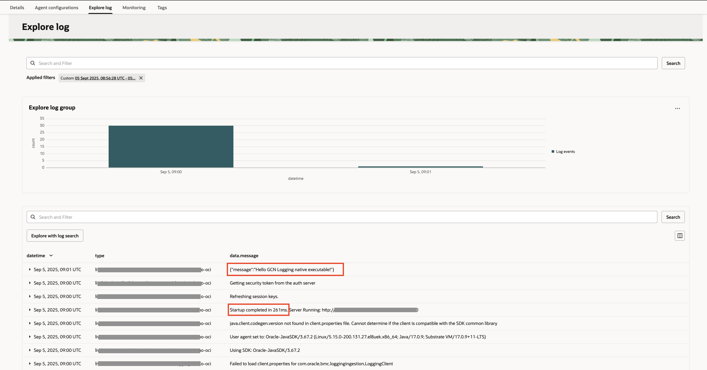

# Build and run a native executable and view the logs in OCI Logging

## Introduction

This lab describes how to build and run a native executable for the application, and send logs to OCI Logging.

You will use [GraalVM Native Image](https://docs.oracle.com/en/graalvm/jdk/17/docs/overview/)’s ahead-of-time compilation to build a native executable for the application.

At build time, GraalVM analyzes a Java application and its dependencies to identify just what classes, methods, and fields are absolutely necessary, and then generates a native executable with optimized machine code for just these elements.

Native executables built with GraalVM require less memory, are smaller in size, and start upto 100x faster than just-in-time compiled applications running on a Java Virtual Machine.

Estimated Lab Time: 15 minutes

### Objectives

In this lab, you will:

* Build and run a native executable for the application
* Send an HTTP POST request
* View the application logs in OCI Logging

## Task 1: Build and run a native executable for the application

1. In the first terminal in VS Code, check the version of the GraalVM native-image utility:

	``` bash
	<copy>
	native-image --version
	</copy>
	```

2. To generate a native executable using Maven, run the following command:

	``` bash
	<copy>
	./mvnw install -pl lib -am && ./mvnw clean package -pl oci -Dpackaging=native-image
	</copy>
	```

   It can take approximately 3-4 minutes to generate the native executable.

3. The native executable is created in the _oci/target_ directory and can be run with the following command:

	``` bash
	<copy>
	MICRONAUT_ENVIRONMENTS=oraclecloud oci/target/oci-logging-demo-oci
	</copy>
	```

   The native executable starts instantaneously.

## Task 2: Send an HTTP POST request

1. From the second terminal, send an HTTP POST request to the `/greet` endpoint:

	``` bash
	<copy>
	curl -X POST -H "Content-Type: application/json" -id '{"message":"Hello GCN Logging native executable!"}' http://localhost:8080/greet
	</copy>
	```

## Task 3: Stop the application

1. In the first terminal in VS Code, use `CTRL+C` to stop the application.

## Task 4: View the application logs in OCI Logging

1. Go to the **OCI Console >> Logging >> Log Groups >> MicronautLogGroup >> MicronautCustomLog >> Custom Log (MicronautCustomLog) Details** screen opened in the browser. The application logs should appear in the **Explore Log** section. (If necessary, refresh the browser.)

	You can select a different value such as "Past 15 minutes" or "Past hour" in the **Filter by time** drop down list to refresh the logs table view.

	

Congratulations! You've successfully completed this lab. Your Java application native executable can successfully send logs to OCI Logging.

You may now **proceed to the next lab**.

## Acknowledgements

* **Author** - [](var:author)
* **Contributors** - [](var:contributors)
* **Last Updated By/Date** - [](var:last_updated)
